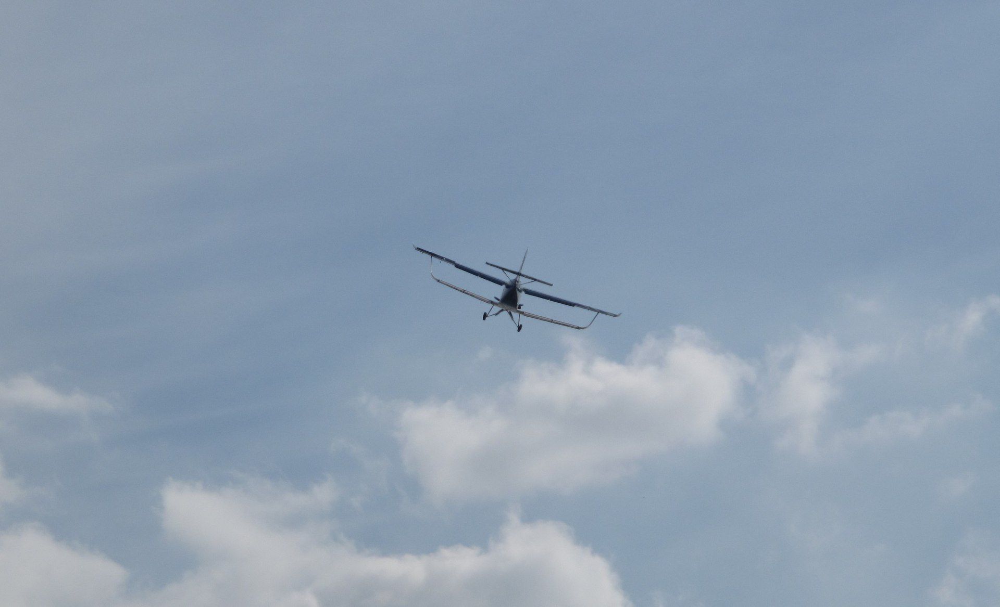

# Пишем простую* игровую физику самолёта

\* — в трёх измерениях.



*Предупреждение: дальнейшие рассуждения вполне могут быть ошибочными, мой опыт ограничивается игрой в авиасимуляторы и курсом теоретической механики. Знания в аэродинамике и игровых физических движках весьма скудные. Картинка для привлечения внимания — фотография, а не скриншот.*

«Что может быть проще самолёта? Подъёмная сила пропорциональна квадрату скорости, двигатель тянет вперёд, всё просто» — такая мысль пришла в мою голову летом, и я сел писать игру. Лето прошло, было собрано несколько граблей, а списочек того, что я планировал добавить в проект, очень сильно вырос.

В данной статье я попробую написать именно о физической составляющей, не отвлекаясь на графику и прочие штуки. Надеюсь, кому-то это поможет — в интернете не очень много информации на эту тему.

Примеры рабочего и не очень кода будут на Scala (для понимания сути язык знать не обязательно). Кроме того, я использую классы для векторов, матриц и кватернионов из libgdx. Если у кого-то будут вопросы по особенностям их реализации — код движка открыт. Для удобства векторам добавлены методы типа +=, *=, а так же +, -, благо в scala так можно. Ещё оказалось удобным добавить методы := для присваивания по значению.

Код:
```Scala
v := (0, 1, 2)
v2 := v
```

Эквивалентен
```Scala
v.set(0, 1, 2)
v2.set(v)
```

За исключением кватернионов:

```set(x,y,z,w)```, но ```:=(w,x,y,z)```

Второй вариант мне намного привычнее, а set я никогда не использую. Свой код выкладывать пока что никуда не буду, там немножко треш, который время от времени переписывается до неузнаваемости.

## Итак, начнём.

Напишем класс для позиции модели:

```Scala
class Position(val pos:Vector3f, val rot:Quaternion)
```

Как нетрудно догадаться, у класса будет два final поля, описывающие положение центра масс модели и её ориентацию относительно мира.
Получить матрицу в libgdx можно так:

```Scala
matrix.idt().translate(position.pos).rotate(position.rot)
```

Введём класс для производной:

```Scala
class Derivative(val linear: Vector3f, val angular: Vector3f)
```

Этот класс окажется удобным не только для описания скорости (первой производной), но и для ускорений и сил.

Стоп. Как кватернион превратился в вектор? Действительно, угловые скорость, ускорение и момент принято описывать векторами. Существенная разница между угловой скоростью и ориентацией в том, что ориентации «закольцованы», поворот на два пи эквивалентен «нулевому» повороту. Напротив, угловая скорость в принципе не ограничена.

Можно ввести операцию логарифма кватерниона q- вектор v, который направлен по направлению оси вращения, и его длина равна углу поворота в радианах. Экспонента — обратная операция. q == exp(v*2) == exp(v) * exp(v)

Отображение вектор->кватернион однозначно, а обратное — нет. Повороту на угол alpha за время dt может соответствовать угловая скорость (alpha + 2 * pi * n)/dt, где n — любое целое число.

Очевидно, что за время dt при угловой скорости w поворот q = exp(w*dt).

Код:

```Scala
class QuaternionS extends Quaternion{

...

  def :=(log: Vector3): Unit = {
    val len = log.len
    if (len > 0.0001f) {
      val a = len / 2
      val m = Math.sin(a).toFloat / len
      this :=(Math.cos(a).toFloat, log.x * m, log.y * m, log.z * m)
    } else
      this :=(1, 0, 0, 0)
  }

  def log(result: Vector3): Unit = {
    val xyz = Math.sqrt(x*x + y*y + z*z) // равно синусу половины угла поворота
    if (xyz > 0.0001f) {
      val m = (Math.acos(w).toFloat * 2f) / xyz
      result.set(m * x, m * y, m * z)
    } else {
      result.set(0f, 0f, 0f)
    }
  }
}
```

Чем же является полёт самолёта с абстрактной точки зрения? Решением системы дифференциальных уравнений второго порядка! Зададим состояние самолёта:

```Scala
trait TimeStamp{
  def time: Long //время в миллисекундах
}

trait VisibleState extends TimeStamp{

  def position: Position

  def speed: Derivative
}
```

Класс для реального состояния самолёта зависит от особенностей модели и степени её физической проработки, но он будет реализовывать этот интерфейс, необходимый для рисования самолёта на экране.

## Задачу можно разбить на две независимых части

1. вычисление сил, действующих на самолёт в заданном состоянии
2. численное решение диффура

Первую часть, как самую интересную, оставим на конец статьи.

Для графической части напишем интерфейс:

```Scala
abstract class Avatar(val player: Player, val model: Airplane) {
  def getState(time: Long): VisibleState
}
```

Реализацию приводить не буду, но суть проста — внутри хранится последовательность состояний с временами t1, t2, t3 и т.д., t(n+1)>t(n). Состояния достраиваются при необходимости, в методе getState происходит интерполяция двух ближайших. Таким образом, можно, например, считать физику 10 раз в секунду и при этом наблюдать плавное движение при 60 fps.

Напишем следующий интерфейс:

```Scala
trait Airplane{

  def mass: Float

  def I: Matrix4

  private val tempM = new Matrix4()
  private val tempQ = new QuaternionS()

  def getInertiaTensor(orientation: Quaternion): Matrix4 = {
    tempM.set(orientation)
    tempM.mul(I)
    tempQ := orientation
    tempQ.conjugate()
    tempM.rotate(tempQ)
    tempM
  }

  def getForceAndMoment(state: State, input: PlaneInput): Derivative
}
```

Момент импульса L = I * w, причём L и w(угловая скорость) преобразуются как вектора. Таким образом, в преобразовании L' = qL, w' = qw получается:
L' = I' * w'
qL = I' * qw
L = q^(-1) * I' * q * w

Получаем I = q^(-1) * I' * q, или I' = q * I * q^(-1).

Преобразование w' = position.rot * w переводит угловую скорость из локальной системы координат в глобальную.

Метод getForceAndMoment будет рассмотрен позже, в нём вычисляются силы и крутящий момент, действующие на самолёт.

Я не очень хорошо представляю, как точно посчитать движение модели, которая движется и вращается с ускорениями, поэтому был выбран самый простой способ c фиксированным шагом в 20мс.

```Scala
class StateGenerator {

  //чтобы не мучить сборщик мусора в андроиде, используемые в рассчётах объекты по возможности создаются только один раз
  //без фанатизма, конечно, всему есть разумные пределы
  private val inversed = new Matrix4()
  private val omega = new Vector3f()
  private val iOm = new Vector3f()
  private val angularAcceleration = new Vector3f()
  private val inv = new QuaternionS()

  def nextState(now: State, timeStep: Long, model: Airplane, planeInput: PlaneInput): State = {
    assert(timeStep > 0)

    val dt = timeStep * 0.001f //время в секундах
    val next = new State(now.time + timeStep)

    next.position := now.position
    next.speed := now.speed

    //код этого метода будет приведён позже
    val forces = model.getForceAndMoment(now, planeInput)

    //linear
    next.speed.linear += forces.linear * (dt / model.mass)
    next.position.pos += (now.speed.linear + next.speed.linear) * (0.5f * dt)

    //angular
    val I = model.getInertiaTensor(now.position.rot)
    inversed.set(I).inv() 

    omega := now.speed.angular
    iOm := omega
    iOm.mul(I)

    angularAcceleration.setCross(iOm, omega)

    angularAcceleration += forces.angular
    angularAcceleration.mul(inversed)

    next.speed.angular.madd(angularAcceleration, dt)
    next.speed.angular *= 1f - dt * 0.1f //трение. Необходимо для устойчивости вычислений. Характерное время затухания вращения - 10 сек.

    val angSp = (next.speed.angular + now.speed.angular) / 2
    next.position.rot := new QuaternionS(angSp * dt) * now.position.rot

    next // в Scala можно не писать return
  }
}
```

Подробнее о вращении можно посмотреть в этой статье: [habrahabr.ru/post/264099](https://habr.com/ru/post/264099/). Честно говоря, я не любитель тензоров, просто взял оттуда формулу в векторном виде, чтобы получать угловое ускорение. Расчёты производятся в системе координат мира. К слову, при отключении внешних сил мне удалось наблюдать движение, вполне похожее на эффект Джанибекова.

## Силы, действующие на самолёт

Самолётом надо управлять:

```Scala
trait PlaneInput extends TimeStamp {

  def yaw: Float // right is positive

  def pitch: Float // up is positive

  def roll: Float // clockwise is positive

  def engineTrust: Float
}
```

Значения обрезаются до интервала [-1, 1], тяга двигателя от 0 до 1.

Что же, перейдём к самой важной части — найдём силы. Тут немножко Terra incognita, мои познания в аэродинамике весьма поверхностные. Возможны ошибки и неточности.

Первое, что приходит в голову — подъёмная сила. Дабы не сотворить фигни, на просторах интернета был найден справочник авиационных профилей с графиками коэффициента подъёмной силы в зависимости от угла атаки. Суть оказалась довольно простой — Сy(коэффициент подъёмной силы) довольно линейно растёт вполь до критических углов, достигает примерно единички, а потом происходит срыв потока с крыла, и подъёмная сила начинает уменьшаться. Также график коэффициента для абстрактного крыла [можно посмотреть в английской википедии](https://en.wikipedia.org/wiki/Lift_coefficient):

Тут меня подстерегали грабли — если прочитать ещё одну [статью на википедии](https://ru.wikipedia.org/wiki/%D0%9B%D0%BE%D0%B1%D0%BE%D0%B2%D0%BE%D0%B5_%D1%81%D0%BE%D0%BF%D1%80%D0%BE%D1%82%D0%B8%D0%B2%D0%BB%D0%B5%D0%BD%D0%B8%D0%B5) по лобовому сопротивлению, то можно заметить, что существует какое-то индуктивное сопротивление. Сюрприз в том, что подъёмную силу принято считать в направлении, перепендикулярном направлению скорости, а не перпендикулярно поверхности крыла (как думал я). Поскольку разница в давлении воздуха сверху и снизу крыла всё-таки приводит к силе, перпендикулярной поверхности крыла, то проекция этой силы на направление, противпоположное движению, ненулевая. ~~Если я правильно понял, это и есть индуктивная сила.~~
А вот и нет. См. [комментарий](https://habr.com/ru/post/266367/comments/#comment_8563391) ниже. Дальнейший текст и код оставляю без изменений.

Если считать, что подъёмная сила направлена вверх в системе отсчёта самолёта, то индуктивная сила вроде и не нужна — она уже учтена. Ориентация осей такая же, как и в openGL:

Ox — вправо
Oy — вверх
Oz — назад

```Scala
//коэффициент подъёмной силы
def cy(angle: Float) = {
    val pi = 3.1415928535f
    if (angle > maxAngle) (pi - angle) / (pi - maxAngle)
    else if (angle < -maxAngle) -(pi + angle) / (pi - maxAngle)
    else angle / maxAngle
  }

def liftingForce(speed2: Float, angle: Float, airDensity: Float): Float =
    cy(angle) * airDensity * speed2 * 0.5f * planesS

//расчёты будут производиться в локальной СО самолёта.

val forceLocal = new Vector3f
val speedLocal = state.position.rot^(-1) * state.speed.linear
val sp2 = state.speed.linear.length2

val airDensity = WorldParams.atmosphere.aitDensity(state.position.pos)

val attackAngle = -Math.asin(speedLocal.y / (speedLocal.length + 0.1f)).toFloat
val steeringAngle = Math.asin(speedLocal.x / (speedLocal.length + 0.1f)).toFloat

// подъёмная и прочие силы пропорциональны квадрату скорости, так что при малых скоростях (поярдка 0.1 м/с) они пренебрежительно малы, и можно "наврать" с углом. Главное - не поделить на ноль.

forceLocal.y += liftingForce(sp2, attackAngle, airDensity)
forceLocal.x -= steeringForce(sp2, steeringAngle, airDensity)
forceLocal += speedLocal/(0.1f + speedLocal.length) * -dragForce(sp2, attackAngle, steeringAngle, airDensity)
```


Кроме подъёмной силы, понадобятся сила сопротивления воздуха: ```dragForce``` и сила, которая возникает, если самолёт летит немного боком: ```steeringForce```.

Я не обладаю достаточными знаниями в аэродинамике. Основная цель — простота формул и по возможности адекватное поведение самолёта для лётных углов атаки и скольжения. 0.5f — последствия делителя 2 в формулах. 0.1f — последствия подгона коэффициентов.

```Scala
private def steeringForce(speed2: Float, angle: Float, airDensity: Float): Float =
  angle * airDensity * speed2 * 0.5f * planeSVert

private def dragForce(speed2: Float, attackAngle: Float, steeringAngle: Float, airDensity: Float): Float = {
  speed2 * (0.5f * airDensity * crossSectionalArea
    + Math.abs(attackAngle) * 0.1f * planesS
    + Math.abs(steeringAngle) * 0.1f * planeSVert)
  }
```

### Добавим тягу мотора

Модель максимально простая: никаких шагов винта, пусть двигатель тратит всю мощность на ускорение самолёта. Никаких бонусов к моменту инерции, никакого крутящего момента при изменении количества оборотов. Впрочем, оборотов тоже нет. Мощность = сила * скорость. Чтобы самолёт не мог взлетать вверх, как ракета, ограничим максимальную силу (с помощью ограничения минимальной скорости).

```Scala
val speed = Math.max(minSpeed, -speedLocal.z)
forceLocal.z -= input.engineTrust * maxPower / speed
```

### Управление

Есть интересный момент — разогнанный винтом воздух попадает прямо на управляющие плоскости хвоста, и самолёт, в принципе, немного управляется хвостом даже на взлётной полосе. Кроме того, сопротивление воздуха пытается закрутить самолёт в обратном вращению винта направлении. И до кучи — у двигателя есть момент инерции, при увеличении/уменьшении скорости вращения самолёт тоже будет немного «закручивать». Я всем этим пренебрегу…

Как и для крыла, появляется знакомый множитель с квадратом скорости и плотностью воздуха:

```Scala
val mul = spLocal.z * spLocal.z * airDensity

result.angular.x = (input.pitch + 0.3f) * mul * 2f
result.angular.y = -input.yaw * mul * 1f
result.angular.z = -input.roll * mul * 5
```

По тангажу нет симметрии, самолёт (да и пилот) намного лучше переносит положительные перегрузки, чем отрицательные. Кроме того, самолёт сам по-себе устойчив (если это не Су-47) и стремится возвратиться в положение «носом вперёд»:

```Scala
result.angular.x -= attackAngle * airDensity * mul * 5f
result.angular.y -= steeringAngle * airDensity * mul * 5f
```

### Ничего не забыли?

Есть ещё одна сила, с которой поведение становится более интересным. При взгляде на самолёт спереди или сзади можно заметить, что крыло немного загнуто вверх латинской буквой V — это продиктовано заботой об устойчивости полёта. Если самолёт будет лететь не прямо вперёд, а немного смещаться боком, подъёмные силы слева и справа станут разными, и он начнёт вращаться.

```Scala
result.angular.z += forceLocal.y * steeringAngle * 1f
```

forceLocal.y — подъёмная сила

### Добавляем «трение» к вращению

Случилось то, против чего протестовало моё чувство прекрасного, но иначе пришлось бы сильно усложнять модель. Прежде, чем добавить силу, я всё-таки попытаюсь её обосновать. Если прямо летящий самолёт вращается, например, креном налево, то угол атаки левого крыла повышается, а правого — наоборот, и этот эффект тормозит вращение. По другим осям — наверно, есть что-то похожее (в классе StateGenerator очень слабое трение при вращении сделано для устойчивости вычислительной схемы, а здесь — просто для того, чтобы самолёт не уподоблялся маятнику):

```Scala
result.angular.mulAdd(spAngLocal, -airDensity * 5000f)
```

Переводим в глобальную систему координат:

```Scala
result.angular.mul(state.position.rot)

forceLocal.mul(state.position.rot)
result.linear := forceLocal
```

## Примечание

Система единиц — метры, килограммы, секунды. «Подгоночные коэффициенты» приведены неспроста — я пытался подобрать их под параметры И-16. Масса 1400, мощность 750л.с., или (750*735.5) Ватт.
~~Момент инерции (по приблизительной оценке) — 5000 вдоль OX, OY и намного меньше вдоль OZ (типа сновная масса сосредоточена в фюзеляже самолёта, а он довольно длинный).~~
[Imp5](https://habr.com/ru/users/imp5/) сообщил более точные данные: главные моменты инерции 2440, 5520, 3080 по осям «вперёд», «вверх» и «вправо» соответственно.

Данная физическая модель не учитывает вращение самолёта, и в штопор упасть не получится. В дальнейшем я планирую брать несколько точек на каждом крыле и индивидуально для каждой точки рассчитывать углы атаки и скорость движения относительно воздуха. Управление хвостом и элеронами реализовать как изменение параметров кусочков крыльев. Возможно, тогда вращение самолёта будет честно затухать из-за сопротивления воздуха.

Код, рассчитывающий силы и перемещение самолёта, в любой момент можно заменить на что-нибудь более серьёзное.

P.S. Снимаю шляпу перед отечественными разработчиками симулятора о самолётах второй мировой, с которого когда-то давно начался мой интерес к авиации.

Стоило попробовать написать физику самому, чтобы понять, какой титанический труд они проделали. Например, вращение продольно расположенного двигателя приводит к тому, что при вираже в одну сторону нос самолёта уводит вверх, а в другую — вниз. У меня этого эффекта нет, как и многих других. С одной стороны, мелочь, но из таких мелочей и складывается уникальное для каждой модели поведение.

Изначально это был [пост на хабре](https://habr.com/ru/post/266367/)
