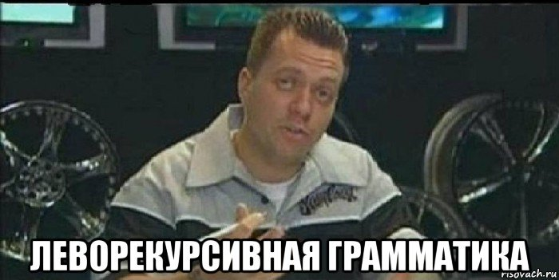

# Scala: parser combinators на примере парсера формул

Время от времени у меня возникает желание придумать свой собственный маленький язык программирования и написать интерпретатор. В этот раз я начал писать на scala, узнал про библиотеку parser combinators, и был поражён: оказывается, можно писать парсеры легко и просто. Чтобы не превращать статью в пособие по "рисованию совы", ниже приведёна реализация разбора и вычисления выражений типа "1 + 2 * sin(pi / 2)".

Сам парсинг и вычисление выражения занимают всего лишь 44 непустых строчки — не то чтобы я сильно стремился сократить их количество, но выглядит это реально просто и лаконично.
[Проект на github](https://github.com/Kright/FormulaParser).

Для сравнения:

* [длинный пример на java](https://habrahabr.ru/post/122397/)
* [короткий, но непонятный пример на C#](https://habrahabr.ru/post/271285/)
* [пример на java с использованием parboiled](https://github.com/sirthias/parboiled/blob/master/examples-java/src/main/java/org/parboiled/examples/calculators/CalculatorParser4.java)

Итак, если вам не терпится увидеть результат:

Ответственный за парсинг кусочек кода

```Scala
object FormulaParser extends RegexParsers with PackratParsers {

    def id: Parser[Id] = "[a-zA-Z][a-zA-Z0-9_]*".r ^^ Id

    def number: Parser[Number] = "-" ~> number ^^ (n => Number(-n.value)) |
        ("[0-9]+\\.[0-9]*".r | "[0-9]+".r) ^^ (s => Number(s.toDouble))

    def funcCall: Parser[FuncCall] = id ~ ("(" ~> expression <~ ")") ^^ {case id ~ exp => FuncCall(id, exp)}

    def value: Parser[Expression] = number | funcCall | id | ("(" ~> expression <~ ")")

    lazy val term: PackratParser[Expression] = term ~ ("*" | "/") ~ value ^^ binOperation | value

    lazy val expression: PackratParser[Expression] = expression ~ ("+" | "-") ~ term ^^ binOperation | term
    ...
}
```

Посмотрите на следущую строчку:

```Scala
def value: Parser[Expression] = number | funcCall | id | ("(" ~> expression <~ ")")
```

Она подозрительно похожа на описание грамматики, но это валидный код, в котором среда разработки может сразу же обнаружить и подсветить большинство ошибок.

Это возможно по следующим причинам:

1. В scala разрешено давать методам замечательные названия типа "~", "~>", "<~", "|", "^^". Комбинация парсеров p и q записывается как p~q, а возможность выбрать один из них: p|q. Читается намного лучше, чем p.andThen(q) или p.or(q)
2. Благодаря неявным преобразованиям (implicits) и строчка "abc" и регулярное выражение "[0-9]+".r при необходимости превращаются в парсеры.
3. В языке мощная статическая система типов, которая позволяет ловить ошибки сразу.

Думаю, мне удалось Вас заинтересовать, поэтому дальше всё будет по порядку.

## Оглавление:

1. [Regex Parsers](#regex-parsers)
2. [Packrat Parsers](#packrat-parsers)
3. [код парсера целиком](#парсер-готов)
4. [вычисление выражений](#вычисление-выражений)
5. [заключение](#заключение)

## Parser Combinators

Когда-то эти классы были включены в стандартную библиотеку языка, но потом их вынесли в отдельную библиотеку. В конце я привёл ссылки, по которым можно найти более подробную информацию.

## Regex parsers

Итак, самое простое — RegexParsers. Добавляют неявные преобразования из строк и регулярных выражений в парсеры.

```Scala
object SimpleExample extends RegexParsers {
    def boolTrue: Parser[Boolean] = "true" ^^ (_ => true)
    // если читаем строчку "true", то вызывается функция, которая преобразует строчку в истинное значение boolean

    def bool: Parser[Boolean] = ("true" | "false") ^^ (_ == "true")
    // можно сгруппировать парсеры и применить функцию к результату

    def alternativeBool: Parser[Boolean] = "true" ^^ (_ => true) | "false" ^^ (_ => false)
    // или преобразовать каждый результат по отдельности

    def int: Parser[Int] = "[0-9]+".r ^^ (_.toInt)
    // парсим последовательность цифр и преобразуем в число.
    // метод .r создаёт регулярное выражение из строки

    def id: Parser[Id] = "[a-zA-Z][a-zA-Z0-9_]*".r ^^ Id
    // Id - функция, которая делает из строки объект типа Id
}
```

Кстати, значок ~ обозначает не только метод у парсера, но и имя case класса, хранящего пару значений. Кусочек кода из Parsers.scala:

```Scala
case class ~[+a, +b](_1: a, _2: b) {
    override def toString = "("+ _1 +"~"+ _2 +")"
}
```

Допустим, мы хотим собрать из нескольких парсеров один:

```Scala
def intInBrackets: Parser[Int] = "(" ~ int ~ ")" ^^ (p => p._1._2)
```

Что произойдёт?


1. "(" неявно из строки превращается в парсер, который возвращает String
2. парсер int возвращает Int
3. "(" ~ int создаёт парсер для ~[String, Int]
4. "(" ~ int ~ ")" создаёт парсер, который возвращает ~[~[String, Int], String]
5. у парсера будет вызван метод ^^
6. в метод передаётся функция, которая принимает аргумент p с типом ~[~[String, Int], String] и возвращает Int

В данном случае скобки не несут никакой полезной информации. Можно сделать так:

```Scala
def intInBrackets: Parser[Int] = "(" ~>  int <~ ")"
```

В этот раз скобки будут отброшены.

1. "(" ~> int создаёт парсер, который парсит скобку и потом Int, но возвращает только Int
2. int <~ ")" работает аналогично, но для левого аргумента

Выражения с оператором <~ советуют заключать в скобки, так как у него не очень высокий приоритет.

```Scala
def funcCall: Parser[FuncCall] = id ~ ("(" ~> expression <~ ")") ^^ (pair => FuncCall(pair._1, pair._2))
```

Теперь должно быть понятно, что делает следующий код:

```Scala
def number: Parser[Number] = "-" ~> number ^^ (n => Number(-n.value)) |
        ("[0-9]+\\.[0-9]*".r | "[0-9]+".r) ^^ (s => Number(s.toDouble))
        // s.toDouble преобразует строку в число.

def value: Parser[Expression] = number | funcCall | id | ("(" ~> expression <~ ")")

private def binOperation(p: Expression ~ String ~ Expression) = p match {
    case e1 ~ op ~ e2 => BinOperation(e1, BinOperator(op), e2)
}
```

Я немножко поленился и превращаю строку в число стандартными методами. Время надо экономить)

Поскольку наше описание парсеров — это код, неоднозначные грамматики всё равно работают. В примере с парсингом ```number | funcCall | id``` мы пытаемся распарсить number, в случае неудачи — вызов функции и т.д. Порядок может быть важным, например ```(id | funcCall)``` при попытке распарсить ```"sin(x)"``` радостно распарсит ```Id("sin")```, и парсер ```funcCall``` не будет вызван. Для корректной работы лучше написать ```(funcCall | id)```.

## Packrat Parsers

Допустим, мы хотим распарсить последовательность единичек:

```Scala
object Ones extends RegexParsers {
    def ones: Parser[Any] =  ones ~ "1" | "1"
}
```

Парсинг ```ones``` начинается с того, что мы вызываем парсинг ```ones```, который снова ...



Попытка распарсить единички приведёт к переполнению стека.

В данном случае можно изменить описание так, чтобы каждый раз "поглощалось" что-нибудь. Например:

```Scala
def ones: Parser[Any] =  "1" ~ ones | "1"
```

Но не всегда грамматику легко переписать. Выражния типа ```3-2-1``` должны распознаваться именно как ```(3-2)-1```, вариант ```3-(2-1)``` не подойдёт. С делением будет аналогичная проблема. Как это сделать без усложнения грамматики?

Нас спасут packrat — парсеры. Их идея заключается в том, что парсер может хранить "для себя" некоторую информацию о вызовах. Например, чтобы сохранять результат работы и не парсить одно и то же дважды… или чтобы корректно работать в случаях с рекурсией.

```Scala
object Ones extends RegexParsers with PackratParsers{
    lazy val ones: PackratParser[Any] =  ones ~ "1" | "1"
}
```

в трейте PackratParsers содержится неявное преобразование строчек и прочего в парсеры "нужного" типа.

PackratParser лучше создавать только один раз и хранить в переменной. Кроме того, если парсер p использует q, а q использует p, стоит использовать ленивую инициализацию.

```Scala
lazy val term: PackratParser[Expression] = term ~ ("*" | "/") ~ value ^^ binOperation | value

lazy val expression: PackratParser[Expression] = expression ~ ("+" | "-") ~ term ^^ binOperation | term
```

Думаю, теперь понятно, как можно легко и непринуждённо распарсить ```3-2-1``` как ```(3-2)-1```.

Возможно, у вас возникает вопрос: где парсер хранит информацию? Если её хранить прямо внутри PackratParser, то вызов парсера для другого ввода может дать некорректные результаты. Так вот, необходимая информация хранится вместе с "входными" данными парсера. Можно заглянуть в код библиотеки и убедиться в этом:

```Scala
class PackratReader[+T](underlying: Reader[T]) extends Reader[T] { outer =>

    private[PackratParsers] val cache = mutable.HashMap.empty[(Parser[_], Position), MemoEntry[_]]
    ...
}
```

Поэтому парсер принимает на вход не строку, а new PackratReader(new CharSequenceReader(string))

```Scala
def apply(code: String): Either[LexerError, Expression] =
    parse(expression, new PackratReader(new CharSequenceReader(code))) match {
        case Success(result, next) => Right(result)
        case NoSuccess(msg, next) => Left(LexerError(msg))
    }
```

Что самое крутое — использование packrat парсеров ни к чему не обязывает, их можно комбинировать с обычными парсерами и наоборот. 

## Парсер готов

Код целиком:

```Scala
object FormulaParser extends RegexParsers with PackratParsers {

    def id: Parser[Id] = "[a-zA-Z][a-zA-Z0-9_]*".r ^^ Id

    def number: Parser[Number] = "-" ~> number ^^ (n => Number(-n.value)) |
        ("[0-9]+\\.[0-9]*".r | "[0-9]+".r) ^^ (s => Number(s.toDouble))

    def funcCall: Parser[FuncCall] = id ~ ("(" ~> expression <~ ")") ^^ {case id ~ exp => FuncCall(id, exp)}

    def value: Parser[Expression] = number | funcCall | id | ("(" ~> expression <~ ")")

    lazy val term: PackratParser[Expression] = term ~ ("*" | "/") ~ value ^^ binOperation | value

    lazy val expression: PackratParser[Expression] = expression ~ ("+" | "-") ~ term ^^ binOperation | term

    private def binOperation(p: Expression ~ String ~ Expression) = p match {
        case e1 ~ op ~ e2 => BinOperation(e1, BinOperator(op), e2)
    }

    def apply(code: String): Either[ParserError, Expression] =
        parse(expression, new PackratReader(new CharSequenceReader(code))) match {
            case Success(result, next) => Right(result)
            case NoSuccess(msg, next) => Left(ParserError(msg))
        }

    case class ParserError(msg: String)
}

sealed trait Expression

case class BinOperator(operator: String)

case class Number(value: Double) extends Expression
case class Id(name: String) extends Expression
case class BinOperation(left: Expression, op: BinOperator, right: Expression) extends Expression
case class FuncCall(funcName: Id, argument: Expression) extends Expression
```

Результат парсинга — либо дерево, либо сообщение об ошибке.

case классы — просто классы-обёртки над значениями, они все реализуют интерфейс Expression. слово sealed обозначает, что реализующие этот интерфейс классы должны содержаться в том же самом файле. Это позволяет с уверенностью говорить, что Expression может быть одного из четырёх типов.

## Вычисление выражений

Код, который вычисляет выражения, тоже прост. Я предполагаю, что на вход подаются корректные выражения.

```Scala
object Evaluator {
    def apply(expression: Expression,
              variables: (String) => Double = Map.empty,
              functions: (String) => (Double) => Double = Map.empty): Double = {

        def eval(exp: Expression) = this (exp, variables, functions)

        expression match {
            case Number(value) => value
            case Id(name) => variables(name)
            case BinOperation(left, op, right) => operator2func(op)(eval(left), eval(right))
            case FuncCall(funcId, expr) => functions(funcId.name)(eval(expr))
        }
    }

    def operator2func(binOperator: BinOperator): (Double, Double) => Double =
        binOperator.operator match {
            case "+" => (a, b) => a + b
            case "-" => (a, b) => a - b
            case "*" => (a, b) => a * b
            case "/" => (a, b) => a / b
        }
}
```

Фишечки скалы — можно объявить функцию eval внутри функции apply для повышения читаемости кода. Вторая фишечка — в качестве аргумента по-умолчанию мы подсовываем Map.empty. Она пустая, поэтому может быть любого типа, она неизменяемая, поэтому она останется пустой, и реально мы получим ссылки на один и тот же объект — синглтон. Map.empty имеет метод apply(a: In):Out — мы можем считать её функцией.

## Почти всё

Парсинг и вычислени выражений готовы. Посчитаем получившиеся строки кода (непустые):

1. Парсер: 18 строк
2. case-классы для описания AST: 6
3. вычисление выражений: 20 строк.


И всё — причём код легко читается, его легко изменять и он практчиески не содержит ничего лишнего. Красота!

## А оно работает?

Об этом стоит подумать ещё на этапе написания парсера, но проверяющий код ни на что не влияет, потому приведён только только сейчас. (конечно, можно написать тестики… но эта статья о написании парсеров, а не тестов, поэтому я сделал как можно проще)

Код, который проверяет работу:

```Scala
object Main extends App {
    def eval(code: String,
             variables: (String) => Double = Map.empty,
             functions: (String) => (Double) => Double = Map.empty) = {
        val parsed = FormulaParser(code)
        parsed.left.foreach(error => println(s"\'$code\' parsing error: $error"))
        parsed.right.map(expr => Evaluator(expr, variables, functions)).foreach(d => println(s"\'$code\' = $d"))
    }

    eval("1")
    eval("0.1")
    eval("1.")
    eval("  1  ")
    eval("-0.1")

    eval("1+2")
    eval("2-1")
    eval("2*3")
    eval("4/2")

    val vars = Map(
        "pi" -> math.Pi,
        "e" -> math.E)

    val funcs: (String) => (Double) => Double = Map(
        "sin" -> math.sin,
        "cos" -> math.cos,
        "inc" -> { d: Double => d + 1 }
    )

    eval("pi", vars)
    eval("inc(e)", vars, funcs)

    eval("2+2*2")
    eval("1+2*(3+4*5)")
    eval("8/2/2")
    eval("8-1-2")

    eval("1. + 2.0 * sin(pi / 2)", vars, funcs)
}
```

## Заключение

Для серьёзных целей существуют генераторы парсеров и прочие штуки.

Но если Вам хочется парсить что-нибудь относительно простое, экспериментировать и получать мгновенную обратную связь — можно использовать описанный выше подход. Информации на русском почти нет, да и на английском тоже не очень много. Я надеюсь, что статья поможет кому-нибудь.

Полезные ссылочки:


1. [библиотека на github](https://github.com/scala/scala-parser-combinators)
2. [Пример парсинга DSL](https://enear.github.io/2016/03/31/parser-combinators/)
3. "Programming in scala", глава "[parser combinators](https://www.artima.com/pins1ed/combinator-parsing.html)"

Приведённый выше код я выложил на [github](https://github.com/Kright/FormulaParser)

### Как запустить

Используется система сборки sbt. Достаточно установить её, перейти в папку с проектом и набрать в консоли "sbt run"

**P.S.** У меня всё ещё есть цель дописать свой интерпретатор lua-подобного языка с шахматами и поэтессами. Я вроде бы продумал синтаксис языка, потом в процессе написания парсера наткнулся на противоречия — пришлось отказаться от пары поэтесс и заменить шахматы на шашки, но результат всё равно получается довольно интересным.

Изначально это был [пост на хабре](https://habr.com/ru/post/325446/).