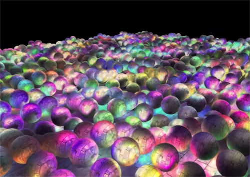
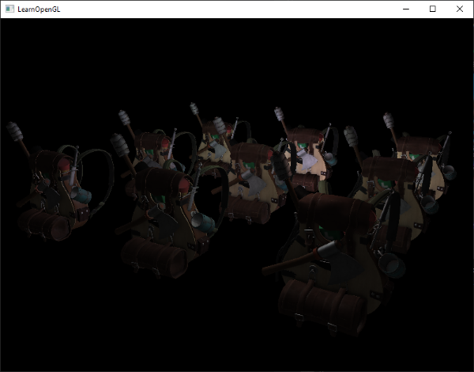
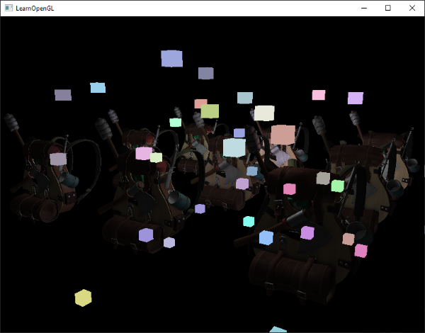
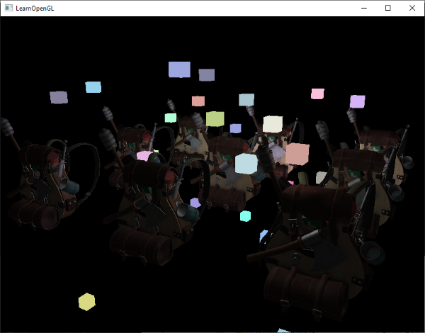
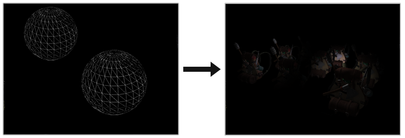

В предыдущих статьях мы использовали прямое освещение *(forward rendering или forward shading)*. Это простой подход, при котором мы рисуем объект с учётом всех источников света, потом рисуем следующий объект вместе с всем освещением на нём, и так для каждого объекта. Это достаточно просто понять и реализовать, но вместе с тем получается довольно медленно с точки зрения производительности: для каждого объекта придётся перебрать все источники света. Кроме того, прямое освещение работает неэффективно на сценах с большим количество перекрывающих друг друга объектов, так как большая часть вычислений пиксельного шейдера не пригодится и будет перезаписана значениями для более близких объектов.

Отложенное освещение или отложенный рендеринг (deferred shading или deferred rendering) обходит эту проблему и кардинально меняет то, как мы рисуем объекты. Это даёт новые возможности значительно оптимизировать сцены с большим количеством источников света, позволяя рисовать сотни и даже тысячи источников света с приемлемой скоростью. Ниже изображена сцена с 1847 точечными источниками света, нарисовання с помощью отложенного освещения (изображение предоставил Hannes Nevalainen). Что-то подобное было бы невозможно при прямом расчёте освещения:



## Содержание

Часть 1. Начало
<ol>
    <li><a href="https://habrahabr.ru/post/310790/">OpenGL</a></li>
    <li><a href="https://habrahabr.ru/post/311198/">Создание окна</a></li>
    <li><a href="https://habrahabr.ru/post/311234/">Hello Window</a></li>
    <li><a href="https://habrahabr.ru/post/311808/">Hello Triangle</a></li>
    <li><a href="https://habrahabr.ru/post/313380/">Shaders</a></li>
    <li><a href="https://habrahabr.ru/post/315294/">Текстуры</a></li>
    <li><a href="https://habrahabr.ru/post/319144/">Трансформации</a></li>
    <li><a href="https://habrahabr.ru/post/324968/">Системы координат</a></li>
    <li><a href="https://habrahabr.ru/post/327604/">Камера</a></li>
</ol>

Часть 2. Базовое освещение
<ol>
    <li><a href="https://habrahabr.ru/post/329592/">Цвета</a></li>
    <li><a href="https://habrahabr.ru/post/333932/">Основы освещения</a></li>
    <li><a href="https://habrahabr.ru/post/336166/">Материалы</a></li>
    <li><a href="https://habrahabr.ru/post/337550/">Текстурные карты</a></li>
    <li><a href="https://habrahabr.ru/post/337642/">Источники света</a></li>
    <li><a href="https://habrahabr.ru/post/338254/">Несколько источников освещения</a></li>
</ol>

Часть 3. Загрузка 3D-моделей
<ol>
    <li><a href="https://habrahabr.ru/post/338436/">Библиотека Assimp</a></li>
    <li><a href="https://habrahabr.ru/post/338436/">Класс полигональной сетки Mesh</a></li>
    <li><a href="https://habrahabr.ru/post/338998/">Класс 3D-модели</a></li>
</ol>

Часть 4. Продвинутые возможности OpenGL <br/><br/>
<ol>
    <li><a href="https://habrahabr.ru/post/342610/">Тест глубины</a></li>
    <li><a href="https://habrahabr.ru/post/344238/">Тест трафарета</a></li>
    <li><a href="https://habrahabr.ru/post/343096/">Смешивание цветов</a></li>
    <li><a href="https://habrahabr.ru/post/346964/">Отсечение граней</a></li>
    <li><a href="https://habrahabr.ru/post/347354/">Кадровый буфер</a></li>
    <li><a href="https://habrahabr.ru/post/347750/">Кубические карты</a></li>
    <li><a href="https://habrahabr.ru/post/350008/">Продвинутая работа с данными</a></li>
    <li><a href="https://habrahabr.ru/post/350156/">Продвинутый GLSL</a></li>
    <li><a href="https://habrahabr.ru/post/350782/">Геометричечкий шейдер</a></li>
    <li><a href="https://habrahabr.ru/post/352962/">Инстансинг</a></li>
    <li><a href="https://habrahabr.ru/post/351706/">Сглаживание</a></li>
</ol>

Часть 5. Продвинутое освещение <br/><br/>
<ol>
    <li><a href="https://habrahabr.ru/post/353054/">Продвинутое освещение. Модель Блинна-Фонга.</a></li>
    <li><a href="https://habrahabr.ru/post/353632/">Гамма-коррекция</a></li>
    <li><a href="https://habrahabr.ru/post/353956/">Карты теней</a></li>
    <li><a href="https://habr.com/post/354208/">Всенаправленные карты теней</a></li>
    <li><a href="https://habr.com/post/415579/">Normal Mapping</a></li>
    <li><a href="https://habr.com/post/416163/">Parallax Mapping</a></li>
    <li><a href="https://habr.com/post/420409/">HDR</a></li>
    <li><a href="https://habr.com/post/420375/">Bloom</a></li>
    <li><a href="https://habr.com/post/420565/">Отложенный рендеринг</a></li>
    <li><a href="https://habr.com/post/421385/">SSAO</a></li>
</ol>

Часть 6. PBR <br/><br/>
<ol>
    <li><a href="https://habr.com/post/426123/">Теория</a></li>
    <li><a href="https://habr.com/post/424453/">Аналитические источники света</a></li>
    <li><a href="https://habr.com/post/426987/">IBL. Диффузная облученность.</a></li>
    <li><a href="https://habr.com/post/429744/">IBL. Зеркальная облученность. </a></li>
</ol>

Идея отложенного освещения состоит в том, что мы откладываем самые вычислетельно сложные части (типа освещения) на потом. Отложенное освещение состоит из двух проходов: в первом проходе, геометрическом *(geometry pass)*, рисуется вся сцена и различная информация сохраняется в набор текстур, называемых G-буффером. Например: позиции, цвета, нормали и/или зеркальность поверхности для каждого пикселя. Сохранённая в G-буфере графическая информация позже используется для расчёта освещения. Ниже приведено содержания G-буфера для одного кадра:


Во втором проходе, называемом проходом освещения (lighting pass), мы используем текстуры из G-буффера, когда рисуем полноэкранный прямоугольник. Вместо использования вершинного и фрагементного шейдеров отдельно для кадого объекта, мы пиксель за пикселем рисуем сразу всю сцену. Расчёт освещения остаётся точно таким же, как и при прямом проходе, но мы берём необходимые данные только из G-буфера и переменных шейдера *(uniforms)*, а не из вершинного шейдера.

Изображение ниже хорошо показывает общий процесс рисования.


Главным преимуществом является то, что сохранённая в G-буфере информация принадлежит самым близким фрагментам, которые ничем не заслонены: тест глубины оставляет только их. Благодаря этому мы расчитываем освещение для каждого пикселя только по одному разу, не совершая лишенй работы. Более того, отложенное освещение даёт нам возможности для дальнейших оптимизаций, позволяющих использовать намного больше источников освещения, чем при прямом освещении.

Впрочем, есть и пара недостатков: G-буфер хранит большое количество информации о сцене. Вдобавок, данные типа позиции требуется хранить с высокой точностью, в итоге G-буфер занимает довольно много места в памяти. Ещё одним недостатком является то, что мы не сможем использовать полупрозрачные объекты (так как в буфере хранится информация только для самой близкой поверхности) и сглаживание типа MSAA тоже не будет работать. Существуют несколько обходных путей для решения этих проблем, они рассмотрены в конце статьи.

*(Прим. пер. - G-буффер занимает реально много места в памяти. Например, для экрана 1920\*1080 и использовании 128 бит на пиксель буфер займёт 33мб. Вырастают требования к пропускной способности памяти - данных пишется и читается значительно больше)*

### G-буфер

G-буфером называют текстуры, используемые для сохранения связанной с освещением информации, используемой в последнем проходе рендеринга. Давайте посмотрим, какая информация нам нужна для расчёта освещения при прямом рендеринге:

* 3д вектор позиции: используется, чтобы узнать положение фрагмента относительно камеры и источников света.
* Дуффузный цвет фрагмента (отражательная способность для красного, зелёного и синего цветов - в общем, цвет).
* 3д вектор нормали (для определения, под каким углом свет падает на поверхность)
* float для хранения зеркальной составляющей
* Позиция источника света и его цвет.
* Позиция камеры.

С помощью этих переменных мы можем посчитать освещение по уже знакомой нам модели Блинна-Фонга. Цвет и положение источника света, а так же позиция камеры могут быть общими переменными, но остальные значения будут своими для каждого фрагмента изображения. Если мы передадим ровно же данные в финальный проход отложенного освещения, что мы бы использовалили при прямом проходе, мы получим тот же самый результат, не смотря на то, что мы будет рисовать фрагменты на обычном 2д прямоугольнике.

В OpenGL нет ограничений на то, что мы можем хранить в текстуре, так что имеет смысл хранить всю информацию в одной или нескольких текстурах размером с экран (называемых G-буфером) и использовать их все в проходе освещения. Так как размер текстур и экрана совпадает, мы получим те же самые входные данные, что и при прямом освещении.

В псевдокоде общая картина выглядит примерно так:

```c
while(...) // render loop
{
    // 1. геометрический проход: вся геометрическая/цветовая информация пишется в g-буфер
    glBindFramebuffer(GL_FRAMEBUFFER, gBuffer);
    glClear(GL_COLOR_BUFFER_BIT | GL_DEPTH_BUFFER_BIT);
    gBufferShader.use();
    for(Object obj : Objects)
    {
        ConfigureShaderTransformsAndUniforms();
        obj.Draw();
    }
    // 2. проход освещения: используем g-буфер для рассчёта освещения сцены
    glBindFramebuffer(GL_FRAMEBUFFER, 0);
    glClear(GL_COLOR_BUFFER_BIT);
    lightingPassShader.use();
    BindAllGBufferTextures();
    SetLightingUniforms();
    RenderQuad();
}
```

Информация, которая необходима для каждого пикселя: вектор **позиции**, вектор **нормали**, вектор **цвета** и значение для **зеркальной** составляющей. В геометрическом проходе мы нарисуем все объекты сцены и сохраним все эти данные в G-буфер. Мы можем использовать множественные цели рендерига *(multiple render targets)*, чтобы заполнить все буферы за один проход рисования, такой подход обсуждался в предыдущей статье про реализацию свечения: [Bloom](https://learnopengl.com/Advanced-Lighting/Bloom]), [перевод на хабре](https://habr.com/post/420375/).

Для геометрического прохода создадим фреймбуфер с очевидными именем gBuffer, к которому присоединим несколько цветовых буферов и один буфер глубины. Для хранения позиций и нормали предпочтительно использовать текстуру с высокой точностью (16 или 32-битные float значения для каждой компоненты), диффузный цвет и значения зеркального отражения мы будем хранить в текстуре по-умолчанию (точность 8 бит на компоненту).

```c
unsigned int gBuffer;
glGenFramebuffers(1, &gBuffer);
glBindFramebuffer(GL_FRAMEBUFFER, gBuffer);
unsigned int gPosition, gNormal, gColorSpec;

// буфер позиций
glGenTextures(1, &gPosition);
glBindTexture(GL_TEXTURE_2D, gPosition);
glTexImage2D(GL_TEXTURE_2D, 0, GL_RGB16F, SCR_WIDTH, SCR_HEIGHT, 0, GL_RGB, GL_FLOAT, NULL);
glTexParameteri(GL_TEXTURE_2D, GL_TEXTURE_MIN_FILTER, GL_NEAREST);
glTexParameteri(GL_TEXTURE_2D, GL_TEXTURE_MAG_FILTER, GL_NEAREST);
glFramebufferTexture2D(GL_FRAMEBUFFER, GL_COLOR_ATTACHMENT0, GL_TEXTURE_2D, gPosition, 0);

// буфер нормалей
glGenTextures(1, &gNormal);
glBindTexture(GL_TEXTURE_2D, gNormal);
glTexImage2D(GL_TEXTURE_2D, 0, GL_RGB16F, SCR_WIDTH, SCR_HEIGHT, 0, GL_RGB, GL_FLOAT, NULL);
glTexParameteri(GL_TEXTURE_2D, GL_TEXTURE_MIN_FILTER, GL_NEAREST);
glTexParameteri(GL_TEXTURE_2D, GL_TEXTURE_MAG_FILTER, GL_NEAREST);
glFramebufferTexture2D(GL_FRAMEBUFFER, GL_COLOR_ATTACHMENT1, GL_TEXTURE_2D, gNormal, 0);

// буфер для цвета + коэффициента зеркального отражения
glGenTextures(1, &gAlbedoSpec);
glBindTexture(GL_TEXTURE_2D, gAlbedoSpec);
glTexImage2D(GL_TEXTURE_2D, 0, GL_RGBA, SCR_WIDTH, SCR_HEIGHT, 0, GL_RGBA, GL_UNSIGNED_BYTE, NULL);
glTexParameteri(GL_TEXTURE_2D, GL_TEXTURE_MIN_FILTER, GL_NEAREST);
glTexParameteri(GL_TEXTURE_2D, GL_TEXTURE_MAG_FILTER, GL_NEAREST);
glFramebufferTexture2D(GL_FRAMEBUFFER, GL_COLOR_ATTACHMENT2, GL_TEXTURE_2D, gAlbedoSpec, 0);

// укажем OpenGL, какие буферы мы будем использовать при рендеринге
unsigned int attachments[3] = { GL_COLOR_ATTACHMENT0, GL_COLOR_ATTACHMENT1, GL_COLOR_ATTACHMENT2 };
glDrawBuffers(3, attachments);

// После так же добавим буфер глубины и проверку на валидность фреймбуфера.
[...]
```

Так как мы используем несколько целей рендеринга, мы должны явно указать OpenGL, в какие буферы из присоединённых к GBuffer мы собираемся рисовать в ```glDrawBuffers()```. Также стоит отметить, что мы храним позиции и нормали имеют по 3 компоненты, и мы храним их в RGB текстурах. Но при этом мы сразу в одну RGBA текстуру помещаем и цвет и коэффициент зеркального отражения - благодаря этому мы используем на один буфер меньше. Если Ваша реализация отложенного рендеринга станет более сложной и использующей большее количество данных, Вы легко найдёте новые способы скомбинировать данные и расположить их в текстурах.

В дальнейшем мы должны отрендерить данные в G-буфер. Если каждый объект имееет цвет, нормаль и коэффициент зеркального отражения, мы можем написать что-то вроде следующего шейдера:

```
#version 330 core
layout (location = 0) out vec3 gPosition;
layout (location = 1) out vec3 gNormal;
layout (location = 2) out vec4 gAlbedoSpec;

in vec2 TexCoords;
in vec3 FragPos;
in vec3 Normal;

uniform sampler2D texture_diffuse1;
uniform sampler2D texture_specular1;

void main()
{
    // записываем позицию фрагмента в первую текстуру G-буфера
    gPosition = FragPos;
    // так же записываем уникальную для каждого фрагмента нормаль в G-буфер
    gNormal = normalize(Normal);
    // и цвет
    gAlbedoSpec.rgb = texture(texture_diffuse1, TexCoords).rgb;
    // сохраняем коэффициент отражения в канал прозрачности
    gAlbedoSpec.a = texture(texture_specular1, TexCoords).r;
}
```

Так как мы используем несколько целей рендеринга, при помощи ```layout``` указываем, что и в какой буфер текущего фреймбуфера мы рендерим. Обратите внимание, что мы не сохраняем коэффициент зеркального отражения в отдельный буфер, так как мы можем хранить float значение в альфа-канале одного из буферов.

> Имейте ввиду, что при расчётах освещения крайне важно хранить все переменные в одном и том же координатном пространстве, в данном случае мы храним (и производим вычисления) в пространстве мира.

Если мы сейчас отрендерим несколько нанокостюмов в G-буфер и нарисуем его содержимое с помощью проецирования каждого буфера на четверть экрана, мы увидим что-то типа такого:


Попробуйте визуализировать вектора позиций и нормалей и убедитесь, что они верны. Например, вектора нормалей, указывающих вправо, будут красным. Аналогично с объектами, расположенными правее центра сцены. После того, как Вы будете удовлетворены содержимым G-буфера, перейдём к следующей части: проходу освещения.

### Проход освещения

Теперь, когда у нас есть большок количество информации в G-буфере, мы имеем возможность полностью вычислить освещение и финальные цвета для каждого пикселя G-буфера, используя его содержание в качестве входных данных для алгоритмов расчёта освещения. Так как значения G-буфера представляют только видимые фрагменты, мы выполним сложные рассчёты освещения ровно по одному разу для каждого пикселя. Благодаря этому отложенное освещение довольно эффективно, особенно в сложных сценах, в которых при прямом рендеринге для каждого пикселя довольно часто приходится производить вычисление освещения по нескольку раз.

Для прохода освещения мы собираемся рендерить полноэкранный прямоугльник (немного похоже на эффект пост-обработки) и произвести медленное вычисление освещения для каждого пикселя.

```
glClear(GL_COLOR_BUFFER_BIT | GL_DEPTH_BUFFER_BIT);
glActiveTexture(GL_TEXTURE0);
glBindTexture(GL_TEXTURE_2D, gPosition);
glActiveTexture(GL_TEXTURE1);
glBindTexture(GL_TEXTURE_2D, gNormal);
glActiveTexture(GL_TEXTURE2);
glBindTexture(GL_TEXTURE_2D, gAlbedoSpec);
// и ещё в юниформы записываем информацию об освещении
shaderLightingPass.use();
SendAllLightUniformsToShader(shaderLightingPass);
shaderLightingPass.setVec3("viewPos", camera.Position);
RenderQuad();
```

Мы присоединяем *(bind)* все необходимые текстуры G-буфера перед рендерингом и вдобавок устанавливаем относящиеся к освещению значения переменных в шейдере.

Фрагментный шейдер прохода освещения сильно похож на тот, что мы использовали в уроках совещения. Принципиально новым является способ, которым мы получаем входные данные для освещение прямо из G-буфера.

```
#version 330 core
out vec4 FragColor;

in vec2 TexCoords;

uniform sampler2D gPosition;
uniform sampler2D gNormal;
uniform sampler2D gAlbedoSpec;

struct Light {
    vec3 Position;
    vec3 Color;
};
const int NR_LIGHTS = 32;
uniform Light lights[NR_LIGHTS];
uniform vec3 viewPos;

void main()
{
    // получаем информацию из G-буфера
    vec3 FragPos = texture(gPosition, TexCoords).rgb;
    vec3 Normal = texture(gNormal, TexCoords).rgb;
    vec3 Albedo = texture(gAlbedoSpec, TexCoords).rgb;
    float Specular = texture(gAlbedoSpec, TexCoords).a;

    // вычисляем освещение как обычно
    vec3 lighting = Albedo * 0.1; // хардкодим фоновое освещение
    vec3 viewDir = normalize(viewPos - FragPos);
    for(int i = 0; i < NR_LIGHTS; ++i)
    {
        // рассеянное освещение
        vec3 lightDir = normalize(lights[i].Position - FragPos);
        vec3 diffuse = max(dot(Normal, lightDir), 0.0) * Albedo * lights[i].Color;
        lighting += diffuse;
    }

    FragColor = vec4(lighting, 1.0);
}
```

Шейдер освещения принимает 3 текстуры, которые содержат всю информацию, записанную в геометрическом проходе и из которых состоит G-буфер. Если мы берём входные данные для освещения из текстур, мы получаем точно такие же значения, как если при обычном прямом рендеринге. В начале фрагментного шейдера мы получаем значения относящихся к освещению переменных простым чтением из текстуры. Заметим, что мы получает и цвет и коэффициент зеркального отражения из одной текстуры - ```gAlbedoSpec```.

Так как для каждого фрагмента есть значения (а так же uniform переменные шейдера), необходимые для рассчёта освещеняи по модели Блинна-Фонга, нам нет необходимости изменять код расчёта освещения. Единственное, что было изменено - способ получения входных значений.

Запуск простой демонстрации с 32 маленькими источникам света выглядит примерно так:



Одним из недостатков отложенного освещения являетя невозможность смешивания, так как все g-буфера для каждого пикселя содержат информацию только об одной поверхности, в то время как смешивание использует комбинации нескольких фрагментов. [(Blending)](https://learnopengl.com/Advanced-OpenGL/Blending), [перевод](https://habr.com/post/343096/). Ещё одним недостатком отложенного освещения является то, что оно вынуждает вас использовать один общий для всех объектов способ расчёта освещения; хотя это ограничение можно как-нибудь обойти с помощью добавления информации о материале в g-буфер.

Чтобы справиться с этими недостатками (особенно с отсутствием смешивания), часто разделяют рендеринг на две части: рендеринг с отложенным освещением, и вторая часть с прямым рендерингом предназначина для наложения чего-то на сцену или использования шейдеров, не сочетающихся с отложенным освещением. *(Прим пер. Из примеров: добавление полупрозрачных дыма, огня, стёкол)* Для иллюстрации работы мы нарисуем источники света как маленькие кубики с помощью прямого рендеринга, так как кубики освещения требуют специальный шейдер (равномерно светятся одним цветом).

### Комбинируем отложенный рендериг с прямым.

Предположим, что мы хотим нарисовать каждый источник света в виде 3д кубика с центром, совпадающим с позицией источника света и излучающим свет с цветом источника. Первой идеей, которая приходит в голову, является прямой рендеринг кубиков для каждого источника света поверх результатов отложенного рендеринга. Т.е., мы рисуем кубики как обычно, но только после отложенного рендеринга. Код будет выглядить примерно так:

```
// проход отложенного освещения
[...]
RenderQuad();

// теперь рисуем все кубики для источников света прямым рендерингом
shaderLightBox.use();
shaderLightBox.setMat4("projection", projection);
shaderLightBox.setMat4("view", view);
for (unsigned int i = 0; i < lightPositions.size(); i++)
{
    model = glm::mat4();
    model = glm::translate(model, lightPositions[i]);
    model = glm::scale(model, glm::vec3(0.25f));
    shaderLightBox.setMat4("model", model);
    shaderLightBox.setVec3("lightColor", lightColors[i]);
    RenderCube();
}
```
Эти отрендеренные кубы не учитывают значения глубины из отложенного рендеринга и в результате рисуются всегда поверх уже отрендеренных объектов: это не то, чего мы добиваемся.



Сначала нам нужно скопировать информацию о глубине из геометрического прохода  в буфер глубины, и только после этого нарисовать светящиеся кубики. Таким образом, фрагменты светящихся кубиков будут нарисованы только в том случае, если они находятся ближе, чем уже нарисованные объекты.

Мы можем скопировать содержимое фреймбуфера в другой фреймбуфер с помощью функции ```glBlitFramebuffer```. Мы уже использовали эту функцию в примере со сглаживанинием: ([anti-aliasing](https://learnopengl.com/#!Advanced-OpenGL/Anti-Aliasing)), [перевод](https://habr.com/post/351706/). Функция ```glBlitFramebuffer``` копирует указанную пользователем часть фреймбуфера в указанную часть другого фреймбуфера.

Для объектов, нарисованных в проходе отложенного освещения, мы сохранили глубину в g-буфере объекта фреймбуфера. Если мы просто скопируем содержимое буфера глубины g-буфера в буфер глубины по-умолчанию, светящиеся кубики будут нарисованы так, как будто вся геометрия сцены была нарисована с помощью прямого прохода рендеринга. Как было кратко объяснено в примере со сглаживанием, мы должны установить фреймбуферы для чтения и записи:

```
glBindFramebuffer(GL_READ_FRAMEBUFFER, gBuffer);
glBindFramebuffer(GL_DRAW_FRAMEBUFFER, 0); // буфер глубины по-умолчанию
glBlitFramebuffer(
  0, 0, SCR_WIDTH, SCR_HEIGHT, 0, 0, SCR_WIDTH, SCR_HEIGHT, GL_DEPTH_BUFFER_BIT, GL_NEAREST
);
glBindFramebuffer(GL_FRAMEBUFFER, 0);
// теперь рисуем светящиеся кубики как и раньше
[...]
```

Здесь мы копируем целиком содержимое буфера глубины фреймбуфера в буфер глубины по-умолчанию (При необходимости можно аналогично скопировать буферы цвета или stensil буфер). Если мы теперь отрендерим светящиеся кубики, они нарисуются так, как будто геометрия сцены реальна (хотя она рисуется как простой).



Исходный код демо можно найти [здесь](https://learnopengl.com/code_viewer_gh.php?code=src/5.advanced_lighting/8.1.deferred_shading/deferred_shading.cpp).

С таким подходом мы можем легко комбинировать отложенный рендеринг с прямым. Это превосходно, так как мы сможем применять смешивание и рисовать объекты, которы требуют специальных шейдеров, не применимых при отложенном рендеренге.

### Больше источников света

Отложенное освещение часто хвалят за возможность рисовать огромное количество источников света без сильного снижения производительности. Отложенное освещение само по себе не позволяет рисовать очень большого количества источников света, так как мы всё ещё должны для каждого пикселя посчитать вклад всех источников света. Для рисования огромного количества источников света используется очень красивая оптимизация, применимая к отложенному рендерингу - области действия источников света. (light volumes)

Обычно, когда мы рисуем фрагменты в сильно освещённой сцене, мы учитываем вклад **каждого** источника света на сцене независимо от его расстояния до фрагмента. Если большая часть источников света никогда не повлияют на фрагмент, зачем мы тратим время на вычисления для них?

Идея области действия источника света состоит в том, чтобы найти радиус (или объём) источника света - т.е., область, в которой свет способен достигнуть поверхности. Так как большинство источников света используют какое-нибудь затухание, мы можем найти максимальное расстояние (радиус), которое свет может достигнуть. После этого мы выполняем сложные рассчёты освещения только для тех источников света, которые влияют на данный фрагмент. Это спасает нас от огромного количесва вычислений, так как мы вычисляем освещение только там, где это необходимо.

При таком подходе основной хитростью является определение размера области действия источнка света.

### Вычисление области действия источника света (радиуса)

Для получения радиуса источника света мы должны решить уравнение затухания для яркости, которую мы посчитаем тёмной - это может быть 0.0 или что-то чуть более освещённое, но всё ещё тёмное: например, 0.03. Для демонстрации, как можно посчитать радиус, мы будем использовать одну из сложных, наиболее общих функций затухания из примера с [light caster](https://learnopengl.com/#!Lighting/Light-casters)

$$F_{light} = \frac{I}{K_c + K_l * d + K_q * d^2}$$

Мы хотим решить это уравнение для случая, когда $inline$F_{light} = 0.0$inline$, т.е., когда источник света будет полностью тёмным. Впрочем, данное уравнение никогда не достигнет точного значения 0.0, так что решения не существует. Однако мы вместо этого можем решить уравнение для яркости для значения, близкого к 0.0, которое можно считать практически тёмным. В этом примере мы считаем приемлемым значение яркости в $inline$\frac{5}{256}$inline$ - делёное на 256, так как 8-битный фреймбуфер может содержать 256 различных значений яркости.

> Выбранная функция затухания становится практически тёмной на расстоянии радиуса действия, если мы ограничим её на меньшей яркости чем 5/256, то область действия источника света станет слишком большой - это не так эффективно. В идеале человек не должен видеть внезапной резкой границы света от источника света. Конечно, это зависит от типа сцены, большее значение минимальной яркости даёт меньшие области действия источников света и повышает эффективность рассчётов, но может приводить к заметным артефакты на изображении: освещение будет резко обрываться на границах области действия источника света.

Уравнение затухания, которое мы должны решить, становится таким:

$$\frac{5}{256} = \frac{I_{max}}{Attenuation}$$

Здесь $inline$I_{max}$inline$ - наиболее яркая составляющая света (из r, g, b каналов). Мы спользуем самую яркую компоненту, так как остальные компоненты дудут более слабое ограничение на область действия источника света.

Продолжим решать уравнение:

$$\frac{5}{256} \cdot Attenuation = I_{max}$$

$$Attenuation = I_{max} \cdot \frac{256}{5}$$

$$K_c + K_l \cdot d + K_q \cdot d^2 = I_{max} \cdot \frac{256}{5}$$

$$K_c + K_l \cdot d + K_q \cdot d^2 - I_{max} \cdot \frac{256}{5} = 0$$

Последнее уравнение является квадратным уравнением в форме $a x^2 + b x + c = 0$ со следующим решением:

$$x = \frac{-K_l + \sqrt{K_l^2 - 4 K_q (K_c - I_max \frac{256}{5})}}{2 K_q}$$

Мы получили общее уравнение, которое позволяет подставить параметры (коэффициенты константного затухания, линейного и квадратичного), чтобы найти x - радиус области действия источника света.

```
float constant  = 1.0;
float linear    = 0.7;
float quadratic = 1.8;
float lightMax  = std::fmaxf(std::fmaxf(lightColor.r, lightColor.g), lightColor.b);
float radius    =
  (-linear +  std::sqrtf(linear * linear - 4 * quadratic * (constant - (256.0 / 5.0) * lightMax))) 
  / (2 * quadratic);
```

Формула возвращает радиус примерно между 1.0 и 5.0 в зависимости от максимальной яркости источника света.

Мы находим этот радиус для каждого источника света на сцене и используем его для того, чтобы для каждого фрагмента учитывать только те источники света, внутри областей действия которых он находится. Ниже приведён переделанный проход освещения, который учитывает области дейстия источников света. Обратите внимание, что этот подход реализован только в целях обучения и плохо подходит для практического применения (скоро обсудим, почему).

```
struct Light {
    [...]
    float Radius;
};

void main()
{
    [...]
    for(int i = 0; i < NR_LIGHTS; ++i)
    {
        // находим расстояние от текущего фрагмента до источника света
        float distance = length(lights[i].Position - FragPos);
        if(distance < lights[i].Radius)
        {
            // делаем сложные вычисления освещения
            [...]
        }
    }
}
```

Результат точно такой же, как и раньше, но сейчас для каждого источника света учитывается его влияние только внутри области его действия.

[Финальный код демо.](https://learnopengl.com/code_viewer_gh.php?code=src/5.advanced_lighting/8.2.deferred_shading_volumes/deferred_shading_volumes.cpp).

### Реальное применение области действия источника света.

Фрагментный шейдер, показанный выше, не будет работать на практике и служит только для иллюстрации, как мы можем избавиться от ненужных вычислений освещения. В реальности видеокарта и язык шейдеров GLSL очень плохо оптимизируют циклы и ветвления. Причной этого является то, что выполенние шейдера на видеокарте производится параллельно для различных пикселей, и многие архитектуры накладывают ограничение, что при паралельном выполнении различные потоки должны вычислять один и тот же шейдер. Часто это приводит к тому, что запущенный шейдер всегда вычисляет все ветвления, чтобы все шейдеры работали одинаковое время. *(Прим пер. Это не влияет на результат вычислений, но может снижать производительность шейдера.)* Из-за этого может получиться, что наша проверка на радиус бесполезна: мы всё ещё будем вычислять освещение для всех источников!

Подходящим подходом для использования области действия света будет рендеринг сфер с радиусом как у источника света. Центр сферы совпадает с позицией источника света, так что сфера содержит внутри себя область действия источника света. Здесь есть небольшая хитрость - мы используем в основном такой же отложенный фрагментный шейдер для рисования сферы. При рисовании сферы фрагментный шейдер вызывается именно для тех пикселей, на которые влияет источник света, мы рендерим только нужные пиксели и пропускаем все остальные. Иллюстрация на картинке ниже:



Мы сделаем так для каждого источника света, результаты вычислений будут сложены все вместе. Результат будет именно такой же, как и раньше, но на этот раз мы рендерим только необходимые пиксели для каждого источника света. Это значительно снижаем сложность вычислений с *количество_объектов\*количество_источников_света* до 
*количество_объектов + количество_источников_света*, что делает отложенный рендеринг неимоверно эффективным в сценах с большим количеством источников света.

При этом подходе всё ещё есть проблема: отсечение обратных граней должно быть включено (чтобы не рассчитывать освещение дважды) и, когда оно включено, пользователь может оказаться внутри области источника света, из-за чего она не будет рисоваться (по причине отсечения обратных граней). Это может быть решено с помощью хитрого использования stenсil буфера.

Рендеринг областей действия источников света приводит к большим потерям производительности, и хотя это значительно быстрее, чем обычное отложенное освещение, это не является лучшим решением. Существуют ещё два популярных (и более эффективных) способа рассчёта освещения при отложенном рендеринге: отложенное оcвещение *(deferred lighting)* и потайловое отложенное затенение *(tile-based deferred shading)*. Эти способы невероятно эффективны при рендеринге большого количества источников света и так же позволяют относительно эффективно использовать сглаживание MSAA. Ради размера этой статьи мы оставим эти оптимизации для рассмотрения в последующих статьях.

### Отложенный рендеринг vs прямой

Отложенный рендеринг (без оптимизаций освещения) сам по-себе уже является хорошей оптимизацией, так как каждый пиксель только один раз требует вычисления фрагментного шейдера, в то время как при прямом рендеринге мы часто вычисляем освещения по нескольку раз для пикселя. Вместе с тем, отложенное освещение имеет недостатки - большое использование памяти, отсутствие сглаживания MSAA, смешивание можно использовать только при прямом рендеринге.

Для простой сцены с небольшим количеством источников света отложенный рендеринг не обязательно будет быстрее (иногда даже медленнее), так как дополнительные расходы (запись в g-буфер и т.п.) могут перевесить преимущества от меньшего количества рассчётов освещения. В более сложных сценах отложенный рендеринг становится значительной оптимизацией, особенно при использовании более продвинутых способов рассчёта освещения.

В заключение я хочу отметить: изначально все эффекты, которые могут быть получены прямым рендерингом, так же могут быть реализованны в отложенном рендеринге, зачастую это требует лишь небольших изменений. Например, если мы хотим использовать карты нормалей при отложенном рендеринге, мы можем изменить геометрическй проход так, чтобы шейдер возвращал нормаль на основе значений из карты нормалей вместо нормали геометрической поверхности. Проход освещения вообще не потребует изменений. Если вы хотите добавить parallax mapping, вы сначала немного измените текстурные координаты в геометрическом шейдере перед чтением из текстур значений цветов, отражающей способности и нормалей. Как только вы поймёте идею отложенного рендеринга, внесение изменений в него будет довольно простым.

### Дополнительные ссылки

* [Tutorial 35: Deferred Shading - Part 1](http://ogldev.atspace.co.uk/www/tutorial35/tutorial35.html) - Туториал от OGLDev из трёх частей об отложенном освещении. Во второй и третьей части обсуждается рисование областей действия источников света.
* [Deferred Rendering for Current and Future Rendering Pipelines](https://software.intel.com/sites/default/files/m/d/4/1/d/8/lauritzen_deferred_shading_siggraph_2010.pdf): cлайды от  Andrew Lauritzen о потайловом отложенном рендеринге *(tile-based deferred shading)* и отложенном оcвещении *(deferred lighting)*.

**P.S.** У нас есть [телеграм-конфа](https://t.me/joinchat/Cpb05A46UPpMWdNVVCb4Vg) для координации переводов. Если есть серьезное желание помогать с переводом, то милости просим!

[Пост на хабре](https://habr.com/ru/post/420565/)