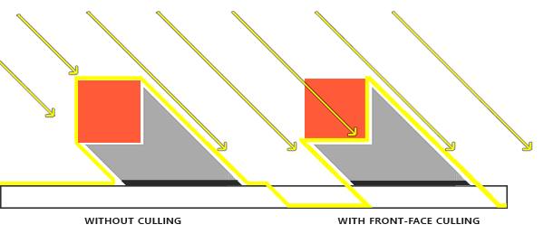

Тень - это отсутствие света. Если лучи от источника света не попадают на объект, так как поглощаются другим объектом, то первый объект находится в тени. Тени добавляют реализма к изображению и дают увидеть взаимное расположение объектов. Благодаря ним сцена приобретает "глубину". Сравните следующие изображения сцены с тенями и без:


Как можно заметить, тени делают намного более очевидным то, как объекты расположены друг относительно друга. Благодаря теням видно, что один из кубов висит в воздухе.

Тени сложновато реализовать, особенно потому что реалтайм алгоритм для идеальных теней ещё не придуман. Существуют несколько хороших способов для приблизительного рассчёта теней, но они все имеют свои особенности, которые надо принимать во внимание.

Один из методов - карты теней *(shadow maps)* - относительно простой в реализации, используется в большинстве видеоигр и даёт достойные результаты. Карты теней не так уж и трудно понять, они довольно дёшевы с точки зрения производительности и их легко улучшить до более продвинутых алгоритмов (типа теней от [точечного источника света](https://learnopengl.com/#!Advanced-Lighting/Shadows/Point-Shadows) или каскадных карт теней)

# Содержание

Часть 1. Начало<br/><br/>
<ol>
    <li><a href="https://habrahabr.ru/post/310790/">OpenGL</a></li>
    <li><a href="https://habrahabr.ru/post/311198/">Создание окна</a></li>
    <li><a href="https://habrahabr.ru/post/311234/">Hello Window</a></li>
    <li><a href="https://habrahabr.ru/post/311808/">Hello Triangle</a></li>
    <li><a href="https://habrahabr.ru/post/313380/">Shaders</a></li>
    <li><a href="https://habrahabr.ru/post/315294/">Текстуры</a></li>
    <li><a href="https://habrahabr.ru/post/319144/">Трансформации</a></li>
    <li><a href="https://habrahabr.ru/post/324968/">Системы координат</a></li>
    <li><a href="https://habrahabr.ru/post/327604/">Камера</a></li>
</ol>
Часть 2. Базовое освещение<br/><br/>
<ol>
    <li><a href="https://habrahabr.ru/post/329592/">Цвета</a></li>
    <li><a href="https://habrahabr.ru/post/333932/">Основы освещения</a></li>
    <li><a href="https://habrahabr.ru/post/336166/">Материалы</a></li>
    <li><a href="https://habrahabr.ru/post/337550/">Текстурные карты</a></li>
    <li><a href="https://habrahabr.ru/post/337642/">Источники света</a></li>
    <li><a href="https://habrahabr.ru/post/338254/">Несколько источников освещения</a></li>
</ol>
Часть 3. Загрузка 3D-моделей<br/><br/>
<ol>
    <li><a href="https://habrahabr.ru/post/338436/">Библиотека Assimp</a></li>
    <li><a href="https://habrahabr.ru/post/338436/">Класс полигональной сетки Mesh</a></li>
    <li><a href="https://habrahabr.ru/post/338998/">Класс модели Model</a></li>
</ol>
Часть 4. Продвинутые возможности OpenGL <br/><br/>
<ol>
    <li><a href="https://habrahabr.ru/post/342610/">Тест глубины</a></li>
    <li><a href="https://habrahabr.ru/post/344238/">Тест трафарета</a></li>
    <li><a href="https://habrahabr.ru/post/343096/">Смешивание цветов</a></li>
    <li><a href="https://habrahabr.ru/post/346964/">Отсечение граней</a></li>
    <li><a href="https://habrahabr.ru/post/347354/">Кадровый буфер</a></li>
    <li><a href="https://habrahabr.ru/post/347750/">Кубические карты</a></li>
    <li><a href="https://habrahabr.ru/post/350008/">Продвинутая работа с данными</a></li>
    <li><a href="https://habrahabr.ru/post/350156/">Продвинутый GLSL</a></li>
<li><a href="https://habrahabr.ru/post/350782/">Геометричечкий шейдер</a></li>
<li><a href="https://habrahabr.ru/post/352962/">Инстансинг</a></li>
<li><a href="https://habrahabr.ru/post/351706/">Сглаживание</a></li>
</ol>
Часть 5. Продвинутое освещение <br/><br/>
<ol>
    <li><a href="https://habrahabr.ru/post/353054/">Продвинутое освещение. Модель Блинна-Фонга.</a></li>
    <li><a href="https://habrahabr.ru/post/353632/">Гамма-коррекция</a></li>
    <li><a href="https://habrahabr.ru/post/353956/">Карты теней</a></li>
    <li><a href="https://habr.com/post/354208/">Всенаправленные карты теней</a></li>
    <li><a href="https://habr.com/post/415579/">Normal Mapping</a></li>
    <li><a href="https://habr.com/post/416163/">Parallax Mapping</a></li>
    <li><a href="https://habr.com/post/420409/">HDR</a></li>
    <li><a href="https://habr.com/post/420375/">Bloom</a></li>
    <li><a href="https://habr.com/post/420565/">Отложенный рендеринг</a></li>
    <li><a href="https://habr.com/post/421385/">SSAO</a></li>
</ol>
Часть 6. PBR <br/><br/>
<ol>
    <li><a href="https://habr.com/post/426123/">Теория</a></li>
    <li><a href="https://habr.com/post/424453/">Аналитические источники света</a></li>
    <li><a href="https://habr.com/post/426987/">IBL. Диффузная облученность.</a></li>
    <li><a href="https://habr.com/post/429744/">IBL. Зеркальная облученность. </a></li>
</ol>

*(Примечение переводчика - в дальнейшем некоторые русские версии терминов будут дублироваться устоявшимся английским вариантом. Если вы их знаете - не будет заблуждений, не знаете - запоминайте вместе с оригинальным термином, в интернете куча хороших статей на английском и довольно мало на русском)*


## Карты теней

Идея, лежащая в основе карт теней, достаточно проста: мы рисуем сцену с точки зрения источника света. Всё, что мы видим, освещено, остальное - в тени. Представьте кусочек пола с большим кубом между ней и источником света. Так как источник света "видит" куб, а не кусочек пола, эта часть пола будет затенена.


На картинке выше синими линиями нарисованы поверхности, которые источник света может увидеть. Закрытые  поверхности нарисованы чёрным - они будут нарисованы затенёнными. Если нарисовать линию (луч) от источника света вершине самого правого куба, то она сначала пересечёт висящий в воздухе кубик. Из-за этого левая поверхность висящего кубика освещена, в отличие от куба справа.

Мы хотим найти точку самого первого пересечения луча с поверхностью и сравнить её с остальными пересечениями. Если точка пересечения луча с поверхностью не совпадает с ближайшим пересечением, то она в тени. Повторение такой операции для тысяч различных лучей от источника будет крайне неэффективным и не подойдёт для рисования в каждом кадре игры.

Возможно Вы уже читали про тест глубины: [перевод на хабре](https://habrahabr.ru/post/342610), [оригинал](https://learnopengl.com/Advanced-OpenGL/Depth-testing). Значение в буфере глубины- это глубина фрагмента из точки зрения камеры, ограниченная значениями от 0 до 1. Что если мы отрендерим сцену с точки зрения источника света и сохраним значения глубины в текстуру? Таким образом мы получим  наименьшие значения глубины, которые видно с точки зрения источника света. Кроме того, значения глубины показывают поверхности, ближайщие для источника света. Такую текстуру называют картой глубины *(depth map)* или картой теней *(shadow map)*.


На левой картинке показан направленый источник света (все лучи параллельны), отбрасывающий тень на поверхность ниже куба. С помощью значений глубины, сохранённых в текстуру, мы находим ближайшую к источнику поверхность и с её помощью определяем, что находится в тени. Мы создаём карту глубины с помощью рендеринга сцены, в качестве матриц вида и проекции используя матрицы, соответствующие нашему источнику света.

> Направленный свет с параллельными лучами не имеет позиции и находится как бы "бесконечно далеко". Тем не менее, ради создания карты теней нам придётся рисовать сцену из позиции на линии направления света.

*Прим. переводчика - openGL отсекает поверхности, которые слишком далеко (z > 1) или слишком близко (z < 0 или z < -1 в зависимости от настроек)). Матрица камеры выбирается так, чтобы z координата для объектов на сцене была в этом интервале, иначе мы их не увидим. С математической точки зрения позиции нет, но реально позицией камеры можно считать точку, которая при рисовании отображаеся в маскимально близкую точку по центру экрана*

На картинке справа мы видим тот же самый свет, куб и наблюдателя. Мы рисуем фрагмент поверхности в точке ```P```, и нам надо определить, находится ли он в тени. Для этого мы переводим ```P``` в координатное пространство источника света ```T(P)```. Так как точка ```P``` не видна из точки зрения света, её координата ```z``` в нашем примере будет ```0.9```. По координатам точки ```x,у``` мы можем заглянуть в карту глубины и узнать, что ближайшая к источнику света точка - ```С``` с глубиной 0.4 Это значение меньше, чем для точки ```P```, поэтому точка ```P``` находится в тени.

Рисование теней состоит из двух проходов: сначала рисуем карту глубины, во втором проходе рисуем мир как обычно, с помощью карты глубины определяя, какие фрагменты поверхности находятся в тени. Это может показаться сложным, но когда мы пройдём всё шаг за шагом, всё станет понятным.

## Карта глубины

В первом проходе мы сгенерируем карту глубины. Карта глубины - это текстура со значениями глубины, отрендеренная с точки зрения источника света. Мы потом будем использовать её для вычисления теней. Чтобы сохранить отрендеренный результат в текстуру, нам понадобится кадровый буфер *(framebuffer)*: [перевод на хабре](https://habrahabr.ru/post/347354/), [оригинал](https://learnopengl.com/Advanced-OpenGL/Framebuffers).

Сначала создадим кадровый буфер для рисования карты глубины:

```c
unsigned int depthMapFBO;
glGenFramebuffers(1, &depthMapFBO);
```

После создадим 2д текстуру, чтобы использовать её качестве буфера глубины для кадрового буфера.

```c
const unsigned int SHADOW_WIDTH = 1024, SHADOW_HEIGHT = 1024;

unsigned int depthMap;
glGenTextures(1, &depthMap);
glBindTexture(GL_TEXTURE_2D, depthMap);
glTexImage2D(GL_TEXTURE_2D, 0, GL_DEPTH_COMPONENT,
             SHADOW_WIDTH, SHADOW_HEIGHT, 0, GL_DEPTH_COMPONENT, GL_FLOAT, NULL);
glTexParameteri(GL_TEXTURE_2D, GL_TEXTURE_MIN_FILTER, GL_NEAREST);
glTexParameteri(GL_TEXTURE_2D, GL_TEXTURE_MAG_FILTER, GL_NEAREST);
glTexParameteri(GL_TEXTURE_2D, GL_TEXTURE_WRAP_S, GL_REPEAT);
glTexParameteri(GL_TEXTURE_2D, GL_TEXTURE_WRAP_T, GL_REPEAT);
```

Создание карты глубины не выглядит сложным. Так как нас интереуют только значения глубины (а не цвета ```r,g,b,a```), мы указываем формат текстуры ```GL_DEPTH_COMPONENT```. Устанавливаем высоту и ширну текстуры 1024*1024 - это будет размер карты глубины.

Теперь присоединим текстуру глубины к кадровому буферу в качестве буфера глубины

```c
glBindFramebuffer(GL_FRAMEBUFFER, depthMapFBO);
glFramebufferTexture2D(GL_FRAMEBUFFER, GL_DEPTH_ATTACHMENT, GL_TEXTURE_2D, depthMap, 0);
glDrawBuffer(GL_NONE);
glReadBuffer(GL_NONE);
glBindFramebuffer(GL_FRAMEBUFFER, 0);
```

Когда мы рисуем сцену с точки зрения источника света, нас интересует только глубина, буфер цвета не нужен. Кадровый буфер будет неполным без буфера цвета, поэтому мы должны явно указать, что не собираемся рендерить цвет. Для этого мы устанавливаем ```GL_NONE``` для ```glDrawBuffer``` и ```glReadBuffer```.

Теперь у нас есть правильно настроенный кадровый буфер, которые записывает значения глубины в текстуру, и мы можем рендерить карту глубины. Полная реализация для обоих проходов рендеринга выглядит примерно так:

```c
// 1. сначала рисуем карту глубины
glViewport(0, 0, SHADOW_WIDTH, SHADOW_HEIGHT);
glBindFramebuffer(GL_FRAMEBUFFER, depthMapFBO);
    glClear(GL_DEPTH_BUFFER_BIT);
    ConfigureShaderAndMatrices();
    RenderScene();

// 2. рисуем сцену как обычно с тенями (используя карту глубины)
glBindFramebuffer(GL_FRAMEBUFFER, 0);
glViewport(0, 0, SCR_WIDTH, SCR_HEIGHT);
    glClear(GL_COLOR_BUFFER_BIT | GL_DEPTH_BUFFER_BIT);
    ConfigureShaderAndMatrices();
    glBindTexture(GL_TEXTURE_2D, depthMap);
    RenderScene();
```

Этот код не содержит некоторых подробностей, но он даёт общую идею карт теней. Обратитке внимание на вызовы ```glViewport```: обычно размер карты глубины отличается от размера экрана (или текстуры, в которую рендерится итоговое изображение). Если вы забудете его поменять, то текстуре глубины будет обновлён только квадратный кусочек с размером экрана или (если текстура меньше) часть информации на ней не будет отображена (останется за краями).

## Пространство источника света

Единственное, что неизвестно в коде выше - что делает функция ```ConfigureShaderAndMatrices()```?
Во втором проходе она работает как обычно - устанавливает соответствующие матрицы вида и проекции для камеры и матрицы модели для объектов. Однако, в первом проходе мы используем иные матрицы для проекции и вида: для рисования сцены с точки зрения источника света.

Мы моделируем направленный источник света, поэтому все лучи света параллельны. По этой причине мы будет использовать ортографическую матрицу проекции для источника света (в ней нет переспектиных искажений).

```c
float near_plane = 1.0f, far_plane = 7.5f;
glm::mat4 lightProjection = glm::ortho(-10.0f, 10.0f, -10.0f, 10.0f, near_plane, far_plane);
```

Это пример матрицы ортографической проекции, используемый в демо к этой статье. Так как матрица проекции определяет расстояние, на котором вы будете видеть объекты (т.е., их не будет отсекать видеокарта как слишком близкие или далёкие), стоит убедиться, что размер области отсечения содержит все объекты, которые Вы хотите отобразить в карте глубины.

Чтобы создать матрицу вида, в котором будут видны все объекты с точки зрения источника света, мы будет использовать непопулярную функцию ```glm::lookAt```, сейчас источник света "смотрит" в центр сцены.

```c
glm::mat4 lightView = glm::lookAt(glm::vec3(-2.0f, 4.0f, -1.0f),
                                  glm::vec3( 0.0f, 0.0f,  0.0f),
                                  glm::vec3( 0.0f, 1.0f,  0.0f));
```

*(Прим. пер. - первый вектор - расположение камеры, второй - куда она смотрит, третий - направление взгляда вверх)*

Комбинация этих двух матриц даёт нам матрицу преобразования из координат мира в координаты, в которых источник света "видит" мир. Это именно то, что нужно нам для рендеринга карты глубины.

```c
glm::mat4 lightSpaceMatrix = lightProjection * lightView;
```

Матрица ```lightSpaceMatrix``` - это как раз то, что выше мы обозначали как ```T```. С этой матрицей мы может отреднерить сцену как обычно, используя её вместо матриц вида и проекции обычной камеры. Однако, нас интересуют только значения глубины, и хочется сохранить производительность, не производя лишних вычислений для неиспользуемого цвета. Поэтому мы напишем максимально простой шейдер для рисования только карты глубины.

## Рендеринг в карту глубины

Когда мы рендерим сцену для источника света, нам нужны только координаты вершин и ничего больше. Для такого простого шейдера (назовём его ```simpleDepthShader```) напишем вершинный шейдер:

```c
#version 330 core
layout (location = 0) in vec3 aPos;

uniform mat4 lightSpaceMatrix;
uniform mat4 model;

void main()
{
    gl_Position = lightSpaceMatrix * model * vec4(aPos, 1.0);
}
```

Для каждой модели этот шейдер отображает вершины модели в пространство источника света с помощью ```lightSpaceMatrix```.
Так как у нас нет цветового буфера в буфере кадров для теней, фрагментный шейдер не требует никаких вычислений, и мы может оставить его пустым:

```c
#version 330 core

void main()
{
    // gl_FragDepth = gl_FragCoord.z;
}
```

Пустой фрагментный шейдер ничего не даелает, и в конце работы шейдера мы получим обновлённый буфер глубины. Мы можем раскомментировать эту линию кода, реально глубина будет вычислена в любом случае.

Рисование в буфер глубины превращается в следующий код:
```c
simpleDepthShader.use();
glUniformMatrix4fv(lightSpaceMatrixLocation, 1, GL_FALSE, glm::value_ptr(lightSpaceMatrix));

glViewport(0, 0, SHADOW_WIDTH, SHADOW_HEIGHT);
glBindFramebuffer(GL_FRAMEBUFFER, depthMapFBO);
    glClear(GL_DEPTH_BUFFER_BIT);
    RenderScene(simpleDepthShader);
glBindFramebuffer(GL_FRAMEBUFFER, 0);
```

Функция ```RenderScene``` принимает шейдер, вызывает необходимые для рисования функции и утснавливает матрицы модели при необходимости.

В результате у нас заполненный буфер глубины, для каждого пикселя содержащий глубину ближайщего фрагмента с точки зрения света. Можно спроецировать эту текстуру на прямоугольник размером с экран и показать её. (схоже с тем, что было в постобработке в примере c кадровым буфером. [перевод на хабре](https://habrahabr.ru/post/347354/), [оригинал](https://learnopengl.com/Advanced-OpenGL/Framebuffers).)


Для рисования карты глубины на прямоугольнике используется такой шейдер:

```
#version 330 core
out vec4 FragColor;

in vec2 TexCoords;

uniform sampler2D depthMap;

void main()
{
    float depthValue = texture(depthMap, TexCoords).r;
    FragColor = vec4(vec3(depthValue), 1.0);
}
```

Если при рендеринге тени матрица проекции будет перспективной, а не ортогональной, то глубина будет изменяться нелинейно. В конце статьи мы обсудим это отличие.

Исходный код рендеринга сцены в карту глубины можно увидеть [здесь](https://learnopengl.com/code_viewer_gh.php?code=src/5.advanced_lighting/3.1.1.shadow_mapping_depth/shadow_mapping_depth.cpp).

### Рисование теней

С помощью правильно сделанной карты глубины мы сможем рисовать тени. Мы проверяем, находится ли фрагмент в тени с фрагментном шейдере, но преобразование в пространство источника света делаем в вершинном шейдере.

```c
#version 330 core
layout (location = 0) in vec3 aPos;
layout (location = 1) in vec3 aNormal;
layout (location = 2) in vec2 aTexCoords;

out VS_OUT {
    vec3 FragPos;
    vec3 Normal;
    vec2 TexCoords;
    vec4 FragPosLightSpace;
} vs_out;

uniform mat4 projection;
uniform mat4 view;
uniform mat4 model;
uniform mat4 lightSpaceMatrix;

void main()
{
    vs_out.FragPos = vec3(model * vec4(aPos, 1.0));
    vs_out.Normal = transpose(inverse(mat3(model))) * aNormal;
    vs_out.TexCoords = aTexCoords;
    vs_out.FragPosLightSpace = lightSpaceMatrix * vec4(vs_out.FragPos, 1.0);
    gl_Position = projection * view * model * vec4(aPos, 1.0);
}
```

Из нового здесь - дополнительный вектор ```FragPosLightSpace``` на выходе вершинного шейдера. Мы принимаем ту же самую ```lightSpaceMatrix```, что использовалась в первом проходе для рисования глубины, и с её помощью переводим вектор в пространство источника света. Вершинный шейдер передаёт во фрагментный одновременно коодринаты вершины и в пространстве мира  (```vs_out.FragPos```) и в пространстве источника света (```vs_out.FragPosLightSpace```).

Мы будем использовать фрагментный шейдер, основанный на световой модели Блинна-Фонга. Во фрагментном шейдере мы найдём значение ```shadow``` - оно будет равно 1.0, если фрагмент находится в тени и 0.0 для освещённого. Результирующие ```diffuse```  и ```specular``` цвета (диффузное и зеркальное освещение) будут домножаться на ```(1.0 - shadow)```. Тени редко полностью чёрные по причине непрямого освещения, поэтому фоновое освещение будет присутствовать независимо от тени.

```c
#version 330 core
out vec4 FragColor;

in VS_OUT {
    vec3 FragPos;
    vec3 Normal;
    vec2 TexCoords;
    vec4 FragPosLightSpace;
} fs_in;

uniform sampler2D diffuseTexture;
uniform sampler2D shadowMap;

uniform vec3 lightPos;
uniform vec3 viewPos;

float ShadowCalculation(vec4 fragPosLightSpace)
{
    [...]
}

void main()
{
    vec3 color = texture(diffuseTexture, fs_in.TexCoords).rgb;
    vec3 normal = normalize(fs_in.Normal);
    vec3 lightColor = vec3(1.0);
    // ambient
    vec3 ambient = 0.15 * color;
    // diffuse
    vec3 lightDir = normalize(lightPos - fs_in.FragPos);
    float diff = max(dot(lightDir, normal), 0.0);
    vec3 diffuse = diff * lightColor;
    // specular
    vec3 viewDir = normalize(viewPos - fs_in.FragPos);
    float spec = 0.0;
    vec3 halfwayDir = normalize(lightDir + viewDir);
    spec = pow(max(dot(normal, halfwayDir), 0.0), 64.0);
    vec3 specular = spec * lightColor;
    // calculate shadow
    float shadow = ShadowCalculation(fs_in.FragPosLightSpace);
    vec3 lighting = (ambient + (1.0 - shadow) * (diffuse + specular)) * color;

    FragColor = vec4(lighting, 1.0);
}
```

Это по большей части копия шейдера, который мы использовали в примере с освещением: [перевод на хабре](https://habrahabr.ru/post/353054/), [advanced lighting](https://learnopengl.com/Advanced-Lighting/Advanced-Lighting).

Здесь добавлено только вычисление тени. Основную часть работы делает функция ```ShadowCalculation```. В конце фрагментного шейдера мы домножаем вклад от диффузного и зеркального отражение света на (1.0 - shadow) - т.е., в зависимости от того, насколько сильно фрагмент не затенён. Кроме того, этот шейдер на вход дополнительно принимает позицию фрагмента в пространстве источника света и текстуру со значениями глубины (которая была отрендерена в первом проходе).

Чтобы проверить, находится ли фрагмент в тени, приведём позицию к в пространстве источника света к нормализованным координатам. Когда мы возвращаем позицию вершины в ```gl_Position``` в вершинном шейдере, openGL автоматически делит ```x,y,z``` на ```w```, чтобы корректно работала перспектива. Так как ```FragPosLightSpace``` передаётся не в как  ```gl_Position```, нам придётся сделать это деление самим.

```c
float ShadowCalculation(vec4 fragPosLightSpace)
{
    // perform perspective divide
    vec3 projCoords = fragPosLightSpace.xyz / fragPosLightSpace.w;
    [...]
}
```

Получаем позицию фрагмента в пространстве источника света.

> При использовании ортографической проекции координата ```w=1.0``` не изменяется и деление на w становится не нужным. Но деление необходимо при использовании перспективной проекции, и наш код будет корректно работать для обоих случаев.

*(Прим. пер. - деление на w необходимо делать именно в фрагментном шейдере. Вот в [этой статье](https://habrahabr.ru/post/249467/) на первой картинке показана разница между линейной и перспективной интерполяцией для текстурных координат.)*

Текстурные координаты лежат в интервале [0,1], а координаты видимых фрагментов при рендеринге принимают значения в [-1,1]. Приведём их к интервалу [0,1]:

```c
projCoords = projCoords * 0.5 + 0.5;
```

По этим координатам мы можем посмотреть значение глубины в текстуре - это будет глубина ближайщего к источнику света объекта.

```c
float closestDepth = texture(shadowMap, projCoords.xy).r;
```

Чтобы получить глубину текущего фрагмента, мы просто берём его координату z в пространстве источника света.

```с
float currentDepth = projCoords.z;
```

После этого простым сравнением ```currentDepth``` и ```closestDepth``` можно определить, является ли наш фрагмент ближайщим или лежит в тени.

```c
float shadow = currentDepth > closestDepth  ? 1.0 : 0.0;
```

Весь код функции ShadowCalculation получается таким:

```c
float ShadowCalculation(vec4 fragPosLightSpace)
{
    // perform perspective divide
    vec3 projCoords = fragPosLightSpace.xyz / fragPosLightSpace.w;
    // transform to [0,1] range
    projCoords = projCoords * 0.5 + 0.5;
    // get closest depth value from light's perspective (using [0,1] range fragPosLight as coords)
    float closestDepth = texture(shadowMap, projCoords.xy).r; 
    // get depth of current fragment from light's perspective
    float currentDepth = projCoords.z;
    // check whether current frag pos is in shadow
    float shadow = currentDepth > closestDepth  ? 1.0 : 0.0;

    return shadow;
}
```

Использование этого шейдера вместе с текстурами и обычными матрицами вида и проекции для второго прохода рендера даст результат примерно как на картинке:


Если Вы сделали всё правильно, вы увидите тени на полу и кубиках (впрочем, с некоторыми артефактами). [Исходный код демо](https://learnopengl.com/code_viewer_gh.php?code=src/5.advanced_lighting/3.1.2.shadow_mapping_base/shadow_mapping_base.cpp).

## Улучшаем карты теней

Мы смогли добиться работы для карт теней, но Вы можете видеть некоторые артефакты на изображении. Дальнейший текст посвящён их исправлению.

## Муаровый узор

Очевидно, в изображении ниже что-то неправильно. Увеличенная картинка напоминает [муаровый узор](https://ru.wikipedia.org/wiki/%D0%9C%D1%83%D0%B0%D1%80%D0%BE%D0%B2%D1%8B%D0%B9_%D1%83%D0%B7%D0%BE%D1%80).


Весь пол покрыт явно заметными чередующимися чёрными полосками. Этот эффект может быть объяснён с помощью одной каринки:


*(Прим. пер. - для описания эффекта автор использует термин "**shadow acne**". Я не нашёл устоявшегося перевода. Я мог бы перевести это как "теневые точки", но в русскоязычном интернете по этому термину всё равно ничего не найти)*

Так как у карты теней ограниченное разрешение (в примере выше мы использовали текстуру ```1024*1024```), несколько пикслей  на итоговом изоражении могут получить одно и то же значение из карты глубины. На картинке выше показан пол, на котором каждый наклонный кусочек (снизу слева вверх на право) представляет собой один тексель из карты глубины. *(тексель - текстурный пиксель)*

В общем-то это нормально, но может стать проблемой, если свет падает под углом к поверхности, как на примере выше. Некоторые фрагменты, получающие глубину из текстуры, получают значение больше или меньше, что не соответствуюет реальной глубине пола для этого фрагмента. Из-за этого часть фрагментов считаются затенёнными - и мы видим полосочки.

Мы можем решить это проблему с помощью маленького хака - сдвиг значений глубины на маленькую величину *(shadow bias)*, чтобы все фрагменты были над поверхностью.


*(Прим. пер. - у меня сильное чувство, что картинки нарисованы некорректно. Чтобы фрагмент не был затенён, зигзагообразные линии, описывающие значения из карты глубины, должны быть ниже поверхности)*

```c
float bias = 0.005;
float shadow = currentDepth - bias > closestDepth  ? 1.0 : 0.0;
```

Сдвиг на 0.005 для нашей сцены в целом решает проблему, но некоторые поверхности, на которые свет падает под очень маленьким углом, всё ещё будут иметь полосочки тени. Более серьёзным подходом будет изменение сдвига в зависимости от угла, под которым свет падает на поверхность. Воспользуемся скалярным произведением.

```c
float bias = max(0.05 * (1.0 - dot(normal, lightDir)), 0.005);
```

Таким образом, поверхности типа пола, которые почти перпендикулярны лучам света, будут иметь очень маленький сдвиг. Чем больше угол между нормалью и направлением света, тем больше будет сдвиг. На следующей картинке показана та же сцена, но уже с использованием сдвига: она выглядит явно лучше.


Выбор корректных значений для сдвига требует их подбора, так как они могут отличаться для каждой сцены, но обычно это делается простым увеличение сдвига до тех пор, пока не пропадут артефакты.

## Эффект Питера Пэна
*(Piter Panning)*

Недостаток использования сдвига для глубины в том, что мы применяем его к реальной глубине объекта. В результате этот сдвиг может стать достаточно большим, чтобы появилось заметное расстояние между объектом и тенью, которую он отбрасывает, как на картинке ниже (с преувеличенно большим смещением):


Это называется эффектом Питера Пэна, так как тень немного убегает от своего объекта. Мы можем использовать маленькую уловку для решения большей части проблем: использовать отсечение фронтально ориентированных полигонов при рисовании карты глубины. Прочитать про отсчение граней [на хабре](https://habrahabr.ru/post/346964/), [оригинал](https://learnopengl.com/Advanced-OpenGL/Face-Culling).
По-умолчанию openGL отсекает обратно ориентированные полигоны. Мы можем переключить openGL, чтобы сделать наоборот.

В первом проходе рендеринга нам нужны только значения глубины, и нам не важно, какую глубину взять - от фронтальной поверхности или от обратной. Мы не заметим неправильных результатов, так как нам не важно, есть ли тени внутри объекта - их всё равно не видно.



Чтобы убрать эффект Питера Пэна, мы отсекаем фронтальные грани на первом проходе. Обратите внимание, что необходимо включить ```GL_CULL_FACE```.

```c
glCullFace(GL_FRONT);
RenderSceneToDepthMap();
glCullFace(GL_BACK); // возвращаем в первоначальное состояние
```

Это решает проблему с эффектом Питера Пена, но только для объектов, которые имеют поверхность со всех сторон. В нашем примере это превосходно работает для кубиков, но не будет работать для пола, так как отсечение фронтальных полигонов полностью уберёт пол. Если вы собираетесь использовать этот способ, используйте отсечение фронмально ориентированных полигонов только там, где это имеет смысл.

*(Прим. пер.- конкретно в этом примере нет ничего страшного в том, что отсечение полностью уберёт пол, так как ниже него нет объектов, и не важно, есть под ним тень или нет.)*

Если объекты расположены слишком близко к затеняемой поверхности, то результат может выглядеть неправильным. Используйте отсечение фронтальных граней только для объектов, для которых это имеет смысл. Впрочем, с помощью хорошо выбранных значений для сдвига можно полностью избежать эффекта Питера Пена.

Ещё один видимый недостаток, который вам может нравиться или нет - некоторые поверхности за пределами  области видимости источника света могут рисоваться затенёнными, даже если на них теоретически должен падать свет. Это происходит из-за того, что для удалённой точки в системе отсчёта источника света координаты будут больше, чем 1.0, а текстурные координаты меняются только от 0.0 до 1.0. Если поверхность находится слишком в стороне от источника света, то в карте глубины нет значения для неё.


На изображении выше можно представить область света - всё остальное находится в тени. Освещённая область показывает, как карта глубины проецируется на пол. Причина такого поведения в том, что ранее для текстуры глубины мы установили режим ```GL_REPEAT```.

Хотелось бы для таких фрагментов возвращать глубину 1.0 - это значит, что они никогда не будут в тени (так как у видимого объекта глубина не может быть больше единицы). Для этого мы установим цвет края для текстуры и остановим опцию "GL_CLAMP_TO_BORDER"

```c
glTexParameteri(GL_TEXTURE_2D, GL_TEXTURE_WRAP_S, GL_CLAMP_TO_BORDER);
glTexParameteri(GL_TEXTURE_2D, GL_TEXTURE_WRAP_T, GL_CLAMP_TO_BORDER);
float borderColor[] = { 1.0f, 1.0f, 1.0f, 1.0f };
glTexParameterfv(GL_TEXTURE_2D, GL_TEXTURE_BORDER_COLOR, borderColor);
```

Теперь, если мы читаем значение из карты глубины по координатам вне интервала [0,1], мы будем получать в ответ глубину 1.0, из за чего значение ```shadow``` в шейдере будет 0.0. Теперь сцена выглядит лучше:


Похоже, часть картинки всё ещё находится в тёмной области. Это поверхность, которая находится дальше дальней области отсечения для источника света. Вы можете видеть, что эта тёмная область всегда возникает далеко от источника освещения.

Для таких областей координата ```z``` в пространстве источника света оказывается больше, чем 1.0, в этом случае опция ```GL_CLAMP_TO_BORDER``` нам не помогает. Мы сравниваем реальную глубину (которая больше 1.0) со значением из карты глубин (в текстуре глубины хранятся значения не больше 1.0) - поэтому далёкие участки будут в тени.

Исправление этого эффекта относительно простое - мы будем считать незатенёнными все объекты, для которых z координата больше единицы.

```c
float ShadowCalculation(vec4 fragPosLightSpace)
{
    [...]
    if(projCoords.z > 1.0)
        shadow = 0.0;

    return shadow;
}
```

Проверка для дальней плоскости отсечения в сочетании с возвращеним глубины 1.0 для значений за границами текстуры дают нам желаемый результат.


В результате всё это значит, что мы рисуем тени только там, где координаты в пространстве источника света помещаются в пределах текстуры глубины, в остальных местах теней не будет. Обычно в играх такое случается только вдали от камеры, и этот эффект выглядит намного лучше, чем тёмные области.

## PCF

**Percentage-closer filtering**

Прямо сейчас тени выглядят хорошим дополнением к сцене, но это всё ещё не то, чего мы хотим. Если увеличить кусочек изображения с тенью, становится очевидной зависимость теней от размера текстуры глубины.


Текстура глубины имеет фиксированный размер, и довольно часто несколько пикселей на итоговой картинке используют значение глубины из одного и того же текселя текстуры. В итоге получаются зазубренные края тени.

Вы можете уменьшить размер этих квадратиков, если увеличите размер текстуры с тенями и подберёте положение источника света.

Ещё одно (частичное) решение проблемы с зазубренными краями теней - PCF (Percentage-closer filtering), содержащий различные функции фильтрации, которые дают нам мягкие тени. Идея состоит в том, чтобы выбирать несколько значений из карты глубины - каждое с немного отличающимися координатами. Для каждого значения мы проверяем, находимся в тени или нет. Потом усредняем все результаты и получаем красивые мягие тени.

Простая реализация PCF - просто выбрать соседние тексели в карте глубины и усреднить результат:

```c
float shadow = 0.0;
vec2 texelSize = 1.0 / textureSize(shadowMap, 0);
for(int x = -1; x <= 1; ++x)
{
    for(int y = -1; y <= 1; ++y)
    {
        float pcfDepth = texture(shadowMap, projCoords.xy + vec2(x, y) * texelSize).r;
        shadow += currentDepth - bias > pcfDepth ? 1.0 : 0.0;
    }
}
shadow /= 9.0;
```

Здесь ```textureSize``` - вектор из двух чисел, ширины и высоты текстуры глубины. Единица, делённая на этот вектор, даёт размер текселя на текстуре. Мы будем смещаться на этот размер, чтобы читать значения из соседних текселей. В этом примере мы берём 9 значений в окрестности точки  ```(x,y)```, проверяем на наличие тени и в конце делим на количество проверок, получая усреднённое значение.

Если использовать больше точек и/или изменить ```texelSize```, то можно улучшить качество мягких теней. Ниже картинка с тенями с простым PCF фильтром:


Издалека тени выглядят намного лучше. У них нет резких краёв, но если приблизиться, то всё ещё видно артефакты (впрочем, 9 оттенков тени разнообразнее одного). В целом, PCF даёт хороший результат в большинстве случаев.

[Исходный код примера](https://learnopengl.com/code_viewer_gh.php?code=src/5.advanced_lighting/3.1.3.shadow_mapping/shadow_mapping.cpp)

На самом деле, существует намного больше способов реализовать PCF, и некоторые методы могут значительно улучшить мягкие тени. Но эта статья и так уже большая, так что обсудим это позже.

## Перспективная проекция vs ортографическая

Есть различия в рендеринге карты глубины с помощью матриц ортографической или перспективной проекции. Ортографическая проекция не вносит перспективных искажений в сцену, все лучики света двигаются параллельно, что хорошо для направленного освещения. У перспективной проекции всё иначе. На картинках ниже показаны затенённые области с помощью этих двух способов.


Для перспективной проекции позиция источника света реально важна (в отличие от источника направленного освещения). Перспективную проекцию чаще всего используют для точечных источников света, а ортографическую - для направленного света.

Ещё одно небольшое отличие перспективной проекции - визуализация буфера глубины часто будет давать полностью белый результат. Это происходит потому, что перспективная проеция преобразует глубину нелинейно, и большая часть значений оказываются около ближней плоскости отсечения. Чтобы можно было хорошо видеть значения глубины, как для ортографической проекции, можно преобразовать нелинейные значения глубины обратно в линейные. Это обсуждалось в статье про буфер глубины: [хабр](https://habrahabr.ru/post/342610/), [оригинал](https://learnopengl.com/Advanced-OpenGL/Depth-testing).

```c
#version 330 core
out vec4 FragColor;

in vec2 TexCoords;

uniform sampler2D depthMap;
uniform float near_plane;
uniform float far_plane;

float LinearizeDepth(float depth)
{
    float z = depth * 2.0 - 1.0; // Back to NDC
    return (2.0 * near_plane * far_plane) / (far_plane + near_plane - z * (far_plane - near_plane));
}

void main()
{
    float depthValue = texture(depthMap, TexCoords).r;
    FragColor = vec4(vec3(LinearizeDepth(depthValue) / far_plane), 1.0); // perspective
    // FragColor = vec4(vec3(depthValue), 1.0); // orthographic
}
```

Этот код показывает значения глубины, схожие с тем, что мы видели при ортографической проекции. Обратите внимание, что это нужно только для отладки. Нелинейное преобразование монотонно и сравнение двух значений глубины будет давать одинаковые результаты независимо от того, являются они линейными или нелинейными.

## Дополнительные ресурсы:

* [tutorial-16-shadow-mapping](http://www.opengl-tutorial.org/intermediate-tutorials/tutorial-16-shadow-mapping/)- схожий пример с некоторыми дополнительными деталями.
* [Shadow mapping - Part 1](http://ogldev.atspace.co.uk/www/tutorial23/tutorial23.html): ещё один пример от ogldev
* [How shadow mapping works:](https://www.youtube.com/watch?v=EsccgeUpdsM) - видео из 3ёх частей про карты теней и их реализацию
* [Common Techniques to Improve Shadow Depth Maps](https://msdn.microsoft.com/en-us/library/windows/desktop/ee416324%28v=vs.85%29.aspx): хорошая статья от Microsoft, перечисляющая большое количество методов улучшения качества карт теней.

[Оригинальная статья](https://learnopengl.com/Advanced-Lighting/Shadows/Shadow-Mapping)

[Пост на хабре](https://habr.com/ru/post/353956/)