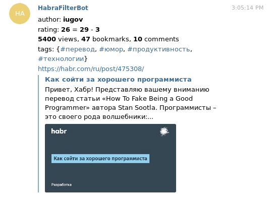

Для вопросов в стиле "зачем?" есть более старая статья - [Натуральный Geektimes — делаем пространство чище](https://habr.com/ru/post/391233/).

Статей много, по субъективным причинам некоторые не нравятся, а некоторые, наоборот, жалко пропускать. Хочется оптимизировать этот процесс и экономить время.

В вышеупомянутой статье предлагался подход со скриптами в браузере, но он мне не очень понравился (хоть я им и пользовался раньше) по следующим причинам:

* Для разных браузеров на компе/телефоне приходится настраивать заново, если это вообще возможно.
* Жёсткая фильтрация по авторам не всегда удобна.
* Не решена проблема с авторами, чьи статьи не хочется пропускать, даже если они выходят раз в год.

Встроенная в сайт фильтрация по рейтингу статей не всегда удобна, так как узкоспециализированные статьи при всей их ценности могут получать довольно скромный рейтинг.

Изначально я хотел генерировать rss ленту (или даже неколько), оставляя там только интересное. Но в итоге получилось, что чтение rss показалось не очень удобным: в любом случае для комментирования/голосования за статью/добавления её в избранное приходится заходить через браузер. Поэтому я написал бота для телеграмма, которые кидает мне в личку интересные статьи. Телеграм сам по себе делает из них красивые превьюшки, что в сочетнии с информацией об авторе/рейтинге/просмотрах выглядит довольно информативно.



Под катом подробности типа особенностей работы, процесса написания и технических решений.

<cut/>

## Кратко о боте

Репозиторий: [https://github.com/Kright/habrahabr_reader](https://github.com/Kright/habrahabr_reader)

Бот в телеграмме: [https://t.me/HabraFilterBot](https://t.me/HabraFilterBot)

Пользователь задаёт добавочный рейтинг для тэгов и авторов. После этого к статьям применяется фильтр - складываются рейтинг статьи на Хабре, пользовательский рейтинг автора и среднее для пользовательских рейтингов по тегам. Если сумма оказывается больше заданного пользователем порогового значения, то статья проходит фильтр.

Побочной целью написания бота было получение фана и опыта. Кроме того, я регулярно напоминал себе, что [я - не гугл](https://habr.com/ru/company/infopulse/blog/330708/), а потому многие вещи сделаны максимально просто и даже примитивно. Впрочем, это не помешало процессу написания бота растянуться на три месяца.

## За окном было лето

Заканчивался июль, а я решил написать бота. И не в одиночку, а со знакомым, который осваивал scala и хотел что-нибудь написать на ней. Начало выглядело многообещающим - код будет пилиться "комадной", задача казалось нетрудной и я думал, что через пару недель или месяц бот будет готов.

Несмотря на то, что я сам последние несколько лет время от времени пишу код на скале, этот код обычно никто не видит и не смотрит: пет проекты, проверка каких-то идей, предобработка данных, освоение каких-то концепций из ФП. Мне было реально интересно, как же выглядит написание кода в команде, потому что код на скале можно писать очень по-разному.

Что же могло пойти **так**? Впрочем, не будем торопить события.
Всё происходящее можно отследить по истории коммитов.

Знакомый создал репозитрий 27 июля, но больше ничего не сделал, а потому я начал писать код.

### 30 июля

Кратко: я написал парсинг rss ленты Хабра.

* ```com.github.pureconfig``` для чтения typesafe конфигов прямов в case классы (оказалось очень удобно)
* ```scala-xml``` для чтения xml: поскольку изначально я хотел написать свою реализацию для rss - ленты, а rss лента в формате xml, то для парсинга использовал эту библиотчеку. Собственно, парсинг rss тоже появился.
* ```scalatest``` для тестов. Даже для крохотных проектов написание тестов экономит время - например, при отладке парсинга xml намного проще скачать его в файлик, написать тесты и поправить ошибки. Когда в дальнейшем появился баг с парсингом каких-то странных html с невалидными utf-8 символами, оказалось опять же удобнее положить его в файлик и добавить тест.
* акторы из Akka. Объективно, они вообще не были нужны, но проект писался for fun, я хотел их попробовать. В результате готов сказать, что мне понравилось. На идею ООП можно взглянуть с другой стороны - есть акторы, которые обмениваются сообщениями. Что интереснее - можно (и нужно) писать код с таким рассчётом, что сообщение может не дойти или не быть обработано (вообще говоря, при работе акки на одном-единственном компе сообщения не должны теряться). Я поначалу ломал голову и в коде происходил треш с подписками акторов друг на друга, но в итоге удалось прийти довольно простой и изящной архитектуре. Код внутри каждого актора можно считать однопоточным, при падениях актора акка перезапускает его - получается довольно отказоустойчивая система.

### 9 августа

Я добавил в проект ```scala-scrapper``` для парсинга html страничек с хабра (чтобы вытаскивать информацию типа рейтинга статьи, количества добавлений в закладки и т.п.).

И Cats. Те самые, которые в скале.


Я тогда читал одну книжку про распределённые базы данных, мне понравилась идея CRDT (Conflict-free replicated data type, [https://en.wikipedia.org/wiki/Conflict-free_replicated_data_type](wiki), [habr](https://habr.com/ru/post/418897/)), поэтому я запилил тайп-класс комутативной полугруппы для информации о статьи на хабре.

На самом деле, идея очень простая - у нас есть счётчики, которые монотонно изменяются. Количество промотров плавно растёт, количество плюсов тоже (впрочем, как и количество минусов). Если у меня есть две версии информации о статье, то можно их "слить в одну" - более акутальной считать то состояние счётчика, которое больше.

Полугруппа обозначает, что два объекта с информацией о статье можно слить в один. Коммутитивная обозначает, что сливать можно и А + B и B + A, результат от порядка не зависит, в итоге останется наиболее новая версия. К слову, ассоциативность тут тоже есть.

Например, по-задумке, rss после парсинга давала чуть ослебленную информацию о статье - без метрик типа количества просмотров. Специальный актор после этого брал информацию о статьях и бегал к html страничкам, чтобы её обновить и слить со старой версией.

Вообще говоря, как и в akka, в этом не было нужды, можно было просто для статьи хранить updateDate и брать более новую без всяких слияний, но меня вела дорога приключений.

## 12 августа

Я начал свободнее себя чувствовать и ради интереса сделал, чтобы каждый чат был отдельным актором. Теоретически, актор сам по себе весит около 300 байт и их можно хоть миллионами создавать, так что это вполне нормальный подход. Получилось, как мне кажется, довольно интересно решение:

Один актор был мостом между сервером телеграмма и системой сообщений в акке. Он просто получал сообщения и отправлял их нужному актору-чату. Актор-чат в ответ мог послать что-нибудь обратно - и оно отправлялось обратно в телеграм. Что было очень удобно - этот актор получился максимально простым и содержал только логику ответа на сообщения. Кстати, информация о новых статьях приходила в каждый чат, но я опять же не вижу в этом никаких проблем.

В общем, бот уже работал, отвечал на сообщения, хранил список отправленных пользователю статей и я уже думал о том, что бот практически готов. Я потихоньку допиливал маленькие фишки типа нормализации имён авторов и тэгов (заменял "s.d f" на "s_d_f").

Оставалось одно *маленькое но* - состояние никуда не сохранялось.

## Всё пошло не так

Возможно, вы заметили, что бота я писал преимущественно один. Так вот, второй участник включился в разработку, и в коде оказались следующие изменения:

* Для хранения состояния появилась mongoDB. Заодно в проекте поломались логи, потому что монга зачем-то начинала в них спамить и кое-кто их просто глобально выключил.
* Актор-мост в телеграм преобразился до неузнаваемости и начал сам парсить сообщения.
* Акторы для чатов были безжалостно выпилены, вместо них появился актор, который прятал в себе всю информацию о всех чатах сразу. На каждый чих этот актор лез в монгу. Ну да, типа при обновлении информации о статье отправить её всем акторам-чатам - тяжело (мы же как гугл, миллионы пользователей так и ждут по миллиону статей в чат для каждого), а вот при каждом обновлении чата лезть в монгу - это нормально. Как я понял сильно позже, работающая логика работы чатов тоже была полностью выпилена и взамен появилось неработающее нечто.
* От тайп-классов не осталось и следа.
* В акторах появилась какая-то нездоровая логика с подписками их друг на друга, ведущая к race condition.
* Структуры данных с полями типа ```Option[Int]``` превратились в Int с магическими дефолтными значениями типа -1. Позже я понял, что mongoDB хранит json и нет ничего плохого в том, чтобы хранить там ```Option``` ну или хотя бы парсить -1 как None, но на тот момент я этого не знал и поверил на слово, что "так надо". Тот код писал не я, и я не лез его менять до поры до времени.
* Я узнал, что мой публичный айпи адрес имеет свойство меняться, и каждый раз приходилось добавлять его в whitelist монге. Бота я запускал локально, монга была где-то на серверах монги как компании.
* Внезапно пропала нормализация тегов и форматирование сообщений для телеграмма. (Хм, с чего бы это?)
* Мне понравилось, что состояние бота хранится во внешней БД, и при перезапуске он продолжает работать как ни в чём ни бывало. Впрочем, это был единственный плюс.

Второй человек не особо торопился, и все эти изменения появились одной большой кучей уже в начале сентября. Я не сразу оценил масштаб полученных разрушений и начал разбираться в работе БД, т.к. раньше и с ними не имел дело. Только потом я понял, сколько работающего кода было выпилено и сколько багов добавлено взамен.

## Сентябрь

Поначалу я думал, что было бы полезно освоить монгу и сделать всё хорошо. Потом я потихоньку начал понимать, что организовать общение с бд - тоже искусство, в котором можно понаделать гонок и просто ошибок. Например, если от пользователя придут два сообщения типа ```/subscribe``` - и мы в ответ на каждое создадим по записи в табличке, потому что на момент обработки тех сообщений пользователь не подписан. У меня возникло подозрение, что общение с монгой в существуещем виде написано не лучшим образом. Например, настройки пользователя создавались в тот момент, когда он подписывался. Если он пробовал их поменять до факта подписки... бот ничего не отвечал, потому что код в акторе лез в базу за настройками, не находил и падал. На вопрос - почему бы не создавать настройки по необходимости я узнал, что нечего их менять, если пользователь не подписался... Система фильтрации сообщений была сделана как-то неочевидно, и я даже после пристального взгляда в код не смог понять, было так задумано изначально или там ошибка.

Списка отправленных в чат статей не было, вместо этого было предложено, чтобы я сам их написал. Меня это удивило - я в общем-то был не против втаскивания в проект всяких штук, но было бы логично втащившему эти штуки их и прикрутить. Но нет, второй участник, похоже, подзабил на всё, но сказал, что список внутри чата - якобы плохое решение, и надо сделать табличку с ивентами типа "пользователю x была отправлена статья у". Потом, если пользователь запрашивал прислать новые статьи, надо было отправить запрос к бд, который из ивентов выделил бы ивенты, относящиеся к пользователю, ещё получить список новых статей, отфильтровать их, отправить пользователю и накидать ивентов об этом обратно в бд.

Второго участника куда-то понесло в сторону абстракций, когда боту будут приходить не только статьи с Хабра и отправляться не только в телеграм.

Я как-то реализовал ивенты в виде отдельной таблички ко второй половине сентября. Неоптимально, но бот хотя бы заработал и снова начал присылать мне статьи, а я потихоньку разобрался с происходящим в коде.

Сейчас можно вернуться вначало и вспомнить, что репозиторий изначально создавал не я. Что же могло пойти так? Мой пул-реквест был отклонен. Оказалось, что у меня быдлокод, что я не умею работать в команде и я должен был править баги в текущей кривой реализации, а не дорабатывать её до юзабельного состояния.

Я расстроился, посмотрел историю коммитов, количество написанного кода. Посмотрел на моменты, которые изначально были написаны хорошо, а потом сломаны обратно...

## F*rk it

Я вспомнил статью [Вы — не Google](https://habr.com/ru/company/infopulse/blog/330708/).

Подумал о том, что идея без реализации никому особо не нужна. Подумал о том, что я хочу иметь работающего бота, который будет в одном-единственном экземпляре работать на одном-единственном компе как простая java-программа. Я знаю, что мой бот будет работать месяцами без перезапусков, благо в прошлом я уже писал таких ботов. Если он вдруг всё-таки упадёт и не пришлёт пользователю очередную статью, небо не обрушится на землю и ничего катастрофического не произойдёт.

Зачем мне докер, mongoDB и прочий карго-культ "серьёзного" софта, если код тупо не работает или работает криво?

Я форкнул проект и сделал всё как хотел.


Примерно тогда же я поменял место работы и свободного времени стало катастрофически не хватать. Утром я просыпался ровно на электричку, вечером возвращался поздно и что-либо делать уже не хотелось. Я какое-то время не делал ничего, потом желание дописать бота пересилило, и я стал потихоньку переписывать код, пока ездил на работу утром. Не скажу, что это было продуктивно: сидеть в трясущейся электричке с ноутбуком на коленях и подглядывать на stack overflow с телефона не очень удобно. Впрочем, время за написанием кода пролетало совершенно незаметно, и проект начал потихоньку двигаться к рабочему состоянию.

Где-то в глубине души был червячок сомнения, который хотел использовать mongoDB, но я подумал, что кроме плюсов с "надёжным" хранением состояния есть заметные минусы:

* БД становится ещё одной точкой отказа.
* Код становится сложнее, и писать его я буду дольше.
* Код становится медленным и неэффективным, вместо изменения объекта в памяти изменения отправляются в БД и при необходимости вытаскиваются обратно.
* Появляются ограничения типа хранения ивентов в отдельной табличке, которые связаны с особенностями работы БД.
* В триальной версии монги есть какие-то ограничения, и если в них упереться, придётся на чём-то монгу запускать и настраивать.

Выпилил монгу, теперь состояние бота просто хранится в памяти программы и время от времени сохраняется в файлик в виде json. Возможно, в комментариях напишут, что я не прав, бд именно тут надо использовать и т.п. Но это мой проект, подход с файлом максимально прост и он работает прозрачным образом.

Выкинул магические значения типа -1 и вернул нормальные ```Option```, добавил хранение хеш-таблички с отправленными статьями обратно в объект с информацией о чате. Добавил удаление информации о статьях старше пяти дней, чтобы не хранить всё подряд. Привёл логирование к рабочему состоянию - логи в разумных количествах пишутся и в файл и в консоль. Добавил несколько админских команд типа сохранения состояния или получения статистики типа количества пользователей и статей.

Исправил кучу мелочей: например, для статей теперь указывается количество просмотров, лайков-дизлайков и комментариев на момент прохождения фильтра пользователя. Вообще, удивительно, сколько мелочей пришлось поправить. Я вёл списочек, отмечал там все "шероховатости" и по мере возможностей исправлял их.

Например, я добавил возможность прямо в одном сообщении задать все настройки: 
```
/subscribe
/rating +20
/author a -30
/author s -20
/author p +9000
/tag scala 20
/tag akka 50
```
И ещё команда ```/settings``` выводит их именно в таком виде, можно брать текст от неё и отправлять все настройки другу.
Вроде и мелочь, но подобных нюансов - десятки.

Реализовал фильтрацию статей в виде простой линейной модели - пользователь может задать дополнительный рейтинг авторам и тегам, а так же пороговое значение. Если сумма рейтинга автора, среднего рейтинга для тегов и реального рейтинга статьи окажется больше порогового значения, то статья показывается пользователю. Можно либо просить у бота статьи командой /new, либо подписаться на бота и он будет кидать статьи в личку в любое время суток.

Вообще говоря, у меня была идея для каждой статьи вытянуть больше признаков (хабы, количество комментариев, добавлений в закладки, динамику изменения рейтинга, количество текста, картинок и кода в статье, ключевые слова), а пользователю показывать голосовалку ок/не ок под каждой статьей и под каждого пользователя обучать модель, но мне стало лень.

Вдобавок, логика работы станет не такой очевидной. Сейчас я могу вручную поставить для patientZero рейтинг +9000 и при пороговом рейтинге в +20 буду гарантированно получать все его статьи (если, конечно, не поставлю -100500 для каких нибудь тегов).

Итоговая архитектура получилась довольно простой:

1. Актор, который хранит состояние всех чатов и статей. Он грузит своё состояние из файлика на диске и время от времени сохраняет его обратно, каждый раз в новый файлик.
2. Актор, который время от времени набегает в rss-ленту, узнаёт о новых статьях, заглядывает по ссылкам, парсит, и оправляет эти статьи первому актору. Кроме того, он иногда запрашивает у первого актора список статей, выбирает те их них, которые не старше трёх дней, но при этом давно не обновлялись, и обновляет их.
3. Актор, который общается с телеграммом. Я всё-таки вынес парсинг сообщений полностью сюда. По-хорошему хочется разделить его на два - чтобы один парсил входящие сообщения, а второй занимался транспортными проблемами типа переотправки неотправившихся сообщений. Сейчас переотправки нет, и не дошедшее из-за ошибки сообщение просто потеряется (разве что в логах отметится), но пока что это не вызывает проблем. Возможно, проблемы возникнут, если на бота подпишется куча человек и я достигну лимита на отправку сообщений).

Что мне понравилось - благодаря akka падения акторов 2 и 3 в общем-то не влияют на работоспособность бота. Возможно, какие-то статьи не обновляются вовремя или какие-то сообщения не доходят до телеграмма, но акка перезапускает актор и всё продолжает работать дальше. Я сохраняю информацию о том, что статья показана пользователю только тогда, когда телеграм актор ответит, что он успешно доставил сообщение. Самое страшное, что мне грозит - отправить сообщение несколько раз (если оно доставится, но потверждение каким-то неведомым образом потеряется). В принципе, если бы первый актор не хранил состояние в себе, а общался с какой-нибудь бд, то он мог бы тоже незаметно падать и возвращаться к жизни. Ещё я мог бы попробовать akka persistance для восстановления состояния акторов, но текущая реализация меня устраивает своей простотой. Не то чтобы мой код часто падал - наоборот, я приложил довольно много усилий, чтобы это было невозможным. Но shit happens, и возможность разбить программу на изолированные кусочки-акторы показалась мне реально удобной и практичной.

Добавил circle-ci для того, чтобы при поломке кода сразу об этом узнавать. Как минимум, о том, что код перестал компилироваться. Изначально хотел добавить travis, но он показывал только мои проекты без форкнутых. В общем-то обе эти штуки можно свободно использовать на открытых репозиториях.

## Итоги

Уже ноябрь. Бот написан, я пользовался им последние две недели и мне понравилось. Если есть идеи по улучшению - пишите. Я не вижу смыла монетизировать его - пускай просто работает и присылает интересные статьи.

Ссылка на бота: [https://t.me/HabraFilterBot](https://t.me/HabraFilterBot)
Гитхаб: [https://github.com/Kright/habrahabr_reader](https://github.com/Kright/habrahabr_reader)

Небольшие выводы:

* Даже маленький проект может сильно затянуться по времени.
* Вы - не гугл. Нет смысла стрелять из пушки по воробьям. Простое решение может работать ничуть не хуже.
* Пэт-проекты очень хорошо подходят для экспериментов с новыми технологиями.
* Телеграм боты пишутся довольно просто. Если бы не "командная работа" и эксперименты с технологиями, бот был бы написан за неделю-две.
* Модель акторов - интересная штука, хорошо сочетающаяся с многопоточностью и отказоустойчивостью кода.
* Кажется, я почувствовал на себе, почему open source сообщество любит форки.
* Базы данных хороши тем, что состояние приложения перестаёт зависеть от падений/перезапусков приложения, но работа с БД усложняет код и накладывает ограничения на структуру данных.

[Пост на хабре](https://habr.com/ru/post/475450/)