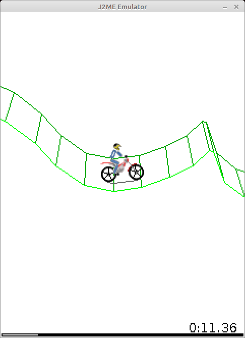
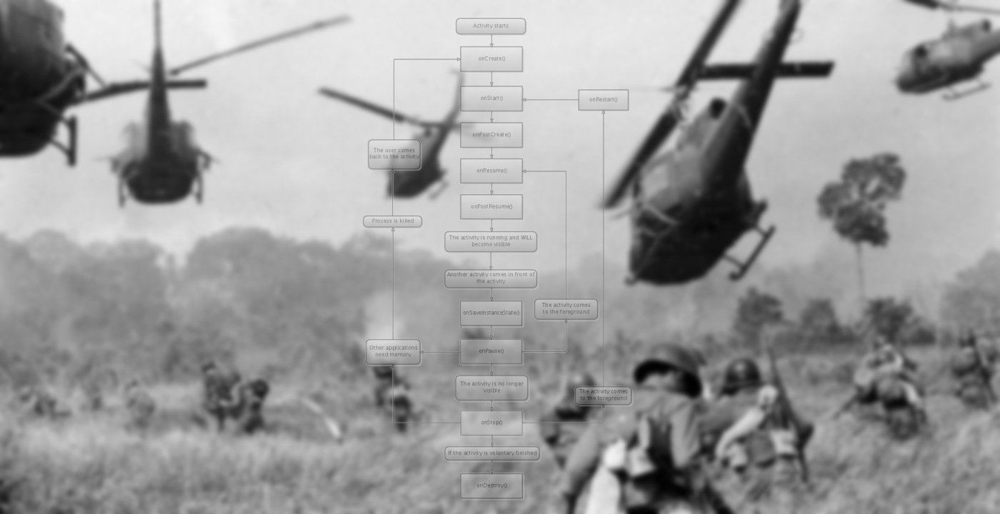
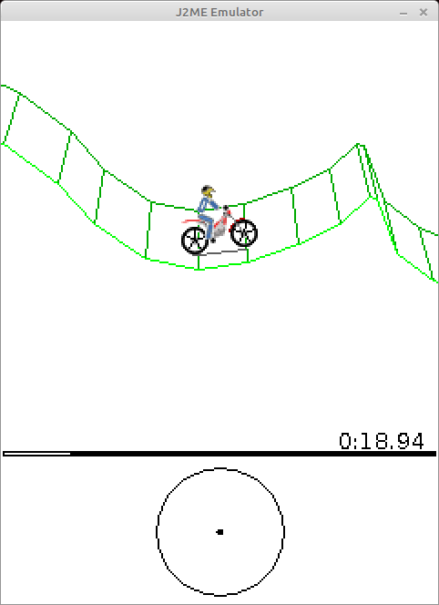

# Nostalgia post: J2ME, Gravity Defied, 64kb

This article doesn't pursue any practical goals - I just got curious how, some 15 years ago, developers managed to make perfectly functional apps and games for the weak phones of that time.



* Just in case: I have nothing to do with this game.

For example, the game from the picture above didn't use floating-point numbers, because not all phones supported them. The "3d" and the physics are completely hand-written, on fixed-point math on top of integers. But I think listing the quirks of a single app wouldn't be very informative. To complete the picture I'll touch a bit on what the phones could do, on the J2ME platform, and while I'm at it compare all this with modern Android development.

Besides, J2ME is a full-fledged Java of an old version (1.3, I think), so I wrote some of the missing classes and managed to run the little .jar file with the game on my PC. The screenshot above is from there. I won't say there's any use in this - it's just that the J2ME API was very simple and I felt like trying.

<cut/>

## Phones of that time.

Technically, modern phones have gone very far, but in terms of functionality, in my opinion, even the old phones let you do all sorts of interesting things.

My first phone was a [Nokia 5200](https://allnokia.ru/catalog/nokia-5200/), and instead of some "abstract smartphone in a vacuum" I'd rather describe what it had:

* came out in 2006
* a 128x160 pixel display, a whole 1.8 inches in size
* The display supported as many as 262 thousand colors. (if I understand correctly, that's 6 bits each for the R, G, B components).
* An IR port and bluetooth for sending files to other phones.
* a few megabytes of persistent internal memory (I don't remember exactly, the internet says 7 MB)
* a slot for a microSd card, mine was 256 MB, I think.
* even back then there were some primitive browsers and Opera Mini (which, by the way, also weighed literally a hundred kilobytes)
* a 640x480 pixel camera.
* MIDP 2.0 support ([wiki](https://en.wikipedia.org/wiki/Mobile_Information_Device_Profile))
* the phone could pretend to be a flash drive when plugged in over USB
* but it charged through some connector of its own
* I couldn't find what the performance of the processors was, but it was clearly very modest - no more than 100 MHz of clock speed and, possibly, a very slow or missing implementation of floating-point numbers. Unfortunately, the phone died long ago and I can't run any benchmarks on it.

I won't list the mobile games I played on it - I'll just say that they all weighed 50-200 kB and still had pretty deep gameplay.

## Write once, run everywhere

Originally Java was positioned precisely for all sorts of low-power household devices. And it settled in very nicely on the phones of that time, letting you run the same game on phones from different manufacturers. Of course, there were platform-specific quirks, but purely in theory the code was supposed to work the same everywhere.

The language was simple, and so was the bytecode. It has one-byte instructions for a virtual stack machine - writing a naive interpreter isn't all that hard. And for the same reason the bytecode took up little space. What's interesting, inside the .jar of a J2ME app there are the very real .class files of full-fledged Java. The only difference was that a mobile app used the classes Canvas, MIDlet and others from the javax.microedition package to interact with the outside world.

In my opinion, it's brilliantly simple. Compared to this, Android looks like a pile of kludges: the code is compiled into .class files, then converted into .dex (or several of them, since a single dex file doesn't support more than 65k methods), packed into an apk, and then the mobile device recompiles it for [ART](https://en.wikipedia.org/wiki/Android_Runtime).

Besides, mobile Java supported multithreading. As we'll see later, you couldn't get by without it when writing apps. What's interesting, the view on multithreading was a bit different back then. For example, the standard Vector class had all of its methods synchronized. Now Vector is considered obsolete, and the advice is to use a plain ArrayList in single-threaded code and the very same ArrayList in multithreaded code, but to explicitly take a lock on it.

Another interesting thing - old Java had no generics. The type system consisted of primitives (int, boolean, ...) and objects. That same Vector class stored objects inside and returned them as Object, and the programmer then cast what he got to the type he needed.

By the way, when I see go and manual casts to the needed types, I remember Java 1.3. Only go for some reason got stuck in its development, while in Java's case version 1.5 with generics support came out already in 2004. But mobile development was still using 1.3.

Since a mobile J2ME app is the most ordinary .jar with normal .class files inside (even if in the 1.3 format, which is already 20 years old), you can take advantage of that and run Gravity Defied right on a PC. "Big" Java doesn't have the classes from javax.microedition, but you can write them yourself. The task is even simpler than that, since there are classes with almost the same set of methods: for example, ```java.awt.Image``` and ```javax.microedition.lcdui.Image```.

## Architecture of J2ME apps



To interact with the outside world you used the classes from ```javax.microedition```. Maybe because of the limited capabilities of the phones, or maybe just because of the developers' sense of beauty, the set of classes is very small, and the classes themselves are as simple as they get. For an example you can look at the classes in [javax.microedition.lcdui](https://docs.oracle.com/javame/config/cldc/ref-impl/midp2.0/jsr118/javax/microedition/lcdui/package-tree.html).

To create an app you had to inherit from the [MIDlet](https://docs.oracle.com/javame/config/cldc/ref-impl/midp1.0/jsr037/javax/microedition/midlet/package-summary.html) class.

When the app started, its ```startApp()``` method got called.
If the app was minimized - ```pauseApp()``` got called, and ```startApp()``` again when it was reopened. On a proper close ```destroyApp()``` got called.

Besides, the app could itself call the methods ```notifyPaused()``` and ```notifyDestroyed()``` - to report that it had paused itself or finished.
Besides, the app could ask to "come out of pause" with the ```resumeRequest()``` method

Honestly, I don't quite get the point of ```notifyPaused()```, since apps worked fine without it too, nobody killed them.

I think this is exactly what the app lifecycle of a healthy person should look like.

In practice it usually turned out that the app class implemented Runnable and the implementation looked something like this:

```java
Thread thread;
boolean isRunning;
boolean needToDestroy = false;

public void startApp() {
    isRunning = true;
    if (thread != null) {
        thread = new Thread(this);
        thread.start();
    }
}

public void pauseApp() {
    isRunning = false;
}

public void destroyApp(boolean unconditional) {
    needToDestroy = true;
}
```
And that's it, from there the app lived in its own thread.

```java
void run(){
    while(!needToDestroy) {
        // the game loop goes here
        // and if we're paused - we sleep.
        while (!isRunning) {
            Thread.sleep(100);
        }
    }
    notifyDestroyed();
}
```
I think waking a thread up every 100 milliseconds is no big deal, and this approach could perfectly well exist on modern phones too. On top of that, nobody forbids you to stop the thread after the ```pauseApp()``` call and start it again in ```startApp()```

### Canvas

For drawing on the screen there was one more class - [Canvas](https://docs.oracle.com/javame/config/cldc/ref-impl/midp2.0/jsr118/javax/microedition/lcdui/Canvas.html). It's similar to the desktop Canvas in Java.

From any thread you can call the ```repaint()``` method, which hints to the system that it would be nice to update the picture. After that the system calls ```paint(Graphics g)``` in the UI thread. Maybe someone will get Vietnam flashbacks again, but when the app was minimized nothing terrible happened to the Canvas - the object stayed valid for the whole life of the program. The only difference - for an app in the background the ```repaint()``` calls were ignored and the ```paint(...)``` method wasn't called.

Remarkably, touch displays were supported even back then: there were the methods
```hasPointerEvents(), hasPointerMotionEvents(), hasRepeatEvents()```, which returned true on a touchscreen phone. On touches, methods like ```pointerDragged(int x, int y)``` (the pointer moved) got called, as well as the versions for ```pressed```(the touch began) and ```released```(the touch ended).
There's no multitouch support - oh well, there were no suitable displays back then anyway.

### Fonts and menus

Funnily enough, back then there were as many as three font sizes - small, medium and large. The actual sizes depended on the phone. But, if you take the display sizes into account, it looks fine. I don't think even a 240x360 display needs all that many font sizes. The most important thing - bold and italic fonts - was supported.

Now it's been unified somehow, but back then the "back" button on smartphones could be either on the left or on the right. In J2ME there was some mechanism for creating menus, so that the system itself drew the menu items, supported scrolling and so on, and the app just got the number of the selected item. For example, on a Nokia 5800 you could scroll such menus with your finger, even if the developers of the app had no idea about it.

## MIDletPascal

Once upon a time I was in school, learned Pascal there and knew no other languages. I didn't manage to get into java2me development from scratch, but luckily for me, I found out that [MIDletPascal](https://ru.wikipedia.org/wiki/MIDletPascal) existed, and I wrote my first phone apps in exactly that. Later I moved to J2ME in a rather funny way - I'd make an app in MIDletPascal, decompile it and look at what came out in Java.

## So what's inside?

Alright, enough nostalgia, let's rather look at how Gravity Defied is made and how it fit into 64 kilobytes.

First, a .jar is a zip archive, and its contents weigh 122.1 kB

* In the META-INF folder there's a 3.8 kB MANIFEST.MF, which lists the game's files and the SHA-1 and MD5 hashes for them. As well as the name of the main class and of the file with the app icon.
* the 5.1 kB file levels.mrg contains, in a pretty compact form, the information about all 30 game levels. On average 170 bytes per level. I'll tell more about such a compact storage format later.
* 11 images. About 10.8 kB in total. Some of them are atlases with a bunch of sprites
* .class files, 98.3 kB in total, 15 of them. The smallest - 127 bytes, the largest - 24.3 kB. By size they can be split into groups:
   * two interfaces, (4 methods in each), 127 and 174 bytes.
   * a simple class with six fields and a couple of methods - 470 bytes.
   * 9 classes of a reasonable size - from 1.6 to 6 kB.
   * god-like classes:
       * m (I later renamed it to [MenuManager](https://gitlab.com/Kright/pc-j2me-emulator/-/blob/master/app-from-sources/src/main/java/MenuManager.java)) - 24.3kB, all the possible menus and messages of the game are hardcoded in it. No layout.xml and strings.txt :). The game wasn't meant to support several languages.
        * i ([GameCanvas](https://gitlab.com/Kright/pc-j2me-emulator/-/blob/master/app-from-sources/src/main/java/GameCanvas.java)) 15.2 kB: a lot of drawing-related code, but, oddly enough, not all of it.
        * b ([GamePhysics](https://gitlab.com/Kright/pc-j2me-emulator/-/blob/master/app-from-sources/src/main/java/GamePhysics.java)) 20.6 kB: the game physics calculations and, for some reason, a lot of drawing-related code.


## Decompiling

We'll need a decompiler. I took fernflower - the one built into IntelliJ IDEA. It seems to work fine - the output was code that you can actually compile back. A few years ago I tried other decompilers and they couldn't cope.

The IDEA repository weighs more than a gigabyte and takes a long time to clone - instead you can use the [mirror](https://github.com/fesh0r/fernflower) that contains only the decompiler.

Building the decompiler is trivial: ```./gradlew jar```, and the .jar you need shows up in the build folder
Decompiling is a bit harder: ```mkdir decompiled && java -jar fernflower.jar -ren=1 GravityDefied_java decompiled```

By default the ```ren``` option is off, and without it you get code where variables and methods can have funny names like ``if`` or ``for``. Bytecode doesn't forbid such names, but the Java compiler won't like them. With ```ren=1``` the decompiler turns the names into something like ```field_42``` or ```method_135``` - it can't get any worse, but the code becomes valid.

The game came out back in 2004 - and, remarkably, obfuscation was already used even then:

* Bytecode stores the names of classes, methods and fields in some form. And names of one or two letters made the .class files smaller.
* There are surprises in the form of invalid names like ```else```, ```int``` and so on.
* You could cut out unused methods and, again, make the code more compact. In the game only the Micro class escaped the "renaming", and it's the only one where I found unused methods.
* possibly, the fixed-point math used methods that got inlined. I doubt the developers wrote code like ```(int)((long)a * b >> 16)``` by hand
* I don't know whether several classes were glued into one by hand or by the obfuscator, but there's this Schrödinger's class in the game.

## Putting it back together

Looking at code is nice, but not very informative. I want to run it and, maybe, add debug output or something else. And I also want to restore normal names for the variables, methods and classes.

Many, many years ago I wrote code in NetBeans, and to build J2ME apps you had to download a special SDK. The build, I think, used ant. You can [read more here.](https://www.oracle.com/java/technologies/java-me-sdk-3-0-5-downloads.html)

But the old Nokia didn't work anymore, and I wanted to build and run the code right on my own computer, preferably on Linux. So I set up a Gradle project and tried to build the code. The code didn't build - the classes from ```javax.microedition.*``` were missing.  Makes sense - they don't exist in the PC version of Java. I decided to go reinvent the wheel and just mechanically added all the non-existent classes and methods. The game uses a small subset of the available methods and classes, so it took no more than an hour.

For convenience I had ```watch ./gradlew run``` going in a terminal and watched the list of errors in real time. After adding each new method I saved the changes with ```ctrl+S```.

You can look at the implemented classes [here](https://gitlab.com/Kright/pc-j2me-emulator/-/tree/master/emulator/src/main/java/javax/microedition).
There are only 19 of them:

* 8 for saves, in javax.microedition.rms.
* 10 in .lcdui, responsible for images, fonts, Canvas and so on).
* MIDlet - the main class that the app has to inherit from.

Once the project compiles without errors, you can try to bring it into a pretty shape.

The app has the Micro class, where the method names aren't obfuscated. Makes sense, really - methods like startApp are inherited from MIDlet and can't be renamed.

A code example:

```java
protected void pauseApp() {
    c = true;
    if (!b) {
        this.gameToMenu();
    }
    System.gc();
}
```

You can pretty much guess that the variable ```c``` could be called ```isPaused```.

For "simple" methods you can also quite often figure out what's going on:

```java
public void a() {
    if (this.recordStore != null) {
        try {
            this.e.closeRecordStore();
            return;
        } catch (RecordStoreException var1) {
        }
    }
}
```
and rename it to something like ```closeMethodStore```.

Besides, in IntelliJ IDEA you can look at all the calls of some method. Especially of the ones we wrote stubs for, like ```Image.loadImage(name)```:

```java
this.p = Image.createImage("/splash.png");
```

It's pretty obvious that p can be renamed to splashImage.

From a certain angle it's like solving a sudoku - you find the obvious spots, give meaningful names to variables and methods. That makes the other methods easier to understand, you give names to them... Huge respect to the JetBrains developers - I spent at least ten hours crawling around the code, renaming variables and methods - and the code didn't break a single time. Still, I compiled the code from time to time anyway and made sure it still worked.

At some point I got tired of it. I tried to run the code and it crashed - because all my stubs like loadImage()... returned null and did nothing. The time had come to write implementations for the stubs.

Most of them were trivial to do: for example, the Image class:

```java
public class Image {
    public final java.awt.Image image;

    private Image(java.awt.Image image) {
        this.image = image;
    }

    public Graphics getGraphics() {
        throw new RuntimeException();
    }

    public int getWidth() {
        return image.getWidth(null);
    }

    public static Image createImage(int w, int h) {
        return new Image(new BufferedImage(w, h, BufferedImage.TYPE_INT_ARGB));
    }
    ...
}
```

Of course, the API doesn't match in places, but it's very similar all the same.

For drawing I made a CanvasImpl class, which inherits from JPanel. It handled key presses and paint calls and turned them into calls to our game Canvas.
I even got a taste for it and added upscaling of the picture, so that I didn't have to squint at a tiny window:

```java
public void paintComponent(Graphics g) {
    if (upscale == 1) {
        canvas.paint(new javax.microedition.lcdui.Graphics(g));
    } else {
        canvas.paint(new javax.microedition.lcdui.Graphics(screen.getGraphics()));
        g.drawImage(screen, 0, 0, width * upscale, height * upscale, Color.WHITE, null);
    }
}
```

```javax.microedition.lcdui.Graphics(g)``` - that's my wrapper over awt.Graphics, which translates the drawing calls.

Again and again I ran the code, watched it crash in different places and filled in the implementations for my stubs. Some exceptions the game swallowed "painlessly", but then worked incorrectly.

For example, if image loading doesn't work in the game, the game still works, draws the biker with plain lines and the wheels with sticks. But it lags on a PC. And why? For some reason the game tiles the background with ```64 * 64``` images, and if the image doesn't load, an empty ```1 * 1``` pixel image is substituted, and when the display is tiled it gets drawn ```240 * 320``` times or something like that. Apparently, the game originally worked without images too, with graphics made of sticks and circles, then the developers added images, but didn't test how it works without them.

Besides, there are funny bugs with saving. Maybe I implemented it incorrectly myself, but the point is that at some moments the game tries to write to an invalid place, then catches the exception, swallows it and calmly keeps working.

Honestly, I didn't google what ready-made J2ME emulators for PC there are. Most likely there are some - somewhere around 2010 I used one, when I was only just getting into programming and trying to write games. If the existing emulators lack some features and you feel like extending mine to support some other games - send me a DM.

## It works!

In the end I managed to build the decompiled code together with my stubs, run it and play.

After that I tried to hook the original .jar with the game up to the stubs. A few errors showed up. It turns out it matters not only that a method has the right name, but also that it belongs to the right parent class. Because of this I had to make Alert and Canvas inherit from Displayable and put there the abstract methods that I had originally declared in Canvas. Oh well, it didn't take that many fixes.

Right now the [Gradle project](https://gitlab.com/Kright/pc-j2me-emulator/-/tree/master/) has this structure:

* The emulator module with the code of, well, my hand-written emulator. A lot of methods are missing, I implemented only the minimum that was needed for the  game to work.
* The app-original module, which has the original .jar in its dependencies and lets you run it
* The app-from-sources module with the sources, decompiled and brought into a more or less decent shape. It runs too.

## Bringing the code into a pretty shape

Once the decompiled code could be compiled and run, figuring it out became easier. You can add debug output or "switch off" individual methods to understand what it is they do.

I think now we can discuss the implementation details more closely.

## Fixed-point physics

The calculations use ordinary integers. They're stored as plain ints, and the lower 16 bits are considered to be the fractional part. This way you get numbers that take values from ```-32768.0``` to ```32767.999984``` with a step of ```1.0 / 65536```.

This solution seemed very pretty to me - a decent fixed precision combined with a pretty large range of usable values.

Addition and subtraction of such numbers are no different from the same operations on int.

Multiplication: if you just multiply the ints, you get the fractional part, and the integer part "overflows". For multiplication the numbers were first converted to long. Multiplying them gave a 64-bit number with a fractional part of 32 bits. Then with a bitwise shift right by 16 you can get back to 16 fractional bits and cut the number back down to int.

Division: with a plain division the fractional part gets lost. Instead, again, you need a conversion to long, shift the dividend left by 16 bits and divide. In the game for some reason they did it differently, a shift left by 32 and then - right by 16.

The game has an [implementation](https://gitlab.com/Kright/pc-j2me-emulator/-/blob/master/app-from-sources/src/main/java/MathF16.java) of ```sin```, ```cos``` and ```atan2```.

It's done pretty simply - there's a hardcoded array of 64 values - an angle from 0 to 90 degrees. When computing a sine or a cosine the angle is reduced to this range, then an index is computed - and the value is read from the array by it. You get a value accurate to a degree and a half. Apparently, that's enough for the game.

## Touch input



Funnily enough, this game supported it already in two thousand and four. If the ```Canvas.hasPointerEvents()``` method returns ```true```, the game draws an extra little circle for the controls, which you can poke at. The mode is there more to tick a box - the input values get quantized into "full throttle", "full lean", "full brake" anyway, and you can't do anything "halfway". But, be that as it may, the game does have touch input support.

## Level format

Above I mentioned that the average size of a game level is 170 bytes. How did that happen? Very simple - just a couple of bytes are used to store each point.

Or rather, it's done a bit more cleverly - first comes all sorts of information like the start/finish positions and so on, as well as the number of points. There are two modes for storing the points. If the first byte is 0xff, then what follows as the coordinates is a pair of ints with absolute coordinates, but if the byte is different, then this byte is the dx offset relative to the previous point, and after it comes a byte with the dy offset.

```java
for (int i = 1; i < pointsCount; ++i) {
    byte modeOrDx;
    if ((modeOrDx = var1.readByte()) == -1) {
        offsetY = 0;
        offsetX = 0;
        pointX = var1.readInt();
        pointY = var1.readInt();
    } else {
        pointX = modeOrDx;
        pointY = var1.readByte();
    }
    offsetX += pointX;
    offsetY += pointY;
    this.addPointSimple(offsetX, offsetY);
}
```

[The full code](https://gitlab.com/Kright/pc-j2me-emulator/-/blob/master/app-from-sources/src/main/java/GameLevel.java#L302)

Simple and efficient.

## Texture atlases

Unlike modern phones with a GPU and full hd screens, the little old phones had very modest displays like (```128*160``` or ```240*320```). The need to rotate images and draw 3d objects somehow never came up, and the image api doesn't even have such a capability. The only thing you could do when drawing an image was rotate it by 90-180-270 degrees and mirror it.

I think for that time it wasn't a problem - a sprite a dozen pixels in size doesn't have all that many visibly different rotations.
In this game specifically, the bike body, the body parts and the helmet of the biker used 32 or 16 sprites each. The helmet sprites needed an image of a whole 48*48 pixels, weighing 1091 bytes.

Still, I should note that at that time there already existed some very primitive API for 3d graphics with a fixed 3d pipeline, and I even played something 3d. The textures had huge visible pixels, and octagonal wheels on the little cars were perceived as something normal and highly detailed.

The way I see it - the display sizes and the capabilities of the phones suited sprite-based 2d graphics very well and couldn't handle 3d.

## String caching

During the game the time is drawn in the bottom right corner of the screen. What's funny - the developers decided not to create a new string every frame and [made a lazily filled cache](https://gitlab.com/Kright/pc-j2me-emulator/-/blob/master/app-from-sources/src/main/java/GameCanvas.java#L134) of 100 strings like "23" and "64".

```java
if (time10MsToStringCache[time10MsPart] == null) {
    String zeroPadding;
    if (time10MsPart >= 10) {
        zeroPadding = "";
    } else {
        zeroPadding = "0";
    }
    time10MsToStringCache[time10MsPart] = zeroPadding + time10Ms % 100L;
}
```

Honestly, I don't know whether it made sense to go to such trouble for two digits. Maybe it would've been simpler to draw the digits one by one.

## No-MVP architecture

The [MenuManager](https://gitlab.com/Kright/pc-j2me-emulator/-/blob/master/app-from-sources/src/main/java/MenuManager.java) class contains all the menus as hardcode (they're all created once when the class is initialized) and draws them when needed. If some component of the game needs to know what the current level is - it just goes to the level selection menu object and asks which position is active.

Maybe someone will say that you have to separate the model from its view and apply all sorts of patterns for abstraction. But on the other hand: look at how a similar task may be done in Android:

* There's a layout file with the placement of the buttons. A separate one for each menu.
* Strings like the button labels are moved out into a separate strings.txt file.
* There's an Activity, which gets recreated at every sneeze.
* There's a LifecycleObserver, which lets you bind a text field to an Adapter in such a way that when the Activity dies it can actually die and not take up memory.
* The Adapter transforms the data from a DataSource.
* Just passing classes between threads is "not ok", so on top of that we'll pack them into a Bundle and unpack them back after getting them from the DataSource.
* Data gets thrown into the DataSource from different threads, or is even synchronized with an SQLite database.

A question: is all of this really needed to handle a user moving around an in-game menu? I may be wrong in the details, but the essence of the problem should be obvious.

## Several classes glued into one

I spent a long time guessing what the [TimerOrMotoPartOrMenuElem](https://gitlab.com/Kright/pc-j2me-emulator/-/blob/master/app-from-sources/src/main/java/TimerOrMotoPartOrMenuElem.java) class is for, and I named it that way for a reason.
I don't know whether it was the obfuscator's doing or it was done by hand, but this class is used at the same time to represent at least three different entities:

* a piece of the motorbike with coordinates and so on
* a menu element with some text
* a timer that you can set for "in a second" or something like that

Accordingly, if the class is used as a menu element, one set of fields in the class is used, if as a motorbike element - another.

Most likely, this was done to reduce the size of the app and fit it into 64 kilobytes. Apparently, the classes separately weighed noticeably more than "assembled" into one like this.

## Long loading

I discovered that the game, which builds from scratch in under a second, nevertheless takes a long time to load. "Hm, suspicious" - I thought and went looking for the source of the slowness.

[Here's what I found](https://gitlab.com/Kright/pc-j2me-emulator/-/blob/master/app-from-sources/src/main/java/Micro.java#L110):

```java
public void init() {
    long timeToLoading = 3000L;
    Thread.yield();
    this.gameCanvas = new GameCanvas(this);
    Display.getDisplay(this).setCurrent(this.gameCanvas);
    this.gameCanvas.requestRepaint(1);

    while (!this.gameCanvas.isShown()) {
        this.goLoadingStep();
    }

    long deltaTimeMs;
    while (timeToLoading > 0L) {
        deltaTimeMs = this.goLoadingStep();
        timeToLoading -= deltaTimeMs;
    }

    this.gameCanvas.requestRepaint(2);

    for (timeToLoading = 3000L; timeToLoading > 0L; timeToLoading -= deltaTimeMs) {
        deltaTimeMs = this.goLoadingStep();
    }

    while (gameLoadingStateStage < 10) {
        this.goLoadingStep();
    }

    this.gameCanvas.requestRepaint(0);
    this.isInited = true;
}
```

The game triggers a screen update and then calls ```goLoadingStep()``` over and over for three seconds. Then it triggers a screen update again, switching the picture to another one, and again calls ```goLoadingStep()``` for three seconds. And after that it calls ```goLoadingStep``` until the steps are finished.


As for ```goLoadingStep()``` itself, it [is also done in a rather funny way](https://gitlab.com/Kright/pc-j2me-emulator/-/blob/master/app-from-sources/src/main/java/Micro.java#L59):

```java
private long goLoadingStep() {
    ++gameLoadingStateStage;
    this.gameCanvas.repaint();
    long startTimeMillis = System.currentTimeMillis();
    switch (gameLoadingStateStage) {
        case 1:
            this.levelLoader = new LevelLoader();
            break;
        case 2:
            this.gamePhysics = new GamePhysics(this.levelLoader);
            this.gameCanvas.init(this.gamePhysics);
            break;
        case 3:
            this.menuManager = new MenuManager(this);
            this.menuManager.initPart(1);
            break;
            .... ///similar code for 5-8
        case 9:
            this.menuManager.initPart(7);
            break;
        case 10:
            this.gameCanvas.setMenuManager(this.menuManager);
            this.gameCanvas.setViewPosition(-50, 150);
            this.setMode(1);
            break;
        default:
            --gameLoadingStateStage;

            try {
                Thread.sleep(100L);
            } catch (InterruptedException var3) {
            }
    }

    return System.currentTimeMillis() - startTimeMillis;
}
```

And [MenuManager.initPart()](https://gitlab.com/Kright/pc-j2me-emulator/-/blob/master/app-from-sources/src/main/java/MenuManager.java#L228) also contains a huge ```switch case``` block with loading steps.

Honestly, I don't know why it's done this way. You could just show the logo in a separate thread and then switch the picture to another one three seconds later, and calmly load everything you need in the main thread.

## How it was made

[The original game](https://ru.wikipedia.org/wiki/Gravity_Defied:_Trial_Racing) first appeared in 2004. It was written for the Excitera Mobile Awards 2004 (EMA04) contest and won in the best-in-show category. The company Codebrew Software had three Swedish developers:

* Tors Björn Henrik Johansson - system/game logic/interface, testing, levels design
* Set Elis Norman - graphics/physics/mathematics/system/tools programming, levels design
* Per David Jacobsson - physics programming, game graphics, levels design

Besides, there's [a port of this game to Android](https://github.com/evgenyzinoviev/gravitydefied), made by compatriots of ours, but it simply uses the decompiled code.

Since nobody has had any complaints about that code for five years now, I think my attempt to decompile the original app and figure it out won't do any harm either. These days the game is of little more than historical interest, and it lets you take a closer look at the era of the little smartphones that could.

[The article on Habr](https://habr.com/ru/post/504682/)
