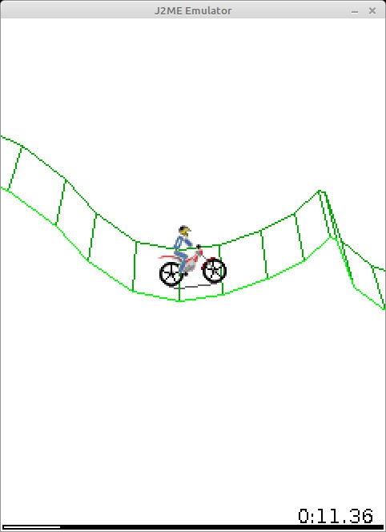
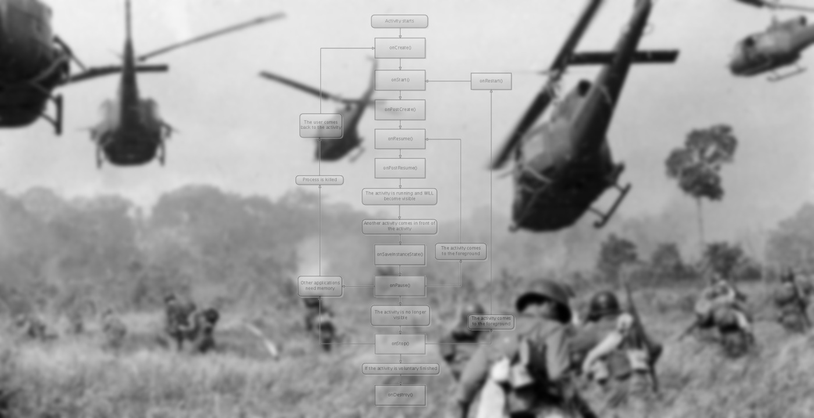
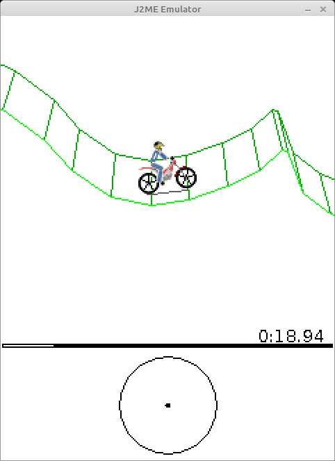

# Ностальгии пост: j2me, Gravity Defied, 64kb

Эта статья не преследует никаких практических целей - просто мне стало интересно, как лет 15 назад разработчикам удавалось делать вполне функциональные приложения и игры для слабых телефонов того времени.



* Если что, я не имею к этой игре никакого отношения.

Например, игра с картинки выше не использовала floating-point числа, так как не все телефоны их поддерживали. "3д" и физика - полностью самописные на fixed-point вычислениях поверх целых чисел. Но мне кажется, перечисление особенностей одного приложения будет не сильно информативным. Для полноты картины я немного затрону возможности телефонов, j2me платформу и заодно сравню это с современной разработкой под Android.

Кроме того, j2me - это полноценная java старой версии (кажется, 1.3), я дописал некоторые недостающие классы и смог запустить .jar файлик с игрой на своём PC. Скриншот выше - оттуда. Не скажу, что от этого есть какая-то польза - просто API для j2me было очень простым и мне захотелось попробовать.

<cut/>

## Телефоны того времени.

В техническом плане современные телефоны ушли очень далеко, но в плане функциональности, на мой взгляд, даже старые телефоны позволяли делать всякие интересные вещи.

Моим первым телефоном была [Nokia 5200](https://allnokia.ru/catalog/nokia-5200/), и я вместо "абстрактного смартфона в вакууме" лучше опишу его особенности:

* появился в 2006 году
* дисплей 128x160 пискелей размером в целых 1.8 дюйма
* Дисплей поддерживал аж 262 тысяч цветов. (если я понимаю, это по 6 бит на R, G, B составляющие).
* Ик-порт и bluetooth для передачи файлов на другие телефоны.
* несколько мегабайт долговременной внутренней памяти (точно не помню, в интернете пишут про 7 Мб)
* слот для microSd карточки, у меня, кажется, была на 256 Мб.
* уже тогда были какие-то примитивные браузеры и opera mini (которая, кстати, тоже весила буквально сотню килобайт)
* камера 640x480 пикселей.
* поддержка MIDP 2.0 ([wiki](https://en.wikipedia.org/wiki/Mobile_Information_Device_Profile))
* телефон умел притворяться флешкой при подключении через usb
* но заряжался через какой-то свой разъём
* Я не нашёл, какая производительность была у процессоров, но она явно была очень скромной - не больше 100Мгц частоты и, возможно, очень медленная или отсутствующая реализация floating-point чисел. К сожалению, телефон давно умер и запустить какие-либо бенчмарки на нём я не смогу.

Не буду перечислять мобильные игры, в которые играл на нём - просто скажу, что они все весили 50-200кб и при этом обладали достаточно глубоким геймплеем.

## Write once, run everywhere

Изначально java позиционировалась именно для всяких маломощных бытовых устройств. И она очень удачно прописалась на телефонах того времени, позволяя запускать одну и ту же игру на телефонах различных производителей. Конечно, существовали platform-специфичные особенности, но чисто теоретически код должен был одинаково работать везде.

Язык был простым, байткод - тоже. В нём команды длиной в байт для виртуальной стековой машины - написать наивный интерпретатор не так уж и сложно. А ещё по этой причине байткод занимал мало места. Что интересно, внутри .jar у j2me приложения лежат самые настоящие .class файлы от полноценной java. Разница была лишь в том, что мобильное приложение для взаимодействия с внешним миром использовало классы Canvas, MIDlet и прочие из пакета javax.microedition.

На мой взгляд, это гениально просто. Android по сравнению с этим кажется набором костылей: код компилируется в .class файлы, потом конвертируется в .dex (или несколько, т.к. один dex файл не поддерживает больше 65к методов), пакуется в apk, а потом мобильное устройство перекомпилирует это под [ART](https://en.wikipedia.org/wiki/Android_Runtime).

Кроме того, мобильная джава поддерживала многопоточность. Как мы увидим дальше, при написании приложений без неё было не обойтись. Что интересно, взгляд на многопоточность тогда был немного иной. Например, у стандартного класса Vector все методы были synchronized. Сейчас Vector считается устаревшим, и предлагается использовать обычный ArrayList в однопоточном коде и тот же самый ArrayList в многопоточном, но явно захватывать блокировку на нём.

Ещё интересная особенность - в старой java не было дженериков. Система типов состояла из примитивов (int, boolean, ...) и объектов. Тот же класс Vector хранил внутри себя объекты и возвращал их как Object, а программист после этого кастовал полученное к нужному типу.

Кстати, когда я вижу go и ручные касты к нужным типам, я вспоминаю java 1.3. Только go почему-то застрял в развитии, а в случае в java уже в 2004 году вышла версия 1.5 с поддержкой дженериков. Но в мобильной разработке всё ещё использовалась 1.3.

Так как мобильное j2me приложение - это самый обычный .jar с нормальными .class файлами внутри (пусть и в формате 1.3, которому уже 20 лет), можно этим воспользоваться и запустить Gravity defied прямо на PC. В "большой" java классов из javax.microedition нет, но их можно написать самому. Задача даже проще, так как есть классы с почти таким же набором методов: например, ```java.awt.Image``` и ```javax.microedition.lcdui.Image```.

## Архитектура J2ME приложений



Для взаимодействия с внешним миром использовались классы из ```javax.microedition```. Возможно, из-за ограниченных возможностей телефонов, а может, просто из-за чувства прекрасного у разработчиков, набор классов очень маленький, а сами они - максимально простые. Для примера можно посмотреть классы в [javax.microedition.lcdui](https://docs.oracle.com/javame/config/cldc/ref-impl/midp2.0/jsr118/javax/microedition/lcdui/package-tree.html).

Для создания приложения надо было унаследоваться от класса [MIDlet](https://docs.oracle.com/javame/config/cldc/ref-impl/midp1.0/jsr037/javax/microedition/midlet/package-summary.html).

При старте приложения у него вызывался метод ```startApp()```.
Если приложение сворачивалось - вызывался ```pauseApp()``` и снова ```startApp()``` при повторном открытии. При полноценном закрытии вызывалось ```destroyApp()```.

Кроме того, приложение могло само вызвать методы ```notifyPaused()``` и ```notifyDestroyed()``` - чтобы сообщить о том, что оно поставилось на паузу или завершилось.
Кроме того, приложение могло попроситься "выйти из паузы" методом ```resumeRequest()```

Честно говоря, я не очень понимаю смысл ```notifyPaused()```, так как и без него приложения нормально работали, никто их не убивал.

Мне кажется, именно таким и должен быть lifecycle приложения здорового человека.

На практике обычно получалось, что класс приложения наследовался от Runnable и реализация выглядела как-то так:

```java
Thread thread;
boolean isRunning;
boolean needToDestroy = false;

public void startApp() {
    isRunning = true;
    if (thread != null) {
        thread = new Thread(this);
        thread.start();
    }
}

public void pauseApp() {
    isRunning = false;
}

public void destroyApp(boolean unconditional) {
    needToDestroy = true;
}
```
И всё, дальше приложение жило в своём потоке.

```java
void run(){
    while(!needToDestroy) {
        // игровой цикл здесь
        // и если на паузе - спим.
        while (!isRunning) {
            Thread.sleep(100);
        }
    }
    notifyDestroyed();
}
```
Мне кажется, будить поток каждые 100 миллисекунд - не страшно, и такой подход вполне мог бы существовать и на современных телефонах. Вдобавок, никто не запрещает остановить поток после вызова ```pauseApp()``` и снова запустить в ```startApp()```

### Canvas

Для рисования на экране использовался ещё один класс - [Canvas](https://docs.oracle.com/javame/config/cldc/ref-impl/midp2.0/jsr118/javax/microedition/lcdui/Canvas.html). Он похож на десктопный Canvas в java.

Можно в любом потоке вызывать метод ```repaint()```, который намекнёт системе, что надо бы обновить изображение. После этого в UI-потоке система вызовет ```paint(Graphics g)```. Возможно, у кого-то снова возникнут вьетнамские флешбеки, но при сворачивании приложения с Canvas ничего страшного не происходило - объект оставался валидным на всём протяжении жизни программы. Единственное отличие - у приложения в фоне вызовы ```repaint()``` игнорировались и метод ```paint(...)``` не вызывался.

Что примечательно, уже тогда поддерживалсь сенсорные дисплеи: были методы
```hasPointerEvents(), hasPointerMotionEvents(), hasRepeatEvents()```, которые на сенсорном телефоне возвращали true. При нажатиях вызывались методы типа ```pointerDragged(int x, int y)``` (перемещение указателя), а так же версии для ```pressed```(начало нажатия) и ```released```(нажатие завершилось).
Поддержки мультитача нет - ну и ладно, тогда и подходящих дисплеев не было.

### Шрифты и меню

Что забавно, тогда существовало аж три размера шрифта - малый, средний и большой. Конкретные размеры зависели от телефона. Но, если учесть размеры дисплеев, то это выглядит нормально. Я не думаю, что даже дисплею 240х360 нужно сильно много размеров шрифтов. Самое важное - жирные и курсивные шрифты - поддерживались.

Сейчас это как-то унифицировалось, но раньше кнопка "назад" на смартфонах могла располагаться как слева, так и справа. В j2me существовал какой-то механизм создания менюшек, чтобы система сама рисовала пункты меню, поддерживала скроллинг  и т.п., а приложение просто узнавало номер выбранного пункта. Например, на nokia 5800 такие менюшки можно было перематывать пальцем, даже если разработчики приложения об этом и не подозревали.

## MIDlet Pascal

Когда-то я учился в школе, там освоил паскаль и других языков не знал. С нуля въехать в java2me разработку у меня не получилось, но на моё счастье, я узнал про существование [MIDlet pascal](https://ru.wikipedia.org/wiki/MIDletPascal) и свои первые приложения на телефон я писал именно на нём. В дальнейшем на j2me я перешёл довольно забавным способом - делал приложение на мидлет паскале, декомпилировал и смотрел, что получалось в java.

## Что же внутри?

Ну ладно, хватит ностальгии, лучше посмотрим, как сделана Gravity Defied и как это уместилось в 64 килобайта.

Во-первых, .jar - это zip архив, содержимое которого весит 122.1 kB

* В папке META-INF лежит MANIFEST.MF на 3.8 kB, в котором перечислены файлики игры и SHA-1 и MD5 хеши для них. А так же название главного класса и файла с иконкой приложения.
* файл levels.mrg на 5.1 kB в довольно компактном виде содержит информацию о всех 30 игровых уровнях. В среднем 170 байт на игровой уровень. Подробнее про столь компактный формат хранения я расскажу позже.
* 11 картинок. В сумме около 10.8 kB. Некоторые из них являются атласами с кучкой спрайтов
* .class файлы, в сумме 98.3 kB, 15 штук. Самый маленький - 127 байт, самый большой 24.3 kB. Их по размеру можно разделить на группы:
   * два интерфейса, (4 метода в каждом), 127 и 174 байт.
   * простой класс с шестью полями и парой методов - 470 байт.
   * 9 классов разумного размера - от 1.6 до 6 kB.
   * god-like классы:
       * m (я его потом переименовал в [MenuManager](https://gitlab.com/Kright/pc-j2me-emulator/-/blob/master/app-from-sources/src/main/java/MenuManager.java)) - 24.3kB, в нём захардкожены все возможные меню и сообщения игры. Никаких layout.xml и strings.txt :). Игра не подразумевала поддержку нескольких языков.
        * i ([GameCanvas](https://gitlab.com/Kright/pc-j2me-emulator/-/blob/master/app-from-sources/src/main/java/GameCanvas.java)) 15.2 kB: много кода, связанного с рисованием, но, как ни странно, не весь.
        * b ([GamePhysics](https://gitlab.com/Kright/pc-j2me-emulator/-/blob/master/app-from-sources/src/main/java/GamePhysics.java)) 20.6 kB: расчёт игровой физики и почему-то много кода, связанного с рисованием.


## Декомпиляция

Нам понадобится декомпилятор. Я взял fernflower - это тот, который встроен в intelliJ IDEA. Он вроде нормально работает - на выходе получился код, который вполне реально скомпилировать обратно. Несколько лет назад я пробовал другими декомпиляторами и они не справлялись.

Репозиторий с IDEA весит больше гигабайта и клонировать его долго - вместо этого можно воспользоваться [зеркалом](https://github.com/fesh0r/fernflower), в котором лежит только декомпилятор.

Сборка декомпилятора тривиальна: ```/gradlew jar ```, в папке build появится нужный .jar
Декомпиляция чуть сложнее: ```mkdir decompiled && java -jar fernflower.jar -ren=1 GravityDefied_java decompiled```

По дефолту опция ```ren``` не включена и без неё получится код, в котором переменные и методы могут иметь забавные имена типа ``if`` или ``for``. Байткод такие имена не запрещает, но компилятору java такое не понравится. С ```ren=1``` декомпилятор приведёт поля к виду типа ```field_42``` или ```method_135``` - хуже уже не станет, зато код станет валидным.

Игра вышла ещё в 2004 году - и, что примечательно, уже тогда использовалась обфускация:

* Байткод в каком-то виде хранит имена классов, методов и полей. И имена в одну или две буквы позволяли уменьшить размер .class файлов.
* Есть сюрпизы в виде невалидных имён типа ```else```, ```int``` и т.п.
* Можно было вырезать неиспользуемые методы и опять же делать код компактнее. В игре "переименованиям" не подвёргся только класс Micro, и только в нём я нашёл неиспользуемые методы.
* возможно, для fixed-point вычислений использовались методы, которые были заинлайнены. Я сомневаюсь, что разработчики вручную писали код типа ```(int)((long)a * b >> 16)```
* я не знаю, вручную были склеены несколько классов в один или с помощью обфускатора, но в игре можно найти такой класс Шрёдингера.

## Собираем обратно

Смотреть на код - это хорошо, но неинформативно. Хочется его запускать и, возможно, добавлять отладочный вывод или ещё что-то. А ещё хочется восстановить нормальные имена переменных, методов и классов.

Много-много лет назад я писал код на Netbeans, и для сборки j2me приложений надо было скачивать специальное SDK. Для сборки, кажется, использовался ant. Подробнее можно [посмотреть здесь.](https://www.oracle.com/java/technologies/java-me-sdk-3-0-5-downloads.html)

Но старенькая нокия уже не работала, а я хотел собрать и запустить код прямо на своём компе и желательно в Linux. Так что я подготовил gradle проект и попробовал собрать код. Код не собирался - не хватало классов из ```javax.microedition.*```.  Логично - их же нет в PC-версии java. Я решил заняться велосипедостроением и просто механически добавил все несуществующие классы и методы. Игра использует маленькое подмножество из доступных методов и классов, так что это заняло не больше часа времени.

Для удобства я вывел в терминал ```watch ./gradlew run``` и в реальном времени смотрел на список ошибок. После добавления каждого нового метода по ```ctrl+S``` сохранял изменения.

Реализованные классы можно посмотреть [здесь](https://gitlab.com/Kright/pc-j2me-emulator/-/tree/master/emulator/src/main/java/javax/microedition).
Их всего лишь 19 штук:

* 8 для сохранений в javax.microedition.rms.
* 10 в .lcdui, которые отвечают за картинки, шрифты, Canvas и т.п.).
* MIDlet - главный класс, от которого приложение должно наследоваться.

После того как проект компилируется без ошибок, можно попробовать привести его к красивому виду.

В приложении есть класс Micro, в котором имена методов не обфусцированы. В общем-то логично, методы типа startApp унаследованы от MIDlet и переименовать их невозможно.

Пример кода:

```java
protected void pauseApp() {
    c = true;
    if (!b) {
        this.gameToMenu();
    }
    System.gc();
}
```

Вполне можно догадаться, что переменная ```c``` могла бы называться ```isPaused```.

Для "простых" методов тоже довольно часто можно понять происходящее:

```java
public void a() {
    if (this.recordStore != null) {
        try {
            this.e.closeRecordStore();
            return;
        } catch (RecordStoreException var1) {
        }
    }
}
```
и переименовать во что-то типа ```closeMethodStore```.

Кроме того, в intelliJ IDEA можно посмотреть все вызовы каких-то методов. Особенно - тех, заглушки для которых мы написали, типа ```Image.loadImage(name)```:

```java
this.p = Image.createImage("/splash.png");
```

Вполне очевидно, что p можно переименовать в splashImage.

С какой-то точки зрения это похоже на разгадывание судоку - находишь очевидные моменты, даёшь значащие названия переменным и методам. Это упрощает понимание остальных методов, даёшь названия им... Огромный респект разработчикам Jetbrains - я как минимум часов десять лазил по коду, переименовывая переменные с методами - и ни разу код не поломался. Впрочем, я всё равно время от времени компилировал код и убеждался, что он остался рабочим.

В какой-то момент мне это надоело. Я попробовал запустить код и он упал - потому что все мои заглушки типа loadImage()... возвращали null и ничего не делали. Настало время писать реализацию для заглушек.

Большая часть из них делалась тривиально: например, класс Image:

```java
public class Image {
    public final java.awt.Image image;

    private Image(java.at.Image image) {
        this.image = image;
    }

    public Graphics getGraphics() {
        throw new RuntimeException();
    }

    public int getWidth() {
        return image.getWidth(null);
    }

    public static Image createImage(int w, int h) {
        return new Image(new BufferedImage(w, h, BufferedImage.TYPE_INT_ARGB));
    }
    ...
}
```

Конечно, API местами не совпадает, но оно всё равно очень похоже.

Для рисования я сделал класс CanvasImpl, который наследуется от JPanel. Он обрабатывал нажатия кнопок и вызовы отрисовки и превращал их в вызовы нашего игрового Canvas.
Я даже вошёл во вкус и сделал апскейлинг картинки, чтобы не приходилось всматриватьcя в крохотное окошко:

```java
public void paintComponent(Graphics g) {
    if (upscale == 1) {
        canvas.paint(new javax.microedition.lcdui.Graphics(g));
    } else {
        canvas.paint(new javax.microedition.lcdui.Graphics(screen.getGraphics()));
        g.drawImage(screen, 0, 0, width * upscale, height * upscale, Color.WHITE, null);
    }
}
```

```javax.microedition.lcdui.Graphics(g)``` - это моя обёртка над awt.Graphics, транслирующая вызовы рисования.

Раз за разом я запускал код, смотрел как он падает в разных местах и дописывал реализации для своих заглушек. Некоторые исключения игра "безболезненно" проглатывала, но потом работала некорректно.

Например, если в игре не работает загрука картинок, то игра работает, рисует мотоциклиста простыми линияим, колёса - палочками. Но тормозит на PC. А почему? Зачем-то в игре фон замащивается картинками ```64 * 64```, и если картинка не грузится, подставляется пустая картина размером ```1 * 1``` пиксель, и при замащивании дисплея она нарисуется ```240 * 320``` раз или типа того. Видимо, игра изначально работала и без картинок с графикой из палочек и кружочков, потом разработчики добавили картинки, но не тестировали, как же работает без них.

Кроме того, есть забавные баги с сохранением. Возможно, я сам его некорректно реализовал, но суть в том, что игра в некоторых моментах пытается писать в невалидное место, потом ловит исключение, проглатывает и спокойно работает дальше.

Честно говоря, я не гуглил, какие есть готовые эмуляторы j2me для PC. Скорее всего есть - году эдак в 2010 я пользовался каким-то, когда только-только осваивал программирование и пробовал писать игры. Если в существующих эмуляторах не хватает каких-то возможностей и захочется доработать мой для поддержки ещё каких-то игр - пишите в личку.

## Заработало!

В итоге мне удалось собрать декомпилированный код вместе со своими заглушками, запустить и поиграть.

После этого я попробовал к заглушкам подключить оригинальный .jar с игрой. Появилось несолько ошибок. Оказывается, важно не только чтобы метод назывался как надо, а чтобы он ещё и был у правильного родительского класса. Из-за этого пришлось унаследовать Alert и Canvas от Displayable и разместить там абстрактные методы, которые я изначально объявил в Canvas. Ну и ладно, исправлений не так уж и много понадобилось.

Сейчас в [gradle проекте](https://gitlab.com/Kright/pc-j2me-emulator/-/tree/master/) такая структура:

* Модуль emulator с кодом, собственно, моего самописного эмулятора. Многих методов не хватает, я реализовал только тот минимум, который был необходим для работы  игры.
* Модуль app-original, который в зависимостях содержит оригинальный .jar и позволяет его запускать
* Модуль app-from-sources с декомпилированными и приведёнными к более-менее приличному виду исходниками. Тоже запускается.

## Приводим код к красивому виду

После того, как декомпилированный код стало можно компилировать и запускать, разбираться в нём стало проще. Можно добавлять отладочный вывод или "выключать" отдельные методы, чтобы понять, что же они делают.

Думаю, теперь можно более подробно обсудить особенности реализации.

## Fixed-point physics

Для рассчётов используются обычные целые числа. Хранятся в виде обычных интов и считается, что младшие 16 бит - это дробная часть. Таким образом, получаются числа, которые принимают значения от ```-32768.0``` до ```32767.999984``` c шагом в ```1.0 / 65536```.

Мне это решение показалось очень красивым - приличная фиксированная точность сочетается со вполне большим диапазоном используемых значений.

Сложение и вычитание таких чисел ничем не отличается от аналогичных операций с int.

Умножение: если перемножить просто int, то мы получим дробную часть, а целая "переполнится". Для умножения числа сначала преобразовывались в long. При перемножении получалось число на 64 бита с дробной частью из 32 бит. После побитовым сдвигом вправо на 16 можно вернуться обратно к дробным 16-ти битам и обрезать число обратно к int.

Деление: при простом делении дробная часть потеряется. Вместо этого опять нужно преобразование в long, сдвинуть делимое на 16 бит влево и поделить. В игре почему-то сделали иначе, сдвиг влево на 32 и после - вправо на 16.

В игре есть [реализация](https://gitlab.com/Kright/pc-j2me-emulator/-/blob/master/app-from-sources/src/main/java/MathF16.java) для ```sin```, ```cos``` и ```atan2```.

Сделано довольно просто - есть захардкоженный массив на 64 значения - угол от 0 до 90 градусов. При вычислении синуса или косинуса угол приводится к этому диапазону, потом вычисляется индекс - и по нему читается значение из массива. Получается значение с точностью до полутора градусов. Видимо, для игры этого достаточно.

## Сенсорный ввод



Что забавно, эта игра уже в две тысячи четвёртом году его поддерживала. Если метод ```Canvas.hasPointerEvents()``` возвращает ```true```, то в игре рисуется дополнительный кружочек для управления, в который можно тыкать. Режим сделан скорее для галочки - всё равно вводимые значения квантуются в "полный газ", "полный наклон", "полный тормоз" и сделать что-либо "наполовинку" не получится. Но, как бы то ни было, поддержка сенсорного ввода в игре есть.

## Level format

Выше я упоминал, что в среднем размер игрового уровня - 170 байт. Как так получилось? Очень просто - для хранения каждой точки используется всего пара байт.

Вернее, сделано чуть хитрее - сначала хранится всякая информация типа позиции старта/финиша т.п., а так же количество точек. Для хранения точек сделано два режима. Если первый байт 0xff, то дальше в качестве координат идёт пара int с абсолютными координатами, а вот если байт отличается, что этот байт - смещение dx относительно предыдущей точки, и за ним байт со смещением dy.

```java
for (int i = 1; i < pointsCount; ++i) {
    byte modeOrDx;
    if ((modeOrDx = var1.readByte()) == -1) {
        offsetY = 0;
        offsetX = 0;
        pointX = var1.readInt();
        pointY = var1.readInt();
    } else {
        pointX = modeOrDx;
        pointY = var1.readByte();
    }
    offsetX += pointX;
    offsetY += pointY;
    this.addPointSimple(offsetX, offsetY);
}
```

[Код целиком](https://gitlab.com/Kright/pc-j2me-emulator/-/blob/master/app-from-sources/src/main/java/GameLevel.java#L302)

Просто и эффективно.

## Текстурные атласы

В отличие от современных телефонов с GPU и full hd экранами, в старых телефончиках стояли весьма скромные дисплеи типа (```128*160``` или ```240*320```). Необходимости крутить изображения и рисовать 3д объекты как-то не возникало, и в api для картинок такой возможности даже и нет. Единственное, что было можно при рисовании картинки - повернуть её на 90-180-270 градусов и зеркально отразить.

Мне кажется, для того времени это не было проблемой - спрайт размером в десяток пикселей имеет не так уж и много видимых вариантов поворота.
Конкретно в этой игре для корпуса мотоцикла, частей тела и шлема мотоциклиста использовалось по 32 или по 16 спрайтов. Для спрайтов шлема потребовалась картинка размером аж 48*48 пикселей и весом в 1091 байт.

Впрочем, надо отметить, что в то время уже существовало какое-то очень примитивное API для 3д графики с фиксированным 3д пайплайном и я даже играл во что-то 3д-шное. Текстуры были с огромными различимыми пикселями, а восьмиугольные колёса машинок воспринимались как что-то нормальное и высокодетализованное.

Как мне кажется - размеры дисплеев и возможности телефонов очень хорошо подходили для спрайтовой 2д графики и не тянули 3д.

## Кеширование строк

Во время игры в нижем правом углу экрана рисуется время. Что забавно - разработчики решили не создавать по новой строчке каждый кадр и [сделали лениво заполняемый кеш](https://gitlab.com/Kright/pc-j2me-emulator/-/blob/master/app-from-sources/src/main/java/GameCanvas.java#L134) на 100 строчек вида "23" и "64".

```java
if (time10MsToStringCache[time10MsPart] == null) {
    String zeroPadding;
    if (time10MsPart >= 10) {
        zeroPadding = "";
    } else {
        zeroPadding = "0";
    }
    time10MsToStringCache[time10MsPart] = zeroPadding + time10Ms % 100L;
}
```

Честно говоря, я не знаю, был ли смысл так заморачиваться ради двух цифр. Возможно, было бы проще рисовать цифры по-отдельности.

## No-MVP архитектура

Класс [MenuManager](https://gitlab.com/Kright/pc-j2me-emulator/-/blob/master/app-from-sources/src/main/java/MenuManager.java) в виде хардкода содержит в себе все менюшки (они все создаются один раз при инициализации класса) и при необходимости рисует их. Если какому-то компоненту игры надо узнать, какой сейчас текущий уровень - он просто идёт к объекту-менюшке с выбором уровня и спрашивает, какая позиция активна.

Возможно, кто-нибудь скажет, что надо отделять модель от её представления и применять всякие паттерны для абстракции. Но с другой стороны: посмотрите как подобная задача может быть сделана в Android:

* Есть layout файл с расположением кнопок. Отдельный для каждой менюшки.
* Строчки типа названий кнопок выносятся в отдельный файл stings.txt.
* Есть Activity, которая пересоздаётся по каждому чиху.
* Есть LifecycleObserver, который даёт возможность биндить текстовое поле к Adapter так, чтобы при смерти Activity та могла уже умереть и не занимать память.
* Adapter преобразует данные из DataSource.
* Просто так передавать классы между потоками "не ок", поэтому ещё будем паковать их в Bundle и после получения из DataSource распаковывать обратно.
* В DataSouce данные закидываются из разных потоков или вообще синхронизуются с SQLite базой данных.

Вопрос: а это всё точно нужно, чтобы обработать перемещение пользователя по внутриигровому меню? Я могу ошибаться в деталях, но суть проблемы должна быть очевидна.

## Несколько классов склеены в один

Я долго гадал, для чего нужен класс [TimerOrMotoPartOrMenuElem](https://gitlab.com/Kright/pc-j2me-emulator/-/blob/master/app-from-sources/src/main/java/TimerOrMotoPartOrMenuElem.java) и назвал его так неспроста.
Не знаю, постарался ли так обфускатор или это сделали вручную, но этот класс одновременно используется для представления как минимум трёх различных сущностей:

* кусочка мотоцикла с координатами и прочим
* элемента меню с каким-то текстом
* таймера, который можно завести на "через секунду" или типа того

Соответсвенно, если класс используется как элемент меню, испрользуются одни поля в классе, если как элемент мотоцикла - другие.

Скорее всего, это сделано для того, чтобы уменьшить размер приложения и уместить его в 64 килобайта. Видимо, классы по-отдельности весили заметно больше, чем вот так "собранные" в один.

## Долгая загрузка

Я обнаружил, что игра, которая собирается с нуля быстрее, чем за секунду, при этом долго грузится. "Хм, подозрительно" - подумал я и полез искать источник тормозов.

[Что же я нашёл](https://gitlab.com/Kright/pc-j2me-emulator/-/blob/master/app-from-sources/src/main/java/Micro.java#L110):

```java
public void init() {
    long timeToLoading = 3000L;
    Thread.yield();
    this.gameCanvas = new GameCanvas(this);
    Display.getDisplay(this).setCurrent(this.gameCanvas);
    this.gameCanvas.requestRepaint(1);

    while (!this.gameCanvas.isShown()) {
        this.goLoadingStep();
    }

    long deltaTimeMs;
    while (timeToLoading > 0L) {
        deltaTimeMs = this.goLoadingStep();
        timeToLoading -= deltaTimeMs;
    }

    this.gameCanvas.requestRepaint(2);

    for (timeToLoading = 3000L; timeToLoading > 0L; timeToLoading -= deltaTimeMs) {
        deltaTimeMs = this.goLoadingStep();
    }

    while (gameLoadingStateStage < 10) {
        this.goLoadingStep();
    }

    this.gameCanvas.requestRepaint(0);
    this.isInited = true;
}
```

Игра вызывает обновление экрана и потом вызывает ```goLoadingStep()``` раз за разом на протяжении трёх секунд. Потом вызывает снова обновление экрана с переключением картинки на другую и снова три секунды вызывает ```goLoadingStep()```. И после этого вызывает ```goLoadingStep``` до тех пор, пока они не завершатся.


Сам ```goLoadingStep()``` [сделан тоже довольно забавно](https://gitlab.com/Kright/pc-j2me-emulator/-/blob/master/app-from-sources/src/main/java/Micro.java#L59):

```java
private long goLoadingStep() {
    ++gameLoadingStateStage;
    this.gameCanvas.repaint();
    long startTimeMillis = System.currentTimeMillis();
    switch (gameLoadingStateStage) {
        case 1:
            this.levelLoader = new LevelLoader();
            break;
        case 2:
            this.gamePhysics = new GamePhysics(this.levelLoader);
            this.gameCanvas.init(this.gamePhysics);
            break;
        case 3:
            this.menuManager = new MenuManager(this);
            this.menuManager.initPart(1);
            break;
            .... ///аналогичный код для 5-8
        case 9:
            this.menuManager.initPart(7);
            break;
        case 10:
            this.gameCanvas.setMenuManager(this.menuManager);
            this.gameCanvas.setViewPosition(-50, 150);
            this.setMode(1);
            break;
        default:
            --gameLoadingStateStage;

            try {
                Thread.sleep(100L);
            } catch (InterruptedException var3) {
            }
    }

    return System.currentTimeMillis() - startTimeMillis;
}
```

А в [MenuManager.initPart()](https://gitlab.com/Kright/pc-j2me-emulator/-/blob/master/app-from-sources/src/main/java/MenuManager.java#L228) тоже содержится огромный ```switch case``` блок с шагами загрузки.

Честно говоря, я не знаю, почему сделано именно так. Можно было бы просто в отдельном потоке показывать лого и потом через три секунды переключить картинку на другую, а в основном потоке спокойно загружать всё необходимое.

## История создания

[Оригинальная игра](https://ru.wikipedia.org/wiki/Gravity_Defied:_Trial_Racing) изначально появилась в 2004 году. Она была написана для конкурса Excitera Mobile Awards 2004 (EMA04) и выиграла в номинации best-in-show. В компании Codebrew Software было три шведских разработчика:

* Tors Björn Henrik Johansson - system/game logic/interface, testing, levels design
* Set Elis Norman - graphics/physics/mathematics/system/tools programming, levels design
* Per David Jacobsson - physics programming, game graphics, levels design

Кроме того, есть [порт этой игры под андроид](https://github.com/evgenyzinoviev/gravitydefied), сделаный нашими соотечественниками, но в нём просто используется декомпилированный код.

Поскольку к тому коду уже пять лет нет никаких претензий, я думаю, и моя попытка декомпилировать оригинальное приложение и разобраться в нём не принесёт никакого вреда. Сейчас игра представляет разве что исторический интерес и позволяет поближе взглянуть на эпоху маленьких смартфонов, которые смогли.

[Статья на хабре](https://habr.com/ru/post/504682/)