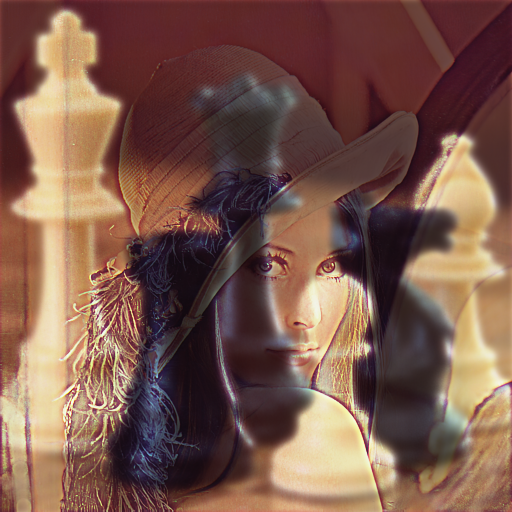

# Как можно взять  tensorflow и смешать две картинки в одну

Возможно, вы встречали изображения, в которых смешаны два образа. Вблизи виден один, а издалека - другой. Например, Эйнштейн и Мадонна.

Не знаю, как делались оригинальные, но я попробовал сделать нечто похожее с помощью tensorflow.


Общая идея: взять машинное обучение и с его помощью подогнать изображение. Обратите внимание: я не учу модель, которая будет из двух картинок делать одну. Модель - это просто массив цветов пикселей, и больше ничего. В процессе "обучения" возьмём две картинки-образца и будет улучшать "похожесть" на них.
Для первого образца функцией ошибки будет попиксельная разница цветов с обучаемой картинкой. Для второго - отличие между размытым образцом и размытой картинкой.

Преобразование Фурье - прошлый век, новые проблемы требуют инновационных решений. 

Код и исходные картинки [лежат на гитхабе](https://github.com/Kright/mix-two-images-in-one/blob/master/twoImages.ipynb).

Для запуска понадобитя tensorflow, numpy и Pillow. Для последней версии tensorflow понадобится python 3.7 или новее. 
	
Чтобы результат получался за пару минут при вычислении на процессоре, я уменьшил картинки до размера 512х512 пикселей. Взял их из википедии: шахматы и девушка Лена.
	

	

	
Загрузим их и переведём во float в интервале от 0 до 1:
	
```Python
lena = Image.open("imgs/Lenna512.png")
chess = Image.open("imgs/ChessSet512.png")
imgs = [np.array(i) / 255.0 for i in [lena, chess]]
```

### Гамма-коррекция

Воспринимаемая глазом яркость света может отличаться на много-много порядков. В изображениях с одним байтом яркости на канал есть 256 значений яркости и в физическое количество фотонов они отображаются нелинейно. Например, от двух пикселей с яркостью 127 света будет меньше, чем от одного с яркостью 254. 

Для перевода в физическое значение яркости существует гамма-коррекция: возведение яркости в степень 2.2. Получится величина, пропорциональная количеству фотонов с экрана. Обратное преобразование тоже делается просто - возведением в степень 1/2.2.

Зачем всё это нужно? Если я хочу узнать видимую разницу цветов, можно просто взять разницу значений в обычном RGB пространстве.

При рассчёте того, как будет выглядеть изображение издалека (размытое), будет необходимо перевести значения яркости в линейное пространство (пропорциональное количеству фотонов) и уже в нём сделать размытие по Гауссу.

### Размытие по Гауссу

При размытии картинки каждый пиксель превращается в пятнышко. На математическом языке пятнышко называется ядром, а сам процесс - свёрткой.
Ядро выглядит как-то так $$Ce^{- \frac{dx^2+dy^2}{2 \sigma^2}} = C e^{-\frac{dx^2}{2 \sigma^2}} e^{-\frac{dy^2}{2 \sigma^2}}$$
C - некая константа, чтобы сумма всех элементов (или интеграл по площади) равнялась единице и яркость изображения не изменялась. По этой же причине надо сделать гамма-коррекцию, чтобы работать с физическим количеством света.

Особенностью свёртки с этим ядром является то, что его её можно сделать сначала по одной оси, а затем по другой, так что достаточно посчитать ядро для одномерного случая:

```Python
def make_gauss_blur_kernel(size: int, sigma: float) -> np.ndarray:  
    result = np.zeros(shape=[size], dtype=float)  
    center = (size - 1) // 2  
    div = 2 * (sigma ** 2)  
    for i in range(size):  
        x2 = (center - i)**2 
		result[i] = math.exp( -x2 / div)  
    return result / np.sum(result)  
  
make_gauss_blur_kernel(size=11, sigma=2)
```

Математически ядро бесконечное, но мы ограничим его размеры. Например, для sigma =2 и размера ядра в 11 получится так:

```Python
array([0.00881223, 0.02714358, 0.06511406, 0.12164907, 0.17699836, 0.20056541, 0.17699836, 0.12164907, 0.06511406, 0.02714358, 0.00881223])
```

### tensorflow 2.0

В старой tensorflow граф модели был неизменяемым, и это накладывало ограничения. В версии 2.0 утащили фишку из питона - граф модели строится динамически прямо в процессе вычисления ошибки, а потом можно взять и вычислить градиенты.


Магия выглядит вот так:

```Python
with tf.GradientTape() as tape:
	# computations
	loss = ...
	
gradient = tape.gradient(loss, trainable_variables)	
```

Это как раз то, что нам нужно.

### создаём модель

```Python
class MyModel:
    def __init__(self, img_h: int, img_w: int, gauss_kernel_size: int, gauss_sigma: float, image_source: Optional[np.ndarray] = None):
        if image_source is None:
            image_source = np.zeros(shape=(1, img_h, img_w, 3), dtype=float)
        self.trainable_image = tf.Variable(initial_value=image_source, trainable=True)
        gauss_blur_kernel = make_gauss_blur_kernel(gauss_kernel_size, gauss_sigma)
        self.gauss_kernel_x = tf.constant(gauss_blur_kernel[np.newaxis, :, np.newaxis, np.newaxis] * np.ones(shape=(1, 1, 3, 1)))
        self.gauss_kernel_y = tf.constant(gauss_blur_kernel[:, np.newaxis, np.newaxis, np.newaxis] * np.ones(shape=(1, 1, 3, 1)))
		
	...
```

trainable_image - переменные. Из них состоит наша "обучаемая" картинка. Их мы будем подгонять, чтобы было похоже на нужные две картинки.
Так же сделаем константы для ядер свёрток по осям х и у. Их учить не будем, они и так получены умным путём.

Для свёрток используется аж четырёхмерное ядро:
1. ось У изображения
2. ось Х изображения
3. количество входных каналов (3)
4. количество выходных каналов на каждый входной канал (1, каждый цвет переходит сам в себя)

Кроме того, и в numpy и в tensorflow есть идея броадкастинга. Например, массив с размерностями (1, 256, 512, 1) можно интерпретировать как (N, 256, 512, C) - как будто по первой и последней оси размер произвольный, а числа одни и те же. Броадкастинг в этих библиотеках иногда работает по-разному, функция свёртки хочет увидеть ядро размероностью именно (size_x, size_y, 3, 1) и почему-то недовольно массивом (size_x, size_y, 1, 1), так что пришлось в numpy умножить на массив единичек размерностью (1, 1, 3, 1). Если бы мы сделали разные ядра свёрток для разных цветов, то нам бы пригодилась эта размерность, но у нас всё одинаково.

Я использую поканальные свёртки (чтобы канал R при размытии влиял только на себя и превращался в новый канал R). Они считаются быстрее обычных. А ещё внутри нет никакого преобразования Фурье, и сложность вычисления свёртки зависит линейно от размера ядра. По этой же причине свёртка с квадратным ядром размера 15x15 будет считаться в несколько раз дольше, чем две свёртки с ядрами 1х15 и 15х1. 

```Python
class MyModel:
	...


    def run(self, img_precise: np.ndarray, img_blurred: np.ndarray, m_precise = 1, m_blurred = 1) -> Report:
        with tf.GradientTape() as tape:
			# next code will be here

```

Для шага обучения возьмём две картинки и коэффициенты для важности ошибок у каждой.

Обучаемые переменные могут быть любыми, хоть -1, хоть 9000. Но в качестве цветов картинки хочется получить значения в интвервале от 0 до 1. Для этого применим [сигмоиду](https://ru.wikipedia.org/wiki/%D0%A1%D0%B8%D0%B3%D0%BC%D0%BE%D0%B8%D0%B4%D0%B0).: около нуля она более-менее линейно растёт, но на больших входных значениях рост замедляется и результат никогда не превысит единицу.

```Python
trainable_image01 = tf.math.sigmoid(self.trainable_image)
```

Для первой картинки (которая должна быть резкой) разница - просто сумма квадратов разностей яркости для каждого канала каждого пикселя. По-идее, каждый пиксель учится независимо, и шаг обучения в 0.1 будет вполне нормальным.

Вместо суммы можно было бы использовать reduce_mean(), но тогда градиенты были бы меньше на площадь картинки (512x512) и пришлось бы градиенты умножать на что-то типа 10^5. 

```Python
loss_precise = tf.reduce_sum(tf.square(trainable_image01 - img_precise[np.newaxis, :, :, :]))
```

Для второй картинки сделаем размытие (свёртку), а потом точно так же попиксельно сравним. И не забудем про гамма-коррекцию до свёртки и обратную после:

```Python 
blurred = self.gauss_blur(trainable_image01 ** 2.2) ** (1.0 / 2.2)
blurred_label = self.gauss_blur(img_blurred[np.newaxis, :, :, :] ** 2.2) ** (1.0 / 2.2)
loss_gauss = tf.reduce_sum(tf.square(blurred - blurred_label))
```

Домножим ошибки на коэффициенты и сложим. В зависимости от соотношения коэффициентов результат будет больше стремиться к одной картинке или другой.

```Python
loss = loss_precise * m_precise + loss_gauss * m_blurred
```

Вжух и получим градиенты:

```Python
gradient = tape.gradient(loss, self.trainable_image)
```

Для обучения есть разные оптимизаторы, но я прямо руками сделал простой градиентный спуск:

```Python
def apply_gradient(self, grad: np.ndarray, lr: float):
    self.trainable_image.assign(self.trainable_image.numpy() - lr * grad)
```

Вызовем функцию много-много раз. Код в статье для иллюстрации, запускабельный вариант можно найти на гитхабе.

```Python
class MyModel:
	...
	def train(self, steps_count: int, print_loss_steps: int, lr: float, **run_kwargs) -> Report:
		for i in range(steps_count):
			r = self.run(**run_kwargs)
			model.apply_gradient(r.gradient, lr)
			if i % print_loss_steps == print_loss_steps - 1:
				print(f"{i}: loss = {r.loss}, precise = {r.loss_precise}, gauss = {r.loss_gauss}")
		return r
```

Теперь всё готово для обучения модели:
```Python
model = MyModel(512, 512, gauss_kernel_size=15, gauss_sigma=3)
r = model.train(steps_count=200, print_loss_steps=50, lr=0.3, img_precise=imgs[0], img_blurred=imgs[1], m_precise=0.1, m_blurred=1.0)  
Image.fromarray(np.uint8(r.image * 255.0))
```

Я попробовал разные коэффициенты (0.1, 0.3, 1.0), ниже можно посмотреть картинки.





### А зачем всё это?

Просто потому что могу. Мне нравится возможность задать произвольную функцию ошибки и обучить модель, не задумываясь над тем, как получить результат аналитически. Эксперименты с картинками делают происходящее очевидным.

Если Вам кажется, что я забиваю гвозди микроскопом и tensorflow совсем не для этого, то это не так. Библиотека даёт возможность легко считать градиенты, я этим пользуюсь как хочу. Машинное обучение не обязано происходить на кластерах с топовыми GPU и датасетами размером в терабайты.

При помощи преобразования Фурье и вырезания высоких частот с одной картинки и низких с другой можно получить похожий эффект. Но с некоторым оговорками: тоже могут получаться значения яркости меньше 0 и больше 1. И я не знаю, как сочетать логарифмическое восприятие яркости человеческим глазом и необходимость делать размытие по Гауссу в линейном цветовом пространстве. Я попробовал, результат мне не понравился. Пруфов не будет.

Вариант с обучением на порядки медленнее Фурье и на моём ноутбуке занимает несколько минут. На мой взгляд это не страшно, так как намного больше времени я потратил на написание кода. У меня нет задачи генерировать тысячи картинок, одной вполне достаточно для понимания процесса.

Изначальное состояние обучаемой модели - серая картинка. Если важна производительность, можно в качестве первого приближения взять одну из картинок или даже результаты экспериментов с Фурье. Но в случае с одной картинкой написание и отладка этого кода займёт больше времени, чем обучение с нуля, а результат будет примерно тот же.

[Пост на хабре](https://habr.com/ru/post/591409/)

