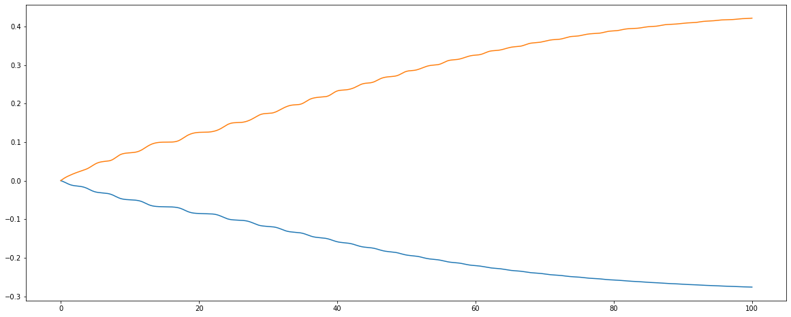
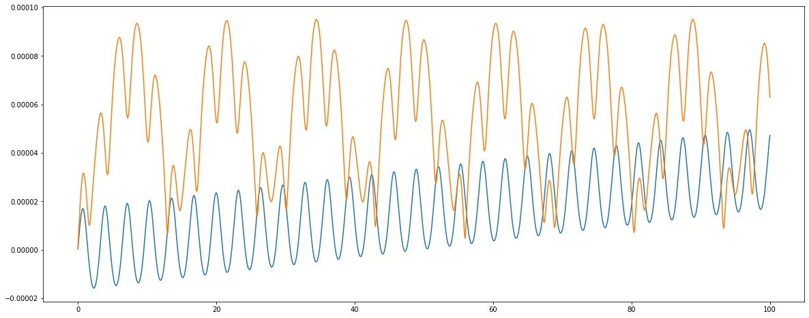
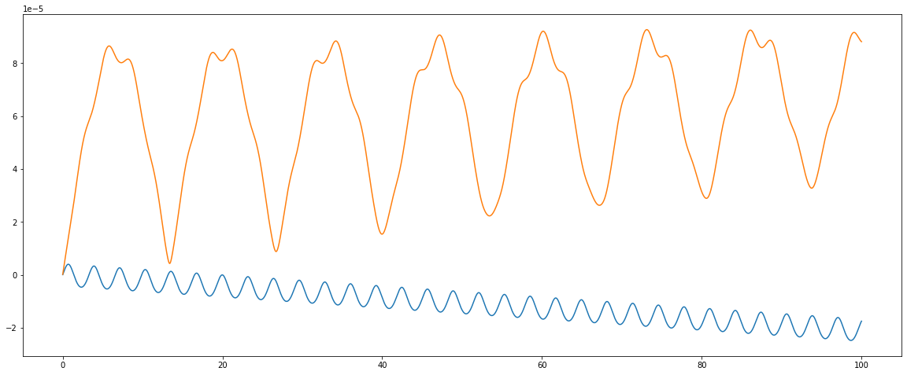
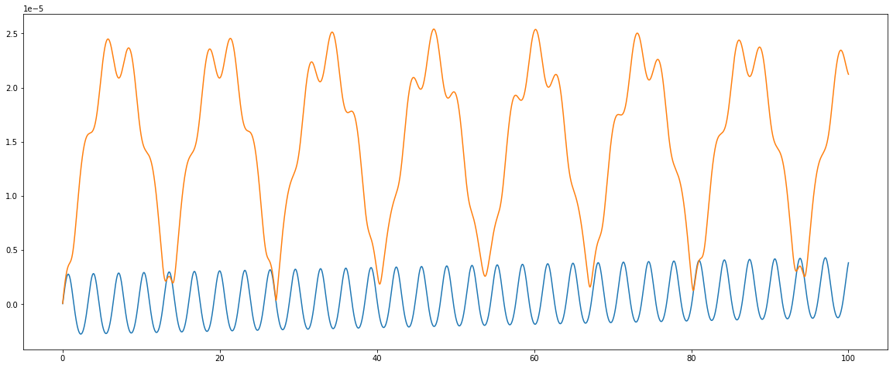
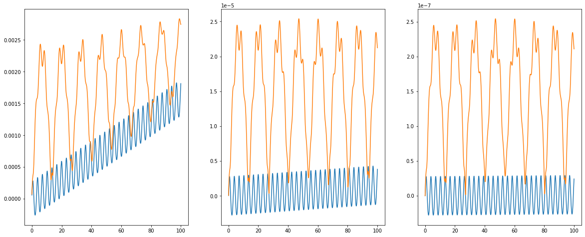
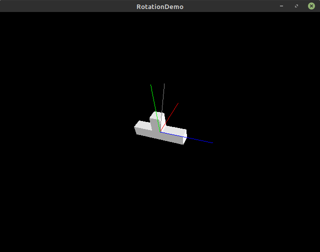

Когда я раньше задумывался о вращении в 3д, мне было неуютно. Оно казалось сложным. Вспомнить, например, [эффект Джанибекова](https://ru.wikipedia.org/wiki/%D0%AD%D1%84%D1%84%D0%B5%D0%BA%D1%82_%D0%94%D0%B6%D0%B0%D0%BD%D0%B8%D0%B1%D0%B5%D0%BA%D0%BE%D0%B2%D0%B0) с прецессией свободно вращающейся гайки. Настало время разобраться!

В статье Вас ждут математика, физика, а заодно численное моделирование и визуализация в libgdx.

Можно провести аналогии между массой тела в поступательном движении и моментом инерции. Разница только в том, что масса выражается одним-единственным числом, а момент инерции - матрицей 3х3. В большинстве примеров ограничиваются вращением в 2д, где существует только одна возможная ось вращения, либо симметричными телами типа мяча, когда момен инерции по всем осям одинаковый. Вместо этого я рассмотрю наиболее общий случай.

## Математический аппарат

Скалярное произведение векторов:
$a \cdot b = |a||b| \cos(angle)$

Для векторов единичной длины позволяет узнать косинус угла между ними.

Векторное произведение $a \times b$ - вектор, перпендикулярный векторам a и b, с длиной $|a||b||\sin(angle)|$

Для векторного произведения порядок a и b важен, $a \times b = - b \times a$ При выборе системы отсчёта есть произвол, в какую из двух сторон откладывать векторное произведение. Системы координат можно разделить на "правые" и "левые". Дальнейшие рассуждения будуть работать и там и там.

Вектора и матрицы:
Я считаю, что вектор - столбик. Поэтому при умножении вектор ставится справа от матрицы, например $A v$

При умножении нескольких матриц $A B v$ можно смотреть как на преобразование вектора матрицей $B$, а потом матрицей $A$. В игровых движках часто делают наоборот - вектор считается строчкой, домножается на матрицу слева, и преобразования "идут слева направо": $v^T B^T A^T$

Я буду использовать вектора-столбики, при желании можно транспонировать матрицы и применять то же самое к строчкам.

### Представление вращения

Можно использовать [углы Эйлера](https://ru.wikipedia.org/wiki/%D0%A3%D0%B3%D0%BB%D1%8B_%D0%AD%D0%B9%D0%BB%D0%B5%D1%80%D0%B0). Это три числа, но углы Эйлера неудобно комбинировать друг с другом. Кроме того, есть вырожденные состояния, при переходе через которые углы резко поменяются (например, направление "вверх").

Матрицы 3х3. Их можно инвертировать, комбинировать (перемножать), но использование девяти чисел для представления трёх степеней свободы выглядит избыточным. Со временем в матрице могут копиться ошибки, и тогда кроме вращения в матрице появятся масштабирование и прочие эффекты. Существует [ортогонализация Грамма-Шмидта](https://ru.wikipedia.org/wiki/%D0%9F%D1%80%D0%BE%D1%86%D0%B5%D1%81%D1%81_%D0%93%D1%80%D0%B0%D0%BC%D0%B0_%E2%80%95_%D0%A8%D0%BC%D0%B8%D0%B4%D1%82%D0%B0) для исправления накопившихся ошибок.

Кватернионы: на мой взгляд, очень красивая конструкция из четырёх чисел. В отличие от углов Эйлера, вырожденных состояний нет. Обычно для представления вращения используют кватернионы единичной длины, что оставляет три степени свободы. Накопившиеся при перемножении кватернионов ошибки легко убираюстя нормализацией. В математике их используют разными способами, нас будет интересовать возможность выразить вращение.

Компоненты кватерниона: (w, x, y, z)

Допустим, если есть ось вращения $(v_x, v_y, v_z)$ и угол поворота $a$. В виде кватерниона это можно записать так: $(\cos(\frac{a}{2}), \sin(\frac{a}{2}) v_x, \sin(\frac{a}{2}) v_y, \sin(\frac{a}{2}) v_z)$

В квантовой физике кватернионом можно описать спин частицы, и тогда между кватирнионами (1, 0, 0, 0) и (-1, 0, 0, 0) будет разница, но для нас они представляют одно и то же вращение. Это нетрудно заметить, если в предыдущей формуле увеличить угол $a$ на 360 градусов. Вместо кватерниона $(w, x, y, z)$ получится $(-w, -x, -y, -z)$

Кватернион очень легко инвертировать - поменять угол вращения на отрицательный $(w, -x, -y, -z)$, ну или перевернуть w: $(-w, x, y, z)$ Замена угла вращения на отрицательный выглядит как "переворот" оси вращения.

Нулевому вращению соответствуют кватернионы (1, 0, 0, 0) и (-1, 0, 0, 0)

Из кватерниона довольно легко "извлечь" ось вращения и угол поворота. Благодаря этому кватернион можно возводить в произвольную (нецелую) степень и использовать для интерполяции вращения.

Не обязательно ограничиваться чем-то одним, можно свободно преобразовывать одно представление вращения в другое и использовать то, что удобнее всего в данный момент.
Например, в игре можно:

1. Хранить и комбинировать вращения в виде кватернионов.
2. Для рисования графики преобразовывать кватернион в матрицу.
3. В логи писать углы Эйлера, как более понятные для человека.

В дальнейшем я храню ориентацию тела в виде кватерниона, а производные типа угловой скорости и ускорения - в виде векторов.

## Физические обозначения

Сила $F$.

Аналог силы для вращения - крутящий момент: $M = r \times F$. Разница в домножении на "длину рычага".

У тела есть [момент инерции](https://ru.wikipedia.org/wiki/%D0%9C%D0%BE%D0%BC%D0%B5%D0%BD%D1%82_%D0%B8%D0%BD%D0%B5%D1%80%D1%86%D0%B8%D0%B8) $I$. Если тело не является шаром или кубом, то вдоль разных осей момент может быть разным. В общем случае $I$ - тензор с 9 чиселками. Из курса физики я помню, что с помощью поворота $I$ всегда можно привести к диагональной форме с тремя числами вокруг трёх главных осей и остальными нулями.

Cкорость $v$, угловая скорость $w$.

Импульс $P = Ft = mv$

Момент импульса: $L = r \times P = M t = I w$

Энергия поступательного движения  $E = \frac{1} {2} m v \cdot v = \frac{1}{2} v \cdot P$

Кинетическая энергия вращения: $E = \frac{1}{2} w \cdot (I w) = \frac{1}{2} w  \cdot L$

Линейное ускорение $a$, угловое ускорение $\varepsilon$.

[Уравнения Эйлера](https://ru.wikipedia.org/wiki/%D0%A3%D1%80%D0%B0%D0%B2%D0%BD%D0%B5%D0%BD%D0%B8%D1%8F_%D0%AD%D0%B9%D0%BB%D0%B5%D1%80%D0%B0):

$$I \varepsilon + w \times (I w) = M$$

$$I \varepsilon = M - w \times (I w) $$

$$\varepsilon = I^{-1} (M - w \times (I w)) $$

Если моменты вращения тела вокруг главных осей равны, то $w \times (Iw) = 0$ и уравнение упрощается до $\varepsilon = I^{-1} M$, а его аналог для поступательного движения - $a = \frac{F}{m}$

В общем случае $w \times (Iw) \neq 0$, и для свободно вращающегося тела ось вращения может меняться. Наглядной демонстрацией является [эффект Джанибекова](https://ru.wikipedia.org/wiki/%D0%AD%D1%84%D1%84%D0%B5%D0%BA%D1%82_%D0%94%D0%B6%D0%B0%D0%BD%D0%B8%D0%B1%D0%B5%D0%BA%D0%BE%D0%B2%D0%B0)

Кроме того, нужно чётко понимать, в какой системе проводятся эти вычисления. Если тело как-то повёрнуто (допустим, матрицей $R$), то в глобальной системе отсчёта $I$ преобразуется:
$I_{global} = R I_{local} R^{-1}$


В виде кода у меня получилось [так](https://github.com/Kright/ScalaGameMath/blob/master/src/main/scala/com/kright/physics3d/Inertia3d.scala#L49):

```Scala
def globalI: Matrix3d =
  rot * objectI * rot.inverted()
```

```Scala
def getE(torque: IVector3d): Vector3d =
  val I = globalI
  I.inverted() * (torque - omega.cross(I * omega))
```

и симуляция вращения:

```scala
def update(dt: Double, moment: IVector3d): Unit =
  val acc = body.getE(moment)
  val dw = Quaternion().setFromExp(body.omega * 0.5 * dt)
  body.rot := dw * body.rot
  body.omega.madd(acc, dt)
  t += dt
```

P.S. В примере была ошибка, исправил - ориентация должна обновляться на основе предыдущего значения скорости, а не нового.

P.P.S. Код выше применим только для методов решения первого-второго порядков точности, для четвёртого надо хранить производные от кватерниона и усреднять именно их. Иначе точность остаётся на уровне методов решения второго порядка.
Можно посмотреть [пример](https://gist.github.com/uranix/b101ca6ce8dcc2b616502dd8e9a2f9e9) из этого [комментария](https://habr.com/ru/post/697534/#comment_24885798) - он работает хорошо. Я повторил его и в репозиторий с примерами добавил SolverEuler2Alt, SolverRK2Alt, SolverRK4Alt. Для второго порядка разницы нет или точность даже хуже, для четвёртого порядка - радикально лучше.

## Хочешь сделать хорошо - сделай сам

Так уж получилось, что в различных библиотеках для линейной алгребы были те или иные недостатки - например, не было кватернионов, или не хватало каких-то методов. Кроме того, есть произвол в определении направления вектороного произведения, в направлениях вращения и в том, считать вектора столбиками или строчками, что влияет на все дальнейшие формулы.

Спустя много лет использования разных библиотек и копирования кода туда-сюда я наконец-то собрался и написал свою библиотеку: [https://github.com/Kright/ScalaGameMath](https://github.com/Kright/ScalaGameMath)

Возможно, было бы лучше написать библиотеку на java, чтобы её можно было использовать из любого jvm языка. Но тогда для scala придётся писать обёртку, чтобы вместо методов типа ```plus, minus``` и т.п. были доступны более удобные + и -.

Вектора, матрицы, кватернионы и т.п. используют double, а не float. Я не хочу бороться с ошибками округления и перспектива удвоенного количества занятых байтов меня не пугает.

По старой памяти и по аналогии с libgdx я cделал кучу изменяющих методов типа 
```+=```, ```*=``` и т.п., а так же варианты типа ```Matrix *> vector```, когда результат операции записывается в правый аргумент. Но потом я взял [JMH](https://github.com/openjdk/jmh), написал какие-то бенчмарки и выяснил, что JVM умеет в escape analysis. Создание временных объектов почти не влияет на производительность.

Можно писать код типа
```Scala
a := b + c + d * m
```

Вместо менее читаемого опимизированного
```Scala
a := b
a += c
a.madd(d, m)
```

Или ещё менее читаемого
```Scala
((a := b) += c).madd(d. m)
```

Я не буду делать никаких общих утверждений, просто призываю не заниматься преждевременной оптимизацией без нужды. Простота и читаемость кода - это тоже очень важные свойства.

Кроме того, в моей библиотеке операции с кватернионами, матрицами, углами Эйлера и преобразования между ними согласованы друг с другом.

Например, можно превратить углы Эйлера в матрицы, перемножить их, превратить обратно в углы Эйлера и получить тот же самый результат, как если бы я в качестве промежуточного преставления использовал кватернионы.

Это очевидное требование, но его легко нарушить, если, допустим, добавлять кватернионы в чей-то проект с готовыми матрицами.

Я использовал property based testing и в тестах явно требовал математических свойств типа ассоциативности, обратимости и т.п.
Например, что для любых кватернионов ```(q1 * q2) * q3 == q1 * (q2 * q3) ```

## Как проверить корректность

По-сути, есть дифференциальное уравнение $\varepsilon = f(w, R)$, которое можно численно решить.

Можно проверить на [эффекте Джанибекова](https://ru.wikipedia.org/wiki/%D0%AD%D1%84%D1%84%D0%B5%D0%BA%D1%82_%D0%94%D0%B6%D0%B0%D0%BD%D0%B8%D0%B1%D0%B5%D0%BA%D0%BE%D0%B2%D0%B0) - взять тело с моментами инерции $I_x < I_y < I_z$, отправить его вращатья вокруг оси $Y$ с каким-то возмущением.

Ось вращения будет прецессировать, а вот кинетическая энергия и момент импульса - оставаться постоянными. Если они не будут сохраняться, значит где-то есть ошибка - либо в формулах, либо в коде.

Для меня было небольшим открытием, что именно это нужно и тестировать. Получается очень просто! Взять произвольную систему с вращающимся телом и проверить, как сохраняются физические инварианты - импульс с энергия. Если что-то выглядит и крякает как утка - это она и есть :) Такой тест по своей полезности оказывается важнее десятка юнит-тестов для отдельных функций.

## Численное решение уравнения движения

Здесь и далее будет более прикладная часть с кодом.

Итак, вращение тела можно описать дифференциальным уравнением второго порядка. Для оценки того, насколько точное получилось решение, я буду запускать в свободный полёт "гайку" и смотреть на вращаельный импульс и энергию. Чем сильнее они отклоняются от начальных значений - тем менее точное решение.

Дальше будет сравнение четырёх численных способов решения:

* [Метод Эйлера первого порядка](https://ru.wikipedia.org/wiki/%D0%9C%D0%B5%D1%82%D0%BE%D0%B4_%D0%AD%D0%B9%D0%BB%D0%B5%D1%80%D0%B0) - точность ужасна, используется в качестве простейшего примера.
* [Улучшенный метод Эйлера](https://en.wikipedia.org/wiki/Heun%27s_method), второго порядка.
* Метод Рунге-Кутты второго порядка.
* [Метод Рунге-Кутты](https://en.wikipedia.org/wiki/Runge%E2%80%93Kutta_methods) четвёртого порядка.

Ещё существует метод [метод Верле](https://ru.wikipedia.org/wiki/%D0%9C%D0%B5%D1%82%D0%BE%D0%B4_%D0%A1%D1%82%D1%91%D1%80%D0%BC%D0%B5%D1%80%D0%B0_%E2%80%94_%D0%92%D0%B5%D1%80%D0%BB%D0%B5) - его часто используют в играх, вместо скорости надо хранить координаты в текущий и в предыдущий момент времени. Но для рассчёта ускорения вращающегося тела надо знать его точную скорость, а её в явном виде нет.

В защиту своей лени скажу, что метод Рунге-Кутты второго порядка очень похож на метод Верле - делается "подшаг" на половину шага вперёд, там считается ускорение и это ускорение применяется для рассчёта следующего состояния из текущего.

Для наглядности для каждого метода решения я построил графики отклонений по вращательной энергии и по кинетической энергии.


В общем виде решаем уравнение с каким-то шагом $dt$ и известным $y_0$

$y' = f(y, t)$

Конкретно в нашем случае уравнение второго порядка, которое можно записать так: 

$(^{y''}_{y'}) = (^{f(y, y', t)}_{y'})$

вектор $^{y''}_{y'}$ можно обозвать как-нибудь типа $Y$ и свести всё к диффуру первого порядка:

$Y' = F(Y, t)$

В моём коде есть вспомогательные классы типа  ```State3d(Position3d, Velocity3d)```, а так же производная ```State3dDerivative(Velocity3d, Acceleration3d)```
В этих терминах решение выражается просто и красиво.

### Метод Эйлера

Именем [Леонарда Эйлера](https://ru.wikipedia.org/wiki/%D0%AD%D0%B9%D0%BB%D0%B5%D1%80,_%D0%9B%D0%B5%D0%BE%D0%BD%D0%B0%D1%80%D0%B4) названо очень много всего - и углы, и уравнение вращения, и способ численного решения дифференциальных уравнений.

Самый простой, но катастрофически неточный.
Точность линейно зависит от размера шага.

$y_{n+1} = y_n + f(y_n, t) dt$

В виде кода получается так:

```Scala
val k1 = getDerivative(initial, time)
nextState(initial, k1, dt)
```



Для каждого из методов - график изменения энергии и отклонения момента импульса. Шаг рассчётов 0.01 сек, скорость вращения - порядка 1 радиана в секунду, время симуляции - 100 сек.

Синяя линяя - изменение кинетической энергии, делённое на начальную энергию для нормирования.

~~Красная~~ Оранжевая линия - отклонение момента импульса L от начального, опять же делённое на начальный |L|.


### Улучшенный метод Эйлера

Второй порядок точности.
Считаем ускорение в начальной точке, по нему находим "приблизительную следующую" точку (в обычном методе Эйлера мы бы тут и остановились)

$\bar{y}_{n+1} = y_n + f(y_n, t) dt$

Потом считаем ускорение в "приблизительно следующей" точке, усредняем его с ускорением в начальной и уже по этому ускорению находим конечную.

$y_{n+1} = y_n + \dfrac{1}{2}(f(y_n, t) + f(\bar{y}_{n+1}, t+dt))dt$

```Scala
val k1 = getDerivative(initial, time)
val k2 = getDerivative(nextState(initial, k1, dt), time + dt)

val kMean = newZeroDerivative()
madd(kMean, k1, 0.5)
madd(kMean, k2, 0.5)

nextState(initial, kMean, dt)
```


Советую обратить внимание на масштаб. Относительная ошибка составляет 0.0001 от L, кинетическая энергия осцилирует слабее, но решительно и неутомимо растёт.

### Метод Рунге-Кутты второго порядка

Второй порядок, похоже на метод Верле.

Находим ускорение, делаем половину шага вперёд и находим ускорение там.

$y_{n+0.5} = y_n + f(y_n, t) \dfrac{dt}{2}$

$y_{n+1} = y_n + f(y_{n+0.5}, t + \dfrac{dt}{2}) dt$

А потом применяем делаем шаг от _начального_ состояния с этим ускорением.

```Scala
val k1 = getDerivative(initial, time)
val k2 = getDerivative(nextState(initial, k1, 0.5 * dt), time + 0.5 * dt)

nextState(initial, k2, dt)
```



Точность примерно такая же как в предыдущем методе. Энергия вращения потихоньку убывает. Я не проверял этот факт для всех возможных моментов инерции, просто забавный момент.

### Метод Рунге-Кутты четвёртого порядка

Если предыдущие методы было легко представить и понять, то в этом я не могу сказать, почему коэффициенты именно такие.

Берутся аж 4 точки - начальная, пол-шага вперёд, "уточнённые" пол-шага и потом шаг вперёд. Ускорения из всех четырёх точек усредняются с какими-то весами и с этим усреднённым делается шаг.

Я не буду писать длинные формулы, напишу сразу код:
```Scala
val k1 = getDerivative(initial, time)
val k2 = getDerivative(nextState(initial, k1, 0.5 * dt), time + 0.5 * dt)
val k3 = getDerivative(nextState(initial, k2, 0.5 * dt), time + 0.5 * dt)
val k4 = getDerivative(nextState(initial, k3, dt), time + dt)

val kMean = newZeroDerivative()
madd(kMean, k1, 1.0 / 6.0)
madd(kMean, k2, 2.0 / 6.0)
madd(kMean, k3, 2.0 / 6.0)
madd(kMean, k4, 1.0 / 6.0)

nextState(initial, kMean, dt)
```



Для L ошибка меньше раза в 3, энергия вращения в среднем растёт на какую-то крохотную капелюшечку - меньше одной стотысячной. Если между методами первого и второго порядка радикальная разница в точности, то переход к четвёртмоу порядку, похоже, даёт небольшой вклад.

Возможно, я где-то ошибся и вместо четвёртого порядка точности у меня так и остался второй. Надеюсь, что нет.

P. P. S. Ошибка дейтвительно была. Именно для метода четвёртого порядка надо считать честную производную от кватерниона (она тоже будет иметь четыре компонента, как и кватернион), усреднять производные с какими-то весами, добавлять к кватерниону ориентации и только потом нормализовать его. График для такого подхода:


Если симулировать только линейные движения тел, то толку от метода четвёртого порядка может и не быть - например свободно падающее тело двигатеся с постоянным ускорением g, производная от ускорения и последующие производные равны нулю, метод второго порядка точности даст идеально точное решение.



Для сравнения целых три графика (для старой некорректной версии) - с шагом в 0.1, 0.01 и 0.001.

Предлагаю обратить внимание на левый график. За шаг модель поворачивается примерно на 0.1 радиана. Примерно 6 градусов. Точность хуже, за пару десятков оборотов ошибка успевает вырасти на 0.2%. Можно добавить в модель слабую силу трения, чтобы энергия не росла и использовать её в играх. Вряд ли игрок расстроится, если вращение будет потихоньку "затухать" с характерным временем в несколько часов.

P.P.S. Ниже графики для исправленного метода. Точность лучше для любого шага по времени, но шаг 0.1 всё равно можно считать минимально допустимым.


Кроме явных схем решения дифференциальных уравнений есть ещё и неявные. Я в них не разбираюсь, поэтому ничего про них не пишу.

Код солверов в двух местах:

* [абстрактные функции](https://github.com/Kright/ScalaGameMath/blob/master/src/main/scala/com/kright/math/DifferentialSolvers.scala)
* [код для 3д тел, который их вызывает](https://github.com/Kright/my-articles/blob/master/2022/%D0%A4%D0%B8%D0%B7%D0%B8%D0%BA%D0%B0%20%D0%B2%D1%80%D0%B0%D1%89%D0%B5%D0%BD%D0%B8%D1%8F%203%D0%B4%20%D1%82%D0%B5%D0%BB/libgdxDemo/src/main/scala/com/kright/benchmark/Solver.scala)


## Результаты



В репозитории лежит [sbt проект](https://github.com/Kright/my-articles/tree/master/2022/%D0%A4%D0%B8%D0%B7%D0%B8%D0%BA%D0%B0%20%D0%B2%D1%80%D0%B0%D1%89%D0%B5%D0%BD%D0%B8%D1%8F%203%D0%B4%20%D1%82%D0%B5%D0%BB/libgdxDemo). Можно запустить ```sbt run``` и выбрать один из двух вариантов:

1. [libgdxDemo](https://github.com/Kright/my-articles/blob/master/2022/%D0%A4%D0%B8%D0%B7%D0%B8%D0%BA%D0%B0%20%D0%B2%D1%80%D0%B0%D1%89%D0%B5%D0%BD%D0%B8%D1%8F%203%D0%B4%20%D1%82%D0%B5%D0%BB/libgdxDemo/src/main/scala/com/kright/RotationDemo.scala) - симуляция + визуализация вращения "гайки"
2. [precisionTest](https://github.com/Kright/my-articles/blob/master/2022/%D0%A4%D0%B8%D0%B7%D0%B8%D0%BA%D0%B0%20%D0%B2%D1%80%D0%B0%D1%89%D0%B5%D0%BD%D0%B8%D1%8F%203%D0%B4%20%D1%82%D0%B5%D0%BB/libgdxDemo/src/main/scala/com/kright/benchmark/PrecisionTest.scala) - сравнение разных солверов на разных шагах по времени. Порядок скорости вращения - единица. Вместо увеличения скорости вращения тела можно "эмулировать" это увеличением шага по времени для той же скорости. Для понимания происходящего результаты сохранятся в виде csv файлов. В репозитории их нет, надо хотя бы разок запустить precisionTest.

Рядом лежит [jupyter notebook](https://github.com/Kright/my-articles/blob/master/2022/%D0%A4%D0%B8%D0%B7%D0%B8%D0%BA%D0%B0%20%D0%B2%D1%80%D0%B0%D1%89%D0%B5%D0%BD%D0%B8%D1%8F%203%D0%B4%20%D1%82%D0%B5%D0%BB/PrecisionCharts.ipynb), в котором можно полюбоваться на графики изменения ошибок в зависимости от времени.

Например, для шага в 0.1 секунды методы второго порядка становятся не очень точными, за условные 100 секунд и пару десятков оборотов накапливается ошибка в два-три процента. У Рунге-Кутты четвёртого порядка точность лучше, накопленная ошибка - около одной четвёртой процента.

Графики такие же как в статье, но их больше. Для разных методов сравниваются разные шаги по времени.

## Выводы

Я попробовал собрать всё в одном месте и пройти путь от теории до практического применения.

Методы второго порядка выглядят хорошим компромиссом между точностью и простотой. Четвёртый порядок точности лучше, я бы советовал использовать именно его. Первый порядок точности можно использовать разве что в образовательных целях.

Наверно, минимальным разумным шагом симуляции можно считать шаг, за который тело повернётся на 0.1 радиан (примерно 6 градусов). Ошибка будет расти не очень быстро, особенно если для использовать метод четвёртого порядка.

Если уменьшить шаг симуляции до угловой скорости 0.01-0.001 радиана за шаг, то можно получить точность порядка 10^5 - 10^7 и её, наверно, хватит всем.
