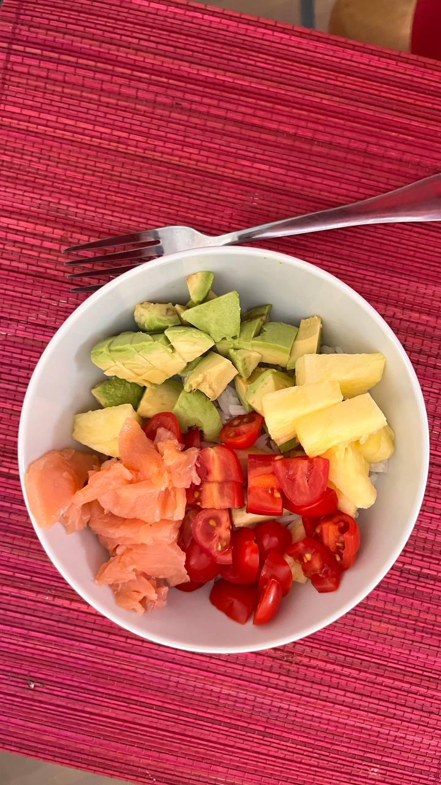
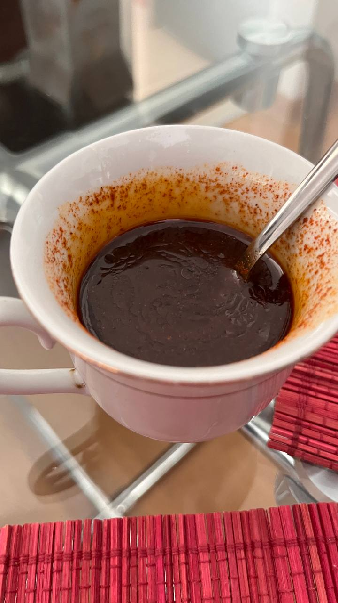

Кулинарии пост:

У нас рядом с домом есть кафешка, где делают боулы. Это гавайское блюдо, в котором есть рис и сверху него по настроению добавляются всякие вкусности типа рыбы и овощей, порезанные кусочками.

Главное - не завалить весь рис одним ингридиентом типа горошка, а подобрать много разных под свой вкус. Несмотря на простоту приготовления - это вкусно и сытно.

Я попробовал его приготовить самостоятельно:

Надо взять рис для суши, иначе вкус будет как у рисовой каши. Рис можно заправить рисовым уксусом для суши (он состоит из воды, уксуса и сахара с солью) - благодаря этой заправке рис в суши-роллах держит форму. В первый раз мы сделали без заправки, второй раз с ней - разница есть, но в целом боул вкусный и так и так.

Список возможных ингридиентов, которые выкладываются на рис сверху: помидоры, огурцы, кукуруза, горошек, лук, мягкий сыр, рыба, водоросли, мясо, авокадо, манго, ананас. В общем что захочется.

На мой взгляд самое вкусное - красная рыба, мягкий сыр, авокадо и помидоры. Интуитивно может показаться, что манго и ананасы лишние, но - их сладко-кисловатый вкус тоже хорош. Единственное что мне не понравилось - водоросли. Важен не только сам ингридиент, а как он сочетается с остальными - например, рыба солоноватая, помидоры или огурцы сочные, мягкий сыр и авокадо наоборот с мягким вкусом, ананасы или авокадо - сочно-кисло-сладкие. Экспериментируйте)

Поскольку разных ингридиентов много, каждого из них в блюде чуть-чуть. Даже если какой-то их них неудачный, на блюдо он не сильно повлияет. Тем более что ингридиенты не перемешиваются, а просто укладываются своими кучками.

Можно добавить соусы типа кетчупа, соевого, кисло сладкого и т.п. Можно полить в уголочке тарелки и потом по настроению брать рис с соусом или без.

Мне кажется, боулы хорошо делать сразу на большую компанию: рис варить не сложно. Ингридиентов типа банки кукурузы хватит на всех. ну и каждый сможет положить что ему нравится. Скорее наоборот есть проблема готовить на двоих, когда нужно всего понемножку, а оно продаётся относительно большими порциями и остаются излишки.

А ещё я попробовал сделать соус. Недавно я вдруг узнал, что в основе соусов терияки лежит соевый соус.

Я попробовал сделать какую-то вариацию для добавления в еду. Мне понравилось, рекомендую. Рецепт очень произвольный, ингриденты и их количество можно брать по вкусу.

1. Соевый соус. В нём есть соль и довольно сильный вкус.
2. Мёд. Добавил чуть-чуть. Можно вместо него добавить сахар, как в терияки.
3. Специи: я добавил красный молотый перец для остроты, можно и без него.
4. Можно разбавить водой, я сделал 1 к 1. Мне очень понравилось - соус стал более жидким и менее концентрированным, теперь им можно поливать рис или ещё что-нибудь.
5. Растительное масло: добавил чуть-чуть, но не заметил чтобы оно сильно повлияло. Возможно, есть смысл использовать его вместо воды.

На сайте где был рецепт, предлагалось налить соус в баночку, закрыть и потрясти. Я баночку не нашёл и без каких-либо проблем перемешал ложкой. Самым неохотно размешиваемым был мёд. Единственный момент - перец потом оседал на дно, перед наливанием в блюдо можно ещё чуть-чуть помешать.

