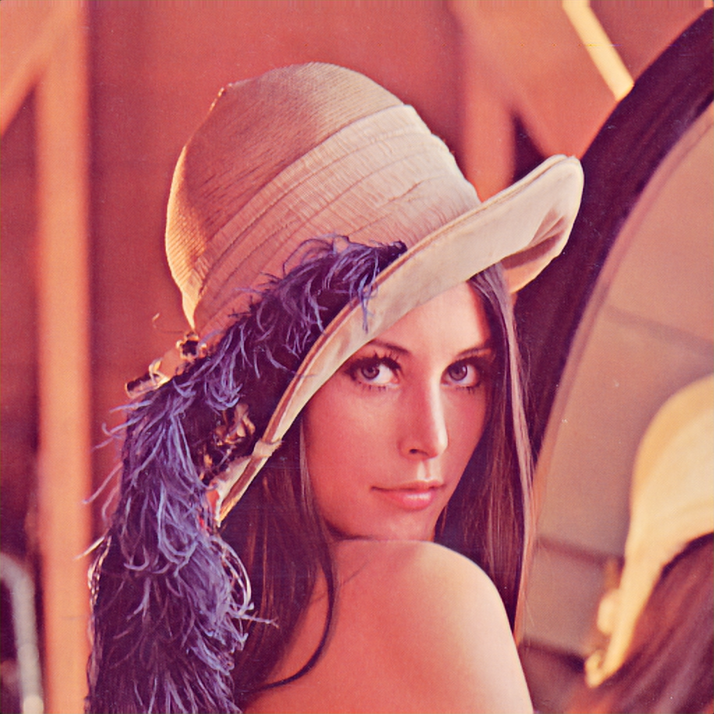
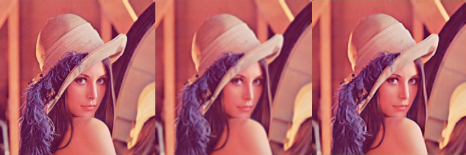

**TLDR** - это не готовое решение, это попытка самостоятельно разобраться, подобрать архитектуру и обучить генеративно-состязательную модель (GAN) для увеличения картинок в 2 или 4 раза. Я не претендую на то, что моя модель или путь рассуждений лучше каких-то других. Кроме того, относительно недавно стали популярны трансформеры и diffusion модели - заметки не про них.

С заметками не получилось линейной структуры повествования - есть отступления "в сторону" и уточнения. Можно пропускать нерелевантные заметки. Например, описание подготовки данных нужно, если вы хотите воспроизвести эксперименты - а в остальных случаях можно пропустить. Я написал каждую отдельную заметку по-возможности цельной и независимой от других.

Я уже был знаком со свёрточными сетками, но мне хотелось попробовать генеративно-состязательные сети. Понять, почему используют те или иные подходы. Попробовать свои идеи. Посмотреть, насколько быстро можно научить модель и насколько хорошо она будет работать.

Для обучения оказалось достаточно возможностей моего ПК. Какие-то простые эксперименты занимали десятки минут или несколько часов, самый длинный с обучением финальной большой модели - трое суток.

## Ссылки

Статьи на архиве или код на гитхабе - ни разу не истина в первой инстанции, в них предостаточно странных и неоптимальных решений. Я советую брать и аккуратно проверять каждое из них. И не боятсья пробовать что-то своё.

### Real-Time Single Image and Video Super-Resolution Using an Efficient Sub-Pixel Convolutional Neural Network

2016 год: https://arxiv.org/abs/1609.05158

Максимально простая и быстрая архитектура - буквально три свёрточных слоя. Кроме того, в pytorch есть слой PixelShuffle, который ссылается именно на эту статью. https://pytorch.org/docs/stable/generated/torch.nn.PixelShuffle.html

Я использовал эту архитектуру как отправную точку, но в ней есть спорные моменты.

### SR-GAN, ESR-GAN, Real-ESR-GAN

Серия статей одних и тех же авторов. В основном большая часть заметок относится к ним.
Я много лет назад прочитал первую статью, хотел разобраться, но руки дошли только сейчас. Авторы без дела не сидели и написали ещё две.
Для полного понимания происходящего лучше читать все три по порядку. И смотреть репозитории к ним, там есть интересные моменты. Но бОльшую часть нюансов я начал понимать, только когда попробовал учить модели сам.

#### SR-GAN (Super-resolution generative adversarial networks)

https://arxiv.org/abs/1609.04802

Увеличение фотографий в четыре раза, одна из первых статей, написана в 2016 году.

Размер картинок - 96х96 пикселей.

#### ESR-GAN (Enchanced ESR-GAN)
2018 год.

Arxiv: https://arxiv.org/abs/1809.00219

Github: https://github.com/xinntao/ESRGAN

Размер картинок 128х128.

Отказались от использования батч-нормализации в генераторе, из-за чего пришлось менять всю архитектуру генератора
Ипользовали в качестве ошибки разность предсказаний для реальной и сгенерированной картинки.

#### Real ESR-GAN

Пока что последняя в этом процессе добавления буковок слева к названию

Arxiv: https://arxiv.org/abs/2107.10833

Github: https://github.com/xinntao/Real-ESRGAN

Наконец-то размер картинок для обучения - 256х256 пикселей. Хотя, возможно, это как-то связано с развитием видеокарт и увеличением количества памяти.

Архитектура практически так же, что и в предыдущей статье. Но авторы очень серьёзно подошли к процессу искажений - к фотографии добавляются шумы, размытие, артефакты сжатия, и уже вот этот "подпорченный" результат нейросетка пытается увеличивать обратно в красивую картинку.


## pytorch, cuda, gpu и время обучения

Видеокарта - geforce 2060 super, 8Gb.
Обучать на CPU медленнее на порядок - лучше разобраться с видеокартой.
В подготовленном датасете получилось 400 000 картинок размером 256х256, они заняли 32 Гб на SSD.

Простые начальные нейронные сетки пробегали датасет очень быстро и я учил по несколько эпох, но с усложнением сети скорость загрузки данных становилась всё менее важной. На последней, самой большой нейронной сетке одна эпоха обучения занимала аж трое суток с одной картинкой в батче - иначе не хватало видеопамяти. Это примерно 0.7 секунды на шаг обучения.

Что забавно, далеко не всегда время обучения сильно важно. Например, я часто запускал обучение на ночь или утром перед уходом на работу - и не важно, учится сетка 3 часа или 8 - я доберусь до неё ещё позже.

Я поставил pytorch с поддержкой cuda на linux mint. Поставить на ubuntu было бы проще. По факту linux mint 21.1 базируется на ubuntu 22.04. Поэтому в `/etc/apt/sources.list` мне пришлось в файле  `cuda-ubuntu2204-x86_64.list` тащить версию для убунты.
```
deb [signed-by=/usr/share/keyrings/cuda-archive-keyring.gpg] https://developer.download.nvidia.com/compute/cuda/repos/ubuntu2204/x86_64/ /
```
И в случае с докером аналогично "jammy stable", которое само собой относится к убунте. Не знаю насколько это правильное решение.

Ещё я попробовал докер: https://catalog.ngc.nvidia.com/orgs/nvidia/containers/pytorch
Что мне не понравилось - нельзя просто так поставить докер и иметь все библиотеки внутри него. В хостовую систему вдобавок придётся ставить nvidia gpu drivers и nvidia container toolkit. А для этого регистироваться на сайте nvidia.... Короче, докер не спасает от установки драйверов.
В итоге у меня torch с cuda в докере так и не заработал и при этом заработал на хосте, так что я на него забил.

## Почему не использую google colab

В Google colab можно поменять настройки и получить доступ к nvidida T4. Она имеет 16 Гб памяти на борту и вроде как специально сделана для машинного обучения.

На практике процесс обучения на моей nvidia 2060 оказался быстрее в 2-3 раза. А ещё у бесплатного google colab есть лимиты: 40 минут неактивности и 12 часов общего времени, после чего ноутбук останавливается.

В итоге я вообще отказался от colab: долгие задачи на нём запускать неудобно, а короткие я и локально запущу. Вдобавок "долгие задачи" для коллаба - это 40 минут, которые превращаются в локальные не такие долгие 15-20.

## Загрузка картинок с помощью Pillow

Вообще есть готовые стандартные классы и решения, но мне хотелось попробовать самому, чтобы иметь больше контроля над каждым шагом.

Для загрузки данных я использовал Pillow, но там есть нюансы:

1. Фотографии с повернутого набок телефона хранятся так же, но в картинке появляется специальный тег, и картинка поворачивается уже программой для просмотра
2. Картинки могут быть не в RGB формате, а например RGBA, чёрно-белые или вообще YUV
3. Бывают картинки, которые открываются просмотрщиком фоток, но Pillow считает их испорченными и кидает исключение
4. Массив данных будет в формате uint8 в интервале 0-255, а для обучения хочется float в интервале 0.0-1.0. Вообще говоря в png можно сохранить картинку и задать глубину канала float 16 бит, но мне таких не попадалось.
5. После загрузки размерность `(height, width, 3)`, но в pytorch обычно используется порядок с каналами вначале: `(3, height, width)`

Так что простой код загрузки не такой уж и простой:
```Python
def load_img(path: str, channels_first: bool = False) -> Optional[np.ndarray]:
	try:
		pil_image = PILImage.open(path)
	    pil_image = PIL.ImageOps.exif_transpose(pil_image)
	    pil_image = pil_image.convert('RGB')
	    np_array = np.asarray(pil_image)
	    np_array = np_array.astype(np.float32) / 255.0
	    if channels_first:
		    np_array = np.moveaxis(np_array, 2, 0)
	    return np_array
	except Exception as e:
		logging.error(f"error {e} for {path}")
	    return None
```

При желании можно заглянуть в теги и вытащить данные типа модели камеры. Например, мой телефон делает 4к снимки, но на их шумность и шакалистость без слёз не взглянешь. Именно эти фотки я заранее уменьшал в два раза. Всё-таки я хочу, чтобы нейронка училась восстанавливать настоящие детали изображения, а не рисовать правдоподобный шум матрицы.

```Python
def image_get_model(image: PIL.Image) -> str:
    model_tag = 0x0110
    return image.getexif().get(model_tag)
```


## Уменьшение картинок бывает разным

Может показаться, что это простая операция, но опять же есть нюансы.

Ссылка со сравнением уменьшения картинок в Pillow, OpenCV, Tensorflow и PyTorch: https://zuru.tech/blog/the-dangers-behind-image-resizing

Краткий вывод - я по-возможности использую Pillow. В некоторых случаях использую pyTorch для уменьшения ровно в два раза.
Уменьшение в Pillow по-умолчанию использует бикубическую интерполяцию:

```Python
pil_image.resize(new_size)
```

И в pytorch:

```Python
_, _, h, w = x.size()
return F.interpolate(x, size=(h // factor, w // factor), mode='bilinear', antialias=True)
```

Кроме того, у меня есть подозрение, что уменьшение картинки должно производиться в линейном цветовом пространстве, а не в sRGB.

При обучении нейронки это всё важно. Если я буду использовать кривой алгоритм уменьшения картинки, то нейронка выучится именно под него. И, возможно, будет хуже работать на настоящих картинках.

Для примера - (могу ошибаться) для нейронной сети sr-gan https://arxiv.org/abs/1609.04802 использовали уменьшение картинок в matlab и оно якобы работает тоже как-то по-своему.

## Почему я выбрал размер картинок 256х256

Ограничение сверху: на моей видеокарте с 8 Гб памяти с большой серьёзной нейронкой размер батча с картинками такого размера уменьшился до одной картинки. На шаге обучения хранятся все промежуточные результаты вычислений и потом считаются градиенты - видеопамяти понадобится много.

Ограничение снизу:
Это размер контекста, больше которого нейронная сеть не сможет захватывать.

Для примера: в первой статье про sr-gan указывают, что большие картинки были размером 96х96. Потом их уменьшали в четыре раза (до 24х24) и потом учили нейронную сеть увеличивать их обратно.

А теперь представьте - нейронка получает крохотный квадратик в 24х24 пикселя и пытается из него что-то восстановить. Сколько информации она способна получить?

По-сути, больше всего информации получат центральные пиксели - у них будет реальная окрестность в целый десяток пикселей. Я считаю, что это крайне мало. Кроме того, большая часть пикселей будет расположена рядом с краями картинки и там вообще придётся играть в угадайку.

Я хочу, чтобы нейронка при увеличении не просто дорисовывала чёткие края, а делала что-то осмысленное. Для этого область восприятия нейронки и размер обучающих примеров должны быть достаточно большими - например, чтобы в обучающие примеры целиком помещались какие-то объекты - лица людей, деревья, столбы и т.п.

Тогда нейронка сможет отличить волосы на щеке от проводов на фоне закатного неба и дорисовать их по-разному.

Если я беру образцы размером 256х256 пикселей, то уменьшенный в четыре раза образец не такой уж и большой - 64х64 пикслея. На мой взгляд это тоже мало, но больше я не сделаю.

Я удивлён, но в статьях про увеличени картинок часто используют очень маленькие образцы. Зачем, почему - не знаю.

## Маленький датасет для проверки идей

Вначале я использовал датасет с цветами:

https://pytorch.org/vision/main/generated/torchvision.datasets.Flowers102.html

Уменьшил и кропнул картинки, сохранил в виде png картинок 256х256 пикселей. Получилось 10к примеров.

Я брал простую сетку, учил её на цветах. Всё было быстро. Сетке было проще учиться, так как она видела только цветы. Я на этих самих цветах "на глаз" или по метрикам мог посмотреть, насколько удачно то или иное решение.

Этот подход сэкономил мне очень много времени.
Процесс обучения занимал от нескольких минут до часа. В принципе, если нет GPU с cuda, с таким датасетом можно экспериментировать и на CPU. Но дальше будет хуже.

Я не разделял датасет на обучение/валидацию. Начальные нейронные сетки всё равно показывают очевидно слабые результаты и бороться с переобучением нет смысла.

## Подготовка реального датасета

Допустим, есть картинка 1500х2000 размером пикселей. Я из неё могу сделать много разных образцов:
1. Можно вырезать кусочки 256х256 пикселей в произвольных местах.
2. Можно уменьшать картинку в 2-4-8-... раз и выбирать кусочки из неё.

Таким образом, из одной большой картинки можно получить несколько десятков образцов для обучения.
У меня хранятся все фотки с телефонов и фотоаппаратов за последний десяток лет - учить есть на чём. Не знаю как так получается, раз или два в год перекидываю все фотки на комп, а уже через несколько месяцев их на телефоне опять целая куча.

В сумме получился датасет на примерно 400 000 кусочков картинок суммарным размером в 32 Гб. Я их сохранял в png, чтобы не было никаких артефактов.
Шакалистые jpeg фотографии с телефонов заранее уменьшал раза в 2, чтобы убрать шум и артефакты сжатия.

Процесс нарезки картинок и т.п. сделал один раз - он занял около восьми часов однопоточного кода на питоне.
Поначалу у меня были мысли, что это можно как-то оптимизировать, распараллелить и делать одновременно с обучением нейронной сети, но в итоге я забил и как мне кажется правильно сделал:

1. Я учил нейронные сети много раз, а сконвертировал только однажды.
2. Легко убедиться, что с подготовленными данными всё впорядке - я могу глазами посмотреть на любую картинку.
3. При обучении картинок не надо заботиться о пайплайне их загрузки и обработки - всё уже готово.
4. Если нейронная сеть небольшая, то шаги обучения делаются очень быстро, и скорость загрузки становится узким горлышком. При обучении и загрузке готовых картинок с диска утилизация видеокарты достигала 95%.
5. Картинки с диска можно загружать в произвольном порядке - потому что изначально при генерации из одной фотографии (или даже серии похожих фотографий) получилалась последовательность из многих похожих по стилю кусочков.
6. Если бы я учил нейронку одновременно с преобразованием данных, какая-нибудь ошибка в  функции преобразования могла бы остановить обучение.

Мне кажется, сохранять четыреста тысяч файлов в одну папку - не самая лучшая идея, поэтому я написал вспомогательный класс `ImageSaver`, который сохраняет картинки по тысяче штук в папку с именами-номерами типа 12/12678.png, 12/12679.png...
Этот класс потом много где пригождался.

## Кастомный датасет для pytorch

https://pytorch.org/docs/stable/data.html

Всё просто: можно унаследоваться от `torch.utils.data.Dataset` и сделать методы `__len__` и `__getitem__

Я написал вспомогательный класс, который хранит список путей к файлам и отдаёт numpy массивы в нужном формате

```Python
class ImagesDataset(torch.utils.data.Dataset):
    def __init__(self,
                 images_paths: List[str],
                 channels_order: str = 'hwc'):
        assert channels_order in {'hwc', 'chw'}
        super(ImagesDataset).__init__()
        self.channels_order = channels_order
        self.images_paths: List[str] = images_paths

    def __getitem__(self, index) -> np.ndarray:
        path = self.images_paths[index]
        # загрузка картинки здесь

    @staticmethod
    def from_dirs_recursive(roots: List[str], shuffle_seed: Optional[int] = None, channels_order: str = 'hwc'):
        result_set: Set[str] = set()

        for root in roots:
            for dir_path, dir_names, file_names in os.walk(root):
                for file_name in file_names:
                    if is_image(file_name):
                        result_set.add(f"{dir_path}/{file_name}")

        results = list(result_set)
        results.sort()
        if shuffle_seed is not None:
            Random(shuffle_seed).shuffle(results)

        return ImagesDataset(results, channels_order)
```

Потом свой датасет можно передавать в стандартный `DataLoader`, который умеет запрашивать данные в случайном порядке, группировать в батчи и т.п.

```Python
dataset = pyml.ImagesDataset.from_dirs_recursive(roots=["datasets/flowers102processed"], channels_order='chw')
data_loader = DataLoader(dataset, batch_size=batch_size, shuffle=True, pin_memory=True, pin_memory_device='cuda')
```

## Самая простая нейронка

Статья для вдохновения: Real-Time Single Image and Video Super-Resolution Using an Efficient Sub-Pixel Convolutional Neural Network https://arxiv.org/abs/1609.05158

Нейронная сеть состоит из трёх свёрточных слоёв. В оригинальной статье есть странные моменты - я их попробовал, но не впечатлился:

**Выбор функии активации**
В оригинальной статье используется активация tanh. Это странно, так как ещё в 2012 году появилась AlexNet и в ней использовалась активация relu. А кроме того, в ней утверждалось, что с ReLU нет затухания градиентов и обучение происходит в 5-7 раз быстрее. https://en.wikipedia.org/wiki/AlexNet
Из-за активации tanh нейронной сети становится сложно выдать значения, близкие к минимальным -1 и максимальным 1 - для этого на входе должны быть очень большие и очень маленькие числа. Я пробовал учить нейронку и прям глазами было видно, что слишком яркие и слишком тёмные места на фотографии получаются "выгоревшими"

Я посмотрел на реализации sr-gan и т.п. и понял, что активацию можно вообще не использовать. Да, нейронка может выдавать любые значения от минус бесконечности до плюс юесконечности. Да, мы будем учить под выходные значениями в интервале от 0 до 1. И да, это работает.

Иногда выходы могут быть вне этого диапазона, но ничего криминального.

**Параметры обучения**

В оригинальной статье самый последний слой учили с learning rate, который меньше в 10 раз.
Пример того, как это можно сделать в pytorch:

```Python
generator_optimizer = torch.optim.Adam([
    {'params': self.generator.other_layers.parameters()},
    {'params': self.generator.pixel_shuffle.parameters(), 'lr': lr * 0.1}
], lr=lr)
```

После замены функции активации на relu я сравнил обучение и выяснил, что вполне можно использовать один learning rate на всю модель.
И это отлично, код обучения стал чуточку проще.


```Python
class GeneratorESPCN(nn.Module):
    def __init__(self, channels: int, upscale: int):
        super(GeneratorESPCN, self).__init__()

        self.layers = nn.Sequential(
            nn.Conv2d(3, channels, kernel_size=5, padding='same'),
            nn.LeakyReLU(0.1),
            nn.Conv2d(channels, channels, kernel_size=3, padding='same'),
            nn.LeakyReLU(0.1),
            nn.Conv2d(channels, 3 * upscale ** 2, kernel_size=3, padding='same'),
        )

    def forward(self, x: torch.Tensor):
        return self.layers(x)
```


В принципе, такая нейронка уже работает.
В оригинальной статье было сделано максимально просто - уменьшали картинку, отправляли в нейронку, она её увеличивала обратно. В качестве ошибки использовали mse loss между оригинальной картинкой и после нейронки.

Результат не то чтобы сильно отличался от увеличения с помощью обычной интерполяции. Это даже не генеративная сеть. Зато она очень быстро учится.

Это отличное базовое решение, которое я потом буду улучшать. И в конце, как в сказке про кашу из топора, заменю эту нейронку на более тяжёлую.

В оригинале было 64 канала, я перешёл к 128 - всё равно сетка работает быстро и весит мало.

Мой jupyter notebook, в конце есть несколько картинок: https://github.com/Kright/mySmallProjects/blob/master/2023/ml_experiments/superresolution/espcn.ipynb

## learning rate, loss и batch size

Надо не забывать, что размер батча влияет на скорость обучения.

Например, я в качестве ошибки использую среднеквадратичное отклонение.
Если батч становится в два раза меньше, то влияние каждого отдельного примера на общую ошибку (и на градиент) будет в два раза больше.

Наша базовая модель из заметки выше учится очень быстро, занимает мало памяти и я при обучении использовал размер батча 64.

В дальнейшем архитектура сети будет усложняться, сеть - становиться больше, и раз за разом batch size придётся уменьшать
В качестве первого приближения можно точно так же уменьшать learning_rate в столько же раз.


## VGG loss

Не все пиксели одинаково важны. Какие-то несут ключевую инфорамцию, какие-то просто фон или шум.

Можно взять уже обученную сеть VGG, отправить в неё картинку и посмотреть, какие высокоуровневые фичи она извлечёт. В качестве функции ошибки можно брать разницу именно для этих фич.

Нюансы:
Не забыть, что эту сеть надо "заморозить" и не обучать.
Есть несколько версий VGG. Во имя простоты я взял версию без батч-нормализации.
Для фич лучше использовать сигналы до активации, а не после (Это логично, после relu часть сигналов станет нулевой)
На вход vgg подаются данные с какими-то нужным средним и среднеквадратичным отклонением. Надо не забыть их указать.

Мой код можно найти тут:
https://github.com/Kright/mySmallProjects/blob/master/2023/ml_experiments/superresolution/models/features_vgg.py

в pytroch всё уже готово, остаётся только использовать:

```Python
class FeaturesFromVGG16(nn.Module):
    def __init__(self, layers_count: int = 30):
        super(FeaturesFromVGG16, self).__init__()
        vgg = torchvision.models.vgg16(weights=torchvision.models.VGG16_Weights.IMAGENET1K_V1)

        features: nn.Sequential = vgg.features

        self.normalize_input = torchvision.transforms.Normalize(mean=(0.485, 0.456, 0.406), std=(0.229, 0.224, 0.225))
        self.layers = nn.ParameterList([features[i] for i in range(layers_count)])
        # freeze network
        self.requires_grad_(False)

    def forward(self, x: torch.Tensor) -> List[torch.Tensor]:
        outputs = []

        x = self.normalize_input(x)

        for layer in self.layers:
            x = layer(x)
            if isinstance(layer, nn.Conv2d):
                outputs.append(x)

        return outputs
```

Здесь мы берём певые несколько слоёв из VGG и утаскиваем их к себе. `self.requires_grad_(False)` значит, что наша модель не собирается учиться и нет смысла хранить градиенты для её обучения.

Модель отдаёт наружу все выходные значения после каждого свёрточного слоя.

Потом при сравнении оригинальной сетки можно просуммировать mse_loss для разных выходов:

```Python
y_features = self.vgg(y)
label_features = self.vgg(label)

results: List[torch.Tensor] = []
for y_f, label_f in zip(y_features, label_features):
    results.append(self.mse_loss(y_f, label_f))

return sum(results) * self.weight
```

Единственный момент, который мне не нравится - несмотря на нормализацию входных значений, среднеквадратичная ошибка от слоя к слою становится всё больше и больше. Возможно, у меня что-то работает некорретно.
Или работает корректно, но наверно надо домножать ошибку на затухащие веса типа `1.0, 0.5, 0.25 ...` Потому что иначе последний слой даёт самый большой и шумный вклад в градиенты.

В статье sr-gan советовали использовать вес 0.001, я вместо него взял 0.0001. Но у меня складываются ошибки на каждом слое vgg.

В статье real-esr-gan упоминается, что взяли первые пять свёрток от vgg19 и ошибку после слоёв считали с весами `0.1, 0.1, 1.0, 1.0, 1.0`

Простейшая сетка из предыдущей заметки с vgg loss даёт намного более красивый результат.
Картинки можно глянуть тут: https://github.com/Kright/mySmallProjects/blob/master/2023/ml_experiments/superresolution/espcn_vgg_gan.ipynb

Почему-то значительная часть сетей увеличивает в четыре раза.
VGG loss можно считать не только на картинках оригинального размера - но и на уменьшенных в два раза.

У меня получилось, что обычно такая ошибка в пару раз меньше, чем vgg loss в оригинальном размере.

Я использовал обе. Тем более что уменьшенное в два раза изображение имеет в четыре раза меньшую площадь и ошибка на нём заметно быстрее считается.

## GAN Discriminator

С нейронками из одной модели я знаком давно, но учить генеративные сети попробовал впервые. Могу чего-то не знать или ошибаться.

Увеличивающая картинку сеть будет генератором.
Сеть, пытающася отличить реальную картинку от сгенерированной - дискриминатором.

Эти две сети будут соревноваться.
Шаг обучения теперь будет состоять из двух шагов - генератора и дискриминатора.

Нужно, чтобы дискриминатор давал как можно больше информации генератору о том, чтот же в изображении кажется ненастоящим.

Для этого я сделал так - дискриминатор на выход даёт вероятность "реальности" для каждого пикселя.
Картинка, правда, в процессе уменьшается в 8 раз. 256 / 8  = 32. Итого на выходе генератора картинка 32х32 предсказания - насколько области выглядят реальными.

Архитектура генератора похожа на VGG. Пара свёрточных слоёв и потом уменьшение, и так повторяется три раза.

В качестве функции активации я использовал LeakyReLU с коэффициентом 0.1 . Честно говоря, я везде люблю использовать эту функцию активации, но конкретно в дискриминаторе она реально нужна. Градиенты должны пройти сквозь дискриминатор и максимально подробно донести информацию до генератора. Даже если какое-то значение отрицательное - это не повод его отсекать.

Интуитивно мне почему-то казалось, что сначала можно отдельно обучить генератор на mse loss, потом отдельно обучить дискриминатор на выходах генератора, а только потом начинать учить их вместе. Так вот - это всё лишние усложнения. Можно брать и с самого начала учить обе сетки одновременно без каких-либо приготовлений.

## Batch normalization

Эта штука реально ускоряет обучение. Но есть нюанс - она приводит выходы слоя к среднему 0 и среднеквадратичному отклонению в 1. Если быть точным - внутри считается скользящее среднее входов за много шагов и входы домножнаются и складываются с поправочными коэффициентами. Оно обновляется не в шаге оптимизатора, а при применении слоя. Это привносит свои сложности - например, из-за этого в pytorch у модели есть два режима train и eval - во втором слои "заморожены" и не пытаются обновлять состояние.

В статье ESR-GAN в генераторе отказались от нормализации. Авторы утверждают, что на одноцветном фоне нейронная сеть начинала "выдумывать" какие-то подробности.
Я принял это утверждение на веру - оно выглядит логично, а проверить руки не дошли. В их статье есть картинки с демонстрацией. Возможно, описанные авторами "артефакты" сильно зависят от конкретной имплементации и параметров нормализации.
В любом случае - без нормализации сеть проще и меньше факторов могут пойти "не так".
В дискриминаторе я использую BatchNorm2d, чтобы генератор быстрее учился. По-хорошему это утверждение тоже надо проверить.

## x4 vs x2x2

По итогам сравнений получилось, что для увеличения картинки в 4 раза лучше сделать два шага с увеличениями в 2 раза и с парой-тройкой свёрточных слоёв между увеличениями.
Кроме того, пара свёрточных слоёв после увеличения тоже улучшают результат.

В ESR-GAN используют такой же подход.

## Функция ошибки и переобучение генератора

Раньше в генеративных сетях использвовали простой подход - дискриминатор для "реального" примера учился выдавать 1, а для "искуственного" - 0. С активацией sigmoid, которая приводит выходы к этому интервалу.

$$\sigma(D(y_{real})) \rightarrow 1$$

$$\sigma(D(y_{fake})) \rightarrow 0$$

Но можно почитать статью на википедии https://en.wikipedia.org/wiki/Generative_adversarial_network, а так же описание ошибки в ESR-GAN

Утверждается, что лучше в качестве ошибки брать разницу предсказаний

$$ \sigma(D(y_{real}) - D(y_{fake})) \rightarrow 1 $$

Дискриминатор будет "тянуть одеяло" в сторону едининчки, а генератор в сторону нуля. Интуитивно это выглядит логично - если настоящий пример выглядит ненастоящим - это не повод сильно наказывать дискриминатор.

Впрочем, как бы я не пробовал, я периодически сталкивался с проблемой переобучения генератора под дискриминтор - генератор начинал рисовать всякие несуществующие узоры, которые выглядели чёткими и красивыми, но не соответствующими оригинальной картинке.

Чтобы с этим бороться, я изменил функцию ошибки для генератора (у дискриминатора всё по-прежнему). Перестал поощрять генератор в те моменты, когда сгенерированное изображение становилось более "настоящим", чем оригинал.

```Python
pred_y = self(y)
pred_label = self(label)
y_more_real = pred_y > pred_label
diff = y_more_real * 9000 + ~y_more_real * (pred_y - pred_label)
ones = torch.ones(size=diff.size(), device=diff.device)
return self.binary_crossentropy_with_sigmoid(diff, ones) * self.generator_weight
```

В итоге получилось хорошо - например, если на картинке если расфокусированная область или однотонный участок, генератор не пытается их "улучшать" и меняет объекты только в фокусе.


Кроме того, я пробовал бороться с переобучением генератора следующими способами:

1. Добавлял Dropout в дискриминатор, чтобы его предсказания были более шумными и было нереально подогнать узор (работало, но в итоге я от этого отказался)
2. Случайно сдвигал пару картинок входе дискриминатора на 0-7 пикслей по вертикали и горизонтали. (Дискриминатор состоит только из свёрточных слоёв, уменьшает картинку в 8 раз, поэтому сдвиг на 8 пикселей эквивалентен его отсутствию)
3. Делал более "умный" дискриминатор добавлением каналов и слоёв.
4. Подгонял отношение коэффициентов обучения между генератором и дискриминатором
5. На один шаг обучения генератора делал несколько шагов дискриминатора (они делаются в разы быстрее)

## max pooling vs strided conv

Я сравнил уменьшение двумя способами:

1. `MaxPool2d(2)` - берёт квадратики 2х2 пикселя, для каждого канала берёт максимум
2. `Conv2d(kernel=3, stride=2)` - вычисляет свёртку как обычно, но только для пикселей с чётными x и y, всё остальное откидывается

Есть даже статья из 2015, в которой заменили все max-pooling слои на свёртки со stride

**Striving for Simplicity: The All Convolutional Net:** https://arxiv.org/abs/1412.6806

Я попробовал воспроизвести их результаты и взял датасет mnist.
Воспроизвести не получилось.
Если я заменял max-pooling слой на ещё одну свёртку - то результаты примерно такие же: https://github.com/Kright/mySmallProjects/blob/master/2023/ml_experiments/mnist_nets/mnist_baseline_compare_maxpool_vs_strided.ipynb
Если я выкидывал max-pooling слой и добавлял параметр strided=2 предыдущему свёрточному слою, то результаты заметно ухудшались: https://github.com/Kright/mySmallProjects/blob/master/2023/ml_experiments/mnist_nets/mnist_baseline_compare_maxpool_vs_no_layer.ipynb

Но есть момент - max pooling вычислить проще и быстрее, чем свёртку. А ещё свёртка - это обучаемые параметры - которые вроде бы и учатся, но при этом не повышают общую результативность сети по сравнению с max pooling. На мой взгляд какое-то бесполезное изменение.

Поэтому в дисриминаторе у меня используется именно max pool

## Dilated convolution и perception field

Для свёртки 3х3 получается, что результат зависит от самого пикселя и от соседних (-1, 0, 1)
по х и у) Если повторить N свёрток 3х3 подряд, то информация сможет "утечь" только на N пикселей вбок. Если хочется, чтобы нейронная часть могла получать информацию о каких-то дальних участках, можно сделать совсем иначе.

**dilated convolution** - цвет пикселя так же зависит девяти точек, только вот эти пиксели расположены дальше. Например, для dilation=2 сдвиги пикселей будут (-2, 0, 2)

Если хочется захватить какую-то большую область, можно сделать последовательность свёрток с dilation в виде степеней двойки - 1, 2, 4, 8, ...
Таким образом и размер картинки не меняется, и информация может "перетекать" довольно далеко.

Статья из 2015 года. Архитектура сети предложена для семантической сегментации - нейронка для каждого пикселя предсказывала класс объекта.

Multi-Scale Context Aggregation by Dilated Convolutions: https://arxiv.org/pdf/1511.07122.pdf

Я использовал примерно такой же подход и в генераторе и в дискриминаторе. В дискриминаторе я не хотел уменьшать картинку больше чем в 8 раз, но хотел увеличить область, которая влияет на предсказание для каждого пикселя. В генераторе я опять же хотел увеличить область хотя бы до 10-20 пикселей вокруг, чтобы сеть при увеличении кусочка картинки могла учитывать окружающий контекст.

Есть альтернативный способ с архитектурой типа U-net: https://en.wikipedia.org/wiki/U-Net

В коде к Real-ESR-GAN в дискриминаторе используется U-net архитектура и спектральная нормализация. https://github.com/xinntao/Real-ESRGAN/blob/master/realesrgan/archs/discriminator_arch.py

"Рукомахательно" я могу сказать, что там уменьшается картинка, обрабатывается в меньшей размерности и  потом "увеличивается" обратно, обогащая слой сигналами, вычисленными на других масштабах.
Но сам я такое обучать ещё не пробовал и со своим решением не сравнивал.

## Финальная архитектура дискриминатора

Уменьшение картинки в 8 раз, потом несколько свёрток с dilation и в конце пара слоёв с `kernel_size=1` для независимых "предсказаний" каждым пикселем.

```Python
class DiscriminatorDilationNetwork(nn.Module):
    def __init__(self,
                 generator_weight: float,
                 mid_channels: int):
        super(DiscriminatorDilationNetwork, self).__init__()

        self.generator_weight: float = generator_weight
        self.random_crop = RandomShiftCrop(8)

        self.layers = nn.Sequential(
            self.conv(3, mid_channels, kernel_size=5),
            self.conv(mid_channels, mid_channels, kernel_size=3),
            nn.MaxPool2d(2),

            self.conv(mid_channels, mid_channels * 2, kernel_size=3),
            self.conv(mid_channels * 2, mid_channels * 2, kernel_size=3),
            nn.MaxPool2d(2),

            self.conv(mid_channels * 2, mid_channels * 4, kernel_size=3),
            self.conv(mid_channels * 4, mid_channels * 4, kernel_size=3),
            nn.MaxPool2d(2),

            self.conv(mid_channels * 4, mid_channels * 8, kernel_size=3),
            self.dilated_conv3(mid_channels * 8, mid_channels * 8, dilation=2),
            self.dilated_conv3(mid_channels * 8, mid_channels * 8, dilation=4),
            self.conv(mid_channels * 8, mid_channels * 8, kernel_size=3),

            self.conv(mid_channels * 8, mid_channels * 16, kernel_size=1),
            self.conv(mid_channels * 16, mid_channels, kernel_size=1),
            nn.Conv2d(mid_channels, 1, kernel_size=1)
        )

        self.binary_crossentropy_with_sigmoid = torch.nn.BCEWithLogitsLoss()

    def conv(self, in_ch: int, out_ch: int, kernel_size: int = 3) -> torch.nn.Module:
        return nn.Sequential(
            nn.Conv2d(in_ch, out_ch, kernel_size=kernel_size, padding='same', bias=False),
            nn.BatchNorm2d(out_ch),
            nn.LeakyReLU(0.1),
        )

    def dilated_conv3(self, in_ch: int, out_ch: int, *, dilation: int) -> torch.nn.Module:
        return nn.Sequential(
            nn.Conv2d(in_ch, out_ch, kernel_size=3, dilation=dilation, padding=dilation, bias=False),
            nn.BatchNorm2d(out_ch),
            nn.LeakyReLU(0.1),
        )

	def loss_for_discriminator(self,
	                           y: torch.Tensor,
	                           label: torch.Tensor) -> torch.Tensor:
	    y, label = self.random_crop(y, label)

	    diff = self(y) - self(label)
	    # realness(label) should be >> realness(y)
	    zeros = torch.zeros(size=diff.size(), device=diff.device)
	    return self.binary_crossentropy_with_sigmoid(diff, zeros)

	def loss(self,
	         y: torch.Tensor,
	         label: torch.Tensor) -> torch.Tensor:
	    if self.generator_weight == 0.0:
	        return torch.zeros(size=[1], device=y.get_device())

	    y, label = self.random_crop(y, label)

	    pred_y = self(y)
	    pred_label = self(label)
	    y_more_real = pred_y > pred_label

	    diff = y_more_real * 9000 + ~y_more_real * (pred_y - pred_label)
	    ones = torch.ones(size=diff.size(), device=diff.device)
	    return self.binary_crossentropy_with_sigmoid(diff, ones) * self.generator_weight

	def forward(self, y: torch.Tensor) -> torch.Tensor:
	    y = self.layers(y)
	    return y
```


## Генератор от ESR-GAN и что я в нём поменял

Вместо тысячи слов: https://github.com/xinntao/ESRGAN/blob/master/RRDBNet_arch.py
Это код от автора статьи ESR-GAN.

А если серьёзно - у меня есть сомнения в оптимальности выбранной архитектуры и я её модифицировал, чтобы сеть училась побыстрее и требовала меньше памяти.

Итак, общая структура сети:
1. свёртка для увеличения размерности до `nf=64` каналов, и активации нет (это важно)
2. большой блок с кучей RRDB блоков, которые я опишу позже. Вычислительно самая сложная часть
3. увеличение в 4 раза сделано как два увеличения в два раза. В каждом свёртка и странный код F.interpolate(fea, scale_factor=2, mode='nearest'). Странное место, nearest я не пробовал.
4. после увеличений пара свёрток. Что тоже странно - количество каналов не меняется. Хотя после увеличения изображения будет в `4**2 = 16`  раз больше пикселей одна `HRconv` будет вычисляться в 16 раз дольше, чем `trunk_conv`

Теперь про основные (и очень вычислительно тяжёлые) блоки.
Основная их идея: https://en.wikipedia.org/wiki/Residual_neural_network
есть "основной путь" в картинке с 64 каналами, каждый блок чуть-чуть улучшает данные - складывает входные данные с поправками, умноженными на 0.2

Основной блок называется (сюрприз) Residual Dense Block:

```Python
class ResidualDenseBlock_5C(nn.Module):
    def __init__(self, nf=64, gc=32, bias=True):
        super(ResidualDenseBlock_5C, self).__init__()
        # gc: growth channel, i.e. intermediate channels
        self.conv1 = nn.Conv2d(nf, gc, 3, 1, 1, bias=bias)
        self.conv2 = nn.Conv2d(nf + gc, gc, 3, 1, 1, bias=bias)
        self.conv3 = nn.Conv2d(nf + 2 * gc, gc, 3, 1, 1, bias=bias)
        self.conv4 = nn.Conv2d(nf + 3 * gc, gc, 3, 1, 1, bias=bias)
        self.conv5 = nn.Conv2d(nf + 4 * gc, nf, 3, 1, 1, bias=bias)
        self.lrelu = nn.LeakyReLU(negative_slope=0.2, inplace=True)

        # initialization
        # mutil.initialize_weights([self.conv1, self.conv2, self.conv3, self.conv4, self.conv5], 0.1)

    def forward(self, x):
        x1 = self.lrelu(self.conv1(x))
        x2 = self.lrelu(self.conv2(torch.cat((x, x1), 1)))
        x3 = self.lrelu(self.conv3(torch.cat((x, x1, x2), 1)))
        x4 = self.lrelu(self.conv4(torch.cat((x, x1, x2, x3), 1)))
        x5 = self.conv5(torch.cat((x, x1, x2, x3, x4), 1))
        return x5 * 0.2 + x
```

После того, как авторы отказались от батч-нормализации, они решили сделать максимально короткие пути внутри модели. Поэтому внутри dense блока каждый следующий слой получает выходы всех предыдущих. Последний слой в блоке без активации.

В отличие от простой последовательности Residual блоков авторы решили устроить их иерархию: из трёх последовательных residual блоков собирается один Residual In Residual Dense Block (RRDB), который тоже домножает свой выход на 0.2 и прибавляет ко входу.

И вот этих RRDB блоков берётся 16 штук и они последовательно улучшают картинку.

Ещё деталь, которую я не очень понял и не пробовал делать: в оригинальной статье на входе той же самой сетки меняли первый слой на свёртку с уменьшением, так что вход уменьшался в 2 или 4 раза, а на выходе получались картинки, увеличенные в 2 или 1 раз. Возможно, это как-то ускоряло обучение.

У меня была забавная мысль, что можно попробовать переиспользовать RRDB блоки - например, взять один блок и применить его 16 раз. Тогда процесс получится чем-то похожим на diffusion модели, когда картинка потихоньку улучшается раз за разом, но я этого не пробовал.

Что мне не понравилось в Redisual Dense Block: каждая свёртка получается всё тяжелее, последняя свёртка из `64 * 5 = 320` каналов в `64` - и вычисляется в пять раз дольше, чем обычная свёртка из `64` каналов в `64`.

Например, для RDB сложноть вычислений (и количество параметров) растёт как `1 + 2 + 3 + 4 + 5 = 15`. Если бы вместо этого была бы просто последовательность пяти свёрток, то сложность была бы `1 * 5 = 5` - в три раза меньше по сложности вычислений и количеству обучаемых параметров. Возможно, такой блок работал бы заметно хуже, но никто не мешает увеличить количество каналов или блоков.

И моя вторая претензия - базовый Residual Dense Block при вычислении цвета пикселя не может далеко заглянуть - не дальше пяти пикселей в сторону. Мне кажется, это принципиальная проблема. Конечно, таких блоков много, и при использовании всех блоков информация потихоньку может уползти довольно далеко, но базовый блок сам по себе способен только на очень локальные улучшения.

Я попробовал переделать - в RDB оставил только три свёртки (сложность `1 + 2 + 3 = 6` - меньше в два с половиной раза). Но для дальних связей добавил свои блоки - три свёртки с dilation `1,2,4` и одну поточечную.
Таким образом, на пиксель начинают влиять все пиксели с расстоянияем до 7
Сложность вычисления примерно `3` , в сумме с RDB блоком получается 9 вместо бывших 15.

```Python
class MyDilatedBlock(nn.Module):
    def __init__(self, channels: int, res_scale: float = 0.2):
        super(MyDilatedBlock, self).__init__()

        self.res_scale: float = res_scale

        self.layers = nn.Sequential(
            nn.Conv2d(channels, channels, kernel_size=3, padding=1, bias=True),
            nn.LeakyReLU(0.1),
            nn.Conv2d(channels, channels, kernel_size=3, dilation=2, padding=2, bias=True),
            nn.LeakyReLU(0.1),
            nn.Conv2d(channels, channels, kernel_size=3, dilation=4, padding=4, bias=True),
            nn.LeakyReLU(0.1),
            nn.Conv2d(channels, channels, kernel_size=1, bias=True)
        )

    def forward(self, x):
        return x + self.layers(x) * self.res_scale

class MyResidualInResidualDenseBlock(nn.Module):
    def __init__(self, filters, res_scale=0.2, dr_layers: int = 5):
        super(MyResidualInResidualDenseBlock, self).__init__()
        self.res_scale = res_scale
        self.dense_blocks = nn.Sequential(
            MyDilatedBlock(filters),
            DenseResidualBlock(filters, layers=dr_layers),
            MyDilatedBlock(filters),
            DenseResidualBlock(filters, layers=dr_layers),
            MyDilatedBlock(filters),
            DenseResidualBlock(filters, layers=dr_layers)
        )

    def forward(self, x):
        return x + self.dense_blocks(x) * self.res_scale
```

Эта сетка одну эпоху проходила трое суток. Долго. Желание менять всякие мелочи и сравнивать результаты куда-то пропало.

Пока сетки были небольшие, я простро сохранял все ошибки в список и строил график через `pyplot` после обучения. К сожалению, этот подход не масштабируется. Я собирался добраться до tensorboard и в реальном времени смотреть графики обучения там, но что-то так и не попробовал. Наверно, освою позже.

## Артефакты сжатия jpeg

В третьей статье (Real-ESRGAN) авторы очень круто занялись добавлением шума, размытия, артефактов сжатия и т.п., которые нейронка училась убирать.

Я об этом не задумывался, пока не попробовал запускать свою нейронку на реальных картинках. Модель все эти артефакты сжатия принимала за какие-то важные детали, усиливала-дорисовывала и результат выглядел ужасно.

Я от всего этого оставил только генерацию артефактов jpeg. Для этого есть библиотека https://github.com/mlomnitz/DiffJPEG С её помощью в реалтайме можно быстро сжимать картинки до произвольной степени шакалистости. Главное не передавать `quality = 100` - кажется, где-то внутри происходит деление на ноль и вместо несжатой картинки получается фиаско.

По ощущениям после этого нейронка стала работать хуже на "качественных" картинках, но зато вполне нормально смогла увеличивать сжатые.

## Как я пробовал увеличить производительность

Реально работающим решением оказалось

```Python
with torch.no_grad():
    ...
```

Но правда в процессе обучения эти самые градиенты нам нужны.

Эта фича очень пригодилась, когда я захотел запускать сетку на реальных больших картинках и смотреть результат.
Да, я знаю про `tensor.requires_grad = False и model.eval()`, но с `no_grad` происходящее более очевидно.
Если не хранить все промежуточные вычисления, то видеокарта вполне нормально вмещает картинки размерами около тысячи пикселей.

Теоретически, можно использовать

```Python
LeakyRelu(0.1, inplace=True)
```

Тогда будет храниться только один слой, а при обратном распространении ошибки при необходимости активация будет вычисляться заново. Теоретически это снижает потребление памяти на хранение промежуточных результатов (в идеале раза в два, если каждый второй слой - активация), но добавляет чуть-чуть дополнительной работы. Я толком не распробовал.

Можно использовать autocast https://pytorch.org/docs/stable/notes/amp_examples.html

```Python
with with autocast(device_type='cuda'):
    ...
```

Производительность улучшилась в полтора-два раза, потребление памяти уменьшилось, только вот вот моя нейронка с какого-то момента переставала обучаться. А без autocast улучшалась дальше. Скорее всего, градиенты где-то становились слишком маленькими. Полезная штука, но экспериментировать лучше без неё.

## Увеличение в 4 или 2 раза.

Самое забавное - вначале, как и в остальных статьях, я планировал увеличивать картинки сразу в четыре раза. А потом посмотрел, как мыльненькая картинка шириной тысячу пикселей превращается в огромное полотнище в 4к пикселей и задумался - а надо ли так сильно увеличивать?

Для моих хотелок типа "сделать картинку покрасивее" вполне подходит увеличение в два раза. А ещё - для нейросетки это намного более простая задача - и учить проще, и результат красивее.

Теоретически, если нейронка увеличивает в два раза и её применить дважды, то картинка будет увеличена в четыре раза. Практически результат получается не очень красивый появляются артефакты. Особенно они заметны, если увеличить раз в 8 или 16.

Наверно, чтобы такое работало хорошо, надо при шаге обучения тоже уменьшать картинку в четыре раза, дважды увеличивать и сравнивать.

```
y = generator(generator(x))
```

## Результаты

Jupyter ноутбук с финальной неронкой, которую я учил трое суток: https://github.com/Kright/mySmallProjects/blob/master/2023/ml_experiments/superresolution/rrdb_x2_vgg_gan.ipynb

Количество весов в генераторе: 16 293 763
Файл с весами генератора занимает 65 мегабайт, с весами дискриминатора - 10.
Такие небольшие файлы можно даже на гитхаб залить, что я и сделал: https://github.com/Kright/mySmallProjects/tree/master/2023/ml_experiments/superresolution/models/espcn

Нейронка увеличивает картинки в два раза. Если применить её несколько раз, то появляются не очень красивые артефакты.

Если хочется красиво увеличивать фотки - наверно, не надо смотреть на мою нейронку. Есть более тяжеловесные нейронки, дающие красивые результаты.

Кроме того, в софт типа фотошопа активно добавляют нейронки и они там работают очень круто.

Итак, если кто хотел увидеть классическую Лену в 1024x1024 вместо 512х512:



Для примера оригинал:


Для наглядности я собрал анимацию в 1024х1024 в webp. Одна картинка увеличена нейронкой, вторая - бикубической интерполяцией:


Если она вдруг не показана, вот ссылка: https://github.com/Kright/my-articles/blob/master/2023/superresolutionNotes/imgs/animation01.webp

Вообще тут забавный момент. Если фотографию, увеличенную интерполяцией с фотографией, сравнить с увеличенной нейронкой - вторая выглядит на порядок лучше.
Но если сравнивать оригинальную фотографию с уменьшенной и увеличенной нейронкой, то результат не такой красивый.

Для примера в одной картинке, слева направо:
1. оригинал,
2. оригинал, уменьшенные в два раза и увеличенный интерполяцией
3. оригинал, уменьшенный в два раза и увеличенный нейронкой.



Что интересно, нейронка дорисовывает какие-то детали типа глаз или контуров, но не трогает объекты, которые не в фокусе.

## Историческая справка

Меня удивляет, как позавчерашние вирусологи и вчерашние военные эксперты вдруг резко стали знатоками в области ИИ. Нейронки - не магия. Они постепенно появлялись в нашей жизни, становясь всё сложнее и совершеннее. Это просто инструмент. Вот несколько примеров:

* 2001 год, появиласть идея использовать простую нейронную сеть для предсказания переходов в процессоре. https://en.wikipedia.org/wiki/Branch_predictor#Neural_branch_prediction. Идея - это ещё не готовое решение, но и оно тоже появилось. Пресс релиз AMD в 2016 году: упоминается "neural net prediction" и "smart prefetch": https://www.amd.com/en/press-releases/amd-takes-computing-2016dec13 Я откуда-то помню, что в процессорах Интела есть что-то похожее, но лень искать пруфы.
* 2012 год, статья про блок управления автомобильного двигателя: https://habr.com/ru/articles/141095/ Там это явно не написано, но электроника не только "управляет" двигателем, она получает обратную связь в виде лямбда зонда, датчиков детонации, температуры, положения коленвала и т.п. Блок управления двигателем в каких-то пределах подстраивается под внешние условия и обеспечивает оптимальную работу на разном бензине, при разной температуре и давлении воздуха и даже подстраивается под водителя. Да, "обучаемая модель" там простая и недалеко ушла от табличек с наборами коэффициентов, но технически модель с сотней подгоняемых параметров не сильно отличается от модели с сотней тысяч параметров.
* 2016 год, в поиске Яндекса появились DSSM: https://habr.com/ru/companies/yandex/articles/314222/
* 2016 год - в Тесле появился автопилот и в дальнейшем он улучшался: https://en.wikipedia.org/wiki/Tesla_Autopilot Так же можно отметить, что большинство автопроизводителей, хоть и не утверждают про "автопилот", потихоньку добавляют возможности типа автоматической парковки, удержания полосы и дистанции до автомобиля впереди и т.п.
* 2020 год, в поиске Яндекса появился BERT: https://habr.com/ru/companies/yandex/articles/529658/

## Выводы

Моя нейронка работает! Учить модели - не сложно. Вполне реально взять обычный ПК и сделать что-нибудь интересное.

Можно читать статьи и иметь общее представление о происходящем, но для получения глубоких знаний надо пробовать делать самому. Это примеры "как можно сделать", но для нейронок нет единственного правильного пути.

Мир не ограничивается простейшими сетками и state-of-the-art решениями. Между ними целая куча градаций - можно менять размер и архитектуру сети, вписывая её в текущие ограничения по железу, времени обучения и размеру датасета. Эти промежуточные решения тоже могут работать хорошо.

Очень удобно для экспериментов сузить обучаемый датасет. Например, я учил на десятке тысяч фотографий цветов - можно было брать сеть с небольшим количеством параметров и быстро учить. Результаты легкой сетки на цветах были вполне сравнимы с тяжёлой сеткой, долго учившейся на всём многообразии фоток.