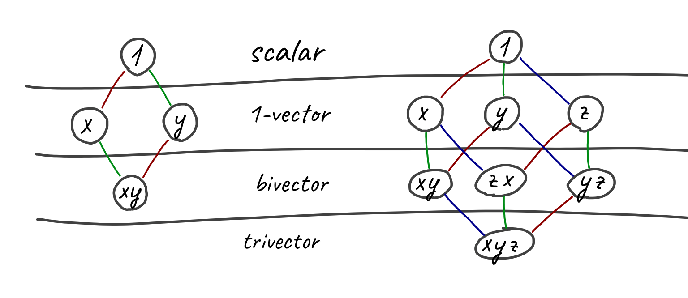
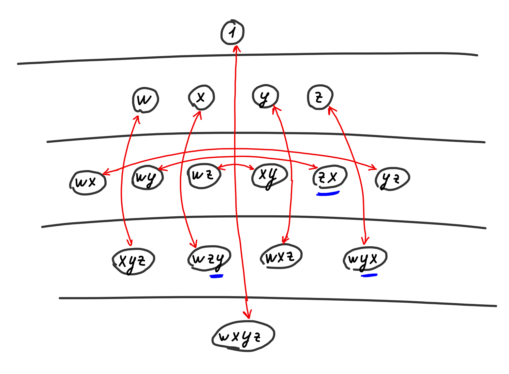
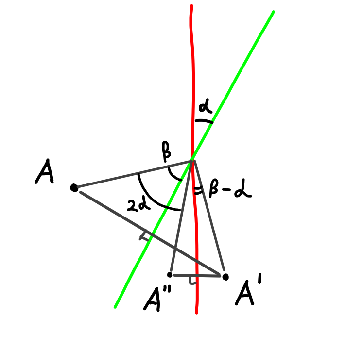
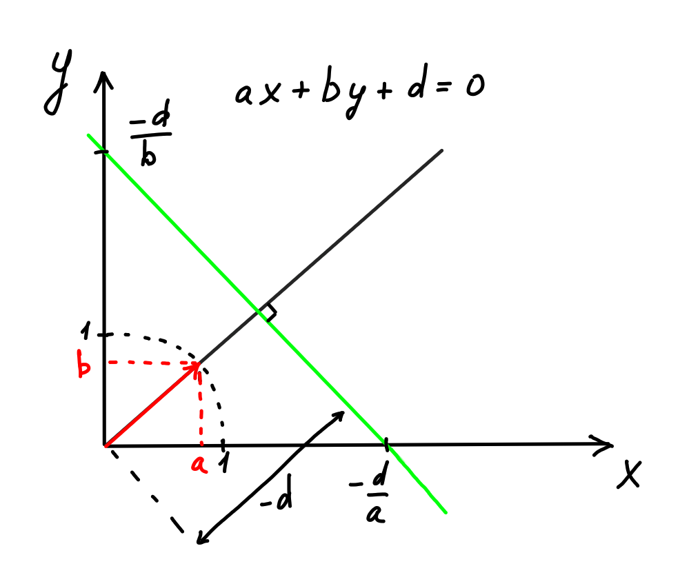
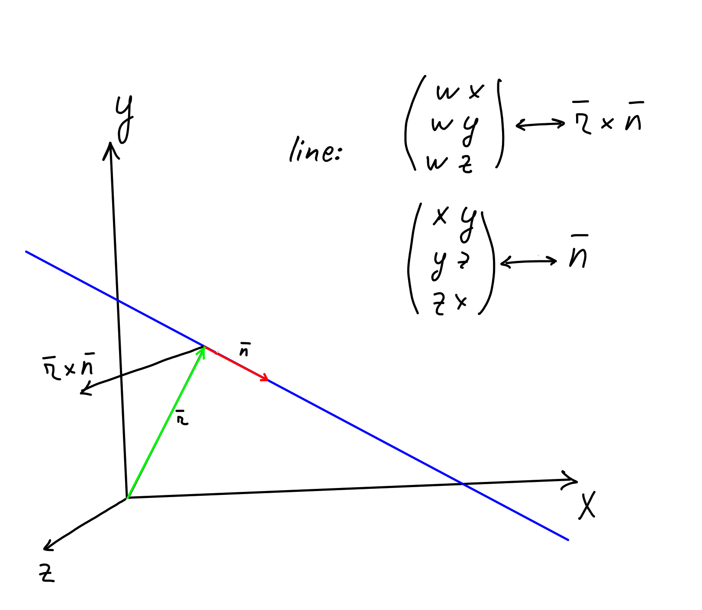
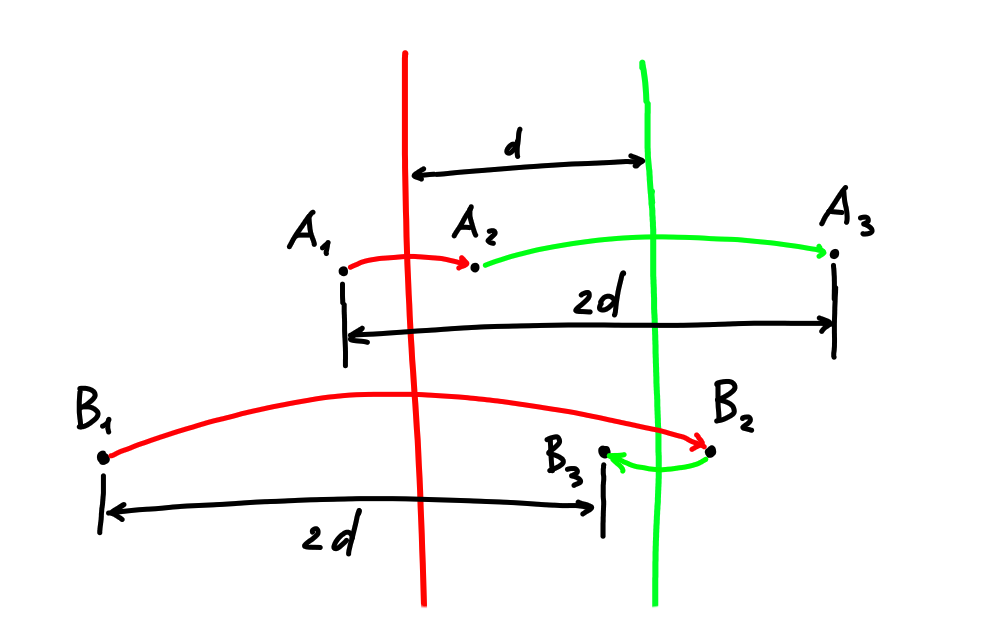

This text logically consists of three parts. First I'll briefly talk about geometric algebra from the math point of view. Then I'll show how you can take one specific algebra and use it to describe rotation and translation of bodies. And the cherry on top - I'll show how physical things like force and torque, momentum, moment of inertia and the equations of motion of bodies are expressed.

There's not much information on this topic on the Russian-speaking internet, and what exists in English is pretty scattered, with different terminology in different sources.

On top of that, in places geometric algebra is used only to describe rotation in 3d without translations, and the result doesn't get much further than quaternions. In my opinion, the juiciest part is the ability to combine rotation and translation of a body into a single entity, group force and torque together the same way, and get relatively simple universal equations that describe everything at once.

Besides, the geometric algebra approach seems more fundamental: the algebra isn't tied to the number of dimensions, and it'll describe any world equally well - two-dimensional, three-dimensional, four-dimensional and so on.

I didn't invent anything new myself, I just figured out what's already there. The main source of inspiration is the site [bivector.net](https://bivector.net) - only there did the authors go far enough to write a mini-book about the moment of inertia and the equations of motion of bodies. If not for them - I'm not sure I'd have been able to figure it all out on my own.

In November 2022 I wrote [an article about the physics of rotating 3d bodies](https://habr.com/ru/articles/697534/) - this article overlaps with it a lot and lets you look at what's going on from another angle.

# Geometric algebra from the math point of view

If all of this is familiar to you - feel free to scroll on and use this part as a list of the notation I use.

## The outer product

In linear algebra, a 3d vector with coordinates x,y,z can be written like this:

$$v = x e_x + y e_y + z e_z$$

The letter e with an index denotes the basis vectors. A vector is expressed as a linear sum of basis vectors.

In geometric algebra, it corresponds to a 1-vector, written exactly the same way. Properties like being able to add 1-vectors or multiply them by a scalar stay the same.

You can look at geometric algebra as an extension of linear algebra. It introduces the outer product with this property:

$$e_a \wedge e_b = -e_b \wedge e_a$$

It's antisymmetric, and in general not commutative (ab != ba). But here and below we keep and use associativity (ab)c = a(bc) and distributivity (a+b)c = ac + bc, a(b+c) = ab + ac.

It follows from the definition that the outer product of a basis vector with itself is zero.

Which means that a nonzero outer product can't contain the same little basis vector twice. And this also means that in any outer product, a given little basis vector is either absent or present exactly once.

For example, in the 2d case we get four combinations: the scalar, the basis vectors Ex, Ey and their product Ex ^ Ey. A product like Ex^Ey we'll call a bivector, because two basis vectors take part in it. We can't get anything else.

In general, a multivector is written like this:

$$v = 1a + e_x b + e_y c + e_x \wedge e_y d$$

For 3d there will be 2^3 = 8 variants, and the top-level one will be the trivector Ex^Ey^Ez.

After linear algebra, it intuitively feels weird that a scalar, a 1-vector, a bivector and so on get added together in one expression.
But look at complex numbers, which are a geometric algebra too. We can add a real number to an imaginary one and get a complex number: a + bi.



Overall, this whole construction with outer products is symmetric.

At the top is the scalar, then n 1-vectors, at the bottom likewise n (n-1)-vectors and one n-vector, which can be called the pseudoscalar.

Also, if you want, looking at the picture you can see a square for 2d and a cube for 3d.

And in principle, the outer product of all possible vectors can be called the imaginary unit, i.e., I. An important point - there's some arbitrariness in which order to put the vectors, xy = -yx, and for other definitions the imaginary unit may be multiplied by -1.

The number of basis vectors involved is called the grade in English. I.e., a scalar has grade=0, basis vectors have grade=1, a bivector - two. You can also come across 0-blade, 1-blade, 2-blade, where an n-blade means the outer product of n 1-vectors. You could say that the vectors we're used to from linear algebra are 1-blades or 1-vectors.

Generally speaking, there's a difference between an n-blade (the outer product of n 1-vectors) and an arbitrary n-vector (a linear combination of elements with grade=n): in 4d and higher not every n-vector can be obtained as a blade. But I won't go into that.

Generalizing to multivectors - the outer product of an m-vector and an n-vector will be an (n+m)-vector or zero.

The outer product can be thought of as a "more correct" cross product. The difference is that the outer product is defined for a space of any dimension and its result is a bivector, not a vector.

## The inner product

Besides the outer product, you can use the inner product. It, on the contrary, decreases the grade (you get the absolute difference of the arguments' grades). For two 1-vectors it works like the dot product. The outer product tries to add a new basis vector, the inner product "subtracts" one.

I.e.

$$(e_x \wedge e_y) \cdot e_y = e_x$$

For two 1-vectors the inner product is commutative. For elements of different grades it can be either symmetric or antisymmetric.

You can also come across stricter variants of the inner product - the left and right contraction. In the right contraction the grade of the element on the left must be no less than the grade of the element on the right, in the left contraction - the other way around. Otherwise the result is zero. Then the grade of the result is just the difference of the grades, without the absolute value. Otherwise they behave the same and are practically the same inner product.

Let's say the inner product of different basis vectors is zero:
$$e_x \cdot e_y = 0$$

And it's usually assumed that the dot product of a basis vector with itself is one:
$$e_y \cdot e_y = 1$$

But the claim about the square being one isn't always true. The algebra depends on how we define the squares of each basis vector.

For example, for complex numbers we'll have one single basis vector (let's call it i), whose square is minus one.
$$i^2 = -1$$

And if we want to describe Minkowski space, we'll have

$$e_t^2 = 1, e_x^2 = e_y^2 = e_z^2 = -1$$

Or, for example, in plane-based geometric algebra the squares are set like this:

$$e_x^2 = e_y^2 = e_z^2 = 1, e_w^2 = 0$$

Describing what's going on at a very high level - the basis vectors for x y z let you describe rotation, and w with a zero square is needed for linear translations. In Minkowski space the squares of the basis vectors have different signs, so in the "rotation" for time, instead of cosine and sine you get hyperbolic cosine and sine, which describe Lorentz transformations.

Any basis of a geometric algebra can be described by a triple of numbers (p, q, r), where p is the number of basis vectors with square one, q - with minus one, and r with square zero. You can read more [here](https://math.stackexchange.com/questions/4478664/what-is-the-difference-between-projective-geometric-clifford-algebra-grassman)

Below we'll focus on plane-based geometric algebra for 2d and for 3d, whose signatures are (2, 0, 1) and (3, 0, 1)

## The geometric product

For basis vectors the geometric product is defined as the sum of the outer and the inner one. Sometimes people write the product sign, sometimes they don't.

$$ab = a ⟑ b = a \cdot b + a \wedge b$$

As you can easily notice, if you overlay the symbol ∧ on the dot ⋅, you get ⟑

Here the inner product is symmetric and the outer one is antisymmetric. And in principle, you can express the geometric product through the inner and outer ones, or the other way around - postulate the geometric product and derive the inner and outer ones from it.

$$a \cdot b = \dfrac{1}{2} (ab + ba)$$
$$a \wedge b = \dfrac{1}{2} (ab - ba)$$

**ALARM!** a and b are some 1-vectors. For arbitrary multivectors this is not true!

For the two-dimensional case with vectors e1 and e2 the multiplication table looks like this:

|   |  1| e_1| e_2|   I|
|---|---|----|----|----|
|1  |  1| e_1| e_2|   I|
|e_1|e_1|   1|   I| e_2|
|e_2|e_2|  -I|   1|-e_1|
|I  |  I|-e_2| e_1|  -1|

It's also called a Cayley table.

[Cayley table for 3d PGA](https://bivector.net/tools.html?p=3&q=0&r=1)

For distinct basis vectors the geometric product equals the outer product, and also people sometimes group the indices for brevity:

$$e_x \wedge e_y \wedge e_z = e_x ⟑ e_y ⟑ e_z = e_x e_y e_z = e_{xyz}$$


As an example, I'll show how to compute the product of two vectors:

$$(a e_1 + b e_2) (c e_1 + d e_2)$$
$$= (a e_1) (c e_1) + (a e_1) (d e_2) + (b e_2)(c e_1) + (b e_2)(d e_2)  $$
$$= ac e_1 e_1 + a d e_1 e_2 + bc e_2 e_1 + bd e_2 e_2$$
$$= ac 1 + a d e_1 e_2 + bc ( - e_1 e_2) + bd 1$$
$$= (ac + bd) + (a d - bc) (e_1 e_2)$$
$$= (ac + bd) + (a d - bc) e_{12}$$

The result is a scalar and a bivector. What meaning could they have?

If you look closely, a c + b d is the dot product of the vectors (a, b) and (c, d) from linear algebra (the cosine between the vectors, multiplied by their lengths).
The (ad - bc) component is, on the contrary, the sine.

Below I'll show how such a construction can describe a rotation for any number of dimensions. It'll be especially convenient if we take the original vectors with unit length.

And at a zero rotation angle the cosine equals one, the sine equals zero, and the whole expression collapses into a scalar. And multiplying any vector by one changes nothing.

Another angle - if we want to rotate the vector (x, y) by the angle `a`, the result will be:

$$(x \cdot cos(a) - y  \cdot sin(a), y  \cdot cos(a) + x  \cdot sin(a)) = (x, y)  \cdot cos(a) + (-y, x)  \cdot sin(a)$$

I.e., the resulting vector contains part of the original vector (multiplied by the cosine) and some perpendicular vector, multiplied by the sine.

Now let's go back to geometric algebra and look at the geometric product of two vectors. It's all the same - the scalar part describes how much of the original vector is kept, and the bivector part describes the perpendicular component. Together they describe a rotation.

Another interesting point - the product of two unit-length 1-vectors gives a multivector whose length is also one:
$$v = cos(a) + sin(a) e_{12}$$
$$|v|^2 = cos(a)^2 + sin(a)^2 = 1$$

**ALARM**: in projective geometric algebra one basis vector has square zero, not one. If it takes part in the computation, the norm won't be preserved.

## Cross product

$$A × B = \dfrac{AB - BA}{2}$$

The difference from the definition of the outer product is that A and B are arbitrary multivectors, not two vectors. This thing is also called the commutator.

## Duality



As you can notice, we can flip the picture over and turn the scalar into the pseudoscalar, a vector into an (n-1)-vector (or a pseudovector) and so on.

Some sources define dual elements as multiplication by I, but because we have a vector with square zero, that definition won't do.
In our case the dual can be defined as $$a a* = I$$

There's some arbitrariness here too, because the vectors a and a* in general don't commute, and you have to distinguish the left complement and the right complement. English sources may call them the left complement and the right complement.

Besides, if you look at how bivector.net defines the basis and duality, you can see a beautiful thing:

```Python
self._base = ["1", "e0", "e1", "e2", "e3", "e01", "e02", "e03", "e12", "e31", "e23", "e021", "e013", "e032", "e123", "e0123"]

def Dual(a):
        """PGA3D.Dual

        Poincare duality operator.
        """
        res = a.mvec.copy()
        res[0]=a[15]
        res[1]=a[14]
        res[2]=a[13]
        res[3]=a[12]
        res[4]=a[11]
        res[5]=a[10]
        res[6]=a[9]
        res[7]=a[8]
        res[8]=a[7]
        res[9]=a[6]
        res[10]=a[5]
        res[11]=a[4]
        res[12]=a[3]
        res[13]=a[2]
        res[14]=a[1]
        res[15]=a[0]
        return PGA3D.fromarray(res)
```

In the last vectors they swap a pair of basis elements to flip the sign. Like, e021 = -e012, and for the first element the dual is the last one, for the second - the second to last, and so on.
What's interesting, in such a sneaky basis the dual transformation preserves all the signs and just permutes the numbers, and the transformation is its own inverse.

In the picture I marked the sign flip in blue.

In my code there's no hack with flipping basis vectors, and for dual elements some components get multiplied by -1.

Our operations like multiplication can be carried out in the dual space. The result will be a bit different, for example instead of raising the grade it'll get lowered.

These operations are called the geometric anti-product, the inner anti-product and so on. Funny notation was invented for them, "flipped" for the anti-products: Geometric product: ⟑, anti: ⟇. Outer product ∧, anti: ∨. Inner: ⋅, anti: ◦

By the way, these are all unicode symbols, use them and enjoy, you can even name a method in code like that, and then not use it because the symbol is inconvenient to type.

All of this works symmetrically - for example, the line that's the intersection of two planes is dual to the line drawn through two points that are dual to the planes.

At the base of plane-based geometric algebra is the plane, and lines and points are defined as their intersections, but there's an equivalent dual representation where everything is built from vectors (a line through two points, a plane through three). The difference is that all operations are defined slightly differently - replaced with their duals. But for some reason it seems to me that the approach with the "plane" at the base is more beautiful.

## Reverse

Let's introduce the Reverse operation, which is drawn as a pretty little plus sign or a little dagger. The operation reverses the order of the little basis vectors:

$$(e_x e_y e_z)^† = e_z e_y e_x$$

So the idea is that if the length of some multivector is one, we can multiply it by its reverse and get one again. And you can multiply from either side - left or right.

By the way, that's how we'll define the length - as the square root of vv†. This matches the intuitive definition of length and I already used it above, but for more rigor I'm stating the explicit definition.

What's it for? For division, for example.

$$\dfrac{a}{b} = \dfrac{a b^†}{b b^†} = a b^† \dfrac{1}{scalar}$$

You've surely seen this formula for complex numbers.
But in geometric algebra you have to be careful, `a b†` isn't always equal to `b† a`

Besides, below in the text we'll have multivectors describing transformations like rotations, translations and so on. Reverse will give the inverse transformations, inverting quaternions and the like.

**ALARM** It's not a given that the product of a multivector with its reverse gives a scalar. You have to distinguish a multivector obtained as a product of 1-vectors from a multivector where we wrote a random set of components. With the latter everything will be bad. For such cases you can use the scalar component as the "squared length".

For a vector the reverse operation does nothing, there's nothing much to reverse: reverse(e_x) = e_x. If this vector has unit length, it'll be its own inverse, the square of the vector collapses into one.

Below we'll be talking about algebras where the basis vectors square to zero or one, and for them the reverse of any 1-vector is itself.

Sometimes reverse is denoted with a tilde (a wave) on top:

$$A^† = \widetilde{A}$$

### Projection, Rejection

If there's a vector `a` and a bivector `B`, then `a` can be decomposed into two components - the projection onto B and the perpendicular part.

Generally speaking, `B` here can be of any dimension, the main thing is that the dimensions of all components match.

$$aB = a_{||B} \cdot B + a_{⊥B} \wedge B$$

With them it's pretty logical:

$$a_{⊥B} \cdot B = 0$$

$$a_{||B} \wedge B = 0 $$

And they can be expressed like this:

$$a_{⊥B} B = a \wedge B$$

$$a_{⊥B} = (a \wedge B) B^{-1}$$

Likewise for the second component:

$$a_{||B} B = a_{||B} \cdot B$$

$$a_{||B} = (a \cdot B) B^{-1}$$

## Reflection in a plane

Let there be a plane U with the normal vector u

$$ua = u(a_{||_{U}} + a_{⊥_U}) = u \cdot a_{||_{U}} + u \wedge a_{||_{U}} + u \cdot a_{⊥_U} + u \wedge a_{⊥_U}$$

Here you shouldn't mix up U and u, the part perpendicular to U is parallel to u.
The inner product between vectors is commutative, the outer one is anticommutative

$$ua = u \wedge a_{||_{U}} + u \cdot a_{⊥_U} = a_{⊥_U} \cdot u - a_{||_{U}} \wedge u = (a_{⊥_U} - a_{||_{U}}) u$$

$$-ua = (a_{||_{U}} - a_{⊥_{U}}) u$$

$$-uau^{-1} = a_{||_U} - a_{⊥_U}$$

Usually the vector u is taken with unit length, then for it $$u^{-1} = u$$

And the reflection simplifies to $$-uau$$

Or it can be written as $$-uau^†$$

I'll add that the minus depends on the grade of the object being reflected: for a k-vector the sign is (-1)^k, so the minus may or may not be there.

Specifically in projective geometric algebra, multiplying by a constant like minus one changes nothing.

## Rotations

A rotation can be represented as a combination of two reflections



I.e., if we take unit-length vectors a and b, their geometric product will be a quaternion.

As formulas it looks like this $$v' = q v q^† = a b v b a = -a(-bvb)a$$

Sometimes the rotation is defined "the other way around" and the reverse is on the left, everything stays roughly the same, but the formulas are a tiny bit different.

From another point of view:

$$ab = a \cdot b + a \wedge b$$

The inner product will equal the cosine of the angle between the vectors, the outer product component-wise resembles the cross product, and its length is the sine of the angle between the vectors.

The difference from the cross product is that the cross product gives a result in the space of vectors, and the outer product - a bivector.

## Sandwich product

As you can easily notice, both in the reflection and in the rotation there's a suspiciously similar formula (up to multiplication by -1, but that's not important)

$$q a q^†$$

We squeeze our multivector, like a sandwich filling, between q and q†.

If q is a product of unit-length vectors, then $$q q^† = 1$$

The inverse rotation is easy to derive:

$$q^† b q = q^† (q a q^†) q = (q^† q) a (q^† q) = a$$

And this will be exactly our inversion operation.

Let's multiply two rotated multivectors:

$$ (q a q^†) (q b q^†) = q a (q^† q) b q^† = q (a b) q^† $$

It turns out we can rotate the product of two multivectors, or we can rotate each multivector and then multiply them. The result will be exactly the same! This is a very important property, and it'll work for all transformations - reflections, rotations, translations and so on.

Reflection in a point is also easy to do - it'll be a combination of three reflections in perpendicular planes that intersect at that point.

# Plane-based geometric algebra

## The plane

Let's add one more basis vector w, whose squared length is zero. This is the key step that lets us bring translation into our three-dimensional world. Roughly like in 3d graphics they use four-dimensional vectors with w=1 so that the rotation matrix can describe translations.

$$v = a e_x + b e_y + c e_z + d e_w$$

Let's suppose this vector describes the plane given by the equation $$ax + by + cz + d = 0$$



Properties of this approach:

1. The plane can be any plane, it doesn't have to pass through the origin.
2. We've got a projective algebra: we can multiply the vector by any nonzero number (for example, -1) and it'll describe the very same plane
3. the values a,b,c describe the normal to the plane
4. In principle, this will work for any number of dimensions, but 2d and 3d are enough for us.

Let's compute the length of the 1-vector describing the plane:

$$|plane|^2 = |plane ⟑ plane^†| = |a e_x + b e_y + c e_z + d e_w|^2 = a^2 + b^2 + c^2$$

Note - d doesn't take part in the length. The length is the length of the normal vector. Since we can multiply the plane equation by any scalar constant, we can normalize the plane equation so that the normal has unit length.


Since we're now talking about a very specific case of the algebra, we don't have to derive abstract stuff, we can just check that it works in 3d. Concrete examples follow:

## The line

It so happened that while learning this I wrote my own little library for PGA, and I didn't write all the formulas by hand, I just fed them into it and did symbolic computation. The code below is from there.

The equation of a line through the point a with direction n

```Scala
a v (a + n) == MultiVector(
    wx -> (a.y * n.z - a.z * n.y)
    wy -> (a.z * n.x - a.x * n.z)
    wz -> (a.x * n.y - a.y * n.x)
    xy -> n.z
    xz -> -n.y
    yz -> n.x
)
```

Essentially, xy, xz, yz hold the direction, and wx, wy, wz - (a x n) - sneakily encode the offset from the origin. If we assume the length of n = 1 and a is the point of the line closest to the origin, then a x n will be perpendicular to both and its length will be the distance to the origin.

A line as the intersection of two planes:

```Scala
a ^ c == MultiVector(
    wx -> (a.d * c.nx - a.nx * c.d)
    wy -> (a.d * c.ny - a.ny * c.d)
    wz -> (a.d * c.nz - a.nz * c.d)
    xy -> (a.nx * c.ny - a.ny * c.nx)
    xz -> (a.nx * c.nz - a.nz * c.nx)
    yz -> (a.ny * c.nz - a.nz * c.ny)
)
```

A line as the inner product of a point and a direction:

```Scala
pos = MultiVector(
    wxy -> -pos.z
    wxz -> pos.y
    wyz -> -pos.x
    xyz -> 1.0
)
shift = MultiVector(
    x -> s.x
    y -> s.y
    z -> s.z
)
pos dot shift = MultiVector(
    wx -> (pos.y * s.z - pos.z * s.y)
    wy -> (pos.z * s.x - pos.x * s.z)
    wz -> (pos.x * s.y - pos.y * s.x)
    xy -> s.z
    xz -> -s.y
    yz -> s.x
)
```

By the way, what's interesting - in 2d a bivector has three components - wx, wy, xy - two of them correspond to linear translations, one - to rotation.
In 3d there will be three translations and three rotations, and in 4d - four translations and six rotations! In geometric algebra this point is expressed as beautifully as it gets, and the formulas for forces and rotation of bodies will handle any dimension.

Lines can be normalized just the same, only now the length of a line is the length of the vector that sets the direction.



For 2d the notions of "line" and "plane" coincide, for the n-dimensional case there's a difference.

Very often for the 3d case people go off into particulars. For example, they introduce the cross product, call its result a vector, and then talk about "right-handed" and "left-handed" triples of vectors. Whereas in fact the result is a bivector, and this coincidence of dimensions happens only in 3d. And the question "right-handed or left-handed triple" makes no sense for geometric algebra, because the spaces of vectors and bivectors are different.

You can try to find the line that's the intersection of two parallel planes, or the line from point A to the very same point A. What comes out as the result, I suggest you think about on your own.

## The point

The intersection of three planes gives us a point.
A point with coordinates x, y, z is described by a trivector:

$$v = 1 e_{xyz} - x e_{yzw} + y e_{xzw} - z e_{xyw}$$

And this trivector is dual to the vector with w=1 and x, y, z in their usual places with positive signs.

In the case of a point, the length is just the absolute value of the e_xyz component, the other components don't affect it and can be anything. A normalized point has its e_xyz component equal to one.

If you subtract one normalized point from another, the e_xyz component will be zero. Such a point is sometimes called an "ideal point" - it describes the offset between a pair of points, but isn't a point itself. Rather, it's a pure direction.

Also, what's interesting, a motor rotates an "ideal point" but doesn't translate it: it doesn't react to a translator at all.

## Interpolation

It's not obvious, but generally speaking you can, for example, add two lines together. If you add them with weights t and (1-t) and smoothly change t from 0 to 1, you get a smooth transition from one line to the other. The same can be done with planes and with points.

Another non-obvious point - planes and lines have a direction, and the result of interpolation depends on it.

## Rotation + translation = Motor

As I wrote above, the sandwich product of a plane and a multivector is the mirror reflection of the multivector in the plane. Since planes now go through space any way they like, not only through the origin, a combination of two reflections can describe a translation.



That's it. Just like that, we've dragged translations into geometric algebra!

A linear translation is two successive reflections in parallel planes.

The motor for a translation (it's called a translator) will look like this:

```Scala
MultiVector(
    1 -> 1.0
    wx -> -0.5 * d.x
    wy -> -0.5 * d.y
    wz -> -0.5 * d.z
)
```

The minus comes from the adopted conventions, you could do without it. Below, in the section "Where the minus in the exponent comes from", there's an explanation of what else it's tied to.

And for a rotation - the familiar quaternion:

```Scala
q = MultiVector(
    1 -> q.cos
    xy -> q.xy
    xz -> q.xz
    yz -> q.yz
)
```

In the general case a motor will have lots of different components mixed in.

For example, let's combine a rotation and a translation:

```
q = MultiVector(
    1 -> q.cos
    xy -> q.xy
    xz -> q.xz
    yz -> q.yz
)
tr = MultiVector(
    1 -> 1.0
    wx -> t.x
    wy -> t.y
    wz -> t.z
)
tr q = MultiVector(
    1 -> q.cos
    wx -> (q.cos * t.x - q.xy * t.y - q.xz * t.z)
    wy -> (q.cos * t.y + q.xy * t.x - q.yz * t.z)
    wz -> (q.cos * t.z + q.xz * t.x + q.yz * t.y)
    xy -> q.xy
    xz -> q.xz
    yz -> q.yz
    I -> (q.xy * t.z + q.yz * t.x - q.xz * t.y)
)
q tr = MultiVector(
    1 -> q.cos
    wx -> (q.cos * t.x + q.xy * t.y + q.xz * t.z)
    wy -> (q.cos * t.y + q.yz * t.z - q.xy * t.x)
    wz -> (q.cos * t.z - q.xz * t.x - q.yz * t.y)
    xy -> q.xy
    xz -> q.xz
    yz -> q.yz
    I -> (q.xy * t.z + q.yz * t.x - q.xz * t.y)
)
```

The translation doesn't affect the quaternion components, but adds new ones in wx, wy, wz and I.

Another funny thing with duality - a translator can be obtained as the geometric product of two parallel planes (as a combination of two mirror reflections in planes), but also as the geometric product of two points - in that case as a combination of two reflections in points!

A motor describes the displacement of a body, but we might want to interpolate or extrapolate it. The exponent and the logarithm come to the rescue (in principle, just like for quaternions).

Angular velocity and acceleration will be bivectors.

$$M = exp(\dfrac{-Bt}{2})$$

We can take the derivative

$$M' = \dfrac{-B}{2} exp(\dfrac{-Bt}{2}) = \dfrac{-BM}{2}$$

By the way, it doesn't matter right now, but in the general case there's a difference on which side you multiply B by M. If M isn't the exponent of B, they won't commute! When multiplying on the left, B is sort of in the world frame, the motion gets added on top of the existing motor, when multiplying on the right - in the body frame - the motion gets added "inside", before the motor is applied. If we denote the velocity in the world frame as B_w, and in the body frame as B_b, then:

$$M' = -\dfrac{1}{2} B_w M = -\dfrac{1}{2} M B_b, \quad B_w = M B_b M^†$$

How can we compute the exponent of a bivector? For example, expand it into a series.

$$exp(B) = 1 + B + \dfrac{B^2}{2!} + \dfrac{B^3}{3!} + ...$$

Sooner or later the series converges and the exponent can perfectly well be found numerically. Doesn't mean you should do it this way, but for testing the "more optimal" methods of computing the exponent this approach works perfectly.

It so happens that the bivector describing a linear translation squares to zero, so all powers above one can be dropped and we get a linear translation.

$$exp(B) = 1 + B$$

For a bivector describing a rotation, the square will be a negative scalar (let's call it -len^2):

$$exp(B) = 1 + B + \dfrac{B^2}{2!} + \dfrac{B^2B}{3!} + \dfrac{B^4}{4!} + ... $$
$$= 1 + B - \dfrac{len^2}{2!} - \dfrac{len^2B}{3!} + \dfrac{len^4}{4!} + ...$$
$$= (1 - \dfrac{len^2}{2!} + ...) + B(1 - \dfrac{len^2}{3!} + ...)$$
$$= cos(len) + B \dfrac{sin(len)}{len} $$

As the length of the vector tends to zero, sin(len) / len tends to one and we get the previous formula. Everything checks out!


But a velocity bivector can also describe a combination of rotation and translation along the rotation axis. Then the square of the bivector becomes the sum of a scalar and a pseudoscalar, and the formula gets noticeably more complicated. I burned through about three sheets of paper before I worked it out, and then the result matched the sum of the series and I understood I hadn't made a mistake anywhere. I'll just give the [code](https://github.com/Kright/krightGameTools/blob/58362592dc48525c6350e631b84b2473706f5936/pga3d/shared/src/main/scala/me/kright/gametools/pga3d/Pga3dBivector.scala#L230) right away

```Scala
  def exp: Pga3dMotor =
    val len = bulkNorm
    val cos = Math.cos(len)

    // sin(x)/x = 1 - x^2/6 + x^4/120 - ...
    val sinDivLen = if (len > 1e-5) {
      Math.sin(len) / len
    } else {
      1.0 - (len * len) / 6.0
    }

    // (sin(x)/x - cos(x)) / x^2 = 1/3 - x^2/30 + x^4/840 - ...
    val sinMinusCosDivLen2 = if (len > 1e-5) {
      (sinDivLen - cos) / (len * len)
    } else {
      1.0 / 3.0 - (len * len) / 30.0
    }

    Pga3dMotor(
      s = cos,
      wx = (sinDivLen * wx + sinMinusCosDivLen2 * yz * (wy * xz - wx * yz - wz * xy)),
      wy = (sinDivLen * wy + sinMinusCosDivLen2 * xz * (wx * yz + wz * xy - wy * xz)),
      wz = (sinDivLen * wz + sinMinusCosDivLen2 * xy * (wy * xz - wx * yz - wz * xy)),
      xy = sinDivLen * xy,
      xz = sinDivLen * xz,
      yz = sinDivLen * yz,
      i = sinDivLen * (wx * yz + wz * xy - wy * xz),
    )
```

Here I had to recall computing limits from university and carefully work around the values near zero.

With the logarithm of a motor it's a similar story (though here I didn't derive anything myself, I found a ready-made formula somewhere and fixed the behavior around zero):

```Scala
  def log: Pga3dBivector =
    val scalar = s
    if (s < 0.0) {
      return (-this).log
    }

    val lenXYZ2 = xy * xy + xz * xz + yz * yz
    val lenXYZ = Math.sqrt(lenXYZ2)
    val angle = Math.atan2(lenXYZ, scalar)

    val a = 1.0 / lenXYZ2 // 1 / sin^2

    val b = if (Math.abs(angle) > 1e-5) { // angle / sin(angle)
      angle / lenXYZ
    } else {
      1.0 + angle * angle / 6.0
    }

    val c = if (Math.abs(angle) > 1e-5) {
      a * i * (1.0 - scalar * b)
    } else {
      (1.0 / 3.0 + angle * angle * (2.0 / 15.0)) * i
    }

    Pga3dBivector(
      wx = (b * wx + c * yz),
      wy = (b * wy - c * xz),
      wz = (b * wz + c * xy),
      xy = b * xy,
      xz = b * xz,
      yz = b * yz,
    )
```

You can check that it's correct using the exponent function - they're mutually inverse operations.

### Projecting a point onto the screen

Suppose we want to bring the point `p (x, y, z, w=1)` into screen space (like in 3d graphics).
How can this be written?

Let's say the center of the screen is the origin (`center, dual(w=1)`), and the screen itself is the plane z = 1 (`planeZ (z=1, w=-1)`). If that's not the case, you can use a motor to move the point into the camera's frame.

Let's draw a line from the origin to the point: `center v p`

Let's find the intersection of the line with the screen plane: `(center v p) ^ planeZ`.

Note that the outer product and the anti-product are each associative on their own, but their mix is not: `(a v b) ^ c` and `a v (b ^ c)` are different things, so the order of application matters.

After applying this we get the point p' = (x, y, z, w=z) - just like in 3d graphics, then on normalization everything gets divided by w and we get p'' = (x/z, y/z, z=1, w=1).

But there are two things I don't like about this approach:
1. translation and rotation can be written as a motor, and motors combine with each other, whereas the expression above doesn't really combine with anything.
2. we lose the depth information (z), while in 3d graphics the projection matrix also transforms z and it can be used further.

Perhaps at this point it's most convenient to go back to linear algebra and say that `(center v _) ^ planeZ` is a linear operator. Then represent it as a matrix, and that matrix can be combined with the matrices representing the motor.

# Physics

On first reading I had the feeling that I was going through mechanics all over again, back in sixth grade. New formulas, new notions... Though the essence is exactly the same.

## Force + torque = forque

In ordinary physics you can't just add linear forces, you have to account for their points of application. For example, if a body is pulled to the right at the top and to the left at the bottom, then, even though it won't fly off anywhere, it'll start rotating.

In geometric algebra a force is a bivector, and both the force and the torque are encoded in it. These bivectors can be added to each other and everything will be correct! Such a combination of force and torque (force + torque) is called a forque.

How to construct a force? It's actually simple - as the equation of a line. Above there's already a formula where a line is obtained as the inner product of a point and a shift. So, the point is the point of application, and the shift is the force.

Newton's law also has to be rewritten a bit.
$$F = ma$$
$$F = pos \cdot ma$$

```
pos = MultiVector(
    wxy -> -pos.z
    wxz -> pos.y
    wyz -> -pos.x
    xyz -> 1.0
)
a = MultiVector(
    x -> a.x
    y -> a.y
    z -> a.z
)
F = (a dot pos * mass) = MultiVector(
    wx -> (mass * pos.y * a.z - mass * pos.z * a.y)
    wy -> (mass * pos.z * a.x - mass * pos.x * a.z)
    wz -> (mass * pos.x * a.y - mass * pos.y * a.x)
    xy -> mass * a.z
    xz -> -mass * a.y
    yz -> mass * a.x
)
F.dual = MultiVector(
    wx -> mass * a.x
    wy -> mass * a.y
    wz -> mass * a.z
    xy -> (mass * pos.x * a.y - mass * pos.y * a.x)
    xz -> (mass * pos.x * a.z - mass * pos.z * a.x)
    yz -> (mass * pos.y * a.z - mass * pos.z * a.y)
)
```

The xy, xz, yz components encode the linear force, wx, wy, wz - the torque about the origin.

In general, the book "May the Forque Be with You", [hosted on bivector.net](https://bivector.net/PGADYN.html), has beautiful diagrams on page 34 of what's dual to what, but honestly I haven't gotten a good enough feel for them. Like, torque and force are dual to angular velocity, and the inertia operator converts one into the other.

## Moment of inertia and momentum

In classical physics the moment of inertia is the integral of mr^2, where r is the distance to the axis through the center of mass. In geometric algebra we also need some symmetric formula, but the outer product is antisymmetric and the inertia looks more complicated.

$$P = I[B] = \sum m_i x_i ∨ (x_i × B)$$

Having the velocity in some frame, we can find the momentum. The velocity must be in that same frame, and the result will be in it too.

An important point - in 3d both velocity and force are bivectors and the catch is easy to miss. But, for example, in 2d, velocity stays a bivector (as the logarithm of a motor), while force will be a 1-vector. And the inertia operator is exactly a linear map from the space into the dual one.

Most likely, mathematically one could introduce the notion of a symmetric tensor into geometric algebra, and inertia would be exactly that.

## Equations of motion

In the book all the computations are done in the body frame. The nuance is that their body frame is fixed at the initial position of the body: at the initial moment it coincides with it, but afterwards it doesn't follow the body, and the body calmly flies off out of it. The book is written in more detail than this article - details and nuances are better looked up there. I repeated them as code and checked that they work :)

Notation with the index w - in the world frame, with the index b - in the body frame.

They take Newton's law and differentiate it (right in terms of geometric algebra)

$$\dfrac{d}{dt} P = F$$

$$M (I_b[B_b] × B_b + I_b[B'_b]) M^† = F_w $$

$$I_b[B_b] × B_b + I_b[B'_b] = F_b $$

$$I_b[B'_b] = F_b - I_b[B_b] × B_b$$

$$I_b[B'_b] = F_b + B_b × I_b[B_b]$$

$$ B'_b = I_b^{-1}[F_b + B_b × I_b[B_b]] $$

The global idea is that the inertia operator can be brought to diagonal form if you pick the right body frame. In my code the class for inertia looks like [this](https://github.com/Kright/krightGameTools/blob/58362592dc48525c6350e631b84b2473706f5936/pga3dphysics/shared/src/main/scala/me/kright/gametools/pga3d/physics/Pga3dInertiaLocal.scala)


In the end the equations of motion look like this:

$$B_b' = I_b^{-1}[B_b × I_b[B_b] + F_b]$$
$$M' = -\dfrac{1}{2}MB_b$$

And they encode both linear motion and rotation! All the computations are done in the body frame, and conversions into it and back can be done with the motor M.

The formula for the acceleration looks scary - the momentum is computed from the velocity, then the precession is computed and the external force is added, and then everything is converted back into acceleration using the same inertia.
But if you collapse it into a compact form and look at what happens to the components of the vectors, the number of arithmetic operations isn't that big:

```Scala
final case class Pga3dInertiaLocal(mass: Double,
                                   mryz: Double,
                                   mrxz: Double,
                                   mrxy: Double) extends Pga3dInertia:
  val invMass: Double = 1.0 / mass
  val invMryz: Double = 1.0 / mryz
  val invMrxz: Double = 1.0 / mrxz
  val invMrxy: Double = 1.0 / mrxy
  ...
  override def getAcceleration(localB: Pga3dBivector, localForque: Pga3dBivector): Pga3dBivector =
    Pga3dBivector(
      wx = localForque.yz * invMass + localB.wy * localB.xy + localB.wz * localB.xz,
      wy = -localForque.xz * invMass + localB.wz * localB.yz - localB.wx * localB.xy,
      wz = localForque.xy * invMass - localB.wx * localB.xz - localB.wy * localB.yz,
      xy = (localForque.wz + localB.xz * localB.yz * (mrxz - mryz)) * invMrxy,
      xz = (-localForque.wy + localB.xy * localB.yz * (mryz - mrxy)) * invMrxz,
      yz = (localForque.wx + localB.xy * localB.xz * (mrxy - mrxz)) * invMryz,
    )
```

While numerically solving the diff eq, the motor M can drift away from its normalized form, and it'd be good to bring it back. (MM†) should equal one. Probably for a projective algebra multiplying by a constant isn't fatal, but it's easier for me to normalize the motor than to deal with normalizing everything I multiply by it afterwards. Who knows, the value might drift off somewhere to infinity or to zero and everything falls apart.

## Where the minus in the exponent comes from

The minus in the formula $$M = exp(\dfrac{-Bt}{2})$$ looks suspicious, but it's not accidental. It ties together three conventions, and exactly one of them has to carry the sign:

1. The sandwich is written as $$M X M^†$$, not $$M^† X M$$.
2. The exponent of a bivector moves things in the direction of that bivector's orientation. For a rotation this can be seen in a 2d example: take $$R = exp(-\dfrac{θ}{2} e_{12})$$. The vector e_1 anticommutes with e_12, so $$R e_1 R^† = e_1 R^† R^† = e_1 exp(θ e_{12}) = cos(θ) e_1 + sin(θ) e_2$$ - a rotation from x toward y by the angle θ, that is, in the direction of the orientation of the bivector e_12. The half angle doubled, and the sign flipped once. With $$exp(+\dfrac{θ}{2} e_{12})$$ the same sandwich would rotate from y toward x. For the translator it's the same story: that's exactly why above it looks like 1 - 0.5 d.
3. The velocity of a point is expressed through the commutator without a minus. If $$x = M x_0 M^†$$ and $$M = exp(\dfrac{-Bt}{2})$$, then $$x' = -\dfrac{1}{2} B x + \dfrac{1}{2} x B = x × B$$. From this come the formula for the momentum $$P = \sum m_i x_i ∨ (x_i × B)$$ and the forque as the derivative of the momentum - also without extra signs.

If you'd rather write $$exp(\dfrac{Bt}{2})$$, then the velocity of a point becomes $$x' = B × x = -x × B$$, and the minus moves either into the formulas for momentum and inertia, or into the definition of the forque, or into the side of the sandwich (that's exactly the "reverse on the left" variant mentioned above). The forque book and the cheat sheet on bivector.net keep the minus in the exponent, and so do I. The main thing is not to mix conventions: the equations of motion above, the translator with -0.5 and the library code are consistent with each other precisely in this variant.

## Kinetic energy

The momentum is computed simply (once again, remember that everything is in the body frame)

$$P_b = I_b[B_b]$$

In classical physics the energy can be expressed through the momentum: $$P = mv, E = \dfrac{mv^2}{2} = \dfrac{Pv}{2}$$

In geometric algebra it's almost the same:

$$E = \dfrac{B_b ∨ I_b[B_b]}{2}$$


# Want to understand it - build it yourself

I wrote [my own library](https://github.com/Kright/krightGameTools) for geometric algebra, and I think I understood what the catch is and why similar libraries look scary.

For PGA in 3d a multivector has 16 components, storing them all and using them in multiplication is inefficient. On top of that, an unprepared person looking at the components of a bivector would hardly be able to say what they're looking at. And as a bonus, in some components tiny errors like 1e-15 can pop up instead of zeros.

You can go another way and come up with some useful classes (plane, point, motor, bivector, quaternion, pseudoscalar ... ). For example, four numbers are enough to store a plane, six for a line, and eight for a motor. But then you'll have to write (or generate) optimized versions of the multiplication for all possible combinations of classes.

In the end I tried both approaches:
I wrote an inefficient but relatively compact library for multivectors of any dimension (the ga module).

Using the first library and hand-written symbolic computation, I wrote code generation for the 3d case (the pgaNdCodeGen and pga3d modules, with the physics of bodies moved out into pga3dphysics).

For the sake of code simplicity (there's a lot of it generated as it is) I made the objects immutable, it seems escape analysis in the JVM copes with them fine.

What's cool is that now if I write code like `point.dot(plane)`, the IDE immediately shows that the result will be a bivector. And on top of that you can jump to the [specific method](https://github.com/Kright/krightGameTools/blob/58362592dc48525c6350e631b84b2473706f5936/pga3d/shared/src/main/scala/me/kright/gametools/pga3d/Pga3dPoint.scala#L478) for multiplying a point by a plane and see how it's computed.

In my code there are tests that [simulate rotating bodies](https://github.com/Kright/krightGameTools/blob/58362592dc48525c6350e631b84b2473706f5936/pga3dphysics/jvm/src/test/scala/me/kright/gametools/pga3d/physics/Pga3dInertiaLocalTest.scala) and compute the error. Everything seems ok. If you use the fourth-order Runge-Kutta method for the numerical integration, the error is on the order of one billionth.

In my article about the physics of rotating bodies there were similar experiments, and the order of the error comes out the same.

One integration step (consisting of four micro-steps with the Runge-Kutta method) takes about 0.4 µs on my hardware - I don't promise everything was measured correctly, it's just a very rough estimate of the speed.

I measured the speed with JMH and got that the geometric product of two motors takes 14 nanoseconds on a Ryzen 3700X, and of two 4x4 matrices - 24-30 ns (both written by hand). In principle, that's logical, since the geometric product of two motors is 48 multiplications and some number of additions, while matrix multiplication is 64 multiplications, and on top of that a matrix holds twice as many elements.

But in some other operations it's the other way around, it's useful to convert a motor into a matrix - for example, if you need to move lots and lots of vectors with the same motor.

# Links

**[Physics of rotating bodies](https://habr.com/ru/articles/697534/)** - the same thing, but in terms of classical physics.

**On the difference between the various algebras**: [https://math.stackexchange.com/questions/4478664/what-is-the-difference-between-projective-geometric-clifford-algebra-grassman](https://math.stackexchange.com/questions/4478664/what-is-the-difference-between-projective-geometric-clifford-algebra-grassman)

The site about PGA and the book with the equations of motion of a body (and there's lots of useful stuff there in general, including links to videos, text and code):

1. the site [https://bivector.net](https://bivector.net)
2. cheat sheet: [https://bivector.net/3DPGA.pdf](https://bivector.net/3DPGA.pdf)
3. the book "May the Forque Be with You" [https://bivector.net/PGADYN.html](https://bivector.net/PGADYN.html), [https://bivector.net/PGAdyn.pdf](https://bivector.net/PGAdyn.pdf)

Videos on YouTube:

1. A video I tried to make myself: [https://www.youtube.com/watch?v=GCBDeI5GL3k](https://www.youtube.com/watch?v=GCBDeI5GL3k)
2. [https://www.youtube.com/watch?v=2AKt6adG_OI](https://www.youtube.com/watch?v=2AKt6adG_OI)
3. [https://www.youtube.com/watch?v=0i3ocLhbxJ4](https://www.youtube.com/watch?v=0i3ocLhbxJ4)
4. [SIBGRAPI2021 about forces, accelerations, moment of inertia and so on](https://www.youtube.com/watch?v=LQyKb0Flm3w&list=PLsSPBzvBkYjxrsTOr0KLDilkZaw7UE2Vc&index=3)

A fairly simple book on the basics: [Geometric Algebra Primer](http://www.jaapsuter.com/geometric-algebra.pdf)

I don't recommend reading: the book by Hestenes - New Foundations for Classical Mechanics (geometric algebra). Despite the title, the author uses GA only for the rotation equation, and in my opinion the book got stuck somewhere between classical physics and the capabilities of geometric algebra.

Read with caution, the definitions differ: [https://projectivegeometricalgebra.org/](https://projectivegeometricalgebra.org/) On this site the "dual" space is considered the normal one and vice versa. Because of this many formulas are "flipped" - instead of the geometric product there's the anti-product, instead of a quaternion - a dual quaternion, instead of a plane - a point and so on. On top of that, bivector.net uses the basis wxyz, and they use xyzw, so I gets replaced with -I and the multiplication tables look noticeably different.

wikipedia: [geometric algebra](https://en.wikipedia.org/wiki/Geometric_algebra), [exterior algebra](https://en.wikipedia.org/wiki/Exterior_algebra)

arxiv: [Projective geometric algebra: A new framework for doing euclidean geometry](https://arxiv.org/abs/1901.05873) - a fairly high-level view of what's going on, duality is well written up.

habr: [On spinors in plain language](https://habr.com/ru/articles/732926/) - an article to broaden your horizons about what else can be done in geometric algebra.

arxiv: [Fast matrix representation for Clifford algebras](https://arxiv.org/abs/2410.06103v1) It seems like this could be applied, but I haven't figured out how yet.
