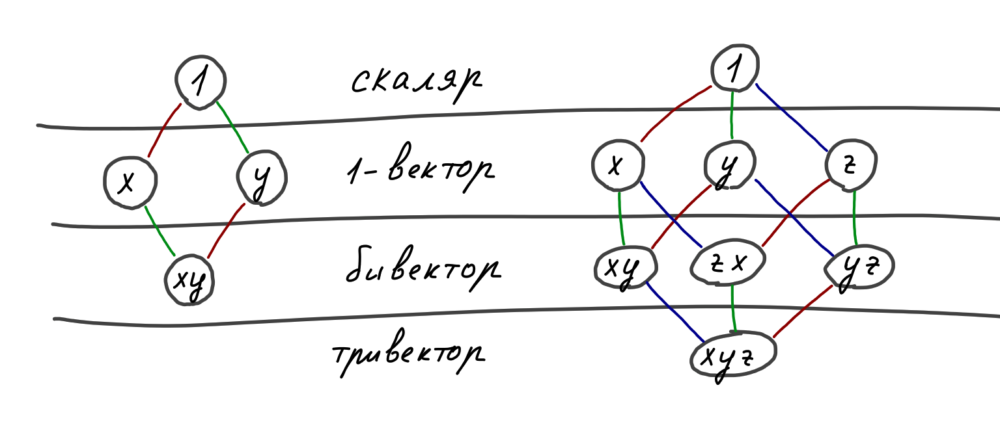
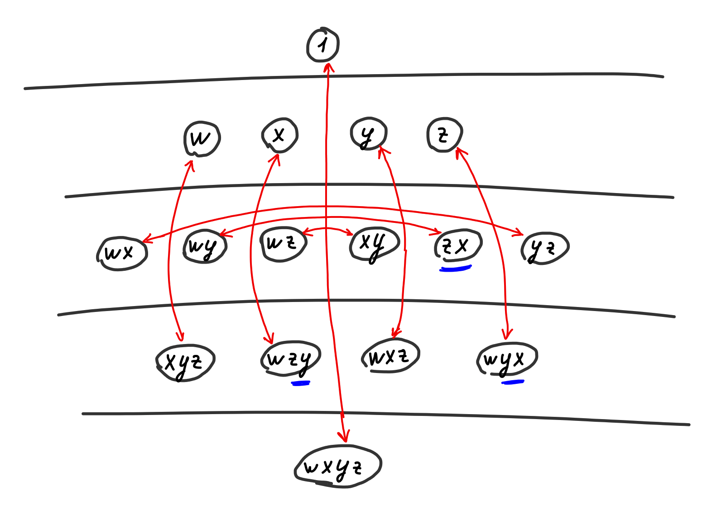
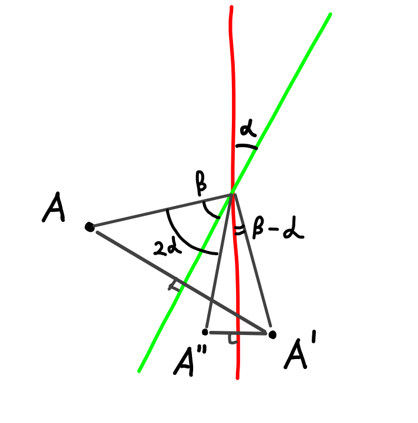
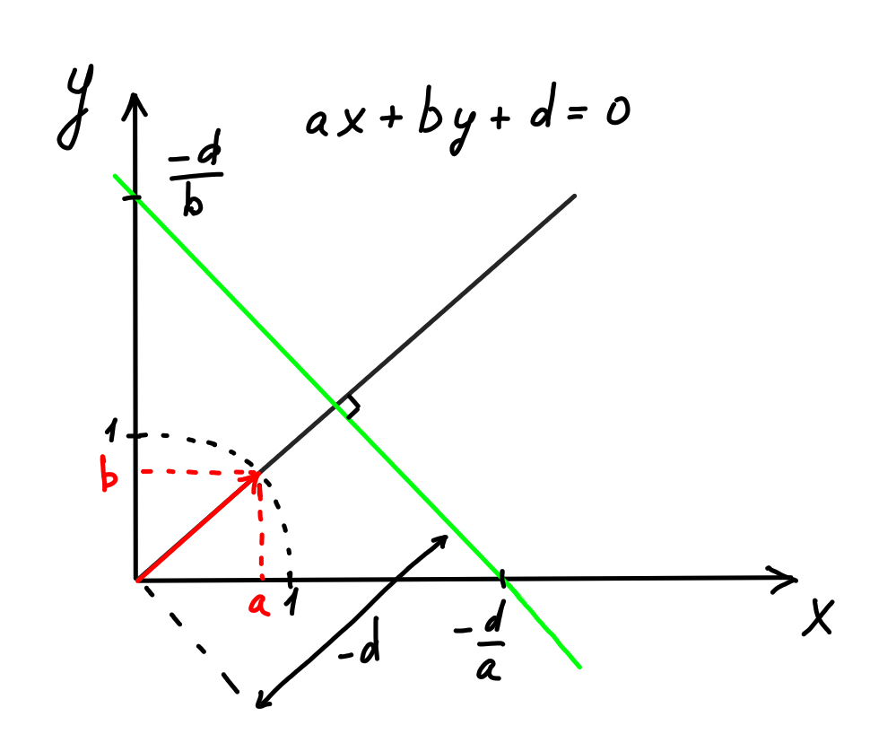
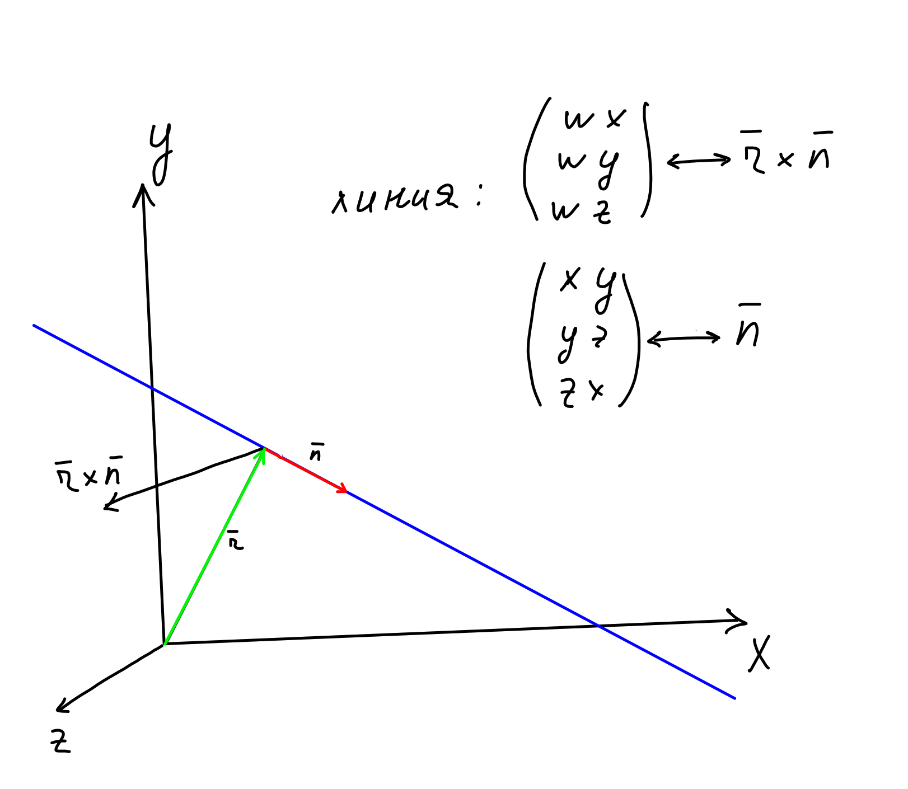
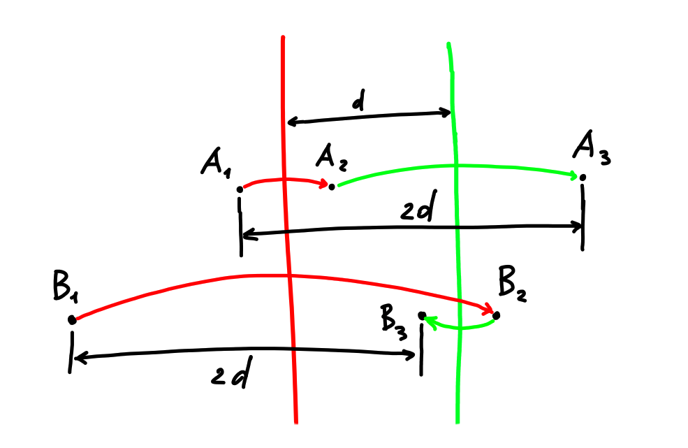

Этот текст логически состоит из трёх частей. Сначала кратко расскажу про геометрическую алгебру с точки зрения математики. Потом расскажу как можно взять одну конкретную алгебру и использовать её для описания вращения и перемещения тел. И вишенка на торте - покажу, как будут выражаться физические сущностей типа силы и момента, импульса, момента инерции и уравнений движения тел.

В русскоязычном интернете не очень много информации на эту тему, а та что есть на английском - довольно разрозненная и с разной терминологией в разных источниках.

Вдобавок, местами геометрическую алгебру используют только для описания вращения в 3д без перемещений и результат уходит не сильно дальше кватернионов. На мой взгляд, самый сок - в возможности скомбинировать вращения и перемещение тела в одну сущность, аналогично сгруппировать силу и крутящий момент и получить относительно простые универсальные уравнения, описывающие сразу всё.

Кроме того, подход с геометрической алгеброй кажется более фундаментальным: алгебра не привязна к количеству измерений и она одинаково хорошо будет описывать любой мир - двухмерный, трёхмерный, четырёхмерный и т.п.

Я сам не придумал ничего нового, просто разобрался с тем что есть. Основным источником вдохновения можно назвать сайт [bivector.net](https://bivector.net) - только там авторы пошли достаточно далеко, чтобы написать мини-книжку про момент инерции и уравнения движения тел. Если бы не они - не уверен, что я смог бы додуматься до всего сам.

Полтора года назад я написал [статью про физику вращения 3д тел](https://habr.com/ru/articles/697534/) - эта статья во многом с ней перекликается и позволяет взглянуть на происходящее с другой стороны.

# Геометрическая алгебра с точки зрения математики

Если Вам всё знакомо - можете листать дальше и использовать эту часть как список используемых обозначений.

## Внешнее произведение

В линейной алгебре 3д вектор с координатами x,y,z можно записать так:

$$v = x e_x + y e_y + z e_z$$

Буковкой e с индексом записываюся базисные векторы. Вектор выражается как линейная сумма базисных векторов.

В геометрической алгебре ему будет соответствовать 1-вектор, записывающийся точно так же. Свойства типа возможности складывать 1-вектора или умножать на скаляр остаются теми же.

На геометрическую алгебру можно смотреть как на расширение линейной алгебры. В ней вводят внешнее произведение c таким свойством:

$$e_a \wedge e_b = -e_b \wedge e_a$$

Оно антисимметрично, и в общем случае не коммутативно (ab != ba). Но здесь и далее у нас останется и будет использоваться ассоцитивность (ab)c = a(bc) и дистрибутивность (a+b)c = ac + bc, a(b+c) = ab + ac.

Из определения следует, что внешнее произведение базисного вектора с самим собой будет равно нулю.

А значит, что ненулевое внешнее произведение не может содержать одинаковые базисные векторочки. И это же значит, что в произвольном внешнем произведении какой-нибудь базисный векторочек либо отсутствует, либо присутствует в единственном экземпляре.

Например, для 2д случая получается четыре сочетания: скаляр, базисный вектора Ex, Ey и их произведение Ex ^ Ey.  Произведение типа Ex^Ey будем называть бивектором, потому что в нём участвуют два базисных вектора. Больше ничего мы получить не можем.

В общем виде мультивектор будет записываться так:

$$v = 1a + e_x b + e_y c + e_x \wedge e_y d$$

Для 3д будет 2^3 = 8 вариантов и самым высокоуровневым будет три-вектор Ex^Ey^Ez.

После линейной алгебры интуитивно кажется странным, что в одном выражении складываются вместе скаляр, 1-вектор, бивектор и т.д.
Но посмотрите на комплексные числа, которые тоже являются геометрической алгеброй. Мы можем сложить вещественное число с мнимым и получить комплексное число: a + bi.



В целом вся эта конструкция с внешними произведениями симметрична.

Вверху скаляр, потом n-векторов, внизу точно так же n (n-1)-векторов и один n-вектор, который можно назвать псевдоскаляром.

Ещё при желании при взгляде на картинку можно увидеть квадрат для 2д и куб для 3д.

И в принципе внешнее произведение всех возможных векторов можно назвать мнимой единией, т.е., I. Важный момент - есть произвол, в каком порядке ставить вектора, xy = -yx, и для другий определений мнимая единица может быть домножена на -1.

Количество участвующих базисных векторов в английском называют grade. Т.е., у скаляра grade=0, у базисных векторов grade=1, у бивектора - два. Ещё можно встретить 0-blade, 1-blade, 2-blade, где под n-blade поразумевают линейную комбинацию векторов с grade=n. Можно сказать, что привычные нам вектора из линейной алгебры это 1-blade или 1-вектор.

Вообще говоря есть разница между произведением n 1-векторов и произвольным n-вектором, под blade и grade подразумевают имеют чуть-чуть разные значения, но я не буду в это углубляться.

Если обобщить на мультивекторы - внешним произведением m-вектора и n-вектора будет (n+m)-вектор либо ноль.

Внешнее произведение можно считать "более правильным" векторным произведением. Разница в том, что внешнее произведение определено для пространства любой размерности и его результат - бивектор, а не вектор.

## Внутреннее произведение.

Кроме внешнего произведения, можно использовать внутреннее произведение. Оно наоборот будет уменьшать грейд (получать модуль разности грейдов аргументов). Для двух 1-векторов оно будет работать как скалярное произведение. Внешнее произведение пытается добавить новый базисный вектор, внутреннее - "вычитает" его.

Т.е.

$$(e_x \wedge e_y) \cdot e_y = e_x$$

Внутреннее произведение коммутативно.

Ещё можно встретить более строгий вариант внутреннего произведения, в котором грейд вектора слева должен быть больше чем грейд вектора справа. Иначе результат будет нулём. Тогда grade результата будет просто разностью грейдов мультивекторов слева и справа, без модуля. В остальном он ведёт себя так же и практически является тем же самым внутренним произведением.

Положим, что внутренее произведение разных базисных векторов равно нулю:
$$e_x \cdot e_y = 0$$

И обычно предполагается, что скалярное произведение базисного вектора с самим собой это единица:
$$e_y \cdot e_y = 1$$

Но утверждение про квадрат-единицу не всегда верно. Алгебра зависит от того, как мы определим квадраты каждого из базисных векторов.

Например, для комплексных чисел у нас будет один-единственный базисный вектор (назовём его i), который в квадрате равен минус единице.
$$i^2 = -1$$

А если мы захотим описать пространство Минковского, то у нас будут

$$e_t^2 = 1, e_x^2 = e_y^2 = e_z^2 = -1$$

Или, например, в plane-based геометрической алгебре квадраты заданы так:

$$e_x^2 = e_y^2 = e_z^2 = 1, e_w^2 = 0$$

Если описывать происходящее очень высокоуровнево - базисные векторы для x y z позводят описывать вращение, а w с нулевым квадратом нужен для линейных перемещений. В пространстве Минковского квадраты базисных векторов с разных знаком, поэтому во "вращении" для времени вместо косинуса и синуса получатся гиперболические косинус и синус, описывающие преобразования Лоренца.

Любой базис геометрической алгебры можно описать тройкой чисел (p, q, r), где p - количесто базисных векторос с квадратом-единицей, q-c минус единицей и r с квадратом-нулём. Подробнее можно почитать [тут](https://math.stackexchange.com/questions/4478664/what-is-the-difference-between-projective-geometric-clifford-algebra-grassman)

Ниже мы сосредоточмися на plane based геометрической алгебре для 2д и для 3д, сигнатуры которых (2, 0, 1) и (3, 0, 1)

## Геометрическое произведение

Для базисных векторов геометрическое произведение определяется как сумма внешнего и внутреннего. Иногда люди пишут значок произведения, иногда нет.

$$ab = a ⟑ b = a \cdot b + a \wedge b$$

Как нетрудно заметить, если наложить символ ∧ на точку ⋅, то получится ⟑

Причём здесь внутреннее произведение симметрично и внешнее антисимметрично. И в принципе, можно выразить геометрическое произведение через внутреннее и внешнее, а можно наоборот - постулировать геометрическое произведение и из него вывести внутренее и внешнее.

$$a \cdot b = \dfrac{1}{2} (ab + ba)$$
$$a \wedge b = \dfrac{1}{2} (ab - ba)$$

**ALARM!** a и b - какие-то 1-векторы. Для произвольных мультивекторов это не верно!

Для двухмерного случая c векторами e1 и e2 табличка умножения выглядит так:

|   |  1| e_1| e_2|   I|
|---|---|----|----|----|
|1  |  1| e_1| e_2|   I|
|e_1|e_1|   1|   I| e_2|
|e_2|e_2|  -I|   1|-e_1|
|I  |  1|-e_2| e_1|  -1|

Ещё её называют таблицей Кейли.

[таблица Кейли для 3d PGA](https://bivector.net/tools.html?p=3&q=0&r=1)

Для неравных базисных векторов геометрическое произведение равно внешнему произведению, а ещё иногда люди группируют индексы для краткости записи:

$$e_x \wedge e_y \wedge e_z = e_x ⟑ e_y ⟑ e_z = e_x e_y e_z = e_{xyz}$$


Для примера покажу, как можно посчитать произведение двух векторов:

$$(a e_1 + b e_2) (c e_1 + d e_2)$$
$$= (a e_1) (c e_1) + (a e_1) (d e_2) + (b e_2)(c e_1) + (b e_2)(d e_2)  $$
$$= ac e_1 e_1 + a d e_1 e_2 + bc e_2 e_1 + bd e_2 e_2$$
$$= ac 1 + a d e_1 e_2 + bc ( - e_1 e_2) + bd 1$$
$$= (ac + bd) + (a d - bc) (e_1 e_2)$$
$$= (ac + bd) + (a d - bc) e_{12}$$

В результате получился скаляр и бивектор. Какой у них может быть смысл?

Если внимательно посмотреть, a c + b d это скалярное произведение векторов (a, c) и (b, d) из линейной алгебры (косинус между векторами, умноженный на их длины).
Компонента (ad - bc) - наоборот, синус.

Ниже я покажу, как такая конструкция может описывать поворот для любого количества измерений. Особенно удобно будет, если мы возьмём исходные вектора с единичной длиной.

Причём при нулевом угле поворота косинус равен единице, а синус равен нулю и всё выражение сворачивается в скаляр. И умножение любого вектора на единицу не будет ничего менять.

Взгляд с ещё одной стороны - если мы хотим повернуть вектор (x, y) на угол `a` то результат будет таким:

$$(x \cdot cos(a) + y  \cdot sin(a), y  \cdot cos(a) - x  \cdot sin(a)) = (x, y)  \cdot cos(a) + (y, -x)  \cdot sin(a)$$

Т.е, в итоговом векторе часть часть исходного вектора (умноженная на косинус) и какой-то перпендикулярный вектор, умноженный на синус.

А теперь давайте вернёмся обратно к геометрической алгебре и посмотрим на геометрическое произведение двух векторов. Всё аналогично - скалярная часть описывает, насколько сохраняется исходный вектор, а бивекторная часть описывает перпендикулярную компоненту. В сумме они описывают поворот.

Ещё интересный момент - произведение двух бивекторов единичной длины даст мультивектор, длина которого тоже равна единице:
$$v = cos(a) + sin(a) e_12$$
$$|v|^2 = cos(a)^2 + sin(a)^2 = 1$$

**ALARM**: в проективной геометрической алгебре у одного базисного вектора квадрат равен нулю, а не единице. Если он участвует в вычислении, то норма сохраняться не будет.

## Cross product

$$A × B = \dfrac{AB - BA}{2}$$

Отличие от определения внешнего произведения в том, что A и B - произвольные мультивекторы, а не два вектора. Ещё эту штуку называют антикоммутатором.

## Дуальность



Как можно заметить, мы можем перевернуть картинку и превратить скаляр в псевдоскаляр, вектор в (n-1)-вектор (или в псевдовектор) и т.п.

В некоторых источниках определяют дуальные элементы как домножение на I, но из-за того, что у нас есть вектор с квадратом-нулём, то такое определение не подойдёт.
В нашем случае можно определить дуальное как $$a a* = I$$

Тут тоже есть произвол, потому что вектора a и a* в общем случае не коммутируют и надо различать дополнение слева и дополнение справа. В английских источниках их могу называть как left complement и right complement - дополнение слева и справа.

Кроме того, если на сайте bivector.net и посмотреть, как они определяют базис и дуальность, то можно увидеть красивую штуку:

```Python
self._base = ["1", "e0", "e1", "e2", "e3", "e01", "e02", "e03", "e12", "e31", "e23", "e021", "e013", "e032", "e123", "e0123"]

def Dual(a):
        """PGA3D.Dual

        Poincare duality operator.
        """
        res = a.mvec.copy()
        res[0]=a[15]
        res[1]=a[14]
        res[2]=a[13]
        res[3]=a[12]
        res[4]=a[11]
        res[5]=a[10]
        res[6]=a[9]
        res[7]=a[8]
        res[8]=a[7]
        res[9]=a[6]
        res[10]=a[5]
        res[11]=a[4]
        res[12]=a[3]
        res[13]=a[2]
        res[14]=a[1]
        res[15]=a[0]
        return PGA3D.fromarray(res)
```

В последних векторах они меняют пару базисных элементов местами, чтобы поменять знак на противоположный. Типа e021 = -e012, и для первого элемента дуальным будет последний, для второго - предпоследний и т.п.
Что интересно, в таком хитром базисе дуальное преобразование сохраняет все знаки и просто переставляет числа, и преобразование обратно самому себе.

На картинке смену знака я отметил синим цветом.

В моём коде хака с переворотом базисных векторов нет и для дуальных элементов некоторые компоненты будут домножены на -1.

Наши операции типа умножения можно провести в дуальном пространстве. Результат будет немножко другой, например вместо повышения grade случится его понижение.

Эти операции называть геометрически анти-произведением, внутрении анти-произведением и т.п. Для них придумали забавные обозначения, "перевёрнутые" для анти-произведений: Геометрическое произдведение: ⟑, анти: ⟇. Внешнее произведение ∧, анти: ∨. Внутреннее: ⋅, анти: ◦

Кстати, это всё символы юникода, используйте на здоровье, можно даже метод в коде так назвать, и потом не использовать потому что символ неудобно печатать.

## Reverse

Введём операцию Reverse, которая рисуется красивым плюсиком или кинжальчиком. Операция будет менять порядок базисных векторочков на обратный:

$$(e_x e_y e_z)^† = e_z e_y e_x$$

Так вот, идея в том, что если длина какого-то мультивектора равна единичке, то мы можем умножить его на reverse и получить снова единицу. Причём умножать можно с любой стороны - и слева, и справа.

Кстати, длину так и определим - как корень из vv†. Это совпадает с интиутивным определением длины и я его уже использовал выше, но для большой строгости указываю явное определение.

Зачем это нужно? Например, для деления.

$$\dfrac{a}{b} = \dfrac{a b^†}{b b^†} = a b^† \dfrac{1}{scalar}$$

Вы наверняка видели такую формулу для комплексных чисел.
Но в геометрической алгебре надо быть аккуратным, не всегда `a b†` равно `b† a`

Кроме того, ниже по тексту у нас будут мультивекторы, описывающие преобразования типа поворотов, переносов и т.п. Reverse будет давать обратные преобразования, обращая кватернионы и прочее.

**ALARM** Не факт что произведение мультивектора с обратным даст скаляр. Надо различать мультивектор, получившийся как произведение векторов, и мультивектор, у которого мы написали рандомный набор компонент. У последнего всё будет плохо. Для таких случаев в качестве "квадрата длины" можно использовать скалярный компонент.

Для вектора операция reverse ничего не делает, там особо нечего обращать: reverse(e_x) = e_x. Если этот вектор единичной длины, то он будет обратным самому себе, квадрат вектора будет сворачиваться в единицу.

Для комплексных чисел reverse для i домножает на минус единицу просто потому, что i^2 = -1. Но дальше мы будем говорить про алгебры, в которых для базисных векторов квадрат равен нулю или единице, для них reverse от любого 1-вектора - это он сам.

Иногда reverse обозначают как подчёркивание сверху:

$$A^† = \widetilde{A}$$

### Projection, Rejection

Если есть вектор `a` и бивектор `B`, то можно разложить `a` на две компоненты - проекцию на B и перпендикулярную часть.

Вообще говоря в этом месте `B` может быть любой размерности, но главное чтобы размерность всех компонент совпадала.

$$aB = a_{||B} \cdot B + a_{⊥B} \wedge B$$

С ними довольно логично:

$$a_{⊥B} \cdot B = 0$$

$$a_{||B} \wedge B = 0 $$

И можно выразить так:

$$a_{⊥B} B = a \wedge B$$

$$a_{⊥B} = (a \wedge B) B^{-1}$$

Аналогично для второй компоненты:

$$a_{||B} B = a_{||B} \cdot B$$

$$a_{||B} = (a_{||B} \cdot B) B^{-1}$$

## Отражение относительно плоскости

пусть есть вектор U, к нему дуальным будет вектор нормали u

$$ua = u(a_{||_{U}} + a_{⊥_U}) = u \cdot a_{||_{U}} + u \wedge a_{||_{U}} + u \cdot a_{⊥_U} + u \wedge a_{⊥_U}$$

Тут надо не перепутать U и u, перпендикулярная к U часть паралелльна u.
Внутренне произведедние между векторами коммутативно, внешнее антикоммутативно

$$ua = u \wedge a_{||_{U}} + u \cdot a_{⊥_U} = a_{⊥_U} \cdot u - a_{||_{U}} \wedge u = (a_{⊥_U} - a_{||_{U}}) u$$

$$-ua = (a_{||_{U}} - a_{⊥_{U}}) u$$

$$-uau^{-1} = a_{||_{U} - a_{⊥_U}}$$

обычно вектор u берут единичной длины, тогда для него $$u^{-1} = u$$

и отражение упрощается до $$-uau$$

Либо это можно записать как $$-uau^†$$

Ещё добавлю, что в зависимости от размерности пространства минус может быть, а может и не быть.

Конкретно в проективной геометрической алгебре домножение на константу типа минус единицы ничего не поменяет.

## Вращения

Вращение можно представить как комбинацию двух отражений



т.е., есть мы возьмём вектора единичной длины a и b, то их геометрическое произведение будет кватернионом.

В виде формул будет так $$v' = q v q^† = a b v b a = -a(-bvb)a$$

Иногда вращение определяют "в другую сторону" и reverse стоит слева, всё остаётся примерно таким же, но формулы капельку другие.

С другой точки зрения:

$$ab = a \cdot b + a \wedge b$$

Внутреннее произведение будет равно косинусу угла между векторами, внешнее произведение покомпонентно напоминает векторное произведение и его длина - синус угла между векторами.

Разница с векторным произведением в том, что векторное произведение - даёт результат в пространстве векторов, а внешнее произведение - бивектор.

## Sandwich product

Как нетрудно заметить, и в отражении и во вращении есть подозрительно похожая формула (с точностью до умножения на -1, но это не важно)

$$q a q^†$$

Мы наш мультивектор, как начинку сендвича, зажимаем между q и q†.

Если q - комбинация векторов единичной длины, то $$q q^† = 1$$

Обратный поворот можно легко вывести:

$$q^† b q = q^† (q a q^†) q = (q^† q) a (q^† q) = a$$

и это будет как раз наша операция обращения.

Перемножим два повёрнутых мультивектора:

$$ (q a q^†) (q b q^†) = q a (q^† q) b q^† = q (a b) q^† $$

Получится, что мы можем повернуть произведение двух мультивекторов, а можем повернуть каждый мультивектор и потом перемножить их. Результат будет точно такой же! Это очень важное свойство, и оно будет работать для всех преобразований - отражений, вращений, переносов и т.п.

Отражение относительно точки тоже сделать несложно - это будет комбинация трёх отражений относительно перпендикулярных плоскостей, пересекающихся в этой точке.

# Plane-based геометрическая алгебра

## Плоскость

Добавим ещё один базисный вектор w, квадрат длины которого равен нулю. Это ключевой шаг, который позволит ввести перемещение в наш трёхмерный мир. Примерно как 3д графике используют четырёхмерные вектора с w=1, чтобы матрица вращения описывала перемещения.

$$v = a e_x + b e_y + c e_z + d e_w$$

Предположим, что этот вектор описывает плоскость, заданную уравнением $$ax + by + cz + d = 0$$



Свойства при таком подходе:

1. Плоскость может быть любой, она не обязана проходить через центр координат.
2. У нас получилась проективная алгебра: мы можем домножить вектор на любое ненулевое число (например, -1) и он будет описывать всё ту же плоскость
3. значения a,b,c описывают нормаль к плоскости
5. В принципе, это будет работать для любого количества измерений, но нам достаточно 2д и 3д.

Посчитаем длину 1-вектора, описывающего плоскость:

$$|plane|^2 = |plane ⟑ plane^†| = |a e_x + b e_y + c e_z + d e_w|^2 = a^2 + b^2 + c^2$$

Обратите внимание - d в длине не участвует. Длина - это длина вектора-нормали. Поскольку мы можем домножать уравнение плоскости на лубую скалярную константу, можно отнормировать уравнение прямой так, чтобы длина нормали была равна единице.


Поскольку мы теперь говорим про вполне конкретный случай алгебры, нам не обязательно выводить какие-то абстрактные штуки, можно просто проверить что они работают в 3д. Дальше пойдут конкретные примеры:

## Линия

Так уж получилось, что я в процессе освовения написал свою бибилиотечку для PGA и всякие формулы писал не вручную, а просто загонял в неё и делал символьные вычисления. Код ниже - оттуда.

Уравнение линии из точки а с направлением n

```Scala
a v (a + n) == MultiVector(
    wx -> (a.y * n.z - a.z * n.y)
    wy -> (a.z * n.x - a.x * n.z)
    wz -> (a.x * n.y - a.y * n.x)
    xy -> n.z
    xz -> -n.y
    yz -> n.x
)
```

по-сути в xy, xz, yz лежит направление и в wx, wy, wz - (a x n) - хитро закодирован сдвиг от центра координат. Если предположить, что длина n = 1, а - ближайшая точка прямой к центру координат, то n x a будет перпендикулярно обоим и с длиной как расстояние до центра координат.

Линия как пересечение двух плоскостей:

```Scala
a ^ c == MultiVector(
    wx -> (a.d * c.nx - a.nx * c.d)
    wy -> (a.d * c.ny - a.ny * c.d)
    wz -> (a.d * c.nz - a.nz * c.d)
    xy -> (a.nx * c.ny - a.ny * c.nx)
    xz -> (a.nx * c.nz - a.nz * c.nx)
    yz -> (a.ny * c.nz - a.nz * c.ny)
)
```

Линия как внутренне произведение точки и направления:

```Scala
pos = MultiVector(
    wxy -> -pos.z
    wxz -> pos.y
    wyz -> -pos.x
    xyz -> 1.0
)
shift = MultiVector(
    x -> s.x
    y -> s.y
    z -> s.z
)
pos dot shift = MultiVector(
    wx -> (pos.y * s.z - pos.z * s.y)
    wy -> (pos.z * s.x - pos.x * s.z)
    wz -> (pos.x * s.y - pos.y * s.x)
    xy -> s.z
    xz -> -s.y
    yz -> s.x
)
```

Кстати, что интересно - в 2д у бивектора будет три компоненты - wx, wy, xy - две из них соответствуют линейным перемещениям, одна - вращению.
В 3д будет три перемещения и три поворота, а в 4д - четыре перемещения и шесть поворотов! В геометрической алгебре этот момент выражается максимально красиво, и формулы для сил и вращения тел справятся с любой размерностью.

Линии точно так же можно нормировать, только теперь длиной линии будет длина вектора, задающего направление.



Для 2д понятия "линии" и "плоскости" совпадают, для n-мерного случая разница есть.

Очень часто для случая с 3д люди уходят в какие-то частности. Например, вводят векторное произведение, результат которого называют вектором, а дальше рассказывают про "правые" и "левые" тройки векторов. Хотя на самом деле результат - бивектор, а такое совпадение размерности только для 3д. И вопрос "правая или левая тройка" для геометрической алгебры не имеет смысла, потому что пространства векторов и бивекторов разные.

Можно попытаться найти линию, задающую пересечение двух паралельных плоскостей или линию от точки А в ту же самую точку А. О том что получится в результате, предлагаю подумать самостоятельно.

## Точка

Пересечение трёх плоскостей даст нам точку.
Точка с координатами x, y, z будет описываться тривектором:

$$v = 1 e_{xyz} - x e_{yzw} + y e_{xzw} - z e_{xyw}$$

Причём этот тривектор дуален вектору с w=1 и x, y, z на привычных местах и с положительными знаками.

В случае точки длина это просто модуль компоненты с e_xyz, остальные компоненты не влияют и могут быть другими. У отнормированной точки компонента для e_xyz будет равна единице.

Если вычесть и одной отнормированной точки другую, то компонента у e_xyz будет равна нулю. Такую точку иногда называют "идеальной точкой" - она описывает сдвиг между парой точек, но сама точкой не явлется. А является, скорее, чистым направлением.

Еще, что интересно, оператор перемещения вращает "идеальную точку", но не сдвигатет.

## Интерполяция

Это неочевидно, но вообще говоря можно, например, сложить две линии друг с другом. Если складывать их с весами t и (1-t) и плавно менять t от 0 до 1, то можно получить плавный переход из одной линии в другой. Аналогично можно сделать и с плоскостями и с точками.

Ещё неочевидный момент - у плоскостей и линий есть направление и результат интерполяции зависит от него.

## Вращение + перемещение = Мотор

Как я писал выше, sandwich product плоскости и мультивектора будет зеркальным отражением мультивектора относительно плоскости. Поскольку плоскости теперь в пространстве проходят как угодно, а не только через церез центр координат, то комбинация двух отражений может описывать перемещение.



Всё. Вот так вот просто мы втащили переносы в геометрчиескую алгебру!

Линейное перемещение - это отражение от двух паралельных плоскостей.

Мотор для перемещения будет выглядеть так:

```Scala
MultiVector(
    1 -> 1.0
    wx -> -0.5 * d.x
    wy -> -0.5 * d.y
    wz -> -0.5 * d.z
)
```

а для вращения - привычный кватернион:

```Scala
q = MultiVector(
    1 -> q.cos
    xy -> q.xy
    xz -> q.xz
    yz -> q.yz
)
```

В общем случае в моторе будут намешаны много разных компонент.

Например скомбинируем вращение и перенос:

```
q = MultiVector(
    1 -> q.cos
    xy -> q.xy
    xz -> q.xz
    yz -> q.yz
)
tr = MultiVector(
    1 -> 1.0
    wx -> t.x
    wy -> t.y
    wz -> t.z
)
tr q = MultiVector(
    1 -> q.cos
    wx -> (q.cos * t.x - q.xy * t.y - q.xz * t.z)
    wy -> (q.cos * t.y + q.xy * t.x - q.yz * t.z)
    wz -> (q.cos * t.z + q.xz * t.x + q.yz * t.y)
    xy -> q.xy
    xz -> q.xz
    yz -> q.yz
    I -> (q.xy * t.z + q.yz * t.x - q.xz * t.y)
)
q tr = MultiVector(
    1 -> q.cos
    wx -> (q.cos * t.x + q.xy * t.y + q.xz * t.z)
    wy -> (q.cos * t.y + q.yz * t.z - q.xy * t.x)
    wz -> (q.cos * t.z - q.xz * t.x - q.yz * t.y)
    xy -> q.xy
    xz -> q.xz
    yz -> q.yz
    I -> (q.xy * t.z + q.yz * t.x - q.xz * t.y)
)
```

Перенос не влияет на компоненты кватерниона, но добавляет новых в wx, wy, wz и I.

Мотор описывает перемещение тела, но мы можем захотеть его интерполировать или экстраполировать. Нам на помощь приходят экспонента и логарифм (в принципе, как и для кватернионов).

Угловая скорость и ускорение будут бивекторами.

$$M = exp(\dfrac{-Bt}{2})$$

можно взять производную

$$M' = \dfrac{-B}{2} exp(\dfrac{-Bt}{2}) = \dfrac{-BM}{2}$$

Кстати, сейчас это не важно, но в общем случае - есть разница с какой стороны умножать B на M. Если M не является экспонентой от B, то они не будут коммутировать! При умножении слева B как бы в глобальной системе отсчёта движение добавлятся поверх существующего мотора, при умножении справа - в локальной - движение добавляется "внутри", до применения мотора.

Как мы можем посчитать экспоненту от бивектора? Например, разложить её в сумму ряда.

$$exp(B) = 1 + B + \dfrac{B^2}{2!} + \dfrac{B^3}{3!} + ...$$

Ряд рано или поздно сойдётся и вполне можно экспоненту найти численно. Не значит что так надо делать, но для тестирования "более опитимальных" методов нахождения экспоненты этот способ работает идеально.

Так уж сложилось, что у бивектора, который описывает линейное перемещение, квадрат равен нулю, поэтому все степени выше единицы можно сократить и получается линейное перемещение.

$$exp(B) = 1 + B$$

Для бивектора, описывающего вращение, квадрат будет отрицательным скаляром  (назовём его -len^2):

$$exp(B) = 1 + B + \dfrac{B^2}{2!} + \dfrac{B^2B}{3!} + \dfrac{B^4}{4!} + ... $$
$$= 1 + B - \dfrac{len^2}{2!} - \dfrac{len^2B}{3!} + \dfrac{len^4}{4!} + ...$$
$$= (1 - \dfrac{len^2}{2!} + ...) + B(1 - \dfrac{len^2B}{3!})$$
$$= cos(len) + B \dfrac{sin(len)}{len} $$

при длине вектора стремящейся к нулю, sin(len) / len будет стремитсья к единице и мы получим предыдущую формулу. Всё сходится!


Но ещё бивектор скорости может описывать комбинацию вращения и перемещения вдоль оси вращения. Тогда квадрат бивектора становится суммой скаляра и псевдоскаляра, формула заметно усложняется. Я где-то три листа бумаги потратил прежде чем посчитал, а потом результат совпал с суммой ряда и я понял что нигде не ошибся. Приведу сразу [код](https://github.com/Kright/ScalaGameMath/blob/master/pga3d/src/main/scala/com/github/kright/pga3d/Bivector.scala#L193)

```Scala
  def exp(): Motor =
    val len = bulkNorm
    val cos = Math.cos(len)

    val sinDivLen = if (len > 1e-5) {
      Math.sin(len) / len
    } else 1.0 - (len * len) / 6.0

    val sinMinusCosDivLen2 = if (len > 1e-5) {
      (sinDivLen - cos) / (len * len)
    } else (1.0 / 3.0) * (1.0 + 0.8 * len * len)

    Motor(
      s = cos,
      wx = (sinDivLen * wx + sinMinusCosDivLen2 * yz * (wy * xz - wx * yz - wz * xy)),
      wy = (sinDivLen * wy + sinMinusCosDivLen2 * xz * (wx * yz + wz * xy - wy * xz)),
      wz = (sinDivLen * wz + sinMinusCosDivLen2 * xy * (wy * xz - wx * yz - wz * xy)),
      xy = sinDivLen * xy,
      xz = sinDivLen * xz,
      yz = sinDivLen * yz,
      i = sinDivLen * (wx * yz + wz * xy - wy * xz),
    )
```

Тут пришлось вспомнить вычисление пределов из института и аккуратно обойти значения около нуля.

С логарифмом от мотора похожая история (правда, тут я уже ничего не выводил, где-то нашёл готовую формулу и поправил поведение вокруг нуля:

```Scala
  def log(): Bivector =
    val scalar = s
    val lenXYZ = Math.sqrt(xy * xy + xz * xz + yz * yz)
    val angle = Math.atan2(lenXYZ, scalar)

    val a = 1.0 / (1.0 - scalar * scalar) // 1 / sin^2

    val b = if (Math.abs(angle) > 1e-5) { // angle / sin(angle)
      angle * Math.sqrt(a)
    } else {
      1.0 + angle * angle / 6.0
    }

    val c = if (Math.abs(angle) > 1e-5) {
      a * i * (1.0 - scalar * b)
    } else {
      (1.0 + angle * angle / 2.0) * i / 3.0
    }

    Bivector(
      wx = (b * wx + c * yz),
      wy = (b * wy - c * xz),
      wz = (b * wz + c * xy),
      xy = b * xy,
      xz = b * xz,
      yz = b * yz,
    )
```

Проверить что она правильная, можно с помощью функции экспоненты - это взаимно обратные операции.

### Проекция точки на экран

Допустим, мы хотим перевести точку `p (x, y, z, w=1)` в пространство экрана. (Как в 3д графике).
Как это можно записать?

Скажем, что центр экрана - начало координат (`center, dual(w=1)`), а сам экран - плоскость с z = 1 (`planeZ (z=1, w=-1)`). Если это не так, можно при помощи мотора подвинуть точку в систему отсчёта камеры.

проведём линию из начала координат к точке: `center v p`

найдём пересечение линии с плоскостью экрана: `(center v p) ^ planeZ`.

Отмечу, что операции внешнего произведения и анти-произведения не ассоциативны и порядок их применения важен.

После применения получим точку p' = (x, y, z, w=z) - как и в 3д графике, потом при нормализации всё поделится на w и получится p'' = (x/z, y/z, z=1, w=1).

Но в таком подходе мне не нравятся два момента:
1. перемещение и поворот можно записывать как мотор и моторы комбинируются друг с другом, а выражение выше толком ни с чем не комбинируется.
2. мы теряем информацию о глубине (z), в то время как в 3д графике матрица проекции заодно преобразует z и его можно использовать дальше.

Возможно в этот момент удобнее всего вернуться к линейной алгебре и сказать, что `(center v _) ^ planeZ` это линейный оператор. Дальше представлять его в виде матрицы, и эту матрицу можно будет комбинировать с матрицами, представляющими мотор.

# Физика

При первом чтении возникало чувство, что я прохожу механику заново в школе в шестом классе. Новые формулы, новые понятия... Хотя суть ровно та же.

## Force + torque = forque

В обычной физике нельзя просто так складывать линейные силы, надо учитывать точки их приложения. Например, если тело сверху тянут вправо, а снизу - влево, то оно, хоть никуда и не полетит, начнёт вращаться.

В геометрической алгебре сила - это бивектор, в нём закодированы и сила и момент силы. Эти бивекторы можно складывать друг с другом и всё будет корректно! Такую комбинацию силы и момента (force + torque) называют forque.

Как силу сконструтировать? На самом деле просто - как уравнение прямой. Выше уже есть формулма, где линия получается как скалярное произведение точки на сдвиг. Так вот, точка - это точка приложения, а сдвиг - это сила.

Закон Ньютона тоже придётся немножко переписать.
$$F = ma$$
$$F = pos \cdot ma$$

```
pos = MultiVector(
    wxy -> -pos.z
    wxz -> pos.y
    wyz -> -pos.x
    xyz -> 1.0
)
a = MultiVector(
    x -> a.x
    y -> a.y
    z -> a.z
)
F = (a dot pos * mass) = MultiVector(
    wx -> (mass * pos.y * a.z - mass * pos.z * a.y)
    wy -> (mass * pos.z * a.x - mass * pos.x * a.z)
    wz -> (mass * pos.x * a.y - mass * pos.y * a.x)
    xy -> mass * a.z
    xz -> -mass * a.y
    yz -> mass * a.x
)
F.dual = MultiVector(
    wx -> mass * a.x
    wy -> mass * a.y
    wz -> mass * a.z
    xy -> (mass * pos.x * a.y - mass * pos.y * a.x)
    xz -> (mass * pos.x * a.z - mass * pos.z * a.x)
    yz -> (mass * pos.y * a.z - mass * pos.z * a.y)
)
```

В компонентах xy, xz, yz закодирован линейный импульс, в wx, wy, wz - вращательный относительно центра координат.

Вообще в книжке "May be Forque Be with You", [лежащей на bivector.net](https://bivector.net/PGADYN.html) на странице 34 есть красивые диаграммки того, что чему дуально, но если честно я их недостаточно хорошо прочувствовал. Типа момент и сила дуальны угловой скорости, а оператор инерции переводит одну в другое.

## Момент интерции и импульс

В классической физике момент инерции это интеграл от mr^2, где r - расстояние до оси, проведённой через центр масс. В геометрической алгебре тоже нужна какая-то симметричная формула, но внешнее произведение антисимметрично и инерция выглядит сложнее.

$$P = I[B] = \sum m_i x_i ∨ (x_i × B)$$

Имея скорость в какой-то системе отсчёта, можем найти импульс. Скорость должна быть в той же самой СО, и результат будет в ней же.

## Уравнения движения

В книжке все вычисления делали в локальной системе отсчёта. Нюанс в том, что у них локальная система отсчёта неподвижная, совпадает с положением тела, но не будет двигаться и тело спокойно улетит из неё. В книжке написано более подбробно, чем в этой статье - детали и нюансы лучше искать там. Я их повторил в виде кода и проверил что они работают :)

Обозначения с индексом w - в глобальной системе отсётча, с индексом b - в локальной.

Они берут закон Ньютона и дифференцируют его (прям в терминах геометрической алгебры)

$$\dfrac{d}{dt} P = F$$

$$M (I_b[B_b] × B + I_b[B'_b]) M^† = F_w $$

$$I_b[B_b] × B + I_b[B'_b] = F_b $$

$$I_b[B'_b]) = F_b - I_b[B_b] × B$$

$$I_b[B'_b]) = F_b + B × I_b[B_b]$$

$$ B'_b = I_b^{-1}[F_b + B × I_b[B_b]] $$

Глобальная идея в том, что оператор инерции можно привести к диагональному виду, если выбрать правильную локальную систему отсчёта. В моём коде класс для инерции выглядит [так](https://github.com/Kright/ScalaGameMath/blob/master/pga3d/src/main/scala/com/github/kright/pga3d/Inertia.scala)


В итоге уравнения движения будут выглядеть так:

$$B_b' = I_b^{-1}[B_b × I[B_b] + F_b]$$
$$M' = \dfrac{1}{2}MB_b$$

Причём в них закодировано и линейное движение, и вращение! Все рассчёты проводятся в локальной системе отсчёта, переводы в неё и обратно можно делать с помощью мотора M.

Формула для ускорения выглядит страшновато - по скорости считается импульс, потом считается прецессия и добавляется внешняя сила, а потом всё с помощью той же инерции конвертируется обратно в ускорение.
Но если её свернуть в компактный вид и посмотерть что происходит c компонентами векторов, то количество арифметических операций не такое уж и большое:

```Scala
case class Inertia(mass: Double,
                   mryz: Double,
                   mrxz: Double,
                   mrxy: Double):
  ...
  def getAcceleration(localB: Bivector, localForque: Bivector): Bivector =
    Bivector(
      wx = localForque.yz / mass + localB.wy * localB.xy + localB.wz * localB.xz,
      wy = -localForque.xz / mass + localB.wz * localB.yz - localB.wx * localB.xy,
      wz = localForque.xy / mass - localB.wx * localB.xz - localB.wy * localB.yz,
      xy = (localForque.wz + localB.xz * localB.yz * mrxz - localB.xz * localB.yz * mryz) / mrxy,
      xz = (-localForque.wy + localB.xy * localB.yz * mryz - localB.xy * localB.yz * mrxy) / mrxz,
      yz = (localForque.wx + localB.xy * localB.xz * mrxy - localB.xy * localB.xz * mrxz) / mryz,
    )
```

В процессе численного решения диффура мотор M может уползать от нормализованного вида и неплохо бы его возвращать обратно. (MM†) должно быть равно единице. Наверно для проективной алгебры домножение на константу не фатально, но мне проще отнормировать мотор, чем потом заниматься нормализацией всего того, что я на него умножу. Мало ли значение удрейфует куда-нибудь в бесконечность или к нулю и всё развалится.

## Кинетическая энергия

Момент считается просто (ещё раз напомню, что всё в локальной СО)

$$P_b = I_b[B_b]$$

В классической физике энергию можно выразить через момент: $$P = mv, E = \dfrac{mv^2}{2} = \dfrac{Pv}{2}$$

В геометрической аглебре почти так же:

$$E = \dfrac{B_b ∨ I_b[B_b]}{2}$$


# Хочешь разобраться - сделай сам

Я написал [свою библиотеку](https://github.com/Kright/ScalaGameMath) для геометрической алгебры, и кажется понял в чём подвох и почему аналогичные библиотеки выглядят страшновато.

Для PGA в 3d у мультивектора получается 16 компонент, хранить их все и использовать при перемножении - неэффективно. Вдобавок, неподготовленный человек, посмотрев на компоненты бивектора, вряд ли сможет сказать, что же такое он там видит. И бонусом в некоторых компонентах могут вместо нулей повылазить мелкие ошибки типа 1e-15.

Можно пойти другим путём и придумать какие-то полезные классы (плоскость, точка, мотор, бивектор, кватернион, псевдоскаляр ... ). Например, для хранения прямой достаточно четырёх чисел, а для мотора - восьми. Но тогда придётся писать (или генерировать) оптимизированные версии для умножения всех возможных сочетаний классов.

Я в итоге попробовал и тот и другой подход:
Написал неэффективную, но относительно компактную библиотеку для мультивекторов любой размерности (модуль ga).

С помощью первой библиотеки и самописных символьных вычислений написал кодогенерацию для 3d случая (pga3CodeGen и pga3).

Во имя просты кода (его и так много нагенерировалось) сделал объекты неизменяемыми, кажется escape analysis в JVM с ними неплохо справляются.

Что круто, теперь если я напишу код типа `point.dot(plane)`, то IDE сразу покажет, что результатом будет бивектор. И вдобавок можно будет прыгнуть к [конкретному методу](https://github.com/Kright/ScalaGameMath/blob/master/pga3d/src/main/scala/com/github/kright/pga3d/Point.scala#L424) умножения точки на плоскость и посмотреть как он считается.

У меня в коде есть тесты, [симулирующие вращение тел](https://github.com/Kright/ScalaGameMath/blob/master/pga3d/src/test/scala/com/github/kright/pga3d/PGA3DInertiaTest.scala) и считающие ошибку. Вроде бы всё ок. Если для диффренцирования использовать метод Рунге-Кутты четвёртого порядка, то ошибка составляет порядка одной миллиардной.

В моей статье про физику вращения тел были аналогичные эксперименты и порядок ошибки получается такой же.

Один шаг интегрирования (состоящий из четырёх микро-шагов с методом Рунге-Кутты) на моём железе занимает порядка 0.4мкс - не обещаю что всё померяно корректно, просто очень примерная оценка скорости работы.

# Ссылки

**[Физика вращения тел](https://habr.com/ru/articles/697534/)** - то же самое, но в терминах классической физики.

**Про разницу между разными алгебрами**: [https://math.stackexchange.com/questions/4478664/what-is-the-difference-between-projective-geometric-clifford-algebra-grassman](https://math.stackexchange.com/questions/4478664/what-is-the-difference-between-projective-geometric-clifford-algebra-grassman)

Сайт про PGA и книжка с уравнениями движения тела (и вообще там много чего полезного, включая ссылки на видео, текст и код):

1. сайт [https://bivector.net](https://bivector.net)
2. шпаргалка: [https://bivector.net/3DPGA.pdf](https://bivector.net/3DPGA.pdf)
2. книга "May the Forque Be with You" [https://bivector.net/PGADYN.html](https://bivector.net/PGADYN.html), [https://bivector.net/PGAdyn.pdf](https://bivector.net/PGAdyn.pdf)

Видео на ютубе:

1. [https://www.youtube.com/watch?v=2AKt6adG_OI](https://www.youtube.com/watch?v=2AKt6adG_OI)
2. [https://www.youtube.com/watch?v=0i3ocLhbxJ4](https://www.youtube.com/watch?v=0i3ocLhbxJ4)
3. [SIBGRAPI2021 про силы, ускорения, момент инерции и т.п.](https://www.youtube.com/watch?v=LQyKb0Flm3w&list=PLsSPBzvBkYjxrsTOr0KLDilkZaw7UE2Vc&index=3)

Довольно простая книжка про основы: [Geometric Algebra Primer](http://www.jaapsuter.com/geometric-algebra.pdf)

Читать не советую: книга Hestenes - New Foundations for Classical Mechanics (geometric algebra). Не смотря на название, автор использует GA только для уравнения вращения и на мой взгляд книжка застряла где-то между классической физикой и возможностями геометрической алгебры.

Читать с осторожностью, отличаются определения: [https://projectivegeometricalgebra.org/](https://projectivegeometricalgebra.org/) На этом сайте "дуальное" пространство считается нормальным и наоборот. Из-за этого многие формулы "перевёрнуты" - вместо геометрического произведения будет анти-произведение, вместо кватерниона - дуальный кватернион, вместо плоскости - точка и т.п. Вдобавок, на bivector.net используется базис wxyz, а у них - xyzw, из-за чего I = -I и таблицы умножения выглядят заметно иначе.

wikipedia: [geometric algebra](https://en.wikipedia.org/wiki/Geometric_algebra), [exterior algebra](https://en.wikipedia.org/wiki/Geometric_algebra)

arxiv: [Projective geometric algebra: A new framework for doing euclidean geometry](https://arxiv.org/abs/1901.05873) - довольно высокроуровневый взгляд на происходящее

habr: [О спинорах человеческим языком](https://habr.com/ru/articles/732926/) - статья для расширения кругозора о том, что ещё можно делать в геометрической алгебре.