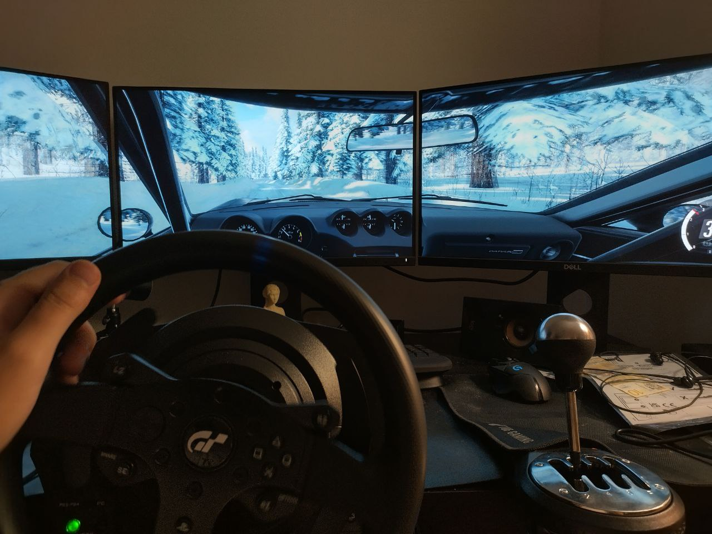
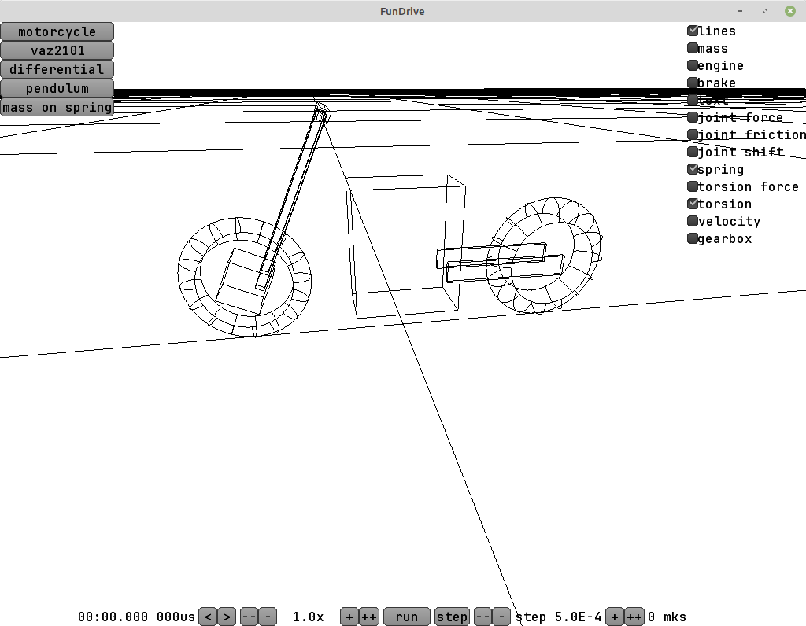
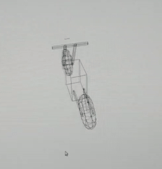
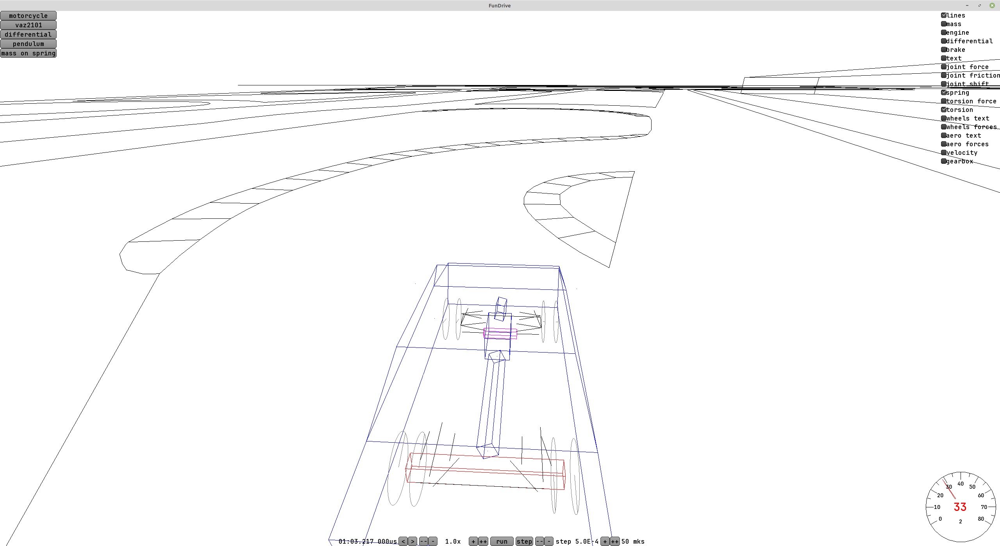
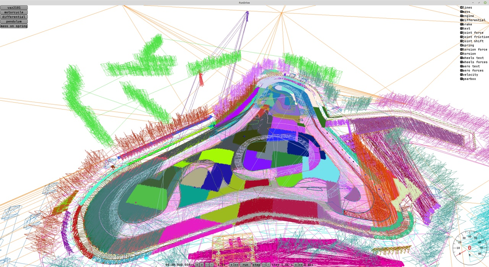
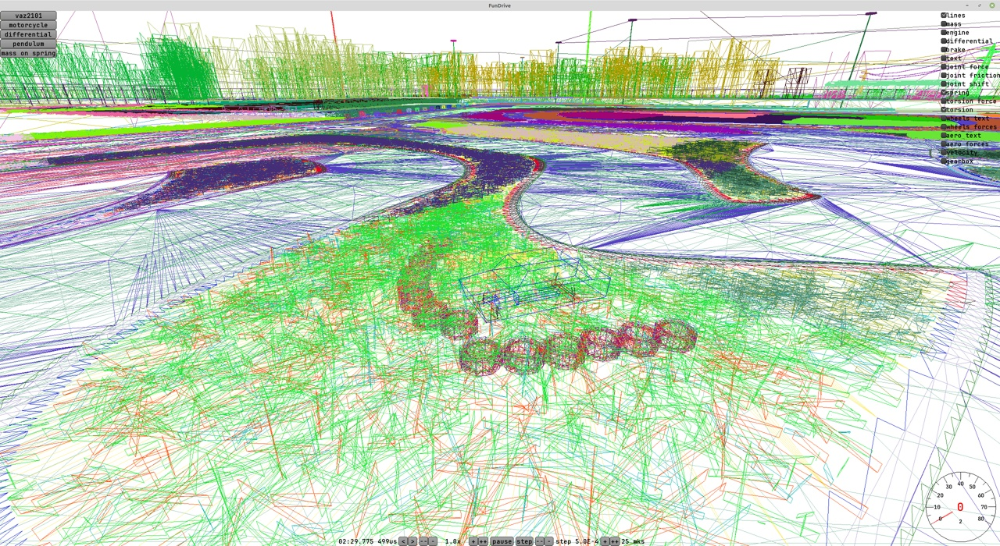
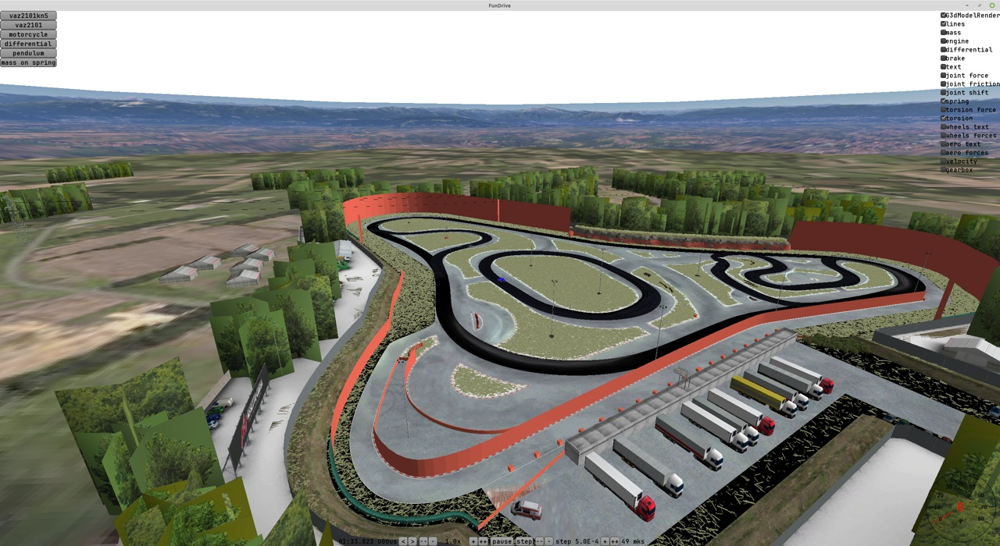
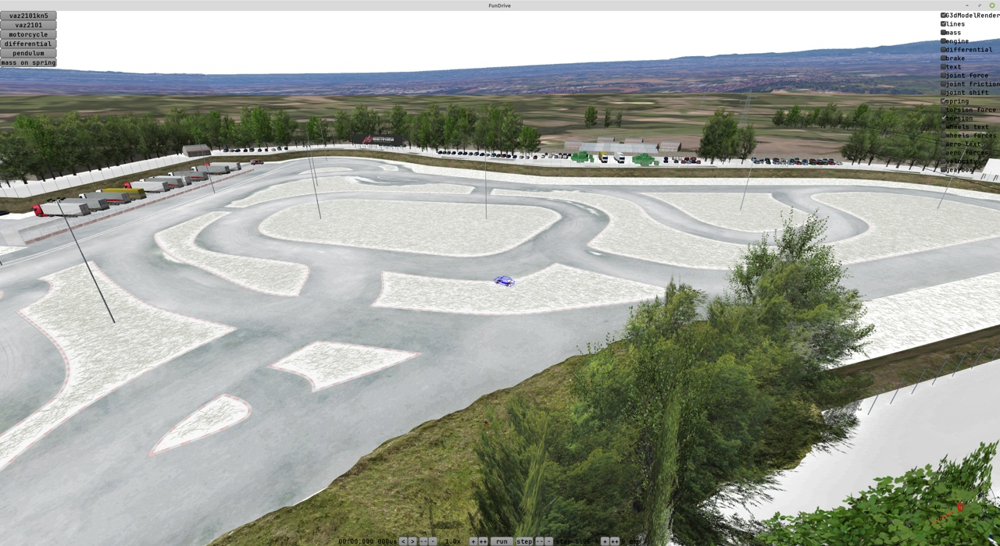

TLDR: I hooked up a racing wheel and figured out how to use force feedback from my own code.

In reality this path included a whole pile of adventures.

First I ordered a Thrustmaster T300 wheel and waited for it to be delivered. Then I sat down to play DiRT Rally 2.0 and Assetto Corsa and regretted not buying a wheel sooner. I definitely enjoyed playing. I used to have the same wheel before, but a year and a half ago it burned out and for some reason I kept putting the purchase off.



I invited over a friend with an Oculus Quest 2 and we tried playing in VR. Mixed impressions.

Pros:

1. Freaking awesome immersion, you can turn your head in any direction, look out of the window or even move back to the rear seat. After playing on a regular monitor I was really happy to be able to turn my head toward the direction of travel in a skid, just like some wannabe drifter.
2. It seems I could feel the skids better this way, because I managed to get through the icy section of the track in DiRT Rally noticeably faster than without VR. But I can't claim this with confidence, because afterwards I tried pressing the gas more carefully without VR and kind of started going faster too.
3. In AC I got into a Miata and was very pleasantly impressed. The dashboard, the gear lever, black leather seats with red stitching - everything like in a real car.
4. There were almost no problems with setting up VR. Probably because the game developers took care of it in advance. I didn't notice any lag either.
5. The video stream gets compressed on the GPU and sent to the headset either over USB 3.0 or over Wi-Fi. No video connector needed. I didn't know you could do that, I suspect the picture quality suffered a lot because of it, but from my point of view as a user the connection is very simple and convenient.

Cons:

1. Motion sickness. First, in corners the brain expects g-forces and there aren't any, second, in rally it's just a bumpy road and the car gets tossed around. My friend couldn't handle playing for long, I somehow managed to drive for a while, probably the novelty and the immersion outweighed everything. Later in the evening I had a bit of a headache. In Corsa we drove on asphalt, it's smooth, and there it was an order of magnitude more comfortable.
2. The resolution is really lacking. When 1600 pixels get stretched across the whole field of view, it turns out that even the text on a button is hard to read, never mind a corner far ahead on the track. I was driving like the hedgehog in the fog, and while on slow icy corners that wasn't a problem, on fast asphalt sections it was bad.
3. For some reason the shadowed places looked completely dark and without detail, and the bright ones - like overexposed blobs. Maybe I should have fiddled more with the gamma and contrast settings, but I couldn't get a good picture, even though on a regular monitor everything looks gorgeous. Maybe the video compression is also to blame here.
4. In games the position of the "center" sometimes gets lost, so you can end up on the rear seat of the car, or in VR see the steering wheel not where it is in reality.
5. If the VR headset shifted on my head even a tiny bit, the picture became very blurry. I had to keep adjusting it or holding it with my hand.

Overall - it's worth trying, but I'd hardly want to play like this all the time. Ideally the picture resolution should be raised to an honest 4k per eye (like Apple's headset, for example).


But ok, back to developing the game.

On Linux force feedback didn't work by itself. The wheel shows up as a joystick with axes, but without feedback. There's a driver [on GitHub](https://github.com/Kimplul/hid-tmff2), with it everything started working.

For talking to the wheel there's the SDL library ([Simple DirectMedia Layer](https://www.libsdl.org/)) with a C interface. As I understand it, that's what everybody uses, I came across some plugins for Unity and Godot.

SDL has three separate subsystems - Joystick, Controller and Haptic.

Joystick - the low-level joystick interface, through it you can find out how many buttons, how many axes, what their positions are and so on. A wheel with pedals or a shifter - those are joysticks too.

Controller - a high-level interface for more or less standard controllers with lots of all those console buttons like A, B, triggers and so on. To find out which button number corresponds to what, it uses a description from a file like [gamecontrollerdb.txt](https://github.com/mdqinc/SDL_GameControllerDB/blob/master/gamecontrollerdb.txt)
There are no wheels in this list. If you really want to, you can add a wheel there, but there's no need. And in general the controller subsystem won't be useful to us, don't waste time on it.

Haptic - and this thing is what's responsible for force feedback. You can create effects and send them to the wheel. For example, an effect can create a rotating force on the wheel or make it vibrate along a sine wave.

And the Haptic device is a separate pointer, which you can get from the pointer to the joystick.

For some reason in the examples the effects are made infinite, but to me it seems more logical to give the effect a duration like 30 ms, and if my game hangs, the wheel will just stop instead of trying to spin all the way to the end.


Since my demo is written in Scala and runs on the JVM, I needed to find a wrapper for SDL. libGDX has one - but it only works with controllers. There's [a check there](https://github.com/libgdx/Jamepad/blob/master/src/main/java/com/studiohartman/jamepad/ControllerManager.java#L240) that if a joystick isn't in the list for controllers, it isn't considered a device at all and isn't even shown. If you really want to, you can add the wheel to the list of controllers and see it, but the haptic subsystem won't be there in principle.

There's also an [alternative implementation](https://github.com/electronstudio/sdl2gdx), but in practice it hasn't been updated for four years and there's no haptic there either.

I was already desperate and wanted to finish one of these libraries to fit my needs, but then I stumbled upon just a Java wrapper for the whole of SDL, tried it and it worked. [libsdl4j](https://github.com/libsdl4j/libsdl4j)

The only non-obvious thing - SDL uses a union for the effect, which can hold different "structs", and there's a type field that says what exactly should be pulled out of the union. In the Java wrapper some edge cases leak out, and you have to specify this type twice - in `setType(...)` and then in `constant.type = ...`

```Scala
  val effect = SDL_HapticEffect()

  effect.setType(SDL_HapticEffectType.SDL_HAPTIC_CONSTANT)

  effect.constant.`type` = SDL_HapticEffectType.SDL_HAPTIC_CONSTANT
  effect.constant.direction.`type` = SDL_HapticDirectionEncoding.SDL_HAPTIC_STEERING_AXIS
  effect.constant.direction.dir(0) = 1

  effect.constant.length = effectLengthMs
  effect.constant.attackLength = 0
  effect.constant.fadeLength = 0
  effect.constant.level = (force * 0x7FFF.toDouble).toShort

  val effectId = SdlHaptic.SDL_HapticNewEffect(haptic, effect)

  SdlHaptic.SDL_HapticRunEffect(haptic, effectId, iterations)

  ...
  SdlHaptic.SDL_HapticDestroyEffect(haptic, effectId)
```

Also, while writing this code ChatGPT helped me a lot - it gave much more detailed and understandable code examples for SDL than what I was finding in google. But in places it lied - for example, level is a signed short and the maximum value is 0x7FFF, while GPT suggested using 0xFFFF.

Once I'd figured all this out, I tried controlling the wheel from the game code. Using the force, I "tied" the wheel with a spring to the steering rack inside the physics engine. And it's cool, you can feel what's happening with the wheels. For example, at high speed the wheel gets heavier, and when the front wheels understeer, the self-aligning force on the wheel decreases.

I won't say the wheel behaved in any realistic way or like in racing games - no. It still needs a pile of settings and further work. But feedback on the wheel and being able to turn it to any angle and press the pedals with arbitrary force - that's freaking awesome.

I immediately saw a bug in the brakes, a bunch of problems with the steering and so on. Then I wrote down all my ideas for improvements and fixes - it came out as a list of fifteen items. I have a feeling this is going to take a while.

Also, purely as an experiment, I tried an effect with a sine-wave force. (Roughly like how gamepads can buzz in your hands). For the sine frequency I passed the engine's rotation frequency. And when pressing the throttle I increased the strength of the oscillations. At low revs (around 1000-2000 RPM, 15-30 per second) the wheel copes just fine and shakes in a cool way. At high revs the wheel tries (I went up to 7500 RPM), but apparently the oscillations become small and the drive belts in the wheel damp it all out - as the frequency grows the sensation on the wheel disappears, but the desk starts shaking a little and the wheel itself starts making the sounds of a buzzing little motor.

And yes, the list of fifteen items has an item about engine sound - so that I can tell the revs by ear, instead of torturing the wheel and making sounds of different frequencies with it. Maybe if it were a direct drive wheel, the shaking would work fine at high frequencies too.

My attempts to model everything myself periodically lead me to very interesting questions. For example, if a car's throttle is half open, what will the power be? After some thinking I came to the conclusion that at low revs the engine consumes little air, which means that even through a half-open throttle a lot of air will get in and the torque will be clearly more than "half".

How did I figure this out? I tried to pull away, smoothly releasing the clutch and adding gas. And I suspected that it looked way too unlike reality.

By the way, a whole bunch of racing games are guilty of something like this, and the process of pulling away with the pedals is usually wrong.

Also, out of curiosity I experimented in different games and started noticing janky bits.

1. Forza Horizon 4 - the wheel reacts to a skid as if with a delay, if you put the left or the right wheels onto the shoulder and hit the gas or brake - the car won't spin around, it just goes straight.
2. DiRT Rally 2.0 - if you press the gas, the revs sharply jump up by about a thousand RPM, release it - they sharply drop. As if the wheels are much softer than in reality and start slipping very noticeably at any press of the gas. And the reactions on the wheel are very soft, to turn you have to really swing the wheel around even on asphalt. These effects are normal, but they should be a lot smaller.
3. Assetto Corsa - I dug into the game's resources to see how they calculate acceleration when you press the gas pedal. They have two tables - one for the maximum torque and a second one that maps the pedal position to torque slightly non-linearly. (Roughly speaking, at 10% pedal you immediately get 30% of the torque, and after that the growth gets weaker and weaker). To be honest, I expected to see a 2d table there like "torque depending on revs and on gas pedal position". In a table like that you could encode a bunch of interesting effects for a naturally aspirated engine, but it's not there :(

Maybe later I'll write a loader for Corsa's resources, there's a bunch of interesting little numbers inside for tires and suspension that somebody has already tuned.

All in all - now I have a wheel and a bunch of ideas for improving the demo. When I'm done with the physics - I'll think about choosing a game engine, and for now I'm trying different things and learning lots and lots of new stuff.


## UPD

It seems I've already outgrown libGDX and right now it gets in the way more than it helps. Somebody wrote that it's easy to bolt your own physics engine onto Godot - I'm waiting in the comments for a story of how to do it and links with examples.

Things that weren't there out of the box and that I wrote myself:

1. Support for a wheel with force feedback via SDL.
2. Attaching sound to objects in 3d. I hooked up miniaudio, now left-right and nearer-farther can be heard properly.
3. No fast ECS. (Here the complaints are more about the specifics of the JVM than about libGDX).

What the problem with ECS is - in languages like C++ an ECS can lay out all components of one type simply in one array, access to them will be a linear read from memory, while in the case of Java the objects are scattered any old way and there's nothing you can do about it.

In the end I got a homemade Frankenstein, in which I managed to move almost everything out into components, but one type had to stay as a field in Entity. Because the physics engine very often reaches into the component for the state of the physical body, where the position, velocity, moment of inertia and the force accumulator are stored. And the access is in random order. For example, to add the force from a spring you need to look at the places of the two attachment points on two different bodies.

I did two experiments and in both the performance dropped several times over. In the end I decided that speed matters more than code beauty and left this field in Entity.
Experiment 1: like for the other components, I simply used HashMap[Entity, PhysicsBody] and went there instead of accessing the field. Terribly slow.
Experiment 2: Replaced the Entity type with Int, and for PhysicsBody made an array where the needed object sat at the index.
Performance dropped by a factor of two or three, and it seems the JIT started coping worse, because the performance was very unstable and after ten seconds or so it settled on something stable, but two or three times slower than with access to the field in Entity.



This week, as an experiment, I tried making a motorcycle model in the game. And it turned out freaking awesome - almost right after the initial settings it rode. And, like a real motorcycle, it was stable at speed, and you had to steer it by countersteering. This is achieved thanks to the fork rake angle and the trail.

Overall this is very cool and means that my physics engine works quite properly and can be used for something serious. It seems it properly handles things like the precession of rotating bodies, which, in a case with a bunch of bodies, good luck calculating analytically.



Problems that I haven't solved (and why I want to move to something like Godot/Unity/UE):
libGDX has no object editor. I can't just take a scene, throw onto it components for wheels, springs, dampers, an engine, a gearbox, a differential, and assemble a vehicle out of them in the engine's editor. And I won't make an asset out of this thing either.

Instead I have to describe all the relationships in code, and it takes a very long time. On top of that I have to get distracted by all sorts of things like sound, input-output, graphics, camera movement logic and so on. Right now it's all homemade, I'd like to use something ready-made and not get distracted.

## UPD 2024-12-03

As an experiment I threw together a flat track out of lines. Actually I liked this approach - no need to think about textures and spend time on detailing. You can just sketch the outlines in Blender and drop them into the engine. That's enough to somehow judge the car's handling and match up the sizes of the models. The whole map in obj weighs about 50 kilobytes and is easily parsed by a homemade parser. The standard obj parser from libGDX expects to see polygons instead of lines and can't digest these files.



## UPD 2024-12-04

I tried loading resources from Assetto Corsa. Their storage format is binary, but fairly simple, and there's already code on GitHub that parses it: [github.com/RaduMC/kn5-converter/blob/master/kn5%20converter/Program.cs](https://github.com/RaduMC/kn5-converter/blob/master/kn5%20converter/Program.cs)

All that's left is to rewrite it for my programming language.

Briefly about the format and how a scene is organized in the kn5 format - the scene consists of a tree of nodes. Each node has a name and a list of children. There are three kinds of nodes - a node with a transformation matrix, a node with a mesh and a node with an animated mesh. Empty nodes show up in the files - it seems they're also used as placeholders, so that later a wheel or something else can be added at that position.



For now, in my minimalist style, I drew only lines, without polygons, each node in its own random color. But it seems I have some mistake in the indices - the chunks of ground are filled with lines somehow very densely and you can't see the triangles.

Also right inside there are textures stored in dds and some material parameters for shaders. But the shaders themselves are who knows where.



## UPD 2024-12-13

Fixed the loading, added textures.
I spent a lot of time fighting libGDX. In my opinion there's a lot of overengineering in this engine and some simple things are done in a complicated way, and on top of that, to use libGDX you need to know both how OpenGL works and how the reinvented wheels on top of it work in the engine. And for something complex the engine is a poor fit, for example there's no support for loading dds textures in the engine.
I found some external library (gdx-dds), but when trying to load some of the textures it throws exceptions. So instead of calling "load texture" I end up wasting time.

In my opinion an example of overengineering: [RenderContext.java](https://github.com/libgdx/libgdx/blob/master/gdx/src/com/badlogic/gdx/graphics/g3d/utils/RenderContext.java) - to use it, you have to read its code in full, and then understand that under the hood it remembers something and somehow calls OpenGL.

What made me rage the most was a bug with texture coordinates. Try to find the mistake:

```Scala
val mesh = new Mesh(
    true,
    node.verticesData.length,
    node.indices.length,
    new VertexAttribute(VertexAttributes.Usage.Position, 3, ShaderProgram.POSITION_ATTRIBUTE),
    new VertexAttribute(VertexAttributes.Usage.Normal, 3, ShaderProgram.NORMAL_ATTRIBUTE),
    new VertexAttribute(VertexAttributes.Usage.TextureCoordinates, 2, ShaderProgram.TEXCOORD_ATTRIBUTE),
    new VertexAttribute(VertexAttributes.Usage.Tangent, 3, ShaderProgram.TANGENT_ATTRIBUTE),
)
```

The mistake is that for texture coordinates it should be like this:

```Scala
ShaderProgram.TEXCOORD_ATTRIBUTE + "0"
```

There's not a hint in the engine that texture coordinates should have a zero or some other digit at the end.



## UPD 2024-12-15

On Mr F's advice I tried using MSAA and turning on alpha to coverage. It's wonderful! A freaking awesome, forgotten technology of the ancients. With MSAA 16x I got an almost perfect picture for semi-transparent objects by literally adding a couple of lines. You can see artifacts if you want to, but I don't want to complicate the code and use more complex approaches. Right now my main focus is specifically on working out the physics, almost any graphics will do.


