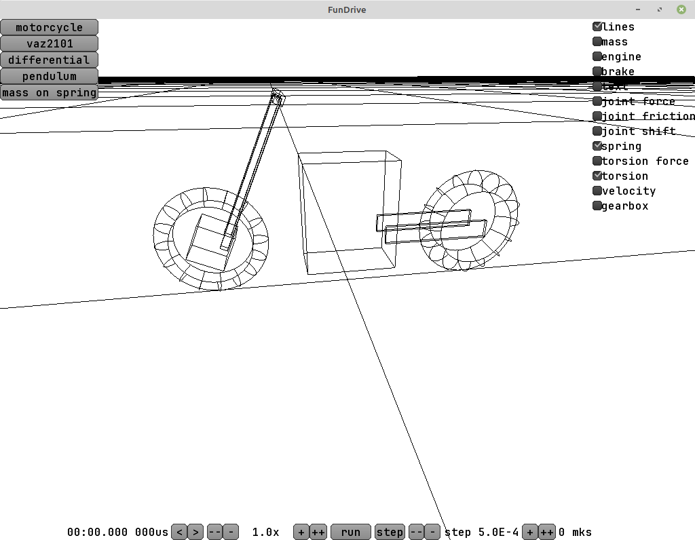
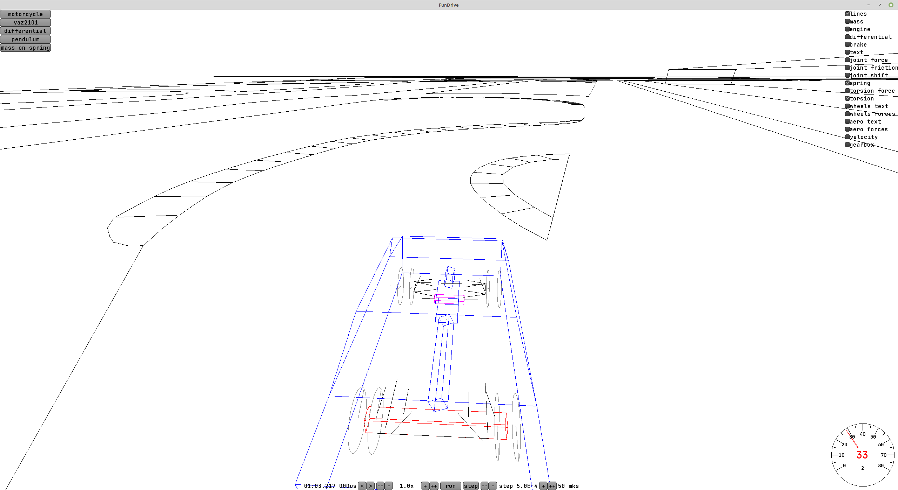
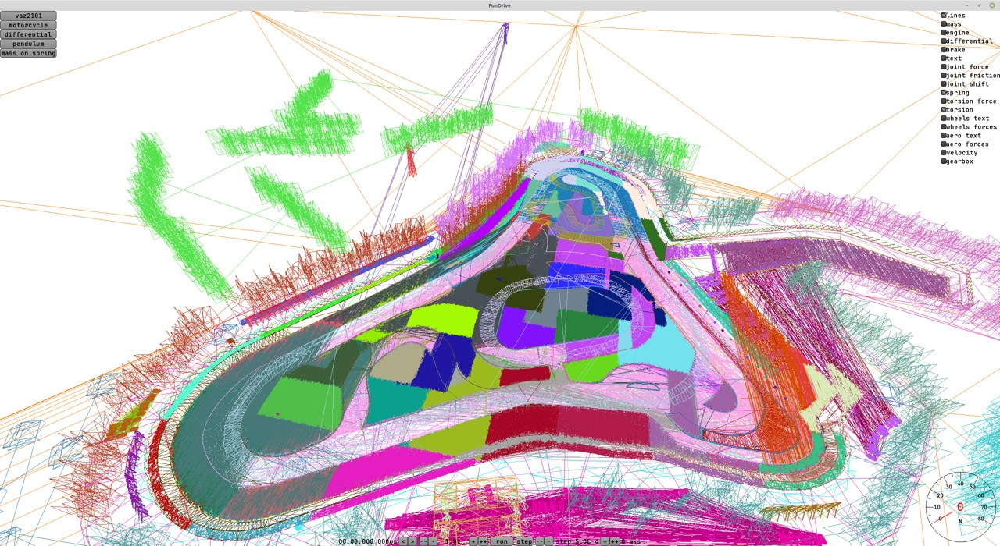
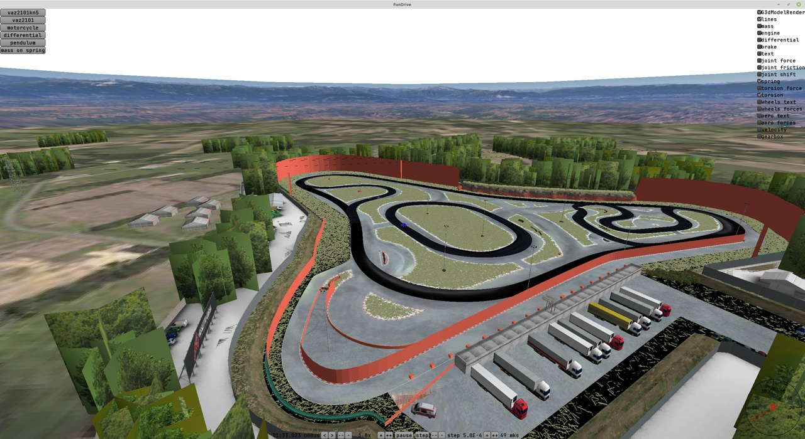
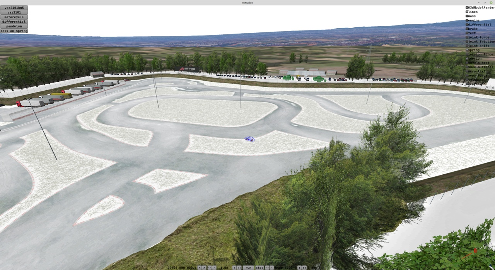

P.S. Пост дописывается со временем

TLDR: Я подключил руль и разобрался с тем, как использовать force feedback из своего кода.

В реальности этот путь включал в себя целую кучу приключений.

Сначала я заказал руль Thrustmaster T300 и дождался когда его привезут. Потом сел играть в Dirt Rally 2 и Assetto Corsa и пожалел, что не купил руль раньше. Играть определённо понравилось. У меня был такой же руль раньше, но полтора года назад он сгорел и я почему-то откладывал покупку на потом.


Позвал в гости знакомого с Oculus Quest 2 и мы попробовали играть в VR. Впечатления неоднозначные.

Плюсы:

1. офигенное погружение, можно вертеть головой во все стороны, выглядывать из окна или вообще отодвинуться на заднее сиденье. Я после игр на обычном мониторе был очень рад возможности при заносе повернуть голову в сторону движения, прям как мамкин дрифтер.
2. Кажется, я так лучше чувствовал заносы, потому что ледяной участок трассы в Dirt Rally мне удалось проехать заметно быстрее, чем без VR. Но тут я не могу с уверенностью утверждать, потому что я после этого попробовал без VR нажимать на газ аккуратнее и вроде как тоже начал ехать быстрее.
3. В AC я сел в миату и был очень приятно впечатлён. Приборная панель, рычаг переключения передач, чёрные кожанные сиденья с красной строчкой - всё как в настоящем авто.
4. C настройкой VR проблем почти не было. Наверно, потому что разработчики игр заранее об этом позаботились. Тормозов я тоже не заметил.
5. Видеопоток жмётся на видеокарте и отправляется на очки либо по usb 3.0, либо через wifi. Видеоразъём не нужен. Я не знал что так можно, подозреваю что из-за этого сильно страдало качество картинки, но с точки зрения меня как пользователя подключение очень простое и удобное.

Минусы:

1. Укачивает. Во-первых мозг в поворотах ожидает перегрузку, а её нет, во вторых в ралли просто неровная дорога с кочками и машину мотыляет. Друг долго играть не осилил, я как-то покатался, наверно чувство новизны и погружения всё перевесило. Потом вечером немного болела голова. В корсе мы покатались по асфальту, он ровный и вот там было на порядок комфортнее.
2. Очень не хватает разрешения. Когда 1600 пикселей растягиваются на всю ширину обзора, оказывается что даже текст на кнопке прочитать сложно, не говоря уж о повороте вдали на трассе. Я ехал как ёжик в тумане, и если на медленных поворотах со льдом это не было проблемой, то на быстрых асфальтовых участках было плохо.
3. Почему-то места с тенями выглядели как совсем тёмные и без деталей, а светлые - как пересвеченные пятна. Возможно, надо было ещё покрутить настройки гаммы, контрастности, но я не смог добиться хорошей картинки, хотя на обычном мониторе всё выглядит шикарно. Возможно, тут ещё виновато сжатие видео.
4. В играх иногда сбивается положение "центра", в итоге можно оказаться на заднем сидении авто или в VR видеть руль не там, где он в реальности.
5. Если VR очки хоть чуть-чуть сдвигались на голове, картинка становилась очень нечёткой. Приходилось постоянно их поправлять или придерживать рукой.

В целом - попробовать стоит, но постоянно играть я бы вряд ли так захотел. В идеале бы разрешение картинки поднять до честных 4к на глаз (как у Эппловских очков, например).


Но ладно, вернёмся к разработке игры.

В линуксе force feedback сам по себе не заработал. Руль видно как джойстик с осями, но без фидбека. Есть драйвер [на гитхабе](https://github.com/Kimplul/hid-tmff2), с ним всё заработало.

Для общения с рулём есть библиотека SDL ([Simple DirectMedia Layer](https://www.libsdl.org/)) с интерфейсом на Си. Я так понимаю, все её и используют, находил какие-то плагины для Unity и годота.

В SDL есть три отдельных подсистемы - Joystick, Controller и Haptic.

Joystick - низкоуровневый интерфейс джойстика, по нему можно узнать сколько кнопок, сколько осей, какие у них положения и т.п. Руль c педалями или коробка передач - тоже джойстики.

Controller - высокоуровневый интерфейс для более-менее стандартных контроллеров с множеством всяких консольных кнопок типа A, B, курков и т.п. Чтобы узнать, какой номер кнопки чему соответствует, используется описание из файлика типа [gamecontrollerdb.txt](https://github.com/mdqinc/SDL_GameControllerDB/blob/master/gamecontrollerdb.txt)
Рулей в этом списке нет. При большом желании можно руль туда добавить, но не нужно. И в целом подсистема с контроллерами нам не пригодится, не тратье на неё время.

Haptic - а вот эта штука отвечает за force feedback. Можно создавать эффекты и посылать их на руль. Например, эффект может создать вращающую силу на руле или заставить его вибрировать по синусоиде.

Причём Haptic-девайс, это отдельный указатель, который можно получить из указателя на джойстик.

Почему-то в примерах эффекты делают бесконечными, но мне кажется более логичным поставить эффекту длительность типа 30 мс, и если моя игра зависнет, то руль просто остановится, а не будет пытаться докрутиться до конца.


Поскольку моё демо написано на Scala и работает на JVM, понадобилось найти обёртку для SDL. В libgdx есть такая - но она работает только с контроллерами. Там [стоит проверка](https://github.com/libgdx/Jamepad/blob/master/src/main/java/com/studiohartman/jamepad/ControllerManager.java#L240), что если джойстика нет в списке для контроллеров, то его вообще за девайс не считают и даже не показывают. При большом желании руль можно добавить в список контроллеров и его увидеть, но haptic подсистемы там в принципе не будет.

Ещё есть [альтернативная имплементация](https://github.com/electronstudio/sdl2gdx), но по-факту её четыре года не обновляли и haptic там тоже нет.

Я уже отчаялся и хотел доделывать одну из этих библиотек под себя, но потом наткнулся на просто java-обёртку для всего SDL, попробовал и она заработала. [libsdl4j](https://github.com/libsdl4j/libsdl4j)

Единственный неочевидный момент - в SDL для эффекта используется union, в котором могут лежать разные "структуры" и есть поле type, которое говорит что же из union надо доставать. В java-обёртки вылезают какие-то пограничные случаи, и надо этот тип указать два раза - в `setType(...)` и потом в `constant.type = ...`

```{Scala}
  val effect = SDL_HapticEffect()

  effect.setType(SDL_HapticEffectType.SDL_HAPTIC_CONSTANT)

  effect.constant.`type` = SDL_HapticEffectType.SDL_HAPTIC_CONSTANT
  effect.constant.direction.`type` = SDL_HapticDirectionEncoding.SDL_HAPTIC_STEERING_AXIS
  effect.constant.direction.dir(0) = 1

  effect.constant.length = effectLengthMs
  effect.constant.attackLength = 0
  effect.constant.fadeLength = 0
  effect.constant.level = (force * 0x7FFF.toDouble).toShort

  val effectId = SdlHaptic.SDL_HapticNewEffect(haptic, effect)

  SdlHaptic.SDL_HapticRunEffect(haptic, effectId, iterations)

  ...
  SdlHaptic.SDL_HapticDestroyEffect(haptic, effectId)
```

Ещё в процессе написания этого кода мне сильно помог chatgpt - он выдавал куда более подробные и понятные примеры кода для SDL, чем я находил в гугле. Но местами врал - например, level это signed short и максимальным значением является 0x7FFF, а gpt предлагал использовать 0xFFFF.

Когда со всем этим разобрался, попробовал управлять рулём из кода игры. С помощью силы "привязал" руль пружиной к рулевой рейке внутри движка. И это прикольно, можно почувствовать, что происходит с колёсами. Например, на большой скорости руль тяжелеет, а при сносе передних колёс выпрямляющее усилие на руле уменьшается.

Не скажу что руль вёл себя как-то реалистично или как в гонках - нет. Нужна ещё куча настроек и доделок. Но обратная связь на руле и возможность его поворачивать на любой угол и нажимать педали с произвольным усилием - это офигенно.

Я сразу увидел баг в тормозах, кучу проблем с рулевым управлением и т.п. Потом выписал все свои идеи по доработкам и исправлениям - получился список на пятнадцать пунктов. Чувствую, это надолго.

Ещё чисто ради эксперимента я попробовал эффект с силой по синусоиде. (Примерно как игровые джойстики умеют жужжать в руках). В качестве частоты синусоиды передавал частоту вращения двигателя. И при нажатии на дроссель увеличивал силу колебаний. На низких оборотах (около 1000-2000 оборотов в минуту, 15-30 в секунду) руль вполне себе справляется и прикольно дрожит. На высоких руль пытается (я пробовал до 7500 оборотов), но видимо колебания становятся маленькими и приводные ремни в руле это всё демпфируют - с ростом частоты ощущения на руле пропадают, но начинает немножко дрожать стол и издавать звуки жужжащего моторчика сам руль.

И да, в списке из пятнадцати пунктов есть пункт про звук двигателя - чтобы можно было понимать обороты на слух, а не мучать руль и не издавать им звуки разной частоты. Возможно, если бы это был руль с direct drive, то и на высоких частотах дрожание бы нормально работало.

Попытки всё смоделировать самому периодически приводят меня к очень интересным вопросам. Например, если дроссель автомобиля открыт наполовину, какая будет мощность? После некоторых размышлений я пришёл к выводу, что на низких оборотах двигатель потребляет мало воздуха, а значит через даже вполовину отрытый дроссель зайдёт куча воздуха и крутящий момент будет явно больше "половинного".

Как я до этого догадался? Попробовал тронуться, плавно отпуская сцепление и добавляя газ. И заподозрил, что больно уж не похоже на реальность.

Кстати, целая куча гоночных игр чем-то таким грешит и процесс троганья на педалях обычно неправильный.

Ещё я ради интереса поэкспериментировал в разных играх и начал замечать кривые моменты.

1. Forza horizon 4 - руль на занос реагирует как будто с задержкой, если заехать левыми или правыми колёсами на обочину и нажать газ или затормозить - машину не развернёт, она просто едет прямо.
2. Dirt Rally 2.0 - если нажать на газ, обороты резко подскакивают на примерно тысячу оборотов, отпустить - резко падают. Как будто колёса сильно мягче чем в реальности и при любом нажатии на газ начинают очень ощутимо проскальзывать. И реакции на руле очень мягкие, чтобы повернуть надо прям размахивать рулём даже на асфальте. Эти эффекты нормальные, но они должны быть сильно меньше.
3. Assetto corsa - я залез в ресурсы игры посмотреть, как у них считается ускорение при нажатии на педаль газа. У них есть две таблички - одна для максимального крутящего момента и вторая, которая чуть нелинейно отображает положение педали в крутящий момент. (Условно, там при 10% педали получается сразу 30% от крутящего момента, а дальше рост всё слабее). Если честно, я ожидал увидеть у них 2д табличку типа "момент в зависомости от оборотов и от положения педали газа". В такой табличке для атмосферного двигателя можно было бы закодировать кучу интересных эффектов, но её нет :(

Возможно, я потом напишу загрузку из ресурсов от корсы, там внутри куча интерсных чиселок для шин и подвески, которые кто-то уже подобрал.

В общем и целом - теперь у меня есть руль и куча идей для улучшений демки. Когда разберусь с физикой - буду думать про выбор движка, а пока что пробую разные штуки и узнаю много-много нового.


## UPD

Кажется, я уже перерос libgdx и он сейчас больше мешает, чем помогает. Кто-то писал что к godot легко прикрутить свой физический движок — жду в комментариях рассказа как это сделать и ссылок с примерами.

Штуки, которых не было из коробки и я писал их сам:

1. Поддержка руля с force feedback через SDL.
2. Привязка звука к объектам в 3д. Подключил miniaudio, теперь право-лево и ближе-дальше нормально слышно.
3. Нет быстрой ECS. (Тут больше претензии к особенностям JVM, чем к libgdx).

В чём проблема с ECS — в языках типа С++ ECS может разложить все компоненты одного типа просто в один массив, доступ к ним будет линейным чтением из памяти, а в случае java объекты раскиданы как попало и на это никак не повлиять.

В итоге у меня получился самописный франкенштейн, в котором почти всё удалось вынести в компоненты, но один тип пришлось оставить в виде поля в Entity. Потому что физический движок очень часто лезет в компонент для состояния физического тела, где хранятся положение, скорость, момент инерции и аккумулятор для сил. Причём доступ в случайном порядке. Например, для добавления силы от пружины надо посмотреть места двух точек крепления у двух разных нет.

Я сделал два эксперимента и в обоих производительность проседала в разы. В итоге я решил что скорость важнее красоты кода и оставил это поле в Entity.
Эксперимент 1: как и для остальных компоненов, просто использовал HashMap[Entity, PhysicsBody] и вместо обращеня к полю лазил туда. Ужасно медленно.
Эксперимент 2: Заменил тип Entity на Int, для PhysicsBody завёл массив, где по индексу лежал нужный объект.
Производительность просела раза в два-три, и кажется JIT стал хуже справляться, т.к. производительность была очень нестабильной и где-то через десяток секунд устаканаливалась на чём-то стабильном, но раза в два-три более медленном чем с доступом к полю в Entity.



В эту неделю попробовал ради эксперимента сделать в игре модель мотоцикла. И это офигенно получилось — почти сразу после начальных настроек он поехал. Причём, как и настоящий мотоцикл, на скорости он был устойчивый, а рулить надо было контррулением. Это достигается за счёт угла наклона вилки и трейла.

В целом это очень круто и значит, что мой физический движок вполне нормально работает и его можно использовать для чего-то серьёзного. Кажется, что он нормально обрабатывает штуки типа прецессии вращающихся тел, которую аналитически в случае с кучей тел фиг посчитаешь.


Проблемы, которые я не решил (и почему хочу перейти к чему-то типа Godot/Unity/UE):
В libgdx нет редактора объектов. Я не могу просто взять сцену, накидать на неё компонентов колес, пружин, амортизаторов, двигателя, коробки передач, дифференциала и в редакторе движка собрать из них транспортное средство. И ассета из этой штуки я тоже не сделаю.

Вместо этого приходится описывать все взаимосвязи кодом, получается очень долго. Вдобавок приходится отвлекаться на всякие штуки типа звука, ввода-вывода, графики, логики движения камеры и т.п. Сейчас это всё самописное, хотелось бы использовать что-то готовое и не отвлекаться.

## UPD 2024-12-03

В качестве эксперимента накидал плоскую трассу из линий. Вообще мне понравился такой подход — не надо думать про текстуры и тратить время на детализацию. Можно просто накидать контуры в Blender и закинуть в движок. Этого достаточно, чтобы как-то оценить управляемость машины и сопоставить размеры моделей. Вся карта в obj весит около 50 килобайт и легко парсится самодельным парсером. Стандартный парсер obj от libgdx ожидает увидеть полигоны вместо линий и эти файлики не переваривает.



## UPD 2024-12-04

Попробовал загрузить ресурсы из Ассето Корсы. Формат хранения у них бинарный, но довольно простой и на гитхабе уже есть код, который его парсит: [github.com/RaduMC/kn5-converter/blob/master/kn5%20converter/Program.cs](github.com/RaduMC/kn5-converter/blob/master/kn5%20converter/Program.cs)

Осталось только под свой язык программирования переписать.

Если кратко по формату и организации сцены в формате kn5 — сцена состоит из дерева нодов. У каждой ноды есть имя и список дочерних. Видов нод три — нода с матрицей преобразования, нода с мешем и нода с анимированным мешем. В файлах попадаются пустые ноды — кажется, их ещё используют в качестве зашлушек, чтобы потом по этой позиции добавить колесо или ещё что-то.



Я пока в своём минималистичном стиле нарисовал только линии, без полигонов, каждую ноду своим рандомным цветом. Но кажется у меня какая-то ошибка в индексах — куски земли как-то очень плотно залиты линиями и треугольников не видно.

Так же прямо внутри хранятся текстуры в dds и какие-то параметры материалов для шейдеров. Но сами шейдеры хз где.


## UPD 2024-12-13

Поправил загрузку, добавил текстуры.
Много времени потратил на борьбу с libgdx. На мой взгляд в этом движке много оверинжиниринга и какие-то простые вещи делаются сложно, а вдобавок чтобы использовать libgdx, надо знать и как работает openGL, и как работают велосипеды в движке поверх него. А для чего-то сложного движок слабо подходит, например поддержки загрузки dds текстур в движке нет
. Я нашёл какую-то внешнюю библиотеку (gdx-dds), но она на попытке загрузки каких-то текстур кидается исключениями. В итоге я вместо вызова «загрузить текстуру» трачу время.

На мой взгляд пример оверинжиниринга: [RenderContext.java](https://github.com/libgdx/libgdx/blob/master/gdx/src/com/badlogic/gdx/graphics/g3d/utils/RenderContext.java) — чтобы его использовать, надо целиком прочитать его код, и потом понять что под капотом он что-то запоминает и как-то вызывает openGL.

Больше всего я сгорел с бага с текстурными координатами. Попробуйте найти ошибку:

```Scala
val mesh = new Mesh(
    true,
    node.verticesData.length,
    node.indices.length,
    new VertexAttribute(VertexAttributes.Usage.Position, 3, ShaderProgram.POSITION_ATTRIBUTE),
    new VertexAttribute(VertexAttributes.Usage.Normal, 3, ShaderProgram.NORMAL_ATTRIBUTE),
    new VertexAttribute(VertexAttributes.Usage.TextureCoordinates, 2, ShaderProgram.TEXCOORD_ATTRIBUTE),
    new VertexAttribute(VertexAttributes.Usage.Tangent, 3, ShaderProgram.TANGENT_ATTRIBUTE),
)
```

Ошибка в том, что для текстурный хоординат должно быть так:

```Scala
ShaderProgram.TEXCOORD_ATTRIBUTE + "0"
```

В движке ни намёка на то, что текстурные координаты должны быть с нулём или ещё какой-то цифрой в конце.



## UPD 2024-12-15

По совету Mr F попробовал использовать MSAA и включить alpha to coverage. Это прекрасно! Офигенная, забытая технология древних. С MSAA 16x получилась почти идеальная картинка для полупрозрачных объектов буквально добавлением пары строчек. Артефакты при желании можно увидеть, но усложнять код и использовать более сложные подходы я не хочу. Сейчас у меня осовной упор именно на проработку физики, графика подойдёт почти любая.


