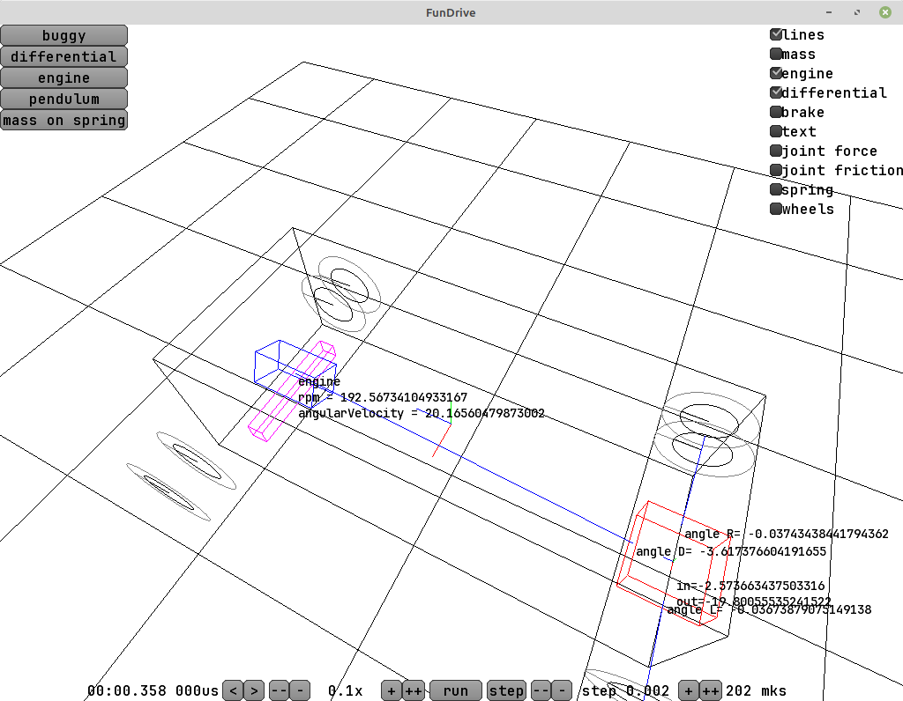
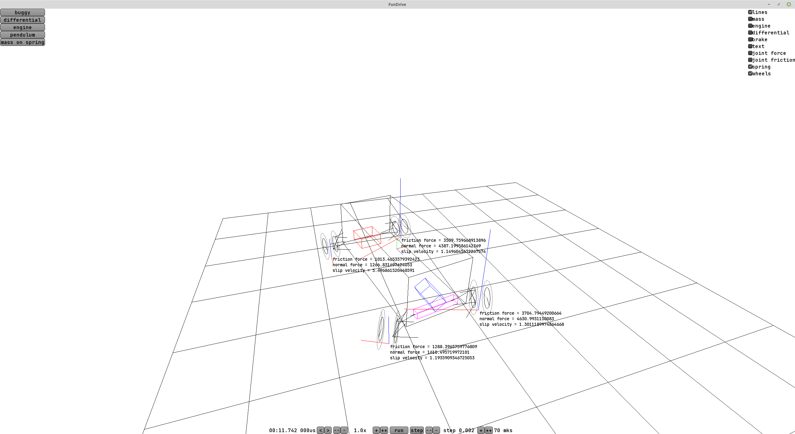

At first I optimistically assumed I'd make the demo in two or three weeks, in the end it stretched into three months of development in the evenings and it's still very far from finished.

My approach is radically different from ordinary games, where they just shoot a ray down with a raycast and put the wheel at the point where it hits the ground.

The physics engine is my own and it lets me do as many as 10000 physics steps per second and compute every single control arm in the car's suspension. A whole lot of points follow from that right away:

1. Since the suspension parts are light and the forces on them are large, you have to take a very small time step for the computation to be stable. Roughly speaking, a control arm is attached to the body through a rubber bushing and the allowed displacements are on the order of a millimeter.

2. I have to figure out and build all these control arms like in reality, and words like "toe, camber, caster, Ackermann angle, scrub radius" are all concepts you actually need. And while the engine power of, say, a Zhiguli (Lada) is easy to find, the suspension geometry is a problem. The best I found was some sketchy drawings.

3. All the math is in double (not float), because high precision is needed for everything. What's even worse - any code like "if eps < 0.000001" has to be written very carefully, so as not to lose precision and at the same time not divide by zero. A double has about 15 significant digits and I try to keep as many of them as I can. For example, some of the functions for working with quaternions I had to carefully finish writing, working around the edge cases.

4. Besides the suspension parts, a whole bunch of other things popped up - with the gearbox, with the differential and so on. Some of them I didn't know about. For example, on a car with a solid rear axle (the Zhiguli) the torque comes into the differential from the driveshaft along the body, and goes out to the wheels multiplied by 3.9 and turned by 90 degrees. By Newton's law there has to be a reaction torque, and it shows up as the differential housing itself trying to twist. Because of this, on an accelerating car the load on the right and left rear wheels will be slightly different. It's really cool that the physics engine literally forced me to think about this, I went off to read how it is in reality - and that's exactly how it is!

5. I hope that with my approach a bunch of interesting effects will come out automatically, simply because the simulation is close to the real thing. For example, if the driver hits the brake in the air after a jump, the wheels will stop spinning, but by conservation of angular momentum the car body itself will start rotating a little. Or, for example, in motorcycle racing there's a difference between a v4 engine and an inline-four - the v4 fires its cylinders unevenly, and if the wheel loses grip under acceleration - it may have time to catch it again while there's no torque. I'm not sure I'll manage to simulate all of this, but I want to try. If a motorcycle engine spins at 18 thousand revolutions per minute (an upper estimate), that's 300 revolutions per second and about 600 ignitions of the fuel mixture in the cylinders per second. In theory, with ten thousand steps per second even the uneven torque of the engine can be done. But all of this is close to the limit of what's possible.

6. In the future I want to hook up a racing wheel with force feedback and try sending it the forces from the "simulated" steering rack.

Right now the demo is in the state of "there are prototypes of tires-suspension-differential-engine" plus convenient tooling around it for debugging - the ability to rewind time, run the simulation in slow motion or move step by step altogether. In the corner I put checkboxes that turn the display of all sorts of debug information on and off - it helps. I'm not thinking about a game right now - that would be a whole bunch more aspects I don't feel like spending time on.

There are, unfortunately, a lot of bugs, and debugging them is hard. Literally one lost minus sign or a division by zero can wreck everything.

What worries me most is the tire model. If I go the BeamNG way and try to compute the tires as lots and lots of tiny elements - I risk losing performance and being left without 10k physics steps per second. Going the way of arcade racers that just put the wheel on the asphalt - I don't want that either. On top of that I read some serious books on suspension tuning and how tires work - and it's all complicated in there. Under load tires deform and their behavior is described by a graph at best. For example, a wheel with camber holds onto the asphalt better when turning one way and worse when turning the other. But in a turn the weight goes to the outer wheel, and if that one has suitable camber - the car will be able to go faster than a car with vertical wheels. And also if you drive at the limit load - in the front part of the contact patch the rubber will still be holding onto the asphalt, while in the rear part it's sliding. And you can feel this in the wheel (for example, in Assetto Corsa or in reality). Ideally I wouldn't hack this behavior in and would get it out of the tire simulation instead.

Ideally I'd like the model to also work well in cases where the surface is uneven - so that, say, you could hook into a rut, the way they sometimes do in rally.

As far as I understand, one of the most detailed tire models is in Richard Burns Rally - you can lock the wheels under braking and the game will show which bit of the tire got worn off - both graphically and in its effect on handling.

P.S. I don't know what will come of it, I'm moving a lot slower than I planned, but so far I haven't found any reasons why this would be impossible to do.
