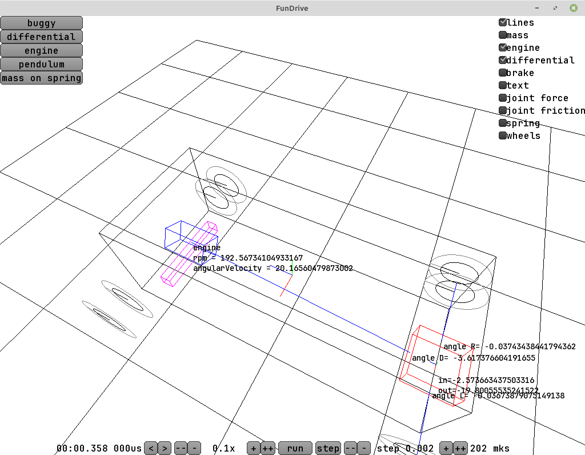
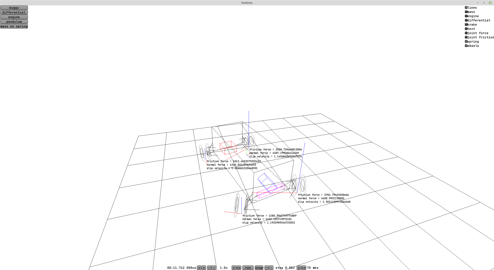

Вначале я оптимистично предполагал, что сделаю демо за пару-тройку недель, в итоге растянулось на три месяца разработки по вечерам и до завершения ещё очень далеко.

Мой подход радикально отличается от обычных игр, где просто пускают рейкастом лучик вниз и в точку пересечения с землёй ставят колесо.

Физический движок самописный и он позволяет делать хоть 10000 шагов физики в секунду и считать каждый рычаг в подвеске авто. Из этого следует сразу много пунктов:

1. Поскольку детали подвески лёгкие, а силы на них большие, надо брать очень маленький шаг по времени, чтобы вычисления были устойчивыми. Условно, рычаг через сайлентблок крепится к кузову и допустимые смещения порядка миллиметра.

2. Надо разбираться и делать все эти рычаги как в реальности, а слова типа "схождение, развал, кастор, угол Аккермана, плечо обката" это всё нужные понятия. И если мощность двигателя условных жигулей найти легко, то с геометрией подвески проблематично. Лучшее что я нашёл - какие-то стрёмные чертежи.

3. Математика вся на double (не float), потому что нужна высокая точность для всего. Что ещё хуже - всякий код типа "if eps < 0.000001" приходится писать очень аккуратно, чтобы не потерять точность и при этом не поделить на ноль. У double около 15 значащих цифр и я стараюсь сохранить максимум из них. Например, некоторые функции по работе с кватернионами пришлось аккуратно дописывать и обходить краевые случаи.

4. Кроме деталей подвески вылезла ещё куча моментов - с коробкой передач, с дифференциалом и т.п. Часть их них я не знал. Например, на машине с задним мостом (жигулях) в дифференциал приходит крутящий момент от карданного вала вдоль кузова, а выходит к колёсам умноженный на 3.9 и повёрнутый на 90 градусов. По закону Ньютона нужен противодействующий момент силы и он выражается в том, что корпус дифференциала сам по себе пытается скрутиться. Из за этого на разгоняющемся автомобиле нагрузка на правом и левом задних колёсах будет немножко разной. Очень прикольно, что движок меня буквально заставил об этом задуматься, я полез читать как оно в реальности - а оно так и есть!

5. Я надеюсь, с моим подходом автоматически получится куча интересных эффектов просто потому, что симуляция близка к реальной. Например, если в полёте после трамплина водитель нажмёт на тормоз, колёса перестанут крутиться, но по закону сохранения момента импульса немножко начнёт вращаться сам кузов авто. Или, например, в мотогонках есть разница между двигателем v4 и рядной четвёркой - у v4 вспышки в цилиндрах происходят неравномерно и если колесо при ускорении теряет зацеп - оно может успеть его поймать обратно, пока нет тяги. Я не уверен, что это всё получится просимулировать, но я хочу попробовать. Если двигатель мотоцикла крутится 18 тысяч оборотов в минуту (оценка сверху), то это 300 оборотов в секунду и около 600 вспышек топливной смеси в цилиндрах в секунду. Теоретически, с десятью тысячами шагов в секунду даже неравномерную тягу двигателя можно сделать. Но это всё близко к пределу возможностей.

6. В будущем хочу подключить руль с форс фидбеком и попробовать на него передавать усилия с "симулируемой" рулевой рейки.

Сейчас демо в состоянии "есть прототипы шин-подвески-дифференциала-двигателя" и удобная обвязка для отладки - возможность перематывать время назад, запускать симуляцию с замедленным временем или вообще двигаться по шагам. В угол я вывел чекбоксы, которые включают-выключают показ всякой отладочной информации - это помогает. Про игру я сейчас не думаю - это будет ещё куча аспектов, на которые не хочется тратить время.

Багов, к сожалению много, и отлаживать их сложно. Буквально один потеряный знак минуса или деление на ноль могут порушить всё.

Наибольшие опасения у меня вызывает модель шин. Если я пойду по пути BeamNG и попытаюсь считать шины как много-много элементиков - я рискую потерять производительность и остаться без 10к шагов физики в секунду. Идти по пути аркадных гоночек, ставящих колесо на асфальт - тоже не хочется. Вдобавок я почитал серьёзные книжки по настройке подвески и работе шин - а там всё сложно. Под нагрузкой шины деформируются и их поведение описывается в лучшем случае графиком. Например, колесо с развалом лучше держится за асфальт при повороте в одну сторону и хуже при повороте в другую. Но при повороте вес уходит на внешнее колесо и если оно с подходящим развалом - машина сможет ехать быстрее машины с вертикальными колёсами. И ещё если ехать с предельной нагрузкой - в передней части пятнка контакта резина будет ещё держаться за асфальт, а в задней скользить. И это можно почувствовать на руле (например, в ассето корсе или в реальности). Было бы идеально такое поведение не костылить и получить из симуляции шин.

В идеале я бы хотел, чтобы модель хорошо работала ещё и в случаях, когда покрытие неровное - чтобы, допустим, было можно зацепиться за колею, как это иногда делают в ралли.

Насколько я понимаю, одна из самых подробных моделей шин в Richard Burns Rally - можно заблокировать колёса на торможении и игра покажет, какой кусочек шины стёртся - и графически, и по влиянию на управляемость.

P.S. Не знаю что получится, двигаюсь сильно медленее чем планировал, но пока что не нашёл причин, по которым это было бы нереально сделать.