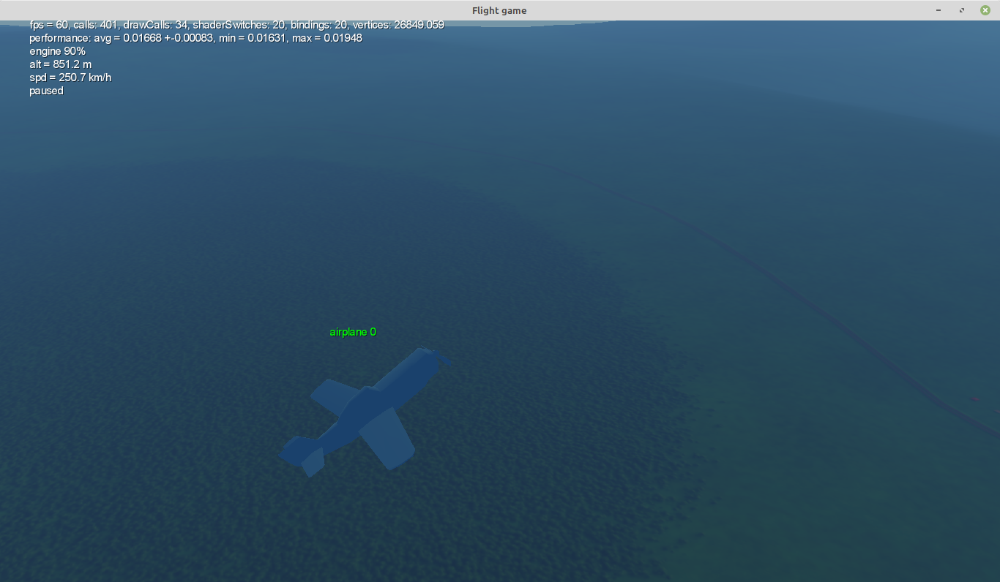
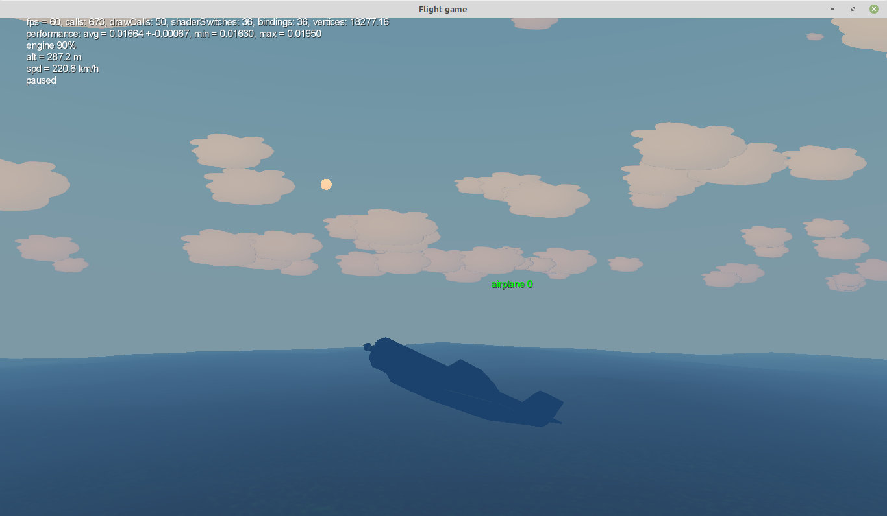
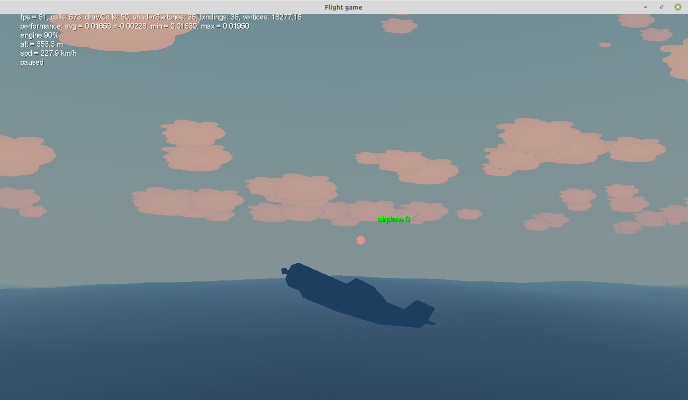
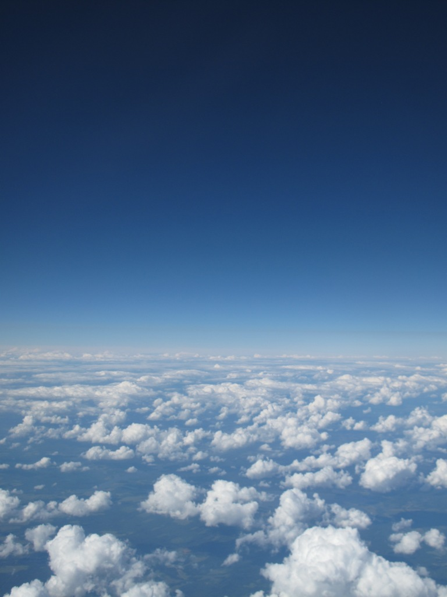
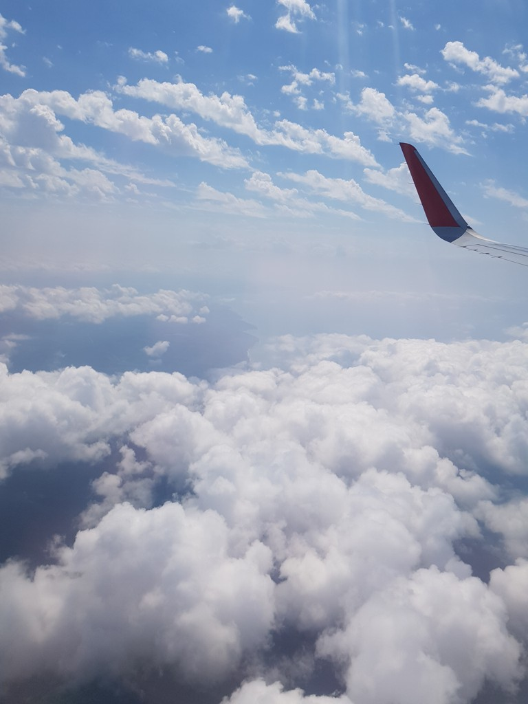
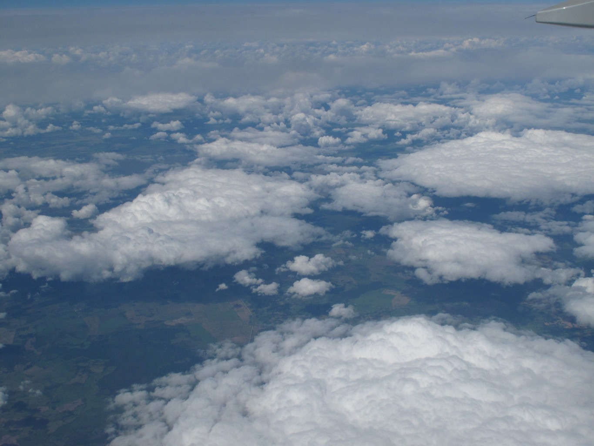
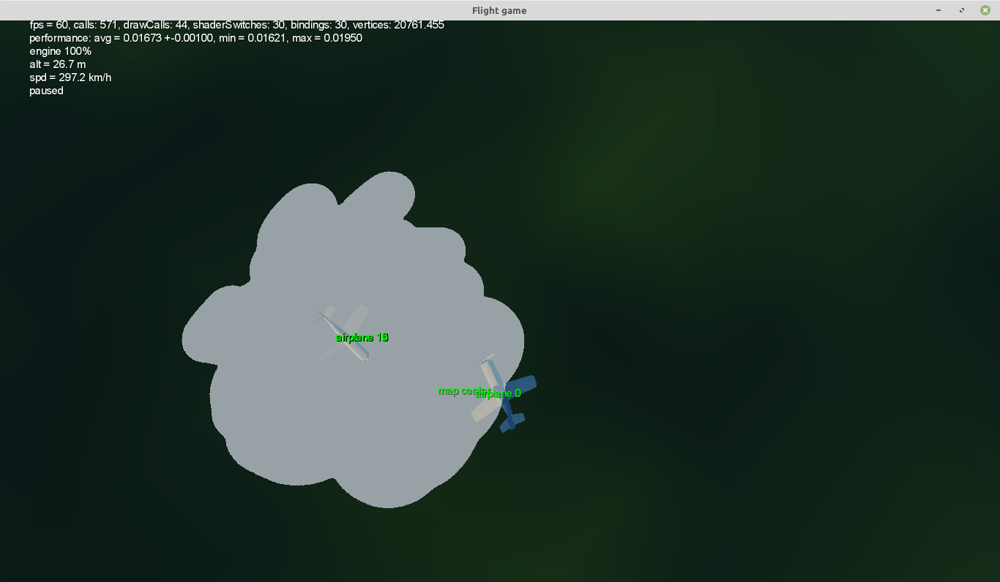
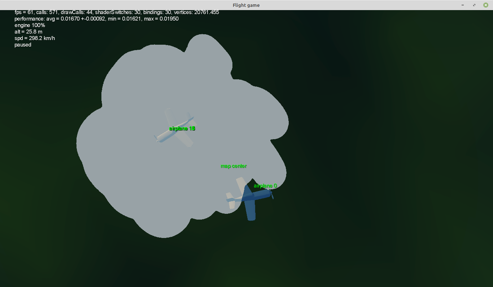

Давным-давно, в 2015 году я написал свою первую статью на хабр: [Пишем простую* игровую физику самолёта](https://habr.com/ru/articles/266367/)

Статья появилась не сама по себе - я писал игру, но так её и не доделал. За предыдущие девять лет я несколько раз возвращался к проекту, что-то улучшал, но по-факту он так и остался на уровне прототипа.

В итоге я решил открыть исходники под MIT-лицензией, чтобы кто угодно мог их посмотреть или как-то переиспользовать: [репозиторий на gitlab](https://gitlab.com/Kright/Dragonfly)

Если интересно почитать о процессе, удачных и неудачных технических решениях и т.п. - читайте дальше.

## Краткая история:

Начал писать игру на третьем курсе института, в 2015 году. В качестве движка выбрал libgdx, в качестве языка - scala.

Я хотел сделать лётный симулятор на телефоне. И в идеале с сетевым режимом. Мобильные игры "три в ряд", которыми был завален google play, меня удручали. Я думал, что на их фоне игра про самолётики будет смотреться просто шикарно. Управление я хотел сделать как в war thunder мышкой в аркаде - чтобы самолёт просто пытался повернуться по направлению камеры.

От libgdx использовал в основном обёртки для ввода и низкоуровневые функции для Open GL. Даже загрузку из obj формата я зачем-то написал свою. Я тогда как раз читал какие-то книжки по графике и хотел всё сделать сам.

Кажется, среди этих книжек были [Game Programming Patterns](https://gameprogrammingpatterns.com/contents.html), [Game Engine Architecture](https://www.gameenginebook.com/) и "Scala для нетерпеливых".

Первый рендер использовал возможности OpenGL ES 2.0. По соврменным меркам они довольно ограниченные: у меня получился простой однопроходный рендеринг, когда модели сразу выводились на экран с каким-то пиксельным шейдером.

Могу ошибаться, но кажется что ES 2.0 нормально поддерживал только argb текстуры с восемью битами на цвет, так что для хранения штук типа карт теней или карты глубины надо было хитро паковать float в rgb компоненты цвета.

Самолётик как-то летал, а больше ничего и не было. Проще сказать что было - самолётик, управление им, а так же плоская земля внизу с какой-то текстурой.

Спустя три года, летом 2018 года я прочитал книжки про open GL и опубликовал на хабре три перевода:

1. [Learn OpenGL. Урок 5.3 — Карты теней](https://habr.com/ru/articles/353956/)
2. [Learn OpenGL. Урок 5.7 — HDR](https://habr.com/ru/articles/420409/)
3. [Learn OpenGL. Урок 5.9 — Отложенный рендеринг](https://habr.com/ru/articles/420565/)

И как нетрудно догадаться, мне захотелось всё это сделать.
Из книжек мне тогда пригодилась "Open gl es 3.0 programming guide".

Я могу ошибаться в деталях за давностью времени, но в Open GL ES 3.0 (или 3.2) появились очень интересные возможности: стало можно рендерить треугольники не на экран, а в текстуру, причём можно одновременно в несколько, а ещё можно было писать в них не argb цвета, а вполне честные float значения.

Не помню по каким причинам, но я создал репозиторий заново и перетащил в него старый проект одним коммитом. Всё что делал дальше, включая переделку рендера, можно увидеть [в истории merge-реквестов](https://gitlab.com/Kright/Dragonfly/-/merge_requests?scope=all&state=merged ) и в истории коммитов.

Сначала я добавил HDR и гамма-коррекцию, потом - отложенный рендеринг.

В рендере я сделал фишку, без которой на мой взгляд невозможен авиасимулятор:
на проходе рендера, когда считается освещение, я учитываю глубину пикселя, высоту, плотность атмосферы и добавляю релеевское рассеяние света.

Получилось очень круто - до этого прохода солнце просто очень далёкий белый кружочек, а небо - очень далёкая чёрная поверхность. Добавление релеевского рассеяния света делает небо синим (и разным цветом в зависимости от высоты над горизонтом - это рассеянный солнечный свет), а солнце при приближении к горизонту становится всё более красным.

А ещё случилось страшное - я поставил на поверхность земли красивую текстуру ~~из яндекс карт~~ и понял, что с ней игра смотрится совершенно иначе, но к сожалению красивые текстуры и модельки нужны для всего - самолётов, наземных объектов и т.п.

И ещё я упёрся в проблему, которую так и не смог нормально решить - я не придумал, как сделать красивые облака.

Требования к облакам у меня были довольно жёсткие:
1. Облака должны быть динамическими.
2. Должны быть полупрозрачными.
3. Объёмные с возможностью посмотреть на них со всех сторон и буквально залететь внутрь.
4. Должны выглядеть как настоящие - затеняться, отбрасывать тени на другие облака и на землю.
5. Облака должны сочетаться с отложенным рендерингом и рассчётом освещения.
6. Телефон должен с этим справляться.

На мой взгляд - для авиасимулятора облака это прям ключевая часть графики и без них не было большого смысла продолжать.
Для демонстрации я покажу несколько фото:

Всё что я писал, можно увидеть: и тёмно-синее небо днём в зените на большой высоте, и рассеяние света, и сложную структуру облаков на разных высотах, и тени от облаков на земле.

Я посмотрел как это сделано в реальных авиасимуляторах, почитал какие-то статьи про графику, но оно выглядело сложно и слишком тяжело для телефона.

Например, один из подходов - ray marching. Т.е., для каждого пикселя пускать лучик, вдоль него брать много точек и суммировать вклад от них. А в идеале ещё от каждой из этих точек пускать лучик (с ещё кучей точек) в сторону солнца и прикидывать, какая освещённость в том или ином месте. Для видеокарты PC такое ещё применимо, но с телефоном у меня большие сомнения.

Ещё у меня была мысль, что вместо полупрозрачности можно использовать dithering. Например, если в шахматном порядке разместить строго прозрачные и строго непрозрачные пиксели, то в принципе "издалека" получится прозрачность 50%. (Кстати, этот эффект есть в GTA 5 при появлении объектов)

При желании подход можно обобщить на любую прозрачность, например пиксель с прозрачностью 0.7 в 30% случаев рисовать как непрозрачный и в остальных откидывать. И ещё надо было сделать, что алгоритм "откидывания" не менялся со временем и не было мерцания.

Но дальше размышлений я не продвинулся и всё заглохло.

Ещё спустя пару лет, весной 2020 года я попробовал ещё немножко доделать игру, но правда занялся не облаками, а попробовал упростить себе жизнь и сделать кое-какие улучшения:

1. Добавил горячую перезагрузку шейдеров (просто чекал дату изменения файла и перезагружал шейдер). Сделать оказалось просто, но очень ускорило и упростило отладку шейдеров.
2. Добавил в игру свободную камеру, паузу и возможность менять скорость течения времени. Это тоже помогло, при программировании какого-то эффекта стало можно выставить камеру как удобно и прям на лету редактировать шейдеры.
3. Добавил подсистему, которая умеет рисовать линии и текст в любом месте экрана. Оказалось очень удобно "цеплять" текст к 3д объектам и выводить какие-то параметры.

Улучшения получились шикарные, я потратил на них буквально пару дней, но кажется что сэкономил несколько недель. Не говоря уж об удовольствии от разработки, когда процесс максимально удобный.

Отложенный рендеринг позволил сделать декали. Это как тени, но на любую поверхность можно спроецировать картинку. Я думал, что я таким образом смогу на поверхность земли накладывать картинки дорог, домиков и прочей мелочи и при этом не создавать тысяч полигонов. Типа внизу может быть плоская земля полигоном 100 на 100 метров, а я при приближении накидаю поверх декалей со всякими мелочами или сделаю какую-нибудь извилстую тропинку.

В итоге декали как-то заработали, но там остались нюансы с mip-map уровнями, и я их так и не доделал.

На картинке демонстрация, как декаль (белая клякса) может накладываться на любую геометрию - в данном случае и на землю и на самолёт.

Я подумал о том, что красивая графика это конечно хорошо, но неплохо бы сделать играбельный прототип. И я добавил самолётиков с очень простым ИИ - они просто летели по моей траектории с задержкой по времени.

Тут меня настигло страшное разочарование!

На пятидюймовом экране телефона не видно ничего! У моего телефона разрешение было около 2960 x 1440px, разглядеть чёрную точку в пару пикселей можно разве что под лупой. Но при этом экран ещё и маленький- даже мой собственный самолётик на экране получился в дюйм или два размером - и это тоже какая-то неубедительная мелочь.

А что хуже - авиасимулятор подразумевает более-менее реальные размеры самолётов и скорость полёта. И это просто фиаско, маленькая вражеская точечка в какой-то момент стремительно увеличивается в размерах и пролетает мимо. На это ещё наклыдывается задумчивое и неточное управление тачскрином и рецепт провала готов.

И ещё в копилочку - на маленьком экране нет погружения в игру. Этот мир просто не воспринимается большим и серьёзным.

До кучи проблема пришла откуда не ждали - вышла scala 3, для которой минимально поддерживаемая версия - java 8, а гугл упорно полноценную поддержку добавлять не хотел. Они везде писали, что поддержка есть, но если на третьей скале собрать бибилиотеку и этот jar подсунуть как зависимость в андроид проект - всё упадёт в рантайме, кажется, из-за [code fence](https://openjdk.org/jeps/171)
[Мини-пруф](https://github.com/scala-android/sbt-android/issues/345):

Относительно недавно появилось какое-то [решение](https://github.com/chenakam/scalroid):  Может быть я попробую перетащить проект на третью.

Но на 2020 год ничего этого не было и я остановился на распутье:

1. Если доделывать игру под телефон, то надо отказаться от реализма и очень сильно подкрутить все параметры, особенно связанные со скоростью, манёвренностью, скороподъёмностью и масштабами игрового мира. Может быть, добавить какие-нибудь самонаводящиеся ракеты или автоматическое прицеливание.
1. Если отказаться от телефона и делать только под PC, то моя самописная графика не идёт ни в какое сравнение с PC играми - там намного красивее и используются возможности видеокарт на всю катушку
2. Не понятно что делать с языком - то ли переписывать код на котлин (что долго), то ли переходить на третью скалу (я очень рад что сейчас появилась возможность, но три года назад оставалось только сидеть и ждать у моря погоды либо попытаться самому как-то модифицировать байткод под андроид).

В 2023 году посмотрел на свой код - а оно всё такое простое, аккуратно написанное. Ещё периодически хотелось знакомым показать код или какие-то идеи, но процесс добавления их в приватный репозиторий всё сильно усложнял - было лень.

Так что я решил открыть код, чтобы желающие могли посмотреть и использовать идеи оттуда.

# Ключевые решения

Я не буду объявлять то или иное решение однозначно удачным или неудачным, выпишу плюсы и минусы для каждого.
Вдобавок, спустя кучу лет и опыта что-то кажется очевидным, но когда-то было не так.

### Выбор движка

Я взял libgdx.

Выбором я доволен, но результат неоднозначный.

Плюсы:

1. Игра почти одинаково работала на ПК и на телефоне, большую часть разработки телефон был не нужен. Разница вылезла только в особенностях работы openGL, но тут уж ничего не поделать. Если на телефоне в шейдере с точностью highp видно ошибки округления, а на компе всё ок - отлаживать придётся именно на телефоне.
2. Движок с открытым исходным кодом. В этом плане сильно удобнее, чем Unity - даже если нет документации, можно почитать исходники, они вполне понятно написаны.
3. Движок является "библиотекой" - он не навязывает архитектуру. Можно взять от движка только нужное, а во всём остальном поиграть в архитектора и сделать всё как захочется. В плане получения опыта это шикарно. В плане контроля происходящего в движке - тоже.
4. Я каждую пару лет обновлял движок на более новую версию и этот процесс не доставлял никаких проблем. На протяжении десяти лет с движком не произошло ничего радикального. Он как был полностью бесплатным, так и остался.

Минусы:

1. libgdx использует свою обёртку над openGL, и новые фичи типа поддержки ES 3.0, ES 3.2 и т.п. появлялись там с задержкой в несколько лет. Местами какие-то фичи работали на PC и не работали на телефоне.
2. Время разработки. Я писал игру, получал кучу опыта, осваивал 3д графику, но если бы я взял какой-нибудь Unity - я бы, наверно, закинул в него несколько моделек, написал бы какую-то логику, закинул это в телефон и намного быстрее бы осознал, что авиасимулятор на маленьком экране играется сомнительно. В принципе, я мог и на libgdx использовать стандартные классы для загрузки 3д объектов, их рисования и т.п., но открывшиеся возможности велосипедостроения сильно увлекли меня и заняли кучу времени.

### Выбор языка

Стоит учесть, что проект начинался в 2015 году.

Из рассмотренных мной вариантов

1. Java - казалась слишком многословной, штуки типа лямбд и прочего под Android только-только появлялись.
2. Kotlin - тоже только появлялся, и, кажется, он ещё не был официальным языком для разработки под Android.
3. Scala - кажется, была на пике популярности, и вдобавок в ней были всякие интересные возможности.
4. C++ - чтобы писать на нём под андроид, надо было очень много знать и уметь. Нормальной поддержки, туториалов и т.п. не было. Вдобавок, на С++ намного проще случайно острелить ноги. Да и не знал я тогда С++, если быть честным.
5. Rust - тем более. Вдобавок я его тоже не знал.
6. C# - он и Unity не понравились по субъективным причинам. Ещё объективный минус - у Unity закрытый исходный код.

По итогу я скажу, что писать код на Scala было очень приятно. Это реально ускоряло разработку и поддерживало (или хотя бы не убавляло) мотивацию писать игру.

### Попытки сделать процесс разработки более удобным

Горячая перезагрузка шейдеров - космически удобная штука. Можно прям в работающей игре "наживую" дописывать шейдеры, тыкать ctrl+s и мгновенно видеть результат.
Удивлён, что я додумался до этого настолько поздно.

[Сделано очень просто](https://gitlab.com/Kright/Dragonfly/-/blob/master/core/src/com/gitlab/kright/dragonfly/engine/opengl/ShaderHotReloader.scala?ref_type=heads): достаточно запомнить время последнего изменения файлов с кодом пиксельного и фрагментного шейдера, при изменении любого из них перезагрузить шейдер.

Паузу, изменения скорости времени и свободную камеру сделать очень просто, в дальнейшей отладке игры и графики это очень помогало.
Отладочные объекты и текст поверх рендера: тоже очень нужно, сделать несложно, польза огромная.

Всё выше перечисленное добавилось легко и быстро, удобства позволили сэкономить кучу времени. Наверняка можно не останавливаться и придумать ещё что-то крутое: возможно, перезагрузку моделей и текстур на лету и в идеале hot reload для кода. Я знаю как такое сделать для java, но не уверен что будет так же просто сделать для Scala.

В общем и целом - "удобства" не нужны для самой игры, но они прекрасно окупаются ускорением разработки. Хотя казалось бы это "шаг в сторону".

### Геймдизайн

Основой в игре является геймдизайн. К сожалению, я начал задумываться про него слишком поздно. В игре может быть сколь угодно красивая и уникальная графика, но без интересного геймплея игроков не будет и никто графику не оценит.

Я как человек с молотком, для которого всё является гвоздями, слишком много времени уделял написанию движка. А ведь с точки зрения геймдизайна в игре есть очень много важных кусочков: геймплей, UI/UX, игровой баланс, графика, звук и т.п.

### Мотивация

Я делал игру в свободное время, его в институте было не очень много. На старших курсах я начал работать и лучше не стало.
Наверное за полгода или год можно довести проект до играбельного состояния. Моей мотивации хватало на пару месяцев, потом я забрасывал :(

Дополнительной сложностью было то, что кроме программирования требовалось уметь что-то рисовать, делать в 3д редакторе, работать со звуком и т.п., я всё это практически не умел и оттого задача казалась ещё более неподъёмной.

# Итоги

Игру я не сделал. В процессе получил кучу интересного опыта, это бесценно. Стал лучше как программист, узнал много про 3д графику и до кучи освоил Blender для 3д моделирования.

[Код открыл](https://gitlab.com/Kright/Dragonfly): смотрите, берите идеи оттуда, можете присылать пул-реквесты с улучшениями.

Периодически возникает желание доделать до полноценной игры. Но лень. Я понимаю, что от готовой игры сейчас только 10-20% и в одиночку я вряд ли это доделаю за разумное время.  Да и нет видения под что доделывать - на PC графика сильно сложнее и точно надо брать готовые движки, а на телефонах сама идея авиасимулятора не очень жизнеспособная.