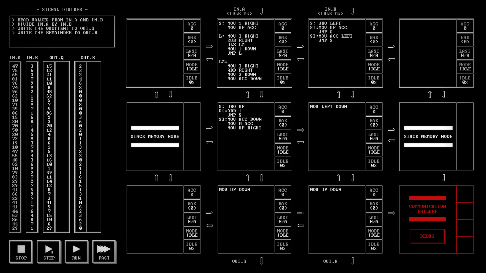
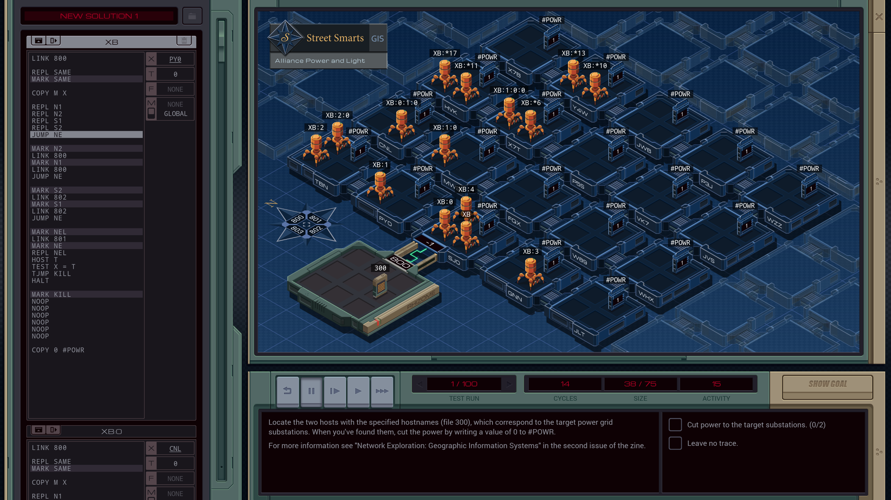
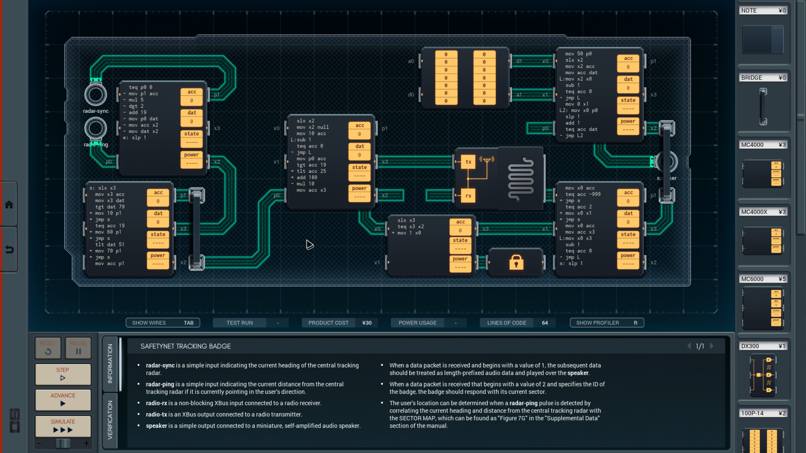
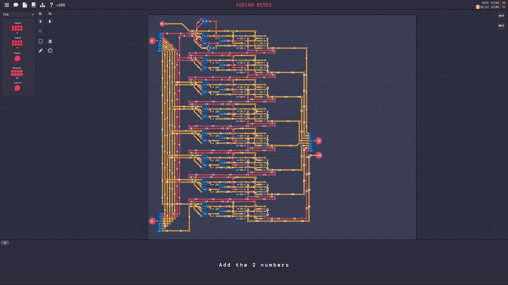
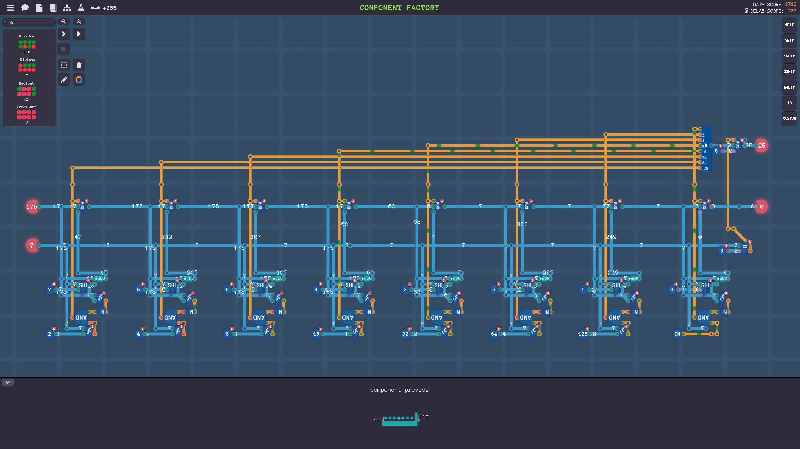
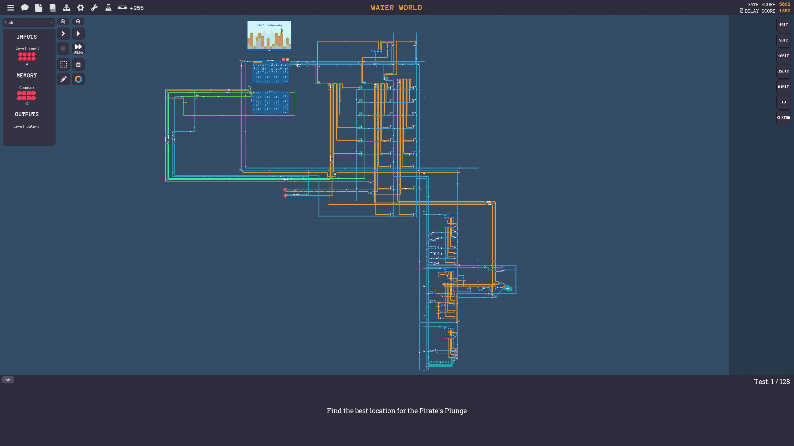

TL;DR

Игры от Zachtronics:

* [TIS-100](https://en.wikipedia.org/wiki/TIS-100)
* [EXAPUNKS](https://en.wikipedia.org/wiki/Exapunks)
* [SHENZHEN I/O](https://en.wikipedia.org/wiki/Shenzhen_I/O)

Про создание процессора от логических элементов и до написания кода на ассемблере:

* браузерная бесплатная [nandgame.com](https://nandgame.com/)
* более продвинутая [Turing complete](https://turingcomplete.game/)

Если Вам нравится какая-то игра из перечисленных - наверно, и остальные тоже подойдут. В каждую из них я наиграл по 30+ часов, получил кучу удовольствия и научился чему-то новому.

Первые три игры - от одного и того же человека и издателя [Zachtronics](https://www.zachtronics.com/), ([Zach Barth](https://en.wikipedia.org/wiki/Zachtronics)), и в чём-то похожи друг на друга.

К каждой игре в дополнение идут журналы в pdf, и их надо читать - там будут описание команд ассемблера, особенности работы процессора и т.п. Ещё скажу, что они добавляют атмосферы игре. Особенно это чувствовалось в SHENZHEN I/O: я на одном мониторе открывал игру и на другом [pdf с описанием работы компонентов](https://github.com/JonathanLemke/shenzhen-io-translate/blob/master/SHENZHEN%20IO%20Manual%20(English).pdf). Появлялось ощущение, что вот я делаю дизайн реальной микросхемы и вообще как самый настоящий разработчик что-то проектирую (кхм-кхм, как будто мне IRL этого не хватает). На седьмой странице мануала есть visa application form, самое то для погружения :P

Ещё скажу, что во всех играх есть юмор и отсылки, например про слежку в Китае и постоянный смог.

В конце уровня показывают гистограммы результатов всех игроков по трём параметрам - например, для Shenzhen i/o это стоимость компонентов микросхемы, время её работы и количество строчек кода. Кроме формального решения задачи можно ещё попытаться найти лучшее решение по какому-то параметру или хотя бы обойти половину игроков.

Все три игры являются наглядной демонстрацией того, что хорошую игру реально сделать в одиночку. Пусть маленькую, пусть без 3д графики и рейтресинга, но зато интересную.

## TIS-100

Особенность игры в том, что вычислители в ней необычные.

Они расположены сеткой 3 на 4 и могут общаться с соседними вычислителями.
Сами ядра максимально примитивные, даже умножать и побитовые операции делать не умеют. У них буквально два регистра, причём второй можно только поменять местами с первым, их даже сложить не получится без помощи от соседних ядер.
В ядро влазит только 15 команд.

Всё хорошо визуализированно, контекст помещаетя на одном экране (состояния всех 12 ядер). Это очень помогает в отладке.

Забавно, что преобразования данных можно разложить в конвейер по ядрышкам и получить приличную скорость работы, когда каждый вычислитель делает пару операций и передаёт результат дальше.

На последних уровнях попадаются довольно жёсткие задачи типа сортировки массива чисел, что в сочетании с очень примитивными вычислителями и ограничениями на размер программы становится серьёзной головоломкой.

На примере - деление двух чисел. 

## Exapunks

В игре атмосфера киберпанкового будущего. Можно читать хакерский чатик и выбирать уровни для выполнения.

Роль вычислителей выполняют наноботы. Я бы сказал, что они являются аналогами процессов - наноботы умеют форкаться, умирать, ходить туда-сюда, таскать с собой файлики и обмениться сигналами.

В этой игре ограничений на размер программы нет. Я наиграл 67 часов, но так и не прошёл до конца - больно уж много уровней.



## Shenzhen I/O

Надо не только программировать, но и располагать на микросхеме элементы и раскидывать задачки между ними. Прям как в tis-100, но количество вычислителей и конфигурацию соединений мы выбираем сами.
На мой взгляд, очень удачное сочетание - микс программирования и пространственной головоломки. Ближе к концу игры бывает, что пространства не хватает и становится сложно.

Есть два вида дорожек - для аналоговых и для дискретных сигналов. И если на микроконтроллере вдруг не хватает нужных ножек - придётся ставить ещё один и как-то с ним общаться.



Мне понравился язык ассемблера - он более удобный, даже умножать можно.

В нём есть conditional execution как в arm!

Команды сравнения ставят conditional flag. Команды с префиксом + или - выполняются, только если есть подходящее состояние флага.

Например, если число меньше 0, то умножится на -1
```
  tlt acc 0
+ mul -1
```

А здесь проверка на то, что acc равен нулю или единице:

```
  teq acc 0
- teq acc 1
+ mov acc dat
```

Это немножко ломает мозг, но в итоге получается заметно компактнее, чем с прыжками по коду. В коде после сравнения можно пропускать или опционально делать команды, перемешанные с обычными, и так до следующего сравнения.

Из команд отмечу slx x0 - она спит, пока по порту типа x0 не придут данные. Если пытаться прочитать их без slx, а с другой стороны микроконтроллер уснёт, то будет "зависание". Пока я не знал этой фишки, приходилось извращаться.

Ещё, кстати, можно использовать одну шину для нескольких микроконтроллеров. Это хорошо работает в режиме "много передатчиков - один приёмник" и плохо для нескольких приёмников (по крайней мере, я не придумал как сделать хорошо).

# Nandgame и turing complete

В институте у меня не было подходящих предметов, я ничего не знал ни про Verilog, ни про VHDL, ни про дизайн микросхем. Я много лет хотел с ними разобраться, но как-то не находил времени. Вдобавок я слышал, что обучающиеся по подходящему профилю студенты могут сделать свой процессор в качестве диплома, и мне казалось, что это всё-таки сложно.

Я читал как haqreu собирает [троичный компьютер](https://habr.com/ru/articles/496366/) и это казалось магией.

Так вот, благодаря этим двум играм я начал что-то понимать. В играх есть условности, упрощения, но зато всё наглядно и прогрессия уровней аккуратно ведёт игрока от самого простого прямо до создания процессора.

Начальные уровни обоих игр похожи (типа сложения двух бит, трёх бит, операций для двух байтов и т.д.), потом сложность растёт, в какой-то момент получается процессор, а дальше надо программировать под него.

Отличия начинаются где-то на средних уровнях, в nandgame получается слишком уж простой процессор с парой регистров, и писать код для него больно. В итоге чувства смешанные - я прошёл игру, но чего-то не хватало.

Из плюсов nandgame укажу, что в ней очень интересный дизайн АЛУ и завязанная на это система команд.

В turing complete тема раскрыта более подробно. В ней по мере прохождения сначала мы собираем какой-то простенький процессор, но, кстати, уже с шестью регистрами и относительно удобный. А потом начинаем всё заново и собираем более продвинутый процессор с другой системой команд и более интересными возможностями. Систему команд можно назвать избыточной, но зато её очень удобно расширять.

Вдобавок, где-то в середине в игре появляется новая фишка - игра начинает показывать задержки компонентов, и можно заморочиться и попытаться ускорить самый медленный путь в микросхеме. Кроме того, можно вернуться к старым уровням и попробовать ускорить базовые компоненты - тогда все микросхемы, которые их используют, тоже станут быстрее. Например, я смог ускорить сложение двух байт в три раза (до 22, если кто захочет повторить).



По ходу прохождения, указания, что добавить в процессор, становятся всё менее конкретными, а потом вообще пропадают.

Например, игра не рассказывает как именно сделать RAM. Я сначала придумал отдельные команды для чтения из памяти и только потом догадался, что можно завести ещё один "как бы регистр", чтобы чтение или запись в него происходили в ячейку RAM по адресу кое-какого другого регистра.

Один из следующих уровней - написать программу для целочисленного деления и нахождения остатка.

Процессор делить не умел - для решения задачи я мог написать какой-то код для деления, а мог добавить новую инструкцию в процессор. Лично мне захотелось сделать инструкцию, а для этого - блок, который на входе принимает пару чисел и на выход отправляет частное и остаток.



В итоговом процессоре получилось что-то около 5600 транзисторов, из них 2700 для модуля деления. Для сравненя - у [PDP-8](https://en.wikipedia.org/wiki/PDP-8) транзисторов было всего лишь 519. То есть схема моего процессора получилась как минимум больше в десяток раз. Наверно, в будущем я попробую в игре собрать максимально простой процессор или повторить какой-то существующий.

В игре есть 16, 32 и 64-битные компоненты, я думаю они именно для экспериментов игроков - для прохождения достаточно восьмибитного процессора.

Мой процессор:


Вверху слева ROM и RAM память, вверху справа регистры и чтение-запись в них, внизу справа - АЛУ.

Маленький кусочек справа от АЛУ - операции со стеком - push, pop, call и ret, с которыми удобно делать вызовы функций. Стек использует свою память отдельно от RAM, она коварно спряталась внутри компонента и её не видно.

P.S.

На написание статьи меня вдохновила шикарная статья [Создание процессора с нуля для чайников](https://habr.com/ru/articles/831934/), в комментариях к которой я узнал про Turing Complete.
Советую её тоже прочитать.
