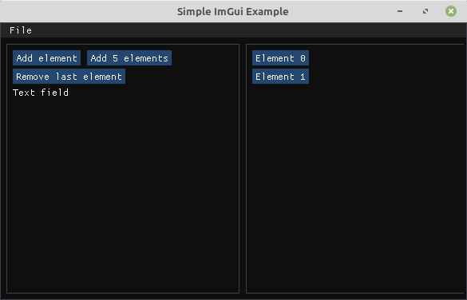

Dear ImGui - это библиотека, в которой можно очень легко и быстро сделать интерфейс. В ней используется очень необычный подход.

Например, если Вы хотите добавить нарисовать кнопку, то достаточно пары строчек кода:

```Python
if imgui.button("Текст кнопки"):
    print("Нажали кнопку!")
```

Это просто верх лаконичности и удобства для программиста. Никаких MVC, MVVM и прочих страшных заклинаний с развесистыми иерархиями объектов. Самое то, чтобы в прототипе накидать несколько кнопок, и уже через минуту уже тыкать их мышкой.

Библиотека сделана для C++ и нужд геймдева, но я буду сразу писать про обёртку для Python. Потому что Python мне ближе, и других удобных способов для рисования интерфейса я не нашёл.

Итак, библиотека может работать поверх разных штук (например, поверх opengl или pygame). Я выбрал glfw.

Сначала надо поставить библиотеку, причём указать что хотим использовать с glfw.
```
apt install imgui[glfw]
```

Дальше надо сделать окно c помощью glfw. Я так подробно описываю шаги, потому что в примерах для pyimgui прыгают сразу к рисованию кнопочек, а без создания окна ничего не заработает.

```Python
import imgui
from imgui.integrations.glfw import GlfwRenderer
import glfw
from typing import List

if not glfw.init():
    print("Could not initialize OpenGL context")
    exit(1)

window = glfw.create_window(1280, 720, "Simple ImGui Example", None, None)
if not window:
    glfw.terminate()
    print("Could not create GLFW window")
    exit(1)

glfw.make_context_current(window)

imgui.create_context()
renderer = GlfwRenderer(window)
imgui.get_io().ini_file_name = None
```

Вот этот код создаёт окно и только после этого мы готовы в нём рисовать.

Дальше можно взять код из примера с imgui и увидеть, что внутри нашего окна появилось какое-то фейковое окошечко, которое можно двигать внутри окна от ОС. Это конечно хорошо, но мне хотелось, чтобы это фейковое окошечко было размером с окно ОС и двигать его было нельзя. Ну то есть, я хочу просто иметь рабочую область размерном с окно, которое создал в glfw.

Кроме того, если делать подвижные окошки внутри большого окна, то их состояние сохранится как раз в ini_file_name. Поскольку это всё не нужно, я это явно отключил.

Теперь напишем функцию рисования и цикл:
```Python
def draw_frame(): ...

while not glfw.window_should_close(app.window):
    glfw.poll_events()
    renderer.process_inputs()
    draw_frame()
    glfw.swap_buffers(app.window)
```

Зададим, чтобы наше "окошко" от imgui было по размеру как окно ОС, никуда не двигалось и не сворачивалось. Я это пишу подробно, потому что, например, chatgpt о такой возможности не знал и мне всё равно пришлось читать документацию и разбираться.

```Python
def draw_frame():
    imgui.new_frame()

    w, h = glfw.get_window_size(window)
    imgui.set_next_window_size(w, h)
    imgui.set_next_window_position(0, 0)

    with imgui.begin("Main Window", False,
                     imgui.WINDOW_NO_RESIZE |
                     imgui.WINDOW_NO_MOVE |
                     imgui.WINDOW_NO_COLLAPSE |
                     imgui.WINDOW_NO_TITLE_BAR |
                     imgui.WINDOW_MENU_BAR):
        pass # тут будет рисование всяких кнопок

    imgui.render()
    self.renderer.render(imgui.get_draw_data())
```

И тут я скажу ещё об одной особенности питона. В С++ версии библиотеки требуется явно вызывать методы для begin и end, например `ImGui::BeginMenuBar()` и `ImGui::EndMenuBar()`. При этом довольно легко ошибиться и закрыть не то, либо закрыть неправильное количество раз. Нейронка об этом опять же не знает, но к счастью разработчики библиотеки на питоне сделали поддержку конструкции `with`

Т.е., вместо
```Python
imgui.begin_menu_bar()
# some code
imgui.end_menu_bar()
```

Можно (и нужно) писать так:
```Python
with imgui.begin_menu_bar():
    # some code
```
или даже так:

```Python
with imgui.begin_menu_bar() as menu_bar:
    if menu_bar.opened:
        with imgui.begin_menu('File') as file_menu:
             if file_menu.opened:
                  clicked, state = imgui.menu_item("Save", '', False, True)
                  if clicked:
                      print("Save")
```

Кстати, в документации в menu_item предлается второй строчкой передавать шорткат типа 'Ctrl+S', он будет показан в UI, но библиотека imgui никак не обрабатывает нажатия клавиш, и вызов сохранения по ctrl+S надо будет сделать самостоятельно. Чтобы не вводить никого в заблуждение, я в качестве второго аргумента передал пустую строчку.

Все элементы типа кнопок и текста располагаются друг под другом.
Если хочется расположить их на одной линии, то надо вызвать `imgui.same_line()`, например так:
```Python
if imgui.button("Кнопка 1"):
    print("нажали 1")

imgui.same_line()
if imgui.button("Кнопка 2"):
    print("нажали 2")
```

Подобно тому, как я создал окно размером с экран, можно сделать дочерний объект, например, в половину ширины окна:
```Python
with imgui.begin_child("Left panel", width=w // 2, border=True):
    # код для создания элементов внутри левой панели

imgui.same_line()
with imgui.begin_child("Right panel", width=w // 2, border=True):
    # код для создания элементов внутри правой панели
```

В итоге получится что-то такое:


Что прикольно, этот код выполняется каждый кадр. Так что всю сложную логику для взаимного расположения объектов можно просто и явно написать в виде кода, ширина панелей вычисляется заново каждый кадр.

На самом деле при вызовах типа "if imgui.button()" библиотека сохраняет все-все управляющие вызовы, и только потом при вызове `imgui.render()` выполнит команды и нарисует интерфейс.

И вообще, эта библиотека для меня является примером лаконичного и изящного программного интерфейса. Её легко освоить и очень удобно использовать.

В геймдеве часто используют всякие нестандартные, но при этом интересные решения, dear imgui одно из них.

Полезные ссылки:

* [Dear imgui](https://github.com/ocornut/imgui)
* [документация к pyimgui](https://pyimgui.readthedocs.io/en/latest/guide/first-steps.html#using-pyimgui)
* [Мой экспериментальный код на Python](https://github.com/Kright/mySmallProjects/tree/master/2025/imgui_experiments)
* [список обёрток для использования из разных языков](https://github.com/ocornut/imgui/wiki/Bindings)


