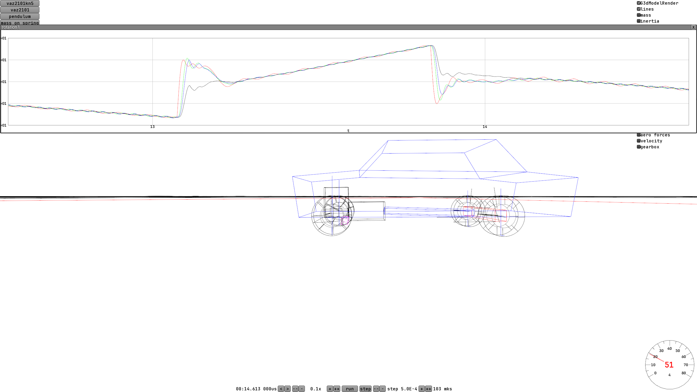

I procrastinated for quite a while and didn't know how to approach the tire model.

# New tire model

I watched all sorts of videos with deforming tires and noticed that the tires usually stay round anyway, they're just slightly shifted or rotated relative to the rim. So now my wheel is two physical bodies - the rim and, separately, a cylinder-tire on little springs.

Suddenly it turned out that even such a simple thing gave interesting effects. For example, on a hard launch the wheel can start bouncing. And the reaction to turning the steering wheel isn't instant, because first the tire moves a bit sideways and only then the reaction shows up at the steering wheel. All in all, the steering got emptier around the center position, and the reaction to a turn can come with a small delay. At high speed this makes the handling twitchier - somewhat like a real Zhiguli (Lada) at speeds above 100 km/h.

The strength of the effect can be varied by changing the tire profile height and the spring stiffness, and I deliberately tested on 13-inch wheels with a very high profile, so that the effect is felt as strongly as possible.

I recorded a short [demonstration](https://www.youtube.com/watch?v=wqt0ylxBqnU
)
In real life the bouncing and the tire shifting relative to the rim can be seen [in drag racing](https://www.youtube.com/watch?v=gXp2QgY1OB8)
They have special very soft tires and very sticky asphalt with an insanely high friction coefficient, so the effects are really easy to see.

Ideally I should develop the tire model further and tune the settings, but I haven't done that yet.

# Limited-slip differential

Instead of the open differential I wrote a universal class for any kind, where parameters set the preload and the degree of locking under acceleration and under engine braking. Open and locked differentials are special cases, when there's no preload and no locking at all, or when the preload is infinitely large.

There are two ways to describe the degree of locking. Either with numbers like 2-3 (when one wheel can get 2-3 times more torque than the other), or with percentages from 0 to 100%. 0% means a fully open differential, 100 % a fully locked one, and, for example, 40% locking means that one wheel can get 30% of the torque and the other 70% = (30% + 40%). And as a number that would be 30:70 = 3:7 = 1:2.333(3).

Besides that, the degree of locking can be different for the cases when the engine accelerates the wheels and when engine braking is going on. For example, in drifting they set it up so that the differential locks under acceleration, and becomes open when you lift off the throttle or press the clutch.

And then there's preload. It's usually done with little springs that press the clutch plates against each other and provide some friction in the differential even at zero engine torque.

Another interesting point - it turns out the preload can go the other way (negative). Then you get a differential that's still open at low torque and only locks at high torque. And in theory you can try making the locking coefficient negative too - for example, so that there's preload with no engine torque, and under engine braking the differential turns into a fully open one.

It's probably something exotic, but I made a universal class "for everything" and from here on it's just a matter of tuning the coefficients.

You can read more about how a differential is built and about the locking mechanisms [on Wikipedia](https://en.wikipedia.org/wiki/Limited-slip_differential).

I drove around on different configurations and came to the conclusion that the limited-slip differential is the coolest option.

So, with an open differential everything's fine, except for one scenario - if you hit the throttle hard in a corner, the inner wheel can start slipping. And it will keep slipping and spinning up, gaining speed, while the outer wheel gets the same torque as the inner one. And another nasty thing - the inner wheel can spin up a lot, and then when you lift off the throttle it'll spend some time slipping on the asphalt and slowing back down.

With a locked differential the driving is very peculiar - the wheels spin at the same speed and really get in the way of turning. You get strong understeer. In a corner you can hit the throttle, then the inner wheel will slip in exactly the same way, and all the torque will go to the outer wheel. Because of that, under throttle the driven wheels will help turn the car in. If you overdo the throttle - both wheels break loose and the car goes into a skid.
In real life you can feel this in karting.

But the limited-slip differential is pure joy - with the throttle released or with low torque the friction force is weak and the differential barely gets in the way of turning. At high torque it turns into a locked differential and starts pushing with the outer wheel. And another nice thing - the inner wheel won't spin up uncontrollably, it'll spin at the speed of the outer one.

Off-road vehicles sometimes end up in a diagonal wheel lift, when one of the wheels is in the air. In that case preload (if there is any) and light pressure on the brake (or using the handbrake) help. Then you get, say, 100 Newton-meters of torque on the lifted wheel, provided by the lightly applied brake, and on the inner one, thanks to the differential - a whole 300. Of which the lightly applied brake will eat about 100 and another 200 are left for moving.

Wikipedia also says that for some really hardcore off-road machinery there are differentials with a locking coefficient of up to 10, though for ordinary cars it's around 2-3 (30%-50%)

## 2025-09-02

I spent a long time chasing a bug, and then realized it's a "feature". Here's what the catch was - if you press the throttle, you can see the revs "jump up", and if you release it, they sharply "drop", as if the engine isn't connected directly but has a lot of backlash. To figure out how to fix the backlash, I added graph plotting and realized that the source of the backlash is my tire model, in which the tires can shift a little relative to the rim.
And here it's strange - either real cars have this too and I never noticed, or I need to raise the tire stiffness in my model.

On the graph red is the RPM of the engine, green - of the driveshaft, blue - of the rim of the rear left wheel, black - of the tire. As you can see, the connection to the tires isn't very stiff. On a sharp throttle press everything sharply starts spinning, until the tires start resisting and pushing off the road. Then the shift gets large enough for the tires, they start resisting, and after about 0.1 second the situation stabilizes. And the tires themselves shift from the rim by a distance on the order of a centimeter. I thought this shift was small enough and the backlash would be completely unnoticeable, but for some reason it's very noticeable both on the tachometer and on the graph. It's especially noticeable in first gear - there the needle jumps by as much as half a thousand RPM.

I noticed the same effect in DiRT Rally 2.0, and there it was even stronger and seemed completely fake, the revs jumped by a whole thousand and more and it felt like there was jelly instead of wheels.
