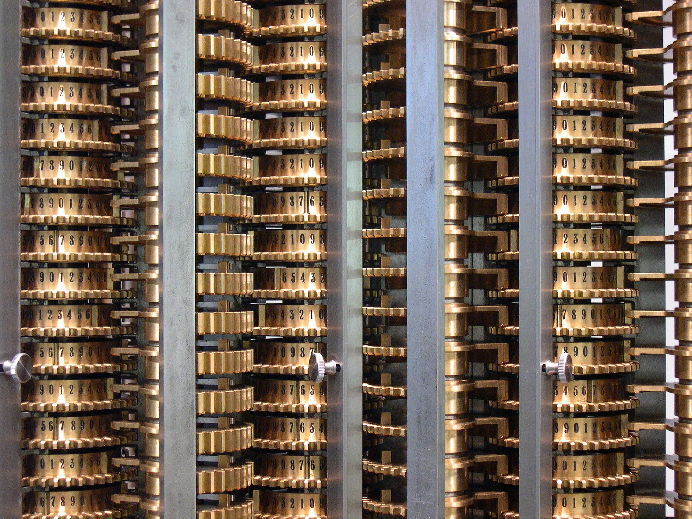
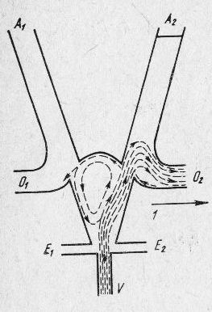
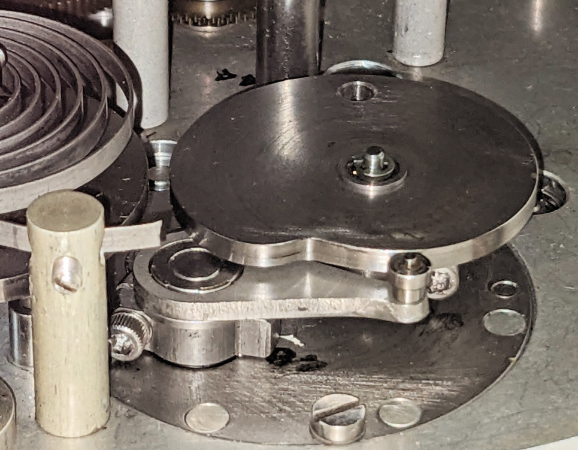

## План

* **отступление в историю**
* арифметические операции
* регистры и такты
* архитектура процессора в общем виде
* как исполнять больше инструкций
* системы команд
* работа кэшей и памяти
* другие архитектуры и подходы
* что можно попробовать самому

---

# Aбак

* Появился предположительно в третьем тысячелетии до н.э.


--- 

# Логарифмическая линейка

Сама идея возникла в 1620-1630, после открытия логарифма


--- 


--- 

# Суммирующая машина Паскаля, 1642г


---

# Колесо Лейбница, 1673


--- 

# Арифмометры

Много разных - от рисунов да Винчи в 1500 до 1978 года (советский арифмометр Феликс)


---

# Curta - карманный арифмометр, 1948-1970


---
# Жаккардовый ткацкий станок, 1804


---

# Разностная машина Чарльза Бэббиджа



---

# Разностная машина Чарльза Бэббиджа


---
# Табуляторы, 1888

.jpg)

Early IBM D11 tabulating machine, with covers removed

---
# Пневматика

* железная дорога - воздушный тормоз Вестингауза
* пневмоавтоматика




---
# Электромеханика в самолёте, 1955


---
# Электромеханика в самолёте, 1955



---

# MONIAC


---

# Digi-Comp I 1963


---

# Математика

* Булева логика (Джордж Буль), 1854
* Лямбда-исчисление (Чёрч) 1936-1940
* Turing machine: Алан Тьюринг, 1936
* Теория информации (Клод Шеннон) 1940
* Гарвардская архитектура: конец 1930ых
* Архитектура Фон-Неймана, 1945


--- 

# Архитектура фон Неймана


---

# Гарвардская архитектура


 
---
# intel i8008


---

* отступление в историю
* **арифметические операции**
* регистры и такты
* архитектура процессора в общем виде
* как исполнять больше инструкций
* системы команд
* работа кэшей и памяти
* другие архитектуры и подходы
* что можно попробовать самому

---

# Одного NAND достаточного для всего


---
# NOT


---
# AND


---
# OR

A | B = !(!A & !B) 


---

# XOR

(A & !B) | (B & !A)


---

# полусумматор
 


---

# сумматор


---

# сложение чисел


---

# carry-lookahead adder


---

# Вычитание


---


# Поразрядное сложение


---


# Умножение-много сложений


---

# деление

* Делается как деление в столбик
* Ради ускорения можно вычислять 2-3 разряда зараз
* На порядок медленнее умножения

---

* отступление в историю
* арифметические операции
* **регистры и такты**
* архитектура процессора в общем виде
* как исполнять больше инструкций
* системы команд
* работа кэшей и памяти
* другие архитектуры и подходы
* что можно попробовать самому

--- 

# ячейка памяти


--- 

Релевантные слова:
* trigger
* latch
* flip-flop


---

* отступление в историю
* арифметические операции
* регистры и такты
* **архитектура процессора в общем виде**
* как исполнять больше инструкций
* системы команд
* работа кэшей и памяти
* другие архитектуры и подходы
* что можно попробовать самому


---

# Общий подход

* регистр с адресом команды
* другие регистры
* после выполнения обычной команды адрес увеличивается на размер команды
* команды с ветвлением меняют адрес команды на произвольный

---
# Микрокод

Команда может описывать несколько простых действий:

```asm
movl $1, 8(%rsp, %rdi, 4) 
# indirect with displacement and scaled-index
  (address = base %rsp + displ 8 + index %rdi * scale 4)
```

Логично разбить её на два действия - вычисление адреса + запись

---

* отступление в историю
* арифметические операции
* регистры и такты
* архитектура процессора в общем виде
* **как исполнять больше инструкций**
* системы команд
* работа кэшей и памяти
* другие архитектуры и подходы
* что можно попробовать самому

---
# Суперскалярность

независимые команды можно исполнять одновременно

```
a = b + c 
e = f + g
```

---

# Конвейер для исполнения инструкций

У классических RISC пять стадий:
* IF - instruction fetch
* ID - instruction decode + registers reading
* EX - execute
* MEM - чтение/запись в память (если надо)
* WB - Write back - записть результата в регистр (если надо)

Современные десктопные CPU с x86-64 - порядка 19-30 стадий

---
# Порты

У ядра есть несколько портов, на которые можно раскидывать операции. Часть для целых чисел, часть для вещественных, часть для доступа к памяти. Могут быть какие-то специализированные блоки: например, для деления или для вычисления синуса.

Ядра могут быть сгруппированы в пары и иметь общий набор портов для пары.

---
# Предсказание переходов и спекулятивное исполнение

Поскольку операции делаются долго, можем менять их порядок или начинать вычислять операцию до того, как случится ветвление. И отменять, если что пошло не так.

В процессоре есть блоки предсказания переходов. 
В современных Amd Ryzen и Samsung exynos предсказатель переходов на основе маленькой двуслойной нейронной сети.

Уязвимость Spectre вызвана спекулятивным исполнением команд. Для фикса предлагалось обновить микрокод процессора и после этого процессор терял часть производительности из-за менее агрессивного спекулятивного исполнения.

---
# Cortex A-76 (Raspberry pi 5)

[источник](https://en.wikichip.org/wiki/arm_holdings/microarchitectures/cortex-a76) 

* 13 стадий конвейера.
* при ветвлении теряются 11
* может параллельно исполнять до 8 микроопераций каждый такт
	* четыре для целочисленных операций, 3 для простых и одна для сложных типа деления.
	* две для FP
	* две для доступа к памяти

--- 
* отступление в историю
* арифметические операции
* регистры и такты
* архитектура процессора в общем виде
* как исполнять больше инструкций
* **системы команд**
* работа кэшей и памяти
* другие архитектуры и подходы
* что можно попробовать самому
--- 
# Системы команд

* **CISC**: Complex Instruction Set Computer (x86)
* **RISC**: Reduced instruction set computer (Arm, RISC-V)
* **VLIW**: Very Long Instruction Word (Intel Itanium, Эльбрус)
* **MISC**: minimal instruction set computer + stack (Forth CPU, Jvm bytecode, .net bytecode)
* **URISC**: Ultimate RISC, one instruction set computer (так можно, пракического смысла нет)

---
# Single instruction, multiple data

x86 - SIMD, AVX (advanced vector extension) (обычно 32 бита)
ARM - NEON (16 байт), SVE (scalable vector extension) (максимальный размер регистра зависит от процессора, лежит в пределах 16 - 256 байт, обязательная часть в ARMv9+)


---
* отступление в историю
* арифметические операции
* регистры и такты
* архитектура процессора в общем виде
* как исполнять больше инструкций
* системы команд
* **работа кэшей и памяти**
* другие архитектуры и подходы
* что можно попробовать самому

---
# Кэш

* L1 кэш самый маленький, самый быстрый и обычно отдельный для инструкций и для данных
* L2 побольше и помедленее
* L3 общий для всех ядер процессора
* обычно размер кеш-линии 64 байта

---
# Kэш

Пример: Cortex A76

- L1I Cache
    - 64 KiB, 4-way set associative
- L1D Cache
    - 64 KiB, 4-way set associative
    - 4-cycle fastest load-to-use latency
- L2 Cache
    - 256 KiB OR 512 KiB (2 banks)
    - 8-way set associative
    - 9-cycle fastest load-to-use latency
- L3 Cache
    - 2 MiB to 4 MiB, 16-way set associative
    - 26-31 cycles load-to-use
    - Shared by all the cores in the cluster

---
# TLB

Транслирует виртуальные адреса в реальные. Обычно размер страницы - 4 килобайта. Есть более новые режимы с большими страницами типа 2 мегабайт. 

---
# Оперативная память

DDR5-6000 с таймингами 30-36-36

Сколько займёт чтение?

---
# Оперативная память

DDR5-6000 с таймингами 30-36-36

DDR5 - double data rate. Данные передаются не сигналом, а по началу сигнала и по его концу. Реальная частота (в которой измеряются тайминги) - 3000.

Сколько займёт чтение?

---
# Оперативная память

DDR5-6000 с таймингами 30-36-36

DDR = double data rate. Данные передаются не сигналом, а по началу сигнала и по его концу. Реальная частота (в которой измеряются тайминги) - 3000.

Память организована в строки по 4 килобайта

---
# Оперативная память

**tRP** - время закрытия предыдущей строки
**tRCD** - Row Address to Column Address Delay - время для активации строки
**CL/tCWL** - тайминг на чтение/запись после активации строки
**burst transfer** - модуль памяти как-бы два отдельных модуля и сразу в двухканальном режиме, на каждый можно передавать 4 байта за раз, и для передачи 64 байт надо сделать 16 передач данных.

Итого - в лучшем случае у нас потери в 10 нс на чтение в уже открытой строке + 2.6 нс на передачу.
В худшем случае, когда надо закрыть другую строку, открыть эту и прочитать, получится вместе (36 + 36 + 30 + 8) / 3000 = 36.6 нс

---

# DDR1 SDRAM (1998)

DDR-200
частота 100 MHz
один такт = 10 ns
тайминги: 2-2-2

---

* отступление в историю
* арифметические операции
* регистры и такты
* архитектура процессора в общем виде
* как исполнять больше инструкций
* системы команд
* работа кэшей и памяти
* **другие архитектуры и подходы**
* что можно попробовать самому

---

# GPU 

Много-много паралельных вычислительных блоков (у каждого свой кеш и прочее). Внутри блока есть warp, который как в SIMD может делать операции, например, сразу над 32 числами.

высокая задержка, медленное исполнение на каждом блоке, плохая поддержка ветвлений, но зато очень большая суммарная производительность.

Если брак при изготовлении - часть блоков можно отключить.

---

# GPU 


---
# FPGA


---
# FPGA


---
# ASIC

Application-specific integrated circuit

Кастомный чип, сделанный специально под какой-то узкоспециализированный сценарий. Например, майнинг биткоинов или перекодирование видео.

---
# Систолический массив
Придумали в 1944 в Британии, но там засекертили и потом придумали ещё несколько раз.

Идея в том, что есть отдельные вычислители, которые посылают данные друг другу.
Примеры хорошо подходящийх операций - перемножение матриц, решение систем линейных уравнений и т.п.

Примеры:
* TPU от Google, 
* Сетевой процессор Cisco PXF

---

* отступление в историю
* арифметические операции
* регистры и такты
* архитектура процессора в общем виде
* как исполнять больше инструкций
* системы команд
* работа кэшей и памяти
* другие архитектуры и подходы
* **что можно попробовать самому**

--- 
# Попробуй сам!

Игры про конструирование процессоров:

* бесплатная браузерная [nandgame.com](https://nandgame.com/)
* [Turing Complete](https://store.steampowered.com/app/1444480/Turing_Complete/)
* [Virtual Circuit board](https://store.steampowered.com/app/1885690/Virtual_Circuit_Board/) (но тут очень низкоуровневый подход)
* Игра с примером систолического массива: [TIS-100](https://store.steampowered.com/app/370360/TIS100/)
*  Игра, где надо собирать микросхемы и программировать на ассемблере: [Shenzhen I/O](https://store.steampowered.com/app/504210/SHENZHEN_IO/)

**Продвинутый уровень** - попробовать сделать что-нибудь на FPGA

--- 
# Какие выводы для программиста

* В 2025 году знание особенностей процессора позволяет писать более эффективный код даже на высокоуровневых языках.
* Производительность процессоров и объёмы памяти очень сильно выросли, но задержки чтения/записи почти те же.
* Процессор может быстро и параллельно выполнять много инструкций, если создать ему подходящие условия.
* При чтении одного байта из памяти на самом деле читается вся кеш линия в 64 байта.
* Задержка чтения из RAM ощутимо большая. Прыжки в рандомные места в память могут быть медленными. 
* Некоторые алгоритмы лучше ложатся на GPU или наоборот хороши только на CPU

--- 
# Список источников

* wikipedia
	* [Abak](https://ru.wikipedia.org/wiki/%D0%90%D0%B1%D0%B0%D0%BA)
	* [Slide Rule](https://en.wikipedia.org/wiki/Slide_rule)
	* [Pascaline](https://ru.wikipedia.org/wiki/%D0%A1%D1%83%D0%BC%D0%BC%D0%B8%D1%80%D1%83%D1%8E%D1%89%D0%B0%D1%8F_%D0%BC%D0%B0%D1%88%D0%B8%D0%BD%D0%B0_%D0%9F%D0%B0%D1%81%D0%BA%D0%B0%D0%BB%D1%8F)
	* [Арифмометр Феликс](https://ru.wikipedia.org/wiki/%D0%A4%D0%B5%D0%BB%D0%B8%D0%BA%D1%81_(%D0%B0%D1%80%D0%B8%D1%84%D0%BC%D0%BE%D0%BC%D0%B5%D1%82%D1%80))
	* [Жаккардовый ткацкий станок](https://ru.wikipedia.org/wiki/%D0%96%D0%B0%D0%BA%D0%BA%D0%B0%D1%80%D0%B4%D0%BE%D0%B2%D1%8B%D0%B9_%D1%82%D0%BA%D0%B0%D1%86%D0%BA%D0%B8%D0%B9_%D1%81%D1%82%D0%B0%D0%BD%D0%BE%D0%BA)
	* [Разностная машина Чарльза Бэббиджа](https://ru.wikipedia.org/wiki/%D0%A0%D0%B0%D0%B7%D0%BD%D0%BE%D1%81%D1%82%D0%BD%D0%B0%D1%8F_%D0%BC%D0%B0%D1%88%D0%B8%D0%BD%D0%B0_%D0%A7%D0%B0%D1%80%D0%BB%D1%8C%D0%B7%D0%B0_%D0%91%D1%8D%D0%B1%D0%B1%D0%B8%D0%B4%D0%B6%D0%B0)
	* [Curta](https://ru.wikipedia.org/wiki/Curta)
	* [Табулятор](https://ru.wikipedia.org/wiki/%D0%A2%D0%B0%D0%B1%D1%83%D0%BB%D1%8F%D1%82%D0%BE%D1%80)
	* [Воздушный тормоз Вестингауза](https://ru.wikipedia.org/wiki/%D0%92%D0%BE%D0%B7%D0%B4%D1%83%D1%88%D0%BD%D1%8B%D0%B9_%D1%82%D0%BE%D1%80%D0%BC%D0%BE%D0%B7_%D0%92%D0%B5%D1%81%D1%82%D0%B8%D0%BD%D0%B3%D0%B0%D1%83%D0%B7%D0%B0)
	* [MONIAC](https://ru.wikipedia.org/wiki/MONIAC)
	* [Church–Turing thesis](https://en.wikipedia.org/wiki/Church%E2%80%93Turing_thesis)
	* [Архитектура фон Неймана](https://ru.wikipedia.org/wiki/%D0%90%D1%80%D1%85%D0%B8%D1%82%D0%B5%D0%BA%D1%82%D1%83%D1%80%D0%B0_%D1%84%D0%BE%D0%BD_%D0%9D%D0%B5%D0%B9%D0%BC%D0%B0%D0%BD%D0%B0)
	* [Гарвардская архитектура](https://ru.wikipedia.org/wiki/%D0%93%D0%B0%D1%80%D0%B2%D0%B0%D1%80%D0%B4%D1%81%D0%BA%D0%B0%D1%8F_%D0%B0%D1%80%D1%85%D0%B8%D1%82%D0%B5%D0%BA%D1%82%D1%83%D1%80%D0%B0)
	* [Триггер](https://ru.wikipedia.org/wiki/%D0%A2%D1%80%D0%B8%D0%B3%D0%B3%D0%B5%D1%80)

--- 
# Список источников

* wikipedia
	* [Neural branch prediction](https://en.wikipedia.org/wiki/Branch_predictor#Neural_branch_prediction)
	* [RISC](https://ru.wikipedia.org/wiki/RISC)
	* [URISC](https://ru.wikipedia.org/wiki/URISC)
	* [Игрушечный механический компьютер Digi-Comp I](https://en.wikipedia.org/wiki/Digi-Comp_I), [https://www.youtube.com/watch?v=chrURgrkd44](https://www.youtube.com/watch?v=chrURgrkd44)
* habr:
	* [Пневмоника и влажные мечты стимпанка](https://habr.com/ru/articles/374309/)
	* [Ретро: электромеханический аналоговый компьютер CADC 1955 года](https://habr.com/ru/articles/740530/)
* Прочее:
	* [Die photos and analysis of the revolutionary 8008 microprocessor, 45 years old](https://www.righto.com/2016/12/die-photos-and-analysis-of_24.html)
	* [Guide to x86-64](https://web.stanford.edu/class/cs107/guide/x86-64.html)
	* [https://en.wikichip.org/wiki/arm_holdings/microarchitectures/cortex-a76](https://en.wikichip.org/wiki/arm_holdings/microarchitectures/cortex-a76)
	* [A beginner’s guide to NVIDIA GPUs](https://www.cudocompute.com/blog/a-beginners-guide-to-nvidia-gpus)
