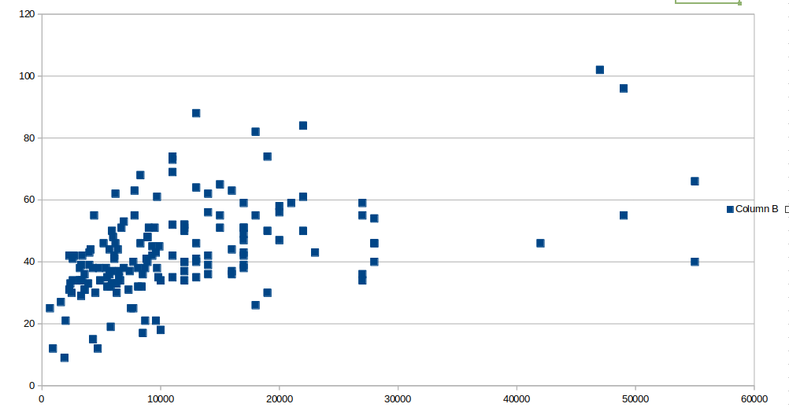

### Примечание

Вообще говоря, я эту статью не планировал и чисто на эмоциях написал за утро в воскресенье и выложил на хабр, но судя по оценкам статьи - я попал в точку. Сейчас её рейтинг уже +371. Мои опасения, что меня дружно заминусуют все те, кто дружно плюсуют корпоративные статьи, не оправдались.

Потом пришла администрация хабра, переместила статью в чулан и запретила редактировать, теперь она доступна только [прямой ссылке](https://habr.com/ru/articles/878768/) или по списку статей в моём профиле. В рекомендациях и "лучшем за день" её не найти. Но как бы то ни было, я автор, это мой текст и я продублирую его тут.

Сама статья помогла мне чётко сформулировать мои мысли и стала переломным моментом - больше желания публиковать свои тексты на хабр нет. Пускай хабр тонет в сгенерированных статьях и переводах отвратительного качества, скатертью дорожка, я сделал что мог. Судя по реакции администрации сайта, текущее положение дел их полностью устраивает.

# Хабр мёртв

Я сначала хотел написать это в комментарии к одной отвратительно написанной статье в корпоративном блоге с рейтингом +50, а потом понял что у меня получилась целая простыня текста. Конечно, хабр не жалобная книга, но это крик души о проблемах хабра.

Ниже я затрону несколько тем: низкое качество корпоративных статей и новостей, накрутки рейтинга этим самым статьям и принципиальное отличие качественных технический статей от того что мы видим в ленте. А так же о том, почему количество статей не переходит в их качество. Всё вместе это складывается в очень мрачную картину.

## Низкое качество статей

Во-первых, некоторые компании в принципе не преследуют цель написать что-то хорошее. Например, Otus клепает статьи тысячами только ради того, чтобы в ленте регулярно попадались статьи с рекламой их платных курсов. На мой взгляд, администрация сайта в принципе не должна такого допускать

Во-вторых, даже если какая-то компания хочет ассоциировать свою рекламу с интересными статьями, в дело вступает закон Гудхарта - авторы статей материально заинтересованы написать с статью с максимальным количеством просмотров (а значит, с кликбейтным заголовком и максимально попсовой темой для широкой аудитории) и с высоким рейтингом (потому что высокий рейтинг на старте статьи позволяет попасть в списки типа "читают сейчас", "популярное за день" или "статьи с > 25 рейтинга". А так же с минимизацей времени на написание статьи - поэтому будут короткие поверхностные статьи и засилье нейросгенерённых текстов.

В-третьих, кроме корпоративных статей на хабре просто куча рекламного треша. Реклама телеграм-каналов, блогов "упал-поднялся с ногтеточками" и т.п. Когда-то давно на хабре требовалось, чтобы статья была уникальная, по теме и без ссылок на всякую хрень. Сейчас всё это можно.

В-четвёртых, администрация хабра потакает платным корпоративным аккаунтам и на мой взгляд она уже давно перегнула палку.

Примерно как в экономике - если налоги 0% - их нет, если они низкие типа 10-20% - их легко собирать, где-то существует оптимум при котором сумма собираемого налога максимальная, а дальше наступает фиаско - допустим, если налоги 90%, то вся экономика в теневом секторе и ничего не платит. Т.е., и цифра налога огромная, и деньги не собираются и всем при этом плохо. Мера "поднять налоги ещё" только усугубляет ситуацию и приводит к коллапсу.

Окей, хабр зарабатывает на корпоративных аккаунтах. Аналогично есть какой-то оптимум, при котором доход максимален. Условно, если бы на хабре было бы чуть-чуть рекламных статей, то читателей хабра было бы много, реклама бы имела большие охваты и корпоративные аккаунты можно было бы продавать очень задорого, получая кучу денег и не слишком влияя на посещаемость.
На мой взгляд сейчас наоборот раскручивается смертельная спираль - читателей всё меньше, рекламного треша всё больше и хабр стремительно катится в бездну.

Вдумчиво полистайте ленту и посчитайте, сколько там треша и бесполезного шума.

## Пример корпоративной статьи

[В этой статье прекрасно всё.](https://habr.com/ru/companies/selectel/articles/878222/)

На момент написания рейтинг +51, при этом 41 человек поставили плюс и один поставил минус (Это был я). А ещё в статье целых 49 комментариев.

Администрация хабра в лице @Exosphere считает, что в статье нейронка использовалась "Только в двух очень небольших частях. " и всё нормально. Вот комментарий: [https://habr.com/ru/articles/878400/comments/#comment_27864694](https://habr.com/ru/articles/878400/comments/#comment_27864694)

Поэтому я разберу статью подробно, чтобы никто не мог отвертеться. Предупреждаю - вы не сможете это развидеть, аналогичные проблемы буквально у каждой второй статье на хабре.

Во-первых, это почему-то статья, хотя по-сути это новость. Возможно, это тонкий намёк на то, что новость на сайте-источнике вышла 22 января, а в корпоративном блоге она появилась только 31 января и уже чуть протухла.

В качестве источника указана статья на [ixbt](https://www.ixbt.com/live/mobile/neobychnyy-smartfon-liberux-nexx-poluchil-32-gbayt-operativnoy-pamyati-i-dva-porta-usb-type-c-31.html)

На ixbt текста заметно меньше, а в качестве источника указана ещё одна статья на [mobiltelefon](https://mobiltelefon.ru/post_1737472663.html)

А у этой статьи источник не указан, но он определённо есть.

Ссылки на оригинальный сайт с информацией на английском (http://liberux.net/) нет нигде. Зато при прогоне текста через нейронку и многократном копипастинге между новостными сайтами теряются ключевые детали и откуда-то появляюстя новые подробности и целые абзацы текста. Замечательный круговорот копи-пастинга.

Итак, теперь наконец-то перейдём к тексту статьи. Тут тоже много интересного. Текст состоит из пяти кусочков, разделённых четырьмя картинками.

С самого первого кусочка мы видим сгенерированный нейронкой текст:

> Ну что, линуксоиды могут быть довольны. На рынке появился (точнее, скоро появится) очередной телефон на базе Linux. Причем не просто так, а с изюминкой. Liberux NEXX – это не просто смартфон, а настоящий техно-манифест. 32 ГБ оперативки, Linux под капотом и куча фишек для параноиков. Давайте разбираться, что это за телефон и кому он вообще нужен.
> Liberux NEXX – смартфон, который явно не хочет быть как все. Вместо Android или iOS тут LiberuxOS, кастомный дистрибутив Linux на базе Debian 13. Да, это не первый Linux-смартфон (вспомним PinePhone или Librem 5), но в отличие от них, Liberux NEXX не выглядит как музейный экспонат. Тут и современный дизайн, и топовые характеристики. Но сначала — про безопасность, это главная фича девайса.
> Аппаратные переключатели – пожалуй, самая интересная фишка Liberux NEXX. Если вы когда-нибудь заклеивали камеру ноутбука изолентой или отключали микрофон в настройках смартфона, то вы точно поймёте, о чём речь. Liberux NEXX позволяет делать это на аппаратном уровне – с помощью физических переключателей. Хотите отключить микрофон, камеру, Bluetooth или GPS? Пожалуйста – просто переключите тумблер. Никаких скрытых процессов, никакой слежки.

Наверно, когда Exosphere написала про две небольшие сгенерированные нейронкой части, она иммела в виду часть с этим текстом.

Что это за мусор? Всю эту хрень можно заменить одним предложением.

Вдобавок там вводят в заблуждение "На рынке появился (точнее, скоро появится) очередной телефон на базе Linux.". В источнике написано "создатели проекта пообещали в ближайшее время запустить кампанию на площадке Kickstarter."

Между "на рынке появился" и "обещали запустить кампанию на Кикстартере" - пропасть. Это они должны не передумать на полпути и запустить кампанию, потом собрать деньги (могут не набрать сумму), потом наладить производство (могут не справиться, например про flipper zero почитать - это огромный труд и куча времени целой команды) и вот через годик-другой, возможно, у них что-то получится. Какой нафиг рынок, если я всё что могу сделать со своими деньгами и желанием купить - оставить почту на сайте разработчиков и ждать сообщения о том, что они начали сбор средств на кикстартере!

Но зачем такие подробности, если можно наврать в первой же строчке статьи и привлечь внимание читателя.

Вторая часть текста - какой-то высосанный из пальца буллшит (явно тоже сгенерированный нейронкой) на целых четыре пункта про то, какие замечательные аппаратные тумблеры. На оригинальном сайте этого почти не упоминается и акценты совсем на других деталях расставлены, но копроавтору виднее. Я даже разбирать этот текст не буду.

Дальше идёт картинка рекламы Selectel. Ребята - знайте, я никогда в жизни сервер у вас не куплю чисто из принципа. У вас офигенная анти-реклама.

После рекламы снова продолжается вода про аппаратные переключатели. Видимо, автор считает, что целевая аудитория слишком тупая и вместо одного предложения надо бы нагенерить две страницы теста.

Итак, четвёртая часть текста. О чудо! Сразу скажу - это единственная хоть как-то информативная часть статьи. Тут есть список характеристик! Часть деталей, правда, потерялись по дороге, а сразу после них опять идёт какой-то бред нейронки:

> Да, как и указывается выше, Liberux NEXX оснащен 32 ГБ оперативной памяти. Памяти много не бывает, но здесь ее как-то даже слишком много. Для сравнения: iPhone 16 Pro Max скромно ютится на 8 ГБ, а большинство Android-флагманов – на 12-16 ГБ. Возможно, в Liberux NEXX все настолько плохо оптимизировано, что его создатели просто решили засунуть под капот побольше оперативки? Или они хотят угодить, например, разработчикам, которые любят запускать на смартфоне пару виртуальных машин, или геймерам, которые хотят играть в PUBG, параллельно стримя на Twitch. Шутка. Хотя кто знает?

Большое спасибо, что в четвёртый раз напомнили мне, что в телефоне 32 Гб оперативки. Заголовка, вступления и упоминания в характеристиках было определённо недостаточно.

И да, обычно читатели хабра не знают, сколько это - 32 гигабайта, поэтому будем измерять в футбольных полях, вернее в айфонах. Что это за бред по PUBG и Twitch? Поставили память - и хорошо. Это фича, а не повод выдумывать байки про низкую оптимизацию. Напомню, что проекта даже на кикстартере ещё нет, через несколько лет этот размер может оказаться самым обычным или вообще другим.

> С характеристиками все очень неплохо. Единственное, что огорчает, – это флеш-память формата eMMC. Она медленнее, чем современные UFS-накопители. С другой стороны, 256 ГБ – это немало, а если не хватит, всегда можно добавить microSD. Хотя, конечно, хотелось бы большего, если уж обещают крутые характеристики, сделайте сразу терабайт, чего мелочиться.

Опять куча воды и нейробреда: "неплохо, немало, а если не хватит, то можно. Но хотелось большего".

Молчи - за умного сойдёшь.

И финал - снова явно нейроночный текст

> Liberux NEXX – это не для всех. Это для гиков, параноиков и всех, кто устал от замкнутой экосистемы Apple и вездесущего Google. Если вы хотите смартфон, который можно настроить под себя, или просто мечтаете о Linux в кармане – это ваш выбор. Если же вам нужен просто телефон для звонков и социальных сетей, лучше посмотрите в сторону чего-то попроще.
> Пока что разработчики только анонсировали устройство и собирают средства на производство. Цены и точной даты выхода нет. Но если Liberux NEXX действительно выйдет на рынок, это будет интересный эксперимент. Сможет ли Linux-смартфон завоевать сердца пользователей? Поживем – увидим

Во-первых, тут признали что в начале текста кликбейт и телефон только анонсирован. Во-вторых, я что-то не нашёл на сайте где это они собирают средства на производство. Нашёл только где можно электронную почту оставить. Так что опять в статье нагло п***ят.

При этом не то чтобы я был против статьи или новости про телефон. Да, если заглянуть на сайт, телефон выглядит как моя мечта - компьютерное железо и Linux в телефонном форм-факторе. Упор на открытость платформы и заменяемость компонент это тоже космос. Возможно, я даже закажу себе такой.

Но текст на хабре просто чудовищный. Ключевые детали упустили, налили воды на кучу страниц, не оставили ссылку - сделали всё, чтобы я не дошёл до оригинального сайта создателей.

Вишенка на торте - накрутки. Не смотря на все перечисленные моменты, рейтинг у статьи выше +51. Существуют корпоративные статьи-перлы с 800 просмотров и оценкой в +25. Я график построил давно по постам одной компании где-то год назад, это просто иллюстрация. Новый делать мне лень. По горизонтали - количество просмотров, по вертикали - рейтинг статьи. График сходится совсем не в ноль. Корпоративные статьи просто обречены на успех и рейнги +25, если не +40.

## Почему количество статей не переходит в качество

Этот момент я внезапно осознал, когда в РФ начали блокировать ютуб и в добровольно-принудительном порядке пересаживать на рутуб и вк видео. Казалось бы, и там и там можно смотреть видео, жрите что дают, чего вам ещё надо?

Ютуб радикально отличается тем, что у него замороченная система рекомендаций. Если ставить лайки-дизлайки под видео, то через какое-то время он начинает показывать интересный мне контент.

Например, про сборку миниатюрных турбореактивных двигателей руками в гараже (привет, Игорь Негода) или ещё что-то очень узкоспецефичное, но совпадающее с моими интересами.

И вторая сторона медали с системой рекомендаций - по-настоящему хорошие видео взлетают сами. Например, когда-то на канале birchpunk вышло самое-первое видео с трейлером русской кибердеревни и ютуб показал мне его в рекомендациях буквально в день выхода.

При этом если я зайду на ютуб в режиме инкогнито - я увижу всякий треш и шлак. Но ютуб системой рекомендаций помогает автору и зрителям найти друг друга.

Блогеры, которые были популярны на youtube, зарабатывали на этом деньги и снимали хорошие видео, при попытке перейти на ВК осознали, что вот у них ничего не получается. И это не блогеры плохие, это просто ВК как среда для развития намного меньше подходит.

А теперь представьте, что если бы ютуба не было. Утрированный пример - Северная Корея. Люди могли бы снимать интересный контент, развиваться, чему-то учиться по видео, жить полной насыщенной жизнью... Но они об этом даже не догадываются, они с детства привыкли радоваться восходу солнца и говорить спасибо партии за это.

Именно эта история с хабром. На нём никогда и не было нормальной системы рекомендации и всё что есть - это надежда на индексацию гугла и формат ленты в стиле рилсов в инстаграмме - пролистал очередную бесполезную статью и больше никогда её не увидел. Нету накопительного качества.

Например, на хабре я за всё время нашёл только одну реально хорошую статью про stable diffusion:
Знаете почему? Потому что автор статьи сам со всем разобрался, сам попробовал учить сеть с diffusion на маленьких картинках цифр, собрал все грабли, понял как оно работает и только потом написал статью. Вот эта статья реально полезная.

Я потом сам попробовал написать и позапускать такой же код, тоже набил шишки и во всём разобрался.
Но при этом на хабре просто десятки, если не сотни статей, от людей которые даже не знают что такое self-attention и выдают перлы типа "внутреннего самоконтроля". По описаниям из этих статей не то что код написать невозможно - их вообще читать противопоказано, эти "знания" только мешать будут.

У хабра ужасная схема с рейтингом статьи, который формируется в первый месяц. Хорошие технические статьи не теряют актуальности годами, но голосовать за них уже нельзя и они теряются среди остальных.

## Хорошие статьи быстро не пишутся

Я сам пишу на хабр где-то раз в полгода-год. Потому что я хочу чем-то поделиться. Хорошие технические статьи быстро писать невозможно.

Для начала, надо разобраться в теме. Это несколько месяцев, если не лет. Это не значит что я специально для статьи буду в чем-то разбираться, это просто ограничение на скорость выхода статей.

Во-вторых, в идеале бы неплохо прошерстить хабр и прочие источники и написать что-то новое, а не кривой перессказ существующего. Например, [моя статья про геометрическую алгебру](https://habr.com/ru/articles/818933/) - уникальная, я в русскоязычном интернете ничего подобного не нашёл.

Про какие-то темы я не писал, просто потому что про это и так уже хорошо написано.

Написать текст - для технических статей можно потратить несколько недель.
И да, под написать текст я подразумеваю не "родить буковки", а несколько раз аккуратно перепроверить все написанные факты, ссылки, дать почитать знакомым и попросить покритиковать, всё это поправить и только потом публиковать. Если делать иллюстрации, то опять же - подобрать по смыслу или нарисовать, а не тупо скопировать первый попавшийся нейротреш.

Плохие примеры иллюстраций ради иллюстраций мы и так видим везде, вместо этого попробую показать хороший, где картинки являются офигенным дополнением. Попробуйте сопоставить [картинки с девушками и описания аллокаторов](https://habr.com/ru/articles/876804/).
Я не уверен, что правильно понял все отсылки, но я точно уверен, что в подбор картинок вложены большие усилия. Опять же, если статья техническая с чертежами или схемами - подробно и наглядно всё нарисовать надо постараться.

Часть статей может вообще не дойти до публикации по каким-то причинам. Например, у меня есть [заметка](https://kright.github.io/2022/01/24/%D0%BC%D0%BE%D1%91-%D0%B4%D0%BE%D0%BC%D0%B0%D1%88%D0%BD%D0%B5%D0%B5-%D1%81%D0%B5%D1%82%D0%B5%D0%B2%D0%BE%D0%B5-%D1%85%D1%80%D0%B0%D0%BD%D0%B8%D0%BB%D0%B8%D1%89%D0%B5-%D0%B8%D0%B7-raspberry-pi-4b.html) про то, что я пробовал делать с raspberry pi и что у меня получалось, но я её потихоньку дописываю уже три года и возможно вообще никогда не опубликую на хабре.

И что я вижу? Кто-то бездумно копирует текст с рандомного сайта, прогоняет через нейронку, вставляет на хабр, пихает рекламу, публикует в чатик внутрикорпоративных авторов ради накруток или ещё куда - и вуаля, за полчаса работы получает популярную статью с рейтингом +50 и кучей просмотров.

Потом кто-то удивляется, что технические статьи на хабре не пишутся. Конечно не пишутся, пока один человек пишет одну техническую статью, кто-то другой клепает их сотнями. Потом читатель заглядывает в ленту, среди десятков статей не видит ничего интересного и уходит.

Автор технической статьи смотрит на низкий рейтинг, никакующие просмотры и думает, что писать текст - это не его, и вообще это никому не нужно.

Вот так лёгкой расстановкой приоритетов хабр превратился в пикабу с историями про горящие жопы (простите, не люблю ругаться, но это был заголовок копростатьи и администрация хабра не нашла в нём ничего плохого).
А теперь, когда нейронки умеют быстро генерировать правдоподобно выглядящий текст и сложность создания поста устремилась к нулю, будет ещё хуже.

И да, если нейронка что-то знает, я у неё напрямую спрошу, мне для этого хабр вообще не нужен. Так что реальную ценность представляют только уникальные технические статьи, а их на хабре почти нет.