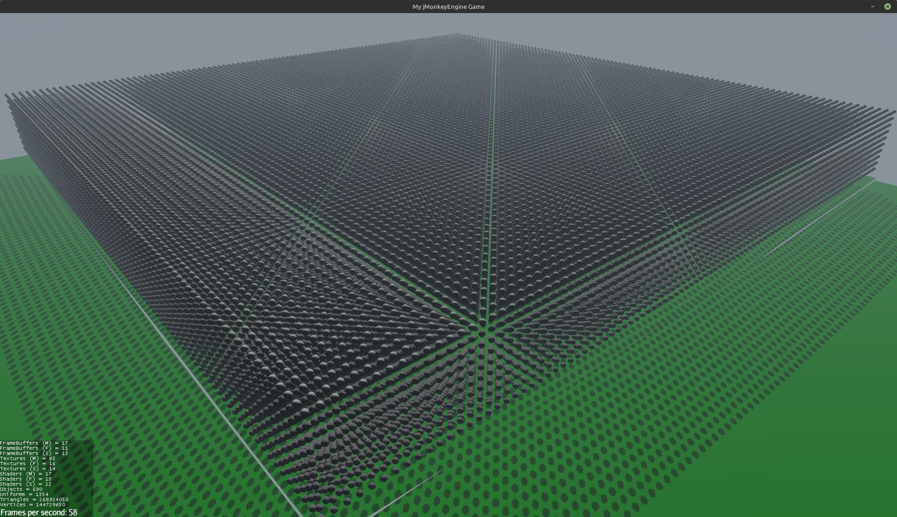
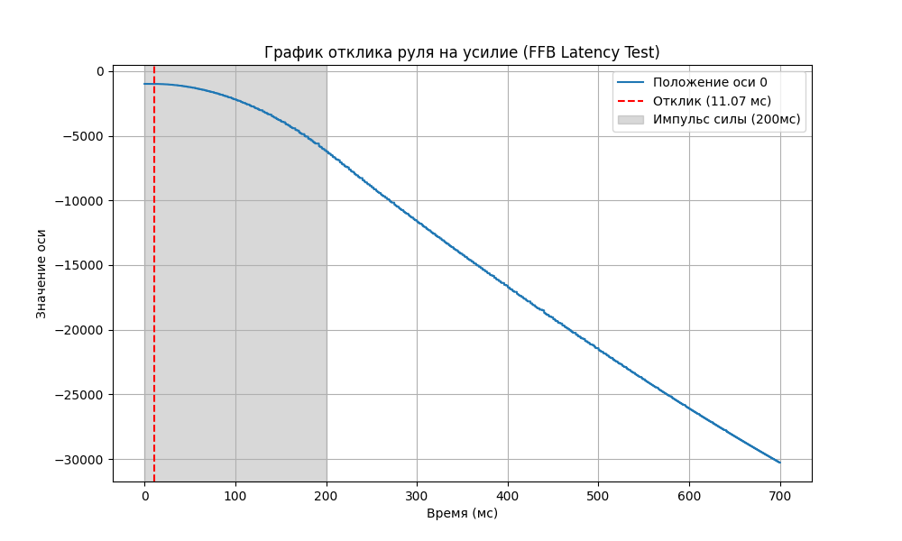
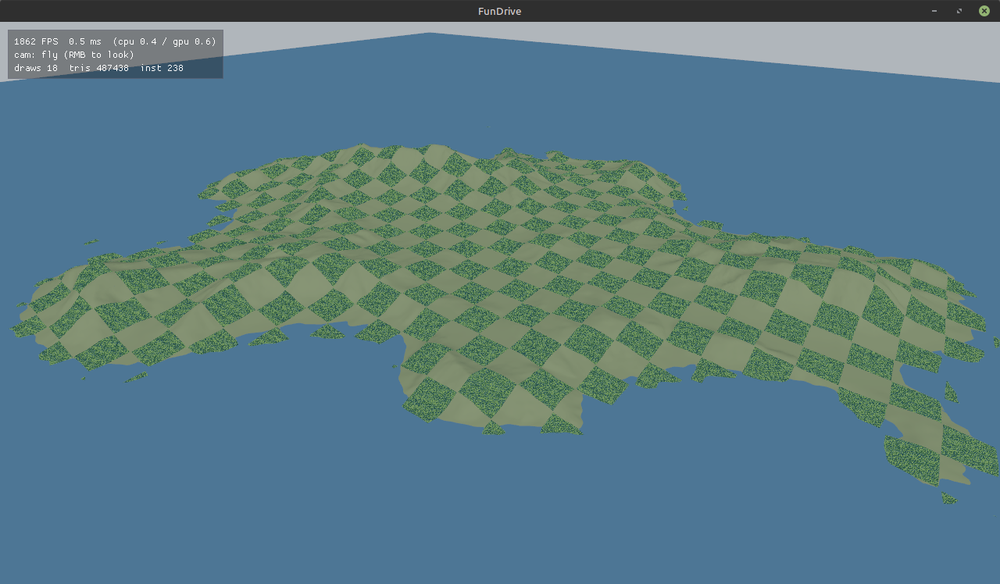
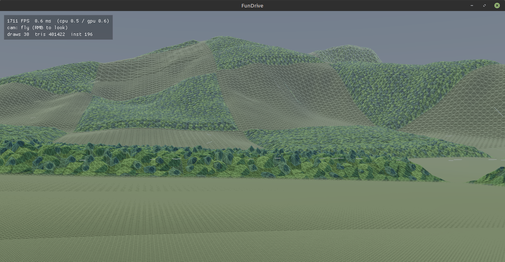
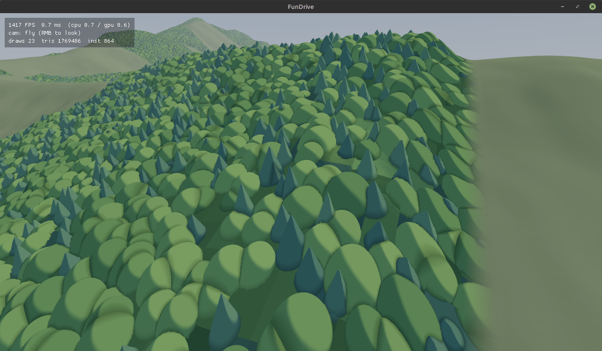
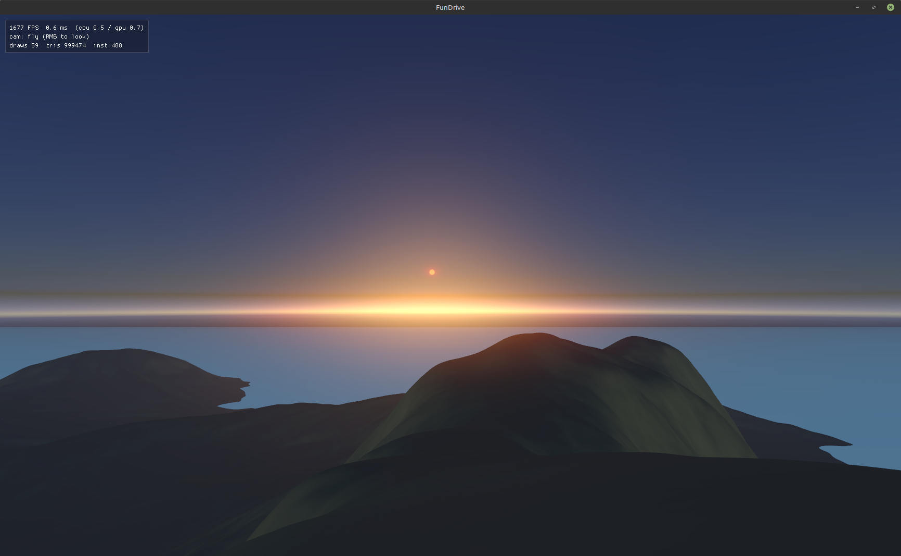
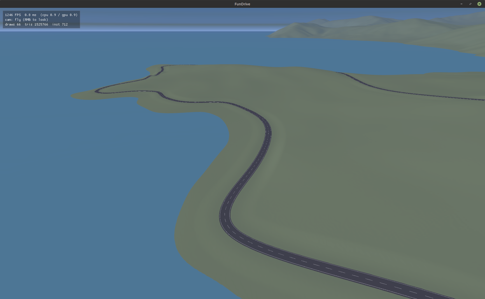
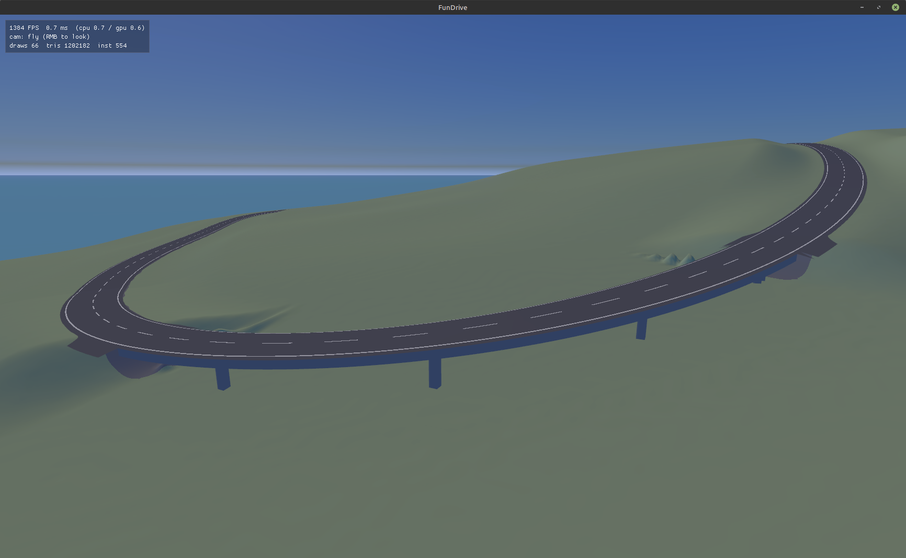
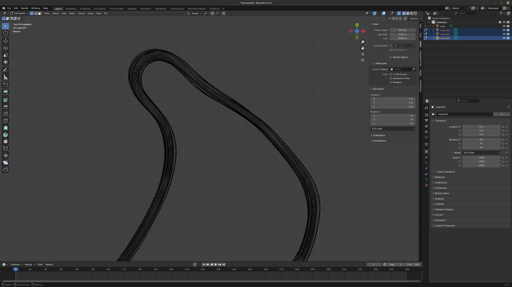

# 2026-05-21

I tried to move the game over to Unreal Engine 5. I didn't like the process, writing and debugging code in C++ is way slower. And by the way, the physics in C++ ran only two times faster than on the JVM.

And I suddenly came to the thought that in my game graphics isn't the main thing at all, and convenience and speed of development matter a lot more. And physics performance isn't a problem - there's enough of it with a good margin.

But I don't like libGDX, so I tried making a prototype on jMonkeyEngine. The result pleasantly surprised me - there's a lot of standard stuff that works fine out of the box.


## Graphics engine

I scratched my head a bit together with the LLM about what the engine can do and came to this architecture:

I use a forward renderer, because it's simple and goes well with honest anti-aliasing like MSAA x4. There won't be horrible jaggies along the edges of objects.
There'll be shadows from the sun (jME supports cascaded shadow maps out of the box and they look fine)
For repeated objects like trees I'll use instancing.
To fight overdraw, use an early-Z pass, to render the depth map first and call the pixel shader only for visible pixels.
Haven't decided about materials yet - either PBR, or something simpler.


### What limitations I found:

Light probes are generated really slowly, seems like it's easier to just give up on dynamic updates altogether. And all the caustics stuff is computed on the CPU. You can drop the caustics, but even plain render-to-texture is still rendering into six cameras and it's slow.

There doesn't seem to be a standard SSR effect, and the one that exists doesn't really support MSAA. It could be used for pretty mirror reflections, but it doesn't look very pretty near the edges of the screen. In the future I plan to support triple screen (with three cameras), and it seems like at the border between monitors SSR would draw garbage and catch the eye.

Just out of curiosity I tried rendering a hundred thousand spheres using multi instancing, with shadows. That comes out to 270 million polygons and 140 million vertices. Not that I was going to do that in the game, I just measured it to understand where the limit is. A geforce 4080 almost keeps up, at 58 frames per second.


So my preliminary plan is this - make a renderer that can draw a big map with a large number of objects, and with shadows from all the houses, trees and mountains.




# 2026-05-29

## How to avoid GC pauses.

By default the JVM uses G1GC with a max pause time of 200 ms. What I actually saw on my machine was around 20 ms. For obvious reasons it's no good for a game at 60 or 120 fps.

In newer JVMs there's ZGC (Z Garbage Collector) for realtime tasks, which collects garbage in separate threads. There is a pause where it really does stop all threads, but it literally takes about ten microseconds. 
At the same time the background garbage collection in my example takes roughly the same 20 ms as with G1GC, but it doesn't stop the game thread.
In Java 21 the collector was improved and became Generational ZGC (and it's so much better that since Java 24 the old ZGC doesn't exist anymore).

On the downside - if new threads allocate memory faster than the background GC threads can keep up, the memory will run out and it'll be a fiasco.

You can run it with a profiler roughly like this:

```bash
java -XX:+UseZGC \
     -XX:+UnlockDiagnosticVMOptions \
     -XX:+DebugNonSafepoints \
     -XX:StartFlightRecording=delay=10s,duration=60s,filename=game_profile.jfr,settings=profile,jdk.ExecutionSample#period=5ms \
     -jar your-game.jar
```
The profiler will start 10 seconds after launch, run for a minute and write the results to a file.
In it you can look at the garbage collection pauses and other info.


# 2026-06-02

Found out that MOZA devices can send update events almost a thousand times per second.

How I checked - I vibe-coded a Python script that gets the list of devices through SDL and counts events per second.
From the pedals it's even more than a thousand, but it seems like they just send several pedals in one packet, and SDL interprets them as separate events.


The code is here: [https://github.com/Kright/mySmallProjects/blob/master/2026/pySDL/main.py](https://github.com/Kright/mySmallProjects/blob/master/2026/pySDL/main.py)

You can also look at the USB data and find out that all of this connects as USB 2.0, but at USB 1.1 speed (12 Mbit). The polling interval is 1 millisecond, so you can't get more than a thousand events per second, and it turns out the device works right around that limit.

```
usb-devices
```

```
Bus=05 Lev=03 Prnt=17 Port=01 Cnt=01 Dev#= 18 Spd=12   MxCh= 0
D:  Ver= 2.00 Cls=ef(misc ) Sub=02 Prot=01 MxPS=64 #Cfgs=  1
P:  Vendor=346e ProdID=0001 Rev=01.00
S:  Manufacturer=Gudsen
S:  Product=MOZA CRP2 pedals
S:  SerialNumber=36001F000B57484838303120
C:  #Ifs= 3 Cfg#= 1 Atr=c0 MxPwr=100mA
I:  If#= 0 Alt= 0 #EPs= 1 Cls=02(commc) Sub=02 Prot=00 Driver=cdc_acm
E:  Ad=81(I) Atr=03(Int.) MxPS=   8 Ivl=1ms
I:  If#= 1 Alt= 0 #EPs= 2 Cls=0a(data ) Sub=00 Prot=00 Driver=cdc_acm
E:  Ad=02(O) Atr=02(Bulk) MxPS=  64 Ivl=0ms
E:  Ad=82(I) Atr=02(Bulk) MxPS=  64 Ivl=0ms
I:  If#= 2 Alt= 0 #EPs= 2 Cls=03(HID  ) Sub=00 Prot=00 Driver=usbhid
E:  Ad=03(O) Atr=03(Int.) MxPS=  64 Ivl=1ms
E:  Ad=83(I) Atr=03(Int.) MxPS=  64 Ivl=1ms
```

# 2026-06-04

I also tried plugging everything into the MOZA wheel base - pedals, handbrake, shifter. It turned out that in this connection mode the wheel still sends values a thousand times per second, but the peripherals only 200. In principle both are a lot, but if anyone's sitting on a 240 Hz monitor for the sake of lower latency - plug everything in over USB, instead of an update once every 5 ms you'll get one every millisecond.

Besides that, I tried measuring the response function - send a short "impulse" of force to the wheel and plot how the position changes over time.
You can connect to the wheel base through the mobile app and get into the advanced settings. There you'll need to completely remove friction and damping, so the wheel spins easily by inertia. If you don't, then in fact you send force X and get the force minus friction. And for example with a small force on the wheel it turns out that it spins up to some small speed and after that damping and friction kill everything and don't let it accelerate.

Another thing I noticed - it seems like the wheel reacts to a command not right away, but with a delay of 10 ms. Maybe I'm wrong, and the wheel is simply only starting to accelerate during that time, but it seems like those 10 ms are really there.



[the code that draws the plot](https://github.com/Kright/mySmallProjects/blob/master/2026/pySDL/ffb_test.py)

And one more fun fact - turns out I was using the force feedback effect wrong. 
I'd create an effect with some force, turn it on, and on the next frame turn it off and turn on another new effect. Well, you shouldn't do that, instead you can make one single effect and change the force in it, and then call `SDL_HapticUpdateEffect`. On top of that, instead of infinite duration I set the duration to 50 ms and I run the effect over and over (even when it hasn't finished yet). It seems like this all works fine, and if the game suddenly hangs, the force on the wheel will go away after those same 50 ms.


# 2026-07-17

I sent Claude Code off to write me a graphics engine. From time to time I correct it, but overall it's fun. If you have a clear vision of what you want from the renderer and what for, then it seems like it's not hard to make a simple solution exactly for the task.

What my ideas are:
1. forward rendering: lower memory load, honest anti-aliasing like MSAA 4x is available instead of all those temporal ones and dlss.
2. cartoon rendering: simpler than PBR, complex effects and photorealism aren't needed
3. a 16km*16km world, a 16k heightmap: that gives a heightmap resolution of 1 meter, takes a whole 680 megabytes of video memory with mip levels, no streaming needed.
4. Don't use screen-space effects like AO and SSR: the renderer is made for triple screen from the start, and effects like SSR work incorrectly near the edges of the screen.
5. OpenGL 4.6: to be honest I want to try Vulkan, but it seems like I'll get a result faster with OpenGL, so I'm doing it on that and trying to keep the renderer separate from the rest of the code, so that in the future it can be swapped out.

One of the funny finds - my forest is rendered by the same mechanism as the terrain, the vertex shader just additionally shifts the terrain vertices up, so that the forest is higher than the fields around it. From far away it looks very good, up close not so much. Another thing - despite the heightmap resolution of 1 meter, you can use [Catmull-Rom splines](https://en.wikipedia.org/wiki/Catmull%E2%80%93Rom_spline) for 2d and get a finer, smoother mesh.

Also, my renderer has tests that produce pictures, and the LLM can look at them by itself and draw some conclusions. Very cool, it sees all sorts of little things by itself and fixes them.

### What I've got so far:

The whole island (a forest cell is 500 meters)



The resolution of the ground mesh depends on the distance to the camera (here it's turned down to the minimum so you can see it)



A close view of the forest, which is actually just terrain




So, up close it doesn't look great and the transition from grass to forest is weird, at medium distance it's good and has volume, and at long distance it flickers noisily, I need to come up with something. I guess I'll try drawing honest trees up close after all, with little branches and a complex-shaped crown. But it's very cool that with pure magic in the vertex shader you can draw a bunch of complex-shaped trees that the rest of the code knows nothing about at all.


# 2026-07-21

I asked Fable what atmospheric effects are done in games, turned out that besides Rayleigh scattering there are several more effects, including the ozone layer and Mie scattering, and you also need to account for the roundness of the Earth - and Claude Code did all of it. I do have some questions about the strength of the effects, it seems like a 16 km island should be foggier in the distance, and it looks a bit weird near the horizon (because the sea "ends" a bit before the horizon, and below the horizon the formula isn't very eager to work). But the fact that the LLM referred to some 2020 paper on 3d graphics and made an efficient and nice-looking implementation - that's very cool and much faster than if I'd done it myself.



But there's a part that the LLM is really struggling with - making a road editor. It also told me a bunch of facts in a very fun way - turns out a road consists not of arcs (as it might seem), but of Euler spirals. I.e., we drive straight, then the steering angle starts to grow smoothly (linearly with the distance traveled), then, fine, you're allowed a piece of an arc, and then an Euler spiral again to straighten out. Like, this shape is much more familiar than a straight road immediately followed by an arc that requires turning the steering wheel instantly. (Wikipedia - [clothoid](https://en.wikipedia.org/wiki/Euler_spiral))



The road does get laid out through the points somehow, but bridges and tunnels are a pain, for several iterations now I've been pointing out the flaws to the LLM, and it still just can't get it right. I'm not happy about this slowdown, but I like the idea of sticking a road editor right into the engine - it's exactly the roads I plan to give a whole lot of attention to. Ideally they'll be generated procedurally, but with a ton of tunable parameters like max slopes, banking, different kinds of bumps, different lanes, markings, barriers, kinds of shoulder, tricky profiles with a slight slope for water drainage and so on.

Here's a picture of a bridge with flaws:



Another funny observation - in its current state the engine can render to three 4k monitors with msaa 4x anti-aliasing at 200 fps on a desktop 4080 video card. There won't be any proof, the engine will get more complicated in the future, but it's fun that in theory you can do that! From the start I'm aiming for the renderer to be not too heavy and to run easily on three monitors at once.


More unexpected discoveries - turns out LWJGL already has bindings to SDL3. I'll need them for connecting the wheel. And also there are nuances with threads (ideally you open the haptic device from the main thread, and then update it from the physics one). My old code on libGDX worked only because libGDX itself didn't use SDL, and my work with it ended up single-threaded - everything from the physics thread.


# 2026-09-11

Came across a pretty clear video about suspension design: [https://www.youtube.com/watch?v=X2xJDFXm7GE](https://www.youtube.com/watch?v=X2xJDFXm7GE)
Ideally I want to make something like that in my own thing.


# 2026-09-14

I did some scanning of the road on Mount Avala. For about ten years WRC was held on it. A one-way road 3.5 meters wide, lots of interesting blind corners, very twisty and the asphalt is a little bit wavy.

The variant that ended up working - I attached a RaceBox Mini to the roof of the car and drove it about five times at different speeds, trying to stay in the center of the road. The little box gives out GPS + accelerometer + gyroscope at 25 Hz. Then I threw the data at Claude and suggested it build the track as an obj, which I looked at in Blender. Between different runs the deviation is about a meter horizontally and a couple of meters vertically. But what's good - the overall profile of the road with its corners is about the same, it's just shifted a bit as a whole. But small details like the waves in the asphalt, unfortunately, aren't visible. After that I suggested the LLM take the accelerometer readings and try to reconstruct the height oscillations. Because of the Nyquist theorem and the 25 Hz you can't go very wild (I was driving at about 10-15 m/s), but waves of 5-10 meters get caught just fine, even though in height they're literally a couple of centimeters.




