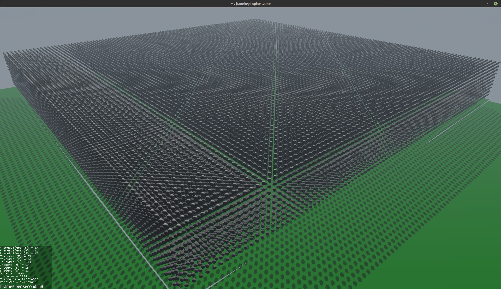
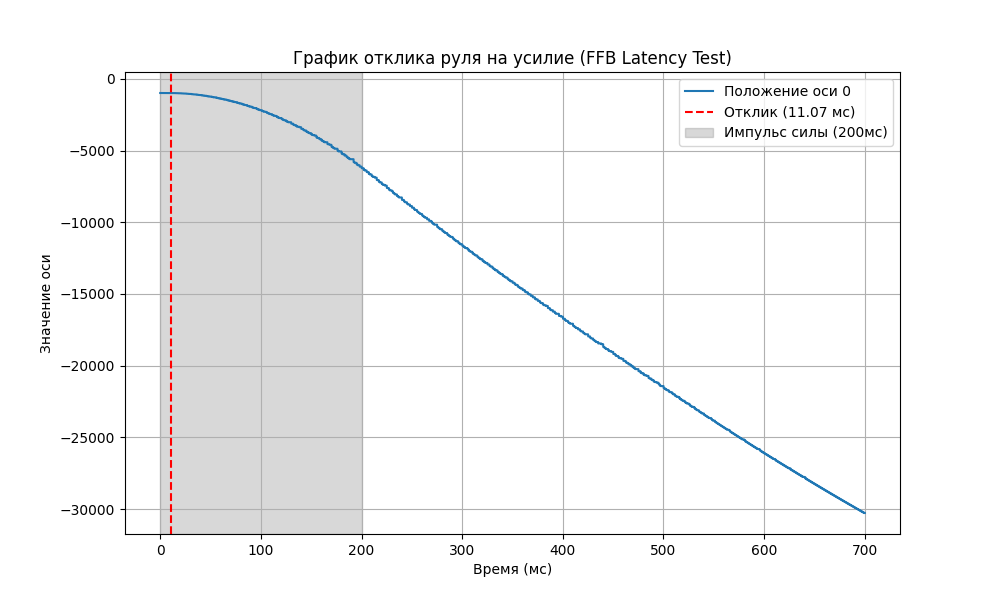
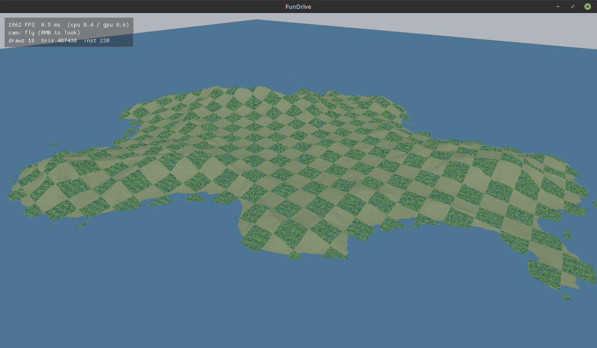
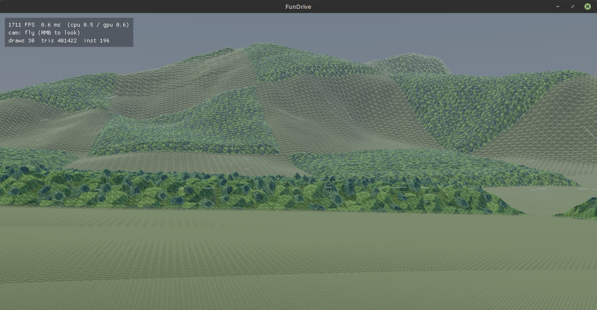
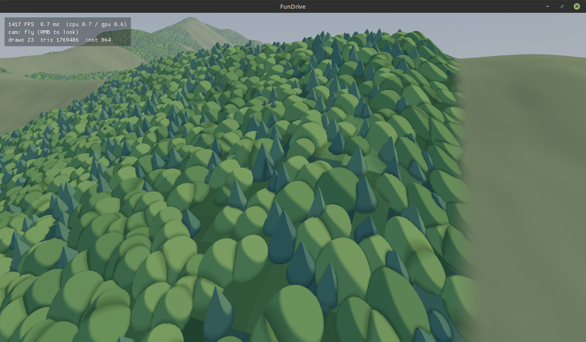
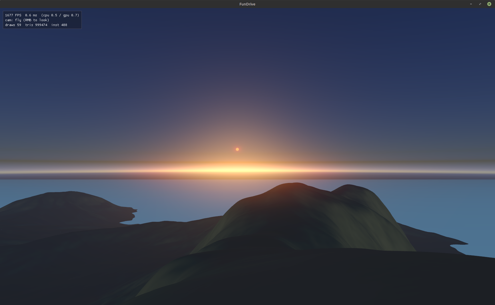
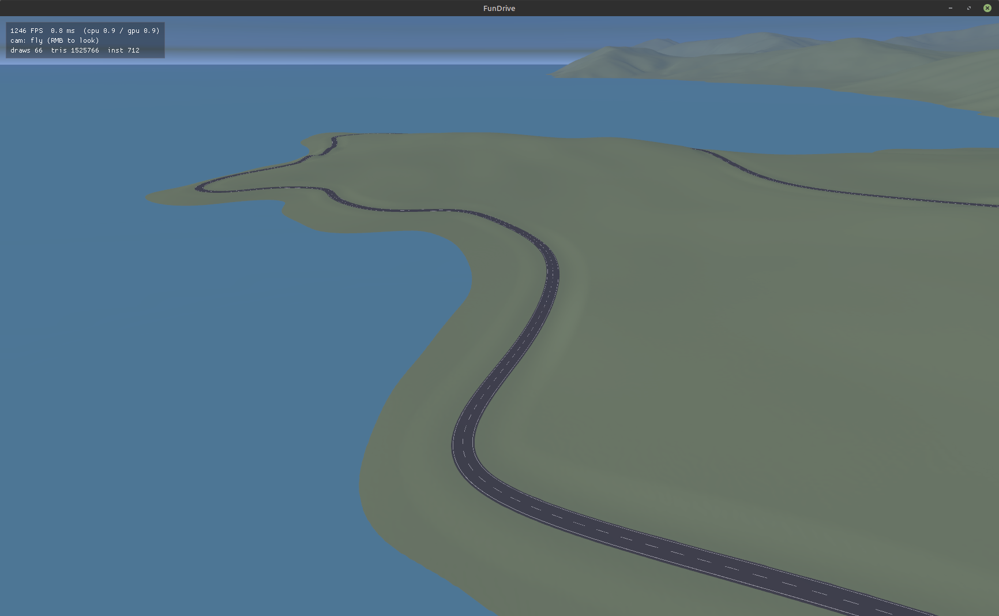
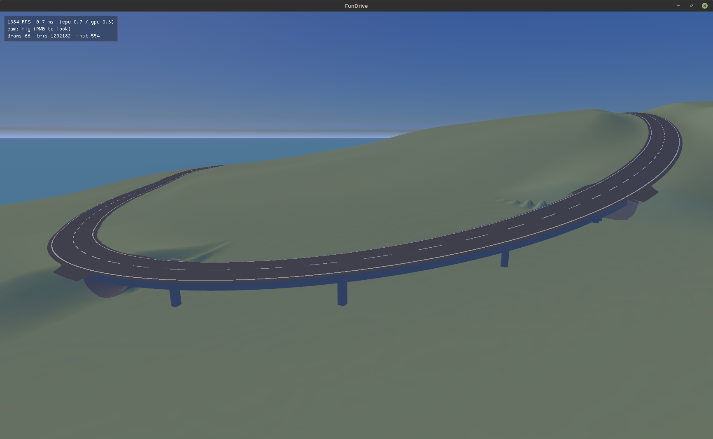

# 2026-05-21

Я попытался перетащить игру на Unreal Engine 5. Процесс мне не понравился, на плюсах сильно медленнее писать и отлаживать код. А ещё, кстати, скорость работы физики на С++ по сравнению с JVM отличалась всего лишь в два раза.

И я вдруг к мысли, что в моей игре графика - это совсем не главное, и куда важнее удобство и скорость разработки. И производительность физики проблемой не является - её хватает с хорошим запасом.

Но libgdx мне не нравится, и я попробовал сделать прототип на jMonkeyEngine. Результат меня приятно удивил - есть много чего стандартного и нормально работающего из коробки.


## Графический движок

Я немного покумекал с нейронкой про возможности движка и пришёл к такой архитектуре:

Использую forward рендер, потому что он простой и хорошо сочетается с честным сглаживанием типа MSAA x4. Не будет ужасных лесенок по краям объектов.
Будут тени от солнца (jME поддерживает каскадные карты теней из коробки и они выглядят нормально)
Для повторяющихся объектов типа деревьев буду использовать инстансинг.
Для борьбы с overdraw использовать early-Z проход, чтобы сначала отренедирть карту глубины и пиксельный шейдер вызывать только для видимых пикселей.
Про материалы ещё не решил - либо PBR, либо что-то более простое.


### Какие ограничения нашёл:

Лайтпробы генерируются реально медленно, кажется что проще вообще забить на динамическое обновление. Причём всякие каустики считаются на CPU. Можно отказаться от каустик, но всё равно даже просто рендеринг в текстуру - это рендеринг в шесть камер и он медленный.

Стандартного эффекта для SSR как будто нет, а тот что есть - не очень поддерживает MSAA. Он мог бы использоваться для красивых зеркальных отражений, но он не очень красиво выглядит по краям экрана. Я в будущем планирую поддерживать трипл скрин (с тремя камерами), и как будто на граниче между мониторами SSR будет рисовать фигню и бросаться в глаза.

Ради интереса я попробовал отрендерить сто тысяч шаров при помощи мульти инстансинга с тенями. Получается 270 миллионов полигонов и 140 миллионов вершин. Не то чтобы я собирался так делать в игре, просто померял для понимания предела возможностей. Видеокарта geforce 4080 почти справляется на 58 кадров в секунду.


Так что мой предварительный план такой - сделать рендер, чтобы мог рисовать большую карту с большим количеством объектов, и чтобы были тени от всяких домов, деревьев и гор.




# 2026-05-29

## Как избежать пауз GC.

В JVM пол-умолчанию стоит G1GC и максимальное время паузы 200 мс. Реально я у себя видел около 20 мс. По понятным причинам для игры в 60 или 120 фпс он не подходит.

В более новых jvm для реалтайм задач появился ZGC (Zero GC), который собирает мусор в отдельных потоках. Там есть пауза, когда он реально приостанавливает все потоки, но она буквально занимает десяток микросекунд. 
При этом фоновая сборка мусора на моём примере идёт примерно те же 20 мс, как и на G1GC, но она не останавливает игровой потокок.
В java 25 сборщик улучшили и он теперь Generational ZGC (причём он настолько лучше, что старого ZGC больше нет).

Из минусов - если новые потоки будут выделять память быстрее, чем будут справляться фоновые потоки GC, то память закончится и будет фиаско.

Запустить с профайлером можно примерно так:

```bash
java -XX:+UseZGC \
     -XX:+UnlockDiagnosticVMOptions \
     -XX:+DebugNonSafepoints \
     -XX:StartFlightRecording=delay=10s,duration=60s,filename=game_profile.jfr,settings=profile,jdk.ExecutionSample#period=5ms \
     -jar your-game.jar
```
Профайлер запустится через 10 секунд после старта на минуту и запишет результаты в файл.
В нём можно посмотреть паузы на сборку мусора и прочую инфу.


# 2026-06-02

Выяснил, что устройства от Moza могут присылать ивенты с обновлениями почти тысячу раз в секунду.

Как проверил - навайбкодил на питоне скрипт, который через SDL получает список устройств и считает ивенты за секунду.
От педалей даже больше тысячи, но кажется что просто они в одном пакете кидают несколько педалей, и SDL интерпретирует их как отдельные ивенты.


Код тут: [https://github.com/Kright/mySmallProjects/blob/master/2026/pySDL/main.py](https://github.com/Kright/mySmallProjects/blob/master/2026/pySDL/main.py)

Ещё можно посмотреть данные о USB и узнать, что это всё подключается как usb 2.0, но со скоростью usb 1.1 (12 мбит). Частота опроса - 1 миллисекунда, так что больше тысячи ивентов в секунду не получить, и получается что девайс работает как раз около этого лимита.

```
usb-devices
```

```
Bus=05 Lev=03 Prnt=17 Port=01 Cnt=01 Dev#= 18 Spd=12   MxCh= 0
D:  Ver= 2.00 Cls=ef(misc ) Sub=02 Prot=01 MxPS=64 #Cfgs=  1
P:  Vendor=346e ProdID=0001 Rev=01.00
S:  Manufacturer=Gudsen
S:  Product=MOZA CRP2 pedals
S:  SerialNumber=36001F000B57484838303120
C:  #Ifs= 3 Cfg#= 1 Atr=c0 MxPwr=100mA
I:  If#= 0 Alt= 0 #EPs= 1 Cls=02(commc) Sub=02 Prot=00 Driver=cdc_acm
E:  Ad=81(I) Atr=03(Int.) MxPS=   8 Ivl=1ms
I:  If#= 1 Alt= 0 #EPs= 2 Cls=0a(data ) Sub=00 Prot=00 Driver=cdc_acm
E:  Ad=02(O) Atr=02(Bulk) MxPS=  64 Ivl=0ms
E:  Ad=82(I) Atr=02(Bulk) MxPS=  64 Ivl=0ms
I:  If#= 2 Alt= 0 #EPs= 2 Cls=03(HID  ) Sub=00 Prot=00 Driver=usbhid
E:  Ad=03(O) Atr=03(Int.) MxPS=  64 Ivl=1ms
E:  Ad=83(I) Atr=03(Int.) MxPS=  64 Ivl=1ms
```

# 2026-06-04

Ещё я попробовал включить всё в базу moza - педали, ручник, коробку. Оказалось, что при таком режиме подключения руль всё ещё передаёт значения тысячу раз в секунду, а вот периферия только 200. В принципе и то и то - много, но если кто-то сидит на мониторе в 240 Гц ради снижения задержек - втыкайте всё через usb, вместо обновления раз в 5 мс будет каждую миллисекунду.

Кроме того, я попробовал померять функцию отклика - подавать на руль короткий "импульс" с силой и стоить график изменения координат от времени.
К базе можно подключиться через мобильное приложение и залезть в продвинутые настройки. Там надо будет полностью убрать трение и демпфирование, чтобы руль по инерции легко крутился. Если этого не сделать, то по-факту посылаешь силу X, а получаешь силу с вычетом трения. И например при небольшой силе на руле получается, что он раскручивается до какой-то небольшой силы и дальше демпфирование и трение всё гасят не дают разгоняться.

Ещё момент, который я заметил - как будто руль реагирует на команду не сразу, а с задержкой в 10 мс. Может быть я ошибаюсь, и просто за это время руль только начинает разгоняться, но как будто эти 10 мс реально есть.



[код, который строит график](https://github.com/Kright/mySmallProjects/blob/master/2026/pySDL/ffb_test.py)

И ещё fun fact - оказывается, я использовал force feedback effect неправильно. 
Я создавал эффект с какой-то силой, включал его, а на следующем кадре отключал и включал другой новый эффект. Так вот, так делать не надо, вместо этого можно сделать один-единственный эффект и менять силу в нём, а потом вызывать `SDL_HapticUpdateEffect`. Вдобавок, вместо бесконечного времени я поставил время в 50 мс и запускаю эффект раз за разом (даже когда он ещё не закончился). Как будто это всё работает нормально, и если игра вдруг зависнет, сила на руле пропадёт через эти самые 50 мс.


# 2026-07-17

Я отправил claude code писать мне графический движок. Время от времени поправляю его, но в целом прикольно. Если иметь чёткое видение, что хочется от рендера и для чего, то как будто несложно сделать простое решение чётко под задачу.

Какие мои идеи:
1. forward rendering: ниже нагрузка на память, доступно честное сглаживание типа MSAA 4x вместо всяких темпоральных и dlss.
2. мультяшный рендеринг: проще чем PBR, сложные эффекты и фотореализм не нужны
3. мир 16км*16км, карта высот 16к: получается разрешение карты высот в 1 метр, занимает аж 680 мегабайт в видеопамяти с mip уровнями, стриминг не нужен.
4. Не использовать экранные эффекты типа AO и SSR: рендер изначально делается под трипл-скрин, а эффекты типа SSR работают некорректно у краёв экрана.
5. OpenGL 4.6: я если честно хочу попробовать вулкан, но кажется что результата быстрее достичь с OpenGL, так что делаю на нём и стараюсь держать рендер отдельно от остального кода, чтобы в будущем его можно было подменить.

Из забавных находок - лес у меня рендерится тем же механизмом, что и ландшафт, просто вершинный шейдер ещё смещает вершины ландшафта вверх, чтобы лес был выше полей вокруг. Вдали выглядит очень хорошо, вблизи не очень. Ещё момент - не смотря на разрешение карты высот в 1 метр, можно использовать [сплайны Catmull-Rom](https://en.wikipedia.org/wiki/Catmull%E2%80%93Rom_spline) для 2д, и получить более мелкую, гладкую сетку.

А ещё, у меня в рендере есть тесты, которые делают картинки, и нейронка сама умеет на них смотреть и делать какие-то выводы. Очень круто, всякие мелочи она сама видит и исправляет.

### Что получилось на данный момент:

Весь остров (клетка леса - 500 метров)



Разрешение сетки земли зависит от расстояния до камеры (тут выкручено на минимум чтобы было видно)



Крупный вид на лес, который на самом деле просто ландшафт




В общем, вблизи он выгдядит не очень и переход от травы к лесу странный, на средней дистанции хорошо и объёмно, а на дальней - шумно мерцает, надо что-то придумывать. Наверно, я всё-таки попробую вблизи рисовать честные деревья с веточками и кроной сложной формы. Но очень круто, что чисто магией в вершинном шейдере можно понарисовать деревьев сложной формы, про которые остальной код вообще ничего не знает.


# 2026-07-21

Я спросил Fable, какие атмосферные эффекты делают в играх, оказалось что кроме релеевского рассеяния есть ещё несколько эффектов, включая озоновый слой и рассеняние Ми, а так же надо учесть округлость Земли - и клауд код это всё сделал. У меня есть вопросики к силе эффектов, кажется что остров в 16 км должен быть более туманным вдали, и немного странно выглядит у горизонта (потому море "заканчиваеся" чуть раньше горизонта, а под горизонтом формула не очень охотно работает). Но то что нейронка сослалась на какую-то статью 2020 года по 3д графике и сделала эффективную и симпатичную реализацию - это очень круто и намного быстрее, чем если бы делал я сам.



Но есть часть, которая нейронке прям тяжко даётся - сделать редактор дорог. Она тоже очень прикольно мне нарассказывала фактов - оказывается, дорога состоит не из дуг (как могло показаться), а из спиралей Эйлера. Т.е., едем по прямой, потом угол поворота начинает плавно нарастать (линейно от пройдённого расстояния), потом так уж и быть можно сделать кусок дуги, а потом снова спираль Эйлера на выпрямление. Типа такая форма намного привычнее, чем после прямой дороги сразу дуга, требущая мгновенного поворота руля. (википедия - [клотоида](https://ru.wikipedia.org/wiki/%D0%9A%D0%BB%D0%BE%D1%82%D0%BE%D0%B8%D0%B4%D0%B0))



Дорога как-то прокладывается по точкам, но мосты и тоннели это боль, уже несколько итераций указываю нейронке на недочёты, и она всё никак не сделает хорошо. Этим замедлоением я недоволен, но идея воткнуть редактор дорог прямо в движок мне нравится - я планирую именно дорогам уделить очень много внимания. В идеале они будут генерироваться процедурно, но с кучей настраиваемых параметров типа максимальных уклонов, бэнкинга, разных видов неровностей, разных полос, разметки, ограждений, видов обочины, хитрых профилей с небольшим уклоном для стока воды и т.п.

Вот картинка моста с недочётами:



Ещё забавное наблюдение - в текущем состоянии движок может рендерить картинку на три 4к монитора со сглаживанием msaa 4x на 200 fps на десктопной видеокарте 4080. Пруфов не будет, движок в будущем будет усложняться, но прикольно, что в теории так можно! Я изначально целюсь в то, чтобы рендер был не сильно тяжёлым и легко шёл на трём мониторах сразу.


Ещё неожиданные открытия - оказывается, в LWJGL уже есть биндинги к SDL3. Они будут нужны для подключения руля. А так же там есть нюансы с потоками (в идеале открывать haptic девайс из главного потока, а обновлять потом из физического. Мой старый код на libgdx работал только потому, что сам libgdx не использовал SDL, и моя работа с ним получалась однопоточной - всё из потока физики.
