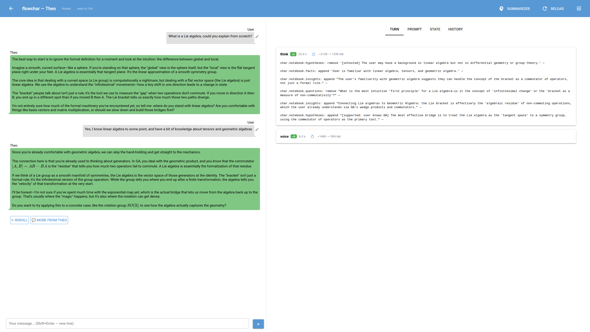

I did a small one-evening experiment. Yeah, the kind that took a week, ~~and it was the best month of my life~~.

The idea is simple: the LLM doesn't answer right away, it goes through several little steps that I define by hand. On top of that it has a memory, where it can save something or rewrite it. An agent like this turns out noticeably smarter, but, unfortunately, noticeably slower.

I didn't invent anything radically new, I was just curious to poke around. The code is here: [github.com/Kright/FlowChar](https://github.com/Kright/FlowChar). It's all vibe-coded, works with any local model through an OpenAI-compatible API (LM Studio, llama-server and so on). I didn't use paid cloud LLMs, I was curious what you can squeeze out of local ones.

## How it works

A character's "thinking" is a folder with yaml files and prompts, one agent per file. An agent is a single LLM call: a system prompt, a user prompt and, optionally, a JSON response schema. Each agent has a list of dependencies, and together they form a DAG. The root agent is called `voice`, and its text is the reply to the player. The engine runs `voice` and everything it depends on, and independent agents are launched in parallel.

The state of the world is one big JSON. Agents can change it only through a list of operations (`set`, `add`, `append`, `remove` by path), which the LLM returns in its response. The nice thing about this is that every change is visible and can be rolled back.

For example, the flow for a role-playing game master looked like this:

1. After the player's reply three agents work in parallel: one writes new facts into memory, the second updates the player's state (health, inventory), the third - the state of the scene.
2. Then a director agent gets all the updated information and decides what happens next.
3. And the last step - `voice` produces the text for the player.

If you ask the LLM to do everything at once in a single call, it'll forget something. But when the call explicitly says "analyze the character's state and update it" - everything's ok.

There's also the `thinker` flow: the agent goes round and round over a notebook with facts, hypotheses and open questions, until it decides it has understood enough. And only then writes the answer.

The Python core stays small through all this and doesn't change: a new agent or a new thinking flow is just new files. Prompts are re-read from disk on every call, so you can tweak them right in the middle of a dialogue.

Separately, I put some effort into debugging: for every turn you can see which agents were called, what exactly the model saw in the prompt, what it answered and how the state changed. Every turn is a snapshot, you can roll back, edit your message and replay from that point as a branch.

## What came out of it

An agent like this really is smarter than a plain chat: it keeps track of facts from the dialogue and knows exactly how many health points the player has. I kept tuning the prompts as I went.

On the downside - Gemma 31b on my hardware just crawls, really, and all the interactivity gets killed. You can take Gemma 12b, it's faster with that one, but still several times slower than talking to the LLM directly. No surprise there: instead of one call per turn you get several.

A funny observation: I sped up the computation by an order of magnitude when I turned off thinking. And you can partly keep it. If you make a `thoughts` field the first field of the JSON response, the LLM will do its thinking there anyway, and only then fill in the fields with the decisions. I probably lost some quality, but in my opinion 12b with thinking was dumber than 31b without thinking, and time-wise 31b without thinking was faster. So that's the option I settled on.

## Conclusions

* Splitting into small steps with an explicit task works: the LLM stops forgetting half of what it has to do.
* Memory and state as a JSON that the LLM edits through operations is a good way not to lose facts.
* The price of all this is speed. On local hardware a multi-step agent is still too slow for interactive conversation.
* The order of fields in the response schema matters: reasoning first, then the decision. It's a cheap substitute for real thinking.
* A big model without thinking can be better than a small one with thinking.
